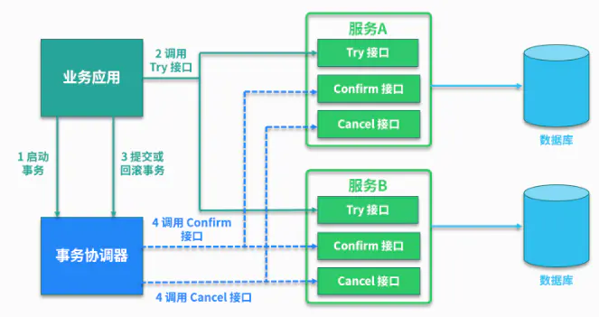

# 场景题

# 系统设计

## 12306抢票亿级流量架构演进

### 第一代架构：双机热备模式

系统极限交易能力为 34 张 /s，按按高峰期 10 h计算，售票量可达到 120 万张 / 天的设计能力。

#### 架构

互联网售票系统设计了缓存服务、用户管理、车票查询、订单及电子客票处理 等多个相对独立的业务分区，以及三级网络安全域， 分别是外网、内网和客票网，系统的体系架构如图 所示：


#### 数据库

用户管理、车票查询采用了传统的**关系型数据库**。

其中车票查询业务部署了多套负载均衡工作模式的数据库， 订单/ 电子客票处理业务采用了双机热备模式的数据库，上述数据库均运行在小型机平台上。

外网的车次、 余票等缓存服务采用了基于内存计算的 **NoSQL 数据库**，运行在 X86 平台上。

#### 网络结构


### 第二代架构：缓存提速+队列削峰+分库分表+读写分离

#### 第一代的问题

请求高峰（类似于秒杀）响应迟缓

请求高峰时 数据库负载过高

级联雪崩


### 第三代架构：异地双活+公私结合

（1）**加缓存**：将用户登录及常用联系人查询等业务迁移 至内存数据库中，提高了相关业务的处理性能和可 靠性。

（2）**IDC双活**：构建中国铁道科学研究院第 2 生产中心，与既有的中国铁路总公司第 1 生产中心间实现**双活**， 提升网站的安全性和可靠性，并将订单 / 电子客票集 群的处理能力提高 1 倍。

（3）**公私结合**：在公有云上部署车票查询服务，通过策略 配置可随时将车票查询流量分流至公用云，以缓解 在售票高峰期网站的处理资源和带宽压力。


## 秒杀超卖

### 解决的三种方案

#### 悲观锁

通过悲观锁解决超卖（数据库为该记录加锁，可能死锁）

解决方案：一般提前采用 select for update，提前加上写锁。

#### 乐观锁

通过乐观锁解决超卖

乐观锁并不是真实存在的锁，而是在更新的时候判断此时的库存是否是之前查询出的库存，如果相同，表示没人修改，可以更新库存，否则表示别人抢过资源，不再执行库存更新。类似如下操作：

```python
update tb_sku set stock=2 where id=1 and stock=7;

SKU.objects.filter(id=1, stock=7).update(stock=2)
```

必须使用读已提交隔离级别，否则不可见事务外部修改。


#### 分段执行的排队方案

通过分段执行的排队方案解决超卖

- 第一阶段申请，申请预减减库，申请成功之后，进入消息队列；
- 第二阶段确认，从消息队列消费申请令牌，然后完成下单操作。 查库存 -> 创建订单 -> 扣减库存。通过分布式锁保障解决多个provider实例并发下单产生的超卖问题。


## 排行榜设计


## 秒杀接口隐藏


## 接口幂等性

绝对更新（不是-500这样的）、绝对删除没有幂等性问题

AOP+注解：后置通知更新请求状态

数据库唯一索引

redis防重，幂等表

token机制


支付场景：用户购买商品后，发起支付操作，支付系统处理支付成功后，由于网络原因没有及时返回给用户结果，其实这个时候订单已经扣过款，相应的支付流水也都已经生成，这个时候用户又点击支付操作，此时会进行第二次扣款，扣款成功后返回给用户。用户去查看支付订单和流水会发现自己支付两次，完蛋了要用户被投诉了，这就是接口没有处理幂等造成的。

如何实现接口幂等

### 总结

1. **按钮只可操作一次**
2. **token机制**（进入页面分配一个token，后面的请求都要带上）
3. **使用Post/Redirect/Get模式**（点击完重定向，避免多次刷新）
4. **在session存放特殊标志**（用完就删）
5. **使用唯一索引防止新增脏数据**（数据库）
6. **乐观锁**（通过version来做）
7. **select + insert or update or delete**（没什么用）
8. **分布式锁**（在流程执行之前根据某个标志(用户ID+后缀等)获取分布式锁）
9. **状态机幂等**（状态变更图）
10. **防重表**（使用唯一主键去做防重表的唯一索引）
11. **缓冲队列**（过滤掉重复的请求）
12. **全局唯一号**

关键词：全局唯一，唯一索引，标识符，状态版本，特殊标志


### 一、前端

如防止表单重复提交，按钮置灰、隐藏、按钮不可点击等方式。


### 二、后端

插入数据，应该按照唯一索引进行插入，比如订单号，相同的订单号就不可能有两条记录插入，
我们在数据库层面防止重复。这个机制是利用了数据库的主键唯一索引的特性，
解决了在插入场景时的幂等问题。
 建立了一个l唯一序列号是唯一索引，我们在进行业务操作的时候,往这张表插入一条数据，
 如果后面第二次提交【序列号还是一样,比如订单ID】，
 发现这张表的序列号已经在第一次插入进去了，那么第二次操作就什么都不进行，
 直接返回，保证幂等。

### 三、redis set防重

很多数据需要处理，只能被处理一次，比如我们可以计算数据的MD5
将其放入redis的set数据结构，每次处理数据，先看这个MD5是否已经存在，
如果已经存在就不处理。


### 四、数据库锁

数据库悲观锁
指的就是每次操作的时候，先把记录锁定起来，其他人无法操作这条记录
 select * from user where user_id = 1 for update;
 注意，数据库悲观锁使用时，一般伴随事务一起使用，数据锁定时间可能会很长，
 需要根据实际情况选用。

数据库乐观锁
就是利用版本号的概念，在操作前先获取到操作记录的当前version版本号，
然后操作的时候带上此版本号。
update user set age = age + 1, version = version + 1 where user_id = 2 and version = 1
注意，乐观锁主要使用于处理读多写少的问题。

### 五、业务层分布式锁

如果多个线程可能在同一时间处理相同的数据，
比如多个线程在同一时刻都拿到了相同的数据处理，我们就可以加分布式锁，
锁定此数据，处理完成后释放锁。获取到锁的必须先判断这个数据是否被处理过。


### 六、Token机制

token令牌机制应该是市面上用的比较多的一种保证幂等方式，简单理解，
就是每次请求都拿着一张门票，这个门票是一次性的，用过一次就被毁掉了，
不能重复利用。这个token令牌就相当于门票的概念，每次接口请求的时候带上token令牌，
服务器第一次处理的时候去校验token，并且这个token只能用一次，
如果用户使用相同的令牌请求二次，那么第二次就不处理，直接返回。
大致的流程
1、服务端提供了发送Token的接口，在执行业务前，先去获取Token，
服务器会把Token保存到redis中;
2、然后调用业务接口请求时，作为请求参数或者请求头中传递;
3、服务器判断token是否存在redis中，存在表示第一次请求，然后删除token，
继续执行业务;
4、服务器如果短时间内重复提交这个接口，因为两次请求token是一样的，
所以第二次请求的时候，服务器校验token时，redis中已经没有了刚刚被第一次删掉的token，就表示是重复操作，所以第二次请求会校验失败，不作处理，
这样就保证了业务代码，不被重复执行;


不过token这种方案有一定的危险性，其实就在于服务端我们到底该如何去验证令牌。
1
1、先删除token【先删除token令牌，再执行业务】还是后删除token【先执行业务，再删除token令牌】;
(a)、先删除可能导致，业务确实没有执行，重试还带上了之前的token，
由于防重设计导致，请求还是不能执行;
(b)、后删除token问题很大，可能导致，业务处理成功，但是服务闪断，
出现超时，没有删除token，别人继续重试，导致业务被执行两次;
(c)、我们最好设计为先删除token，如果业务调用失败，就重新获取token再次请求。
2、token获取，比较和删除必须保证原子性
(a)、redis.get(token)【获取】、token.equals()【比较】、redis.del(token)
【删除】、如果这三个操作不是原子的，可能导致高并发下，
多个线程都获取到同样的数据，判断都成功，继续业务并发执行;
 (b)、可以在redis中使用lua脚本完成这个操作，保证上述操作原子性。
————————————————
版权声明：本文为CSDN博主「top啦它」的原创文章，遵循CC 4.0 BY-SA版权协议，转载请附上原文出处链接及本声明。
原文链接：https://blog.csdn.net/weixin_45949073/article/details/124222592


## 项目中是如何处理重复/并发请求的？

生成一个用户id加uuid生成一个防重token 用户点击一次就存redis 判断redis有没有这个token，如果有就报错返回，在逻辑处理完成以后删除这个token


用户ID：接口名：参数值或md5摘要

## 如何保障RabbitMQ的消息的可靠性？


## 项目中对外提供调用的API是如何设计？如何保证安全性？如何签名？如何防重的？


## 幂等性和去重

不论是「去重」还是「幂等」，都需要对有一个「唯一 Key」，并且有地方对唯一Key进行「存储」

在「消息管理平台」这个场景下，我存储选择的「Redis」（读写性能优越），Redis也有「过期时间」方便解决「一定时间内」的问题

比如说「5分钟相同内容消息去重」，我直接MD5请求参数作为唯一Key。「1小时模板去重」则是「模板ID+userId」作为唯一Key，「一天内渠道去重」则是「渠道ID+userId」作为唯一Key…


布隆过滤器的底层数据结构可以理解为bitmap，bitmap也可以简单理解为是一个数组，元素只存储0和1，所以它占用的空间相对较小

当一个元素要存入bitmap时，其实是要去看存储到bitmap的哪个位置，这时一般用的就是哈希算法，存进去的位置标记为1

标记为1的位置表示存在，标记为0的位置标示不存在


如果「去重」开销比较大，可以考虑建立「多层过滤」的逻辑

比如，先看看『本地缓存』能不能过滤一部分，剩下「强校验」交由『远程存储』（常见的Redis或者DB）进行二次过滤


至于幂等，一般的存储还是「Redis」和「数据库」

最最最最常见的就是数据库「唯一索引」来实现幂等（我所负责的好几个项目都是用这个）


# 分布式

## 分布式事务

### 刚性事务

#### 2PC

#### 3PC

相比较2PC而言，3PC对于协调者（Coordinator）和参与者（Participant）都设置了超时时间，而2PC只有协调者才拥有超时机制。

多设置了一个缓冲阶段保证了在最后提交阶段之前各参与节点的状态是一致的。

### 柔性事务

柔性事务主要分为**补偿型**和**通知型**，

补偿型事务又分：TCC、Saga；

通知型事务分：MQ事务消息、最大努力通知型。


### 异步确保型事务：MQ事务消息 VS 本地消息表

**二者的共性：**
1、 事务消息都依赖MQ进行事务通知，所以都是异步的。
2、 事务消息在投递方都是存在重复投递的可能，需要有配套的机制去降低重复投递率，实现更友好的消息投递去重。
3、 事务消息的消费方，因为投递重复的无法避免，因此需要进行消费去重设计或者服务幂等设计。

**二者的区别：**

MQ事务消息：

- 需要MQ支持半消息机制或者类似特性，在重复投递上具有比较好的去重处理；
- 具有比较大的**业务侵入性**，需要业务方进行改造，提供对应的本地操作成功的回查功能；

DB本地消息表：

- 使用了数据库来存储事务消息，降低了对MQ的要求，但是增加了存储成本；
- 事务消息使用了异步投递，增大了消息重复投递的可能性；


### 最大努力通知

要实现最大努力通知，可以采用 MQ 的 ACK 机制。

最大努力通知事务在投递之前，跟异步确保型流程都差不多，关键在于投递后的处理。

最大努力通知事务在于第三方系统的对接，所以最大努力通知事务有几个特性：

- 业务主动方在完成业务处理后，向业务被动方(第三方系统)发送**通知消息**，允许存在消息丢失。
- 业务主动方提供递增多挡位**时间间隔**(5min、10min、30min、1h、24h)，用于**失败重试**调用业务被动方的接口；在通知N次之后就不再通知，报警+记日志+人工介入。
- 业务被动方提供**幂等**的服务接口，防止通知重复消费。
- 业务主动方需要有定期**校验机制**，对业务数据进行兜底；防止业务被动方无法履行责任时进行业务回滚，确保**数据最终一致性**。

### TCC 事务模型

非常复杂的事务模型，对每个业务都要编写相应的撤销业务，成本高，侵入性强。


1.**主业务服务**：主业务服务为整个业务活动的发起方，服务的编排者，负责发起并完成整个业务活动。

2.**从业务服务**：从业务服务是整个业务活动的参与方，负责提供 TCC 业务操作，实现初步操作(Try)、确认操作(Confirm)、取消操作(Cancel)三个接口，供主业务服务调用。


3.**业务活动管理器**：业务活动管理器管理控制整个业务活动，包括记录维护 TCC 全局事务的事务状态和每个从业务服务的子事务状态，并在业务活动提交时调用所有从业务服务的 Confirm 操作，在业务活动取消时调用所有从业务服务的 Cancel 操作。

TCC(Try-Confirm-Cancel)分布式事务模型相对于 XA 等传统模型，其特征在于**它不依赖资源管理器(RM)对分布式事务的支持，而是通过对业务逻辑的分解来实现分布式事务**。




### Saga

**Saga**模型是把一个分布式事务拆分为多个本地事务，每个本地事务都有相应的执行模块和补偿模块（对应TCC中的Confirm和Cancel），当Saga事务中任意一个本地事务出错时，可以通过调用相关的补偿方法恢复之前的事务，达到事务最终一致性。

这样的SAGA事务模型，是牺牲了一定的隔离性和一致性的，但是提高了long-running事务的可用性。


## Reactor

Reactor模式也叫反应器模式，事件触发反应


### 单线程Reactor

Reactor模型的朴素原型

Java的NIO模式的Selector网络通讯，其实就是一个简单的Reactor模型。可以说是Reactor模型的朴素原型。


## Java NIO

**Java NIO（New IO） 不是IO模型中的NIO模型，而是另外的一种模型，叫做IO多路复用模型（ IO multiplexing ）。**


## 分布式锁

### 数据库悲观锁

数据库的行锁、表锁、排他锁等都是悲观锁，这里以行锁为例，进行介绍。以我们常用的MySQL为例，我们通过使用select...for update语句, 执行该语句后，会在表上加持行锁，一直到事务提交，解除行锁。

### 数据库乐观锁

CAS是项乐观锁技术，当多个线程尝试使用CAS同时更新同一个变量时，只有其中一个线程能更新变量的值，而其它线程都失败，**失败的线程并不会被挂起，而是被告知这次竞争中失败，并可以再次尝试。**

### Zookeeper分布式锁

只有一个会成功，有序公平，前向监控，自动释放


ZooKeeper的节点监听机制，可以保障占有锁的传递有序而且高效。

顺序发生器——多个线程去 Zookeeper 里面去创建同一个节点的时候，**只会有一个线程执行成功**。

在父永久节点下创建序号递增的节点——**有序**且高效

监听机制——节点只需要监控上一个节点的通知，上一个节点消失，判断自己是否是第一个，不是则再监控一个节点，无需全体监控

临时节点异常就自动释放

避免羊群效应——都只监控前一个，避免一个节点出现问题，所有人都监控，无需维护顺序

### Redis分布式锁

**setnx命令:**

SETNX 是SET if Not eXists的简写。将 key 的值设为 value，当且仅当 key 不存在; 若给定的 key 已经存在，则 SETNX 不做任何动作。

RedLock算法思想：

> 不能只在一个redis实例上创建锁，应该是在多个redis实例上创建锁，n / 2 + 1，必须在大多数redis节点上都成功创建锁，才能算这个整体的RedLock加锁成功，避免说仅仅在一个redis实例上加锁而带来的问题。

提前说明，使用redis分布式锁，是追求高性能， 在cap理论中，追求的是 ap 而不是cp。

所以，如果追求高可用，建议使用 zookeeper分布式锁。


# 数据库设计

## 数据库面试题：为什么要小表驱动大表？


## 缓存一致性

### 3种方案保证数据库与缓存的一致性

> 3种方案保证数据库与缓存的一致性
>
> - 延时双删策略
> - 删除缓存重试机制（消息队列）
> - 读取biglog异步删除缓存（canal）


# 海量数据

### 现在数据库有1亿的数据，在多张表中，如何同步到es（elasticsearch）中？


数据分割——但有数据分布不均匀的情况

JDBC读取数据优化，fetch size


Fetch相当于读缓存，如果使用setFetchSize设置Fetch Size为10000，本地缓存10000条记录，每次执行rs.next，只是内存操作，不会有数据库网络消耗，效率就会高些。但需要注意的是，Fetch Size值越高则占用内存越高，要避免出现OOM错误。

建议执行SQL语句之前设置，即ps.executeQuery();之前使用setFetchSize()函数设置。

————————————————
原文链接：https://blog.csdn.net/bisal/article/details/82735614


笔者个人不深入的学习感觉 Logstash 对于这种需要一次性大批量将数据导入ES的需求适应性可能不太好。
大批量的数据导入ES 个人推荐BulkProcessor, 不论是什么数据，只需要将其转换成Map键值对的格式便可运用bulkProcessor实现流式导入。
对于导入效率需要看集群的环境以及导入批次的设置，还有ES的相关优化配置。
————————————————
原文链接：https://blog.csdn.net/u013850277/article/details/88904303


## 大批量(百万级)数据插入数据库应该怎么做(提高效率)？

### 一：在数据库中进行操作

1.合并sql语句(一个sql插入单条数据转为一个sql插入多条数据)

原因：合并后减少了日志生成量

2.在事务中进行插入操作

原因：单条sql执行时mysql内部会自动创建事务进行提交，所以通过自主创建事务，减少mysql执行sql时创建事务的消耗。 

3.有序插入

原因：无需插入会增大维护索引的成本（甚至可以先删除索引，只是不能执行业务了）


### 二：Java代码向数据库中插入数据

**整体策略：通过多线程分批次对大量数据进行插入操作实现高效插入。**

1.比如数据量为10w，将10w条数据分为10个1w条，然后通过创建多（10）个线程，对这10个1w数据进行插入操作。

2.通过遍历数据去进行插入操作实际上就是一条一条的插入，每执行一次insert就要向数据库传一条sql，数据库编译sql，然后执行，这里用的是Statement。这样做插入效率明显很低，所以我们需要采用批量插入大方式去进行，这里需要用到PreparedStatement。两者的区别在文章末。

例：

```java
Connection conn = DriverManager.getConnection();
conn.setAutoCommit(false);
PreparedStatement ps = conn.prepareStatement(   
   "INSERT into employees values (?, ?, ?)");   
for (n = 0; n < 10000; n++) {   
  ps.setString(name[n]);   
  ps.setLong(id[n]);   
  ps.setInt(salary[n]);   
  ps.addBatch(); //添加批处理  
}   
ps.executeBatch(); //执行批处理  

```


3.由上例可以看出每10000条数据进行一次事务的提交，也就是说事务的粗粒度太大，数据库每次面临一万条数据的插入，压力也会很大，所以我们可以再将上述案例进行优化，每一百条数据进行一次事务的提交。


4.最后如果想要查看数据库中已经插入的数据条数，通过执行sql语句效率也会比较低，可以通过在内存中设置一个n，来记录插入数据条数，当然，在多线程的情况下，需要对n进行加锁操作。


### Statement和PreparedStatement的区别：

选择PreparedStatement还是Statement取决于你要怎么使用它们. 对于只执行一次的SQL语句选择Statement是最好的. 相反, 如果SQL语句被多次执行选用PreparedStatement是最好的.
PreparedStatement的第一次执行消耗是很高的. 它的性能体现在后面的重复执行. 

简单来说：

statement是每次执行都会向数据库发送sql，然后数据库进行预编译然后执行。

PreparedStatement是通过AddBatch()将多次执行操作都放在一起，然后再向数据库发送sql，然后数据库编译执行。


## 海量数据设计

取频次：hash、trie树（字典树，前缀树）

排序：堆排序，

合并：归并

数字重复：bitMap（新开数组的所需大小并不取决于数据量的大小，而是取决于某数据值的大小，超过两个状态，可以使用2bit，四个状态）

二进制拆分数据


著作权归https://pdai.tech所有。 链接：https://pdai.tech/md/interview/x-interview.html


### 100亿数据找中位数

所有数第一位0，1拆开

如果file_1 60亿，file_0 40亿

那么中位数就在file_1里面，依次进行。


### 资料

#### 大数据处理之分治思想？

分而治之/hash映射 + hash统计 + 堆/快速/归并排序，说白了，就是先映射，而后统计，最后排序:

- **分而治之/hash映射**: 针对数据太大，内存受限，只能是: 把大文件化成(取模映射)小文件，即16字方针: 大而化小，各个击破，缩小规模，逐个解决
- **hash_map统计**: 当大文件转化了小文件，那么我们便可以采用常规的hash_map(ip，value)来进行频率统计。
- **堆/快速排序**: 统计完了之后，便进行排序(可采取堆排序)，得到次数最多的IP。

#### [¶](#海量日志数据提取出某日访问百度次数最多的那个ip) 海量日志数据，提取出某日访问百度次数最多的那个IP?

分析:  “首先是这一天，并且是访问百度的日志中的IP取出来，逐个写入到一个大文件中。注意到IP是32位的，最多有个2^32个IP。同样可以采用映射的方法，比如%1000，把整个大文件映射为1000个小文件，再找出每个小文中出现频率最大的IP(可以采用hash_map对那1000个文件中的所有IP进行频率统计，然后依次找出各个文件中频率最大的那个IP)及相应的频率。然后再在这1000个最大的IP中，找出那个频率最大的IP，即为所求。”

关于本题，还有几个问题，如下:

- Hash取模是一种等价映射，不会存在同一个元素分散到不同小文件中的情况，即这里采用的是mod1000算法，那么相同的IP在hash取模后，只可能落在同一个文件中，不可能被分散的。因为如果两个IP相等，那么经过Hash(IP)之后的哈希值是相同的，将此哈希值取模(如模1000)，必定仍然相等。
- 那到底什么是hash映射呢? 简单来说，就是为了便于计算机在有限的内存中处理big数据，从而通过一种映射散列的方式让数据均匀分布在对应的内存位置(如大数据通过取余的方式映射成小树存放在内存中，或大文件映射成多个小文件)，而这个映射散列方式便是我们通常所说的hash函数，设计的好的hash函数能让数据均匀分布而减少冲突。尽管数据映射到了另外一些不同的位置，但数据还是原来的数据，只是代替和表示这些原始数据的形式发生了变化而已。

#### [¶](#寻找热门查询300万个查询字符串中统计最热门的10个查询) 寻找热门查询，300万个查询字符串中统计最热门的10个查询?

原题: 搜索引擎会通过日志文件把用户每次检索使用的所有检索串都记录下来，每个查询串的长度为1-255字节。假设目前有一千万个记录(这些查询串的重复度比较高，虽然总数是1千万，但如果除去重复后，不超过3百万个。一个查询串的重复度越高，说明查询它的用户越多，也就是越热门)，请你统计最热门的10个查询串，要求使用的内存不能超过1G。

解答: 由上面第1题，我们知道，数据大则划为小的，如如一亿个Ip求Top 10，可先%1000将ip分到1000个小文件中去，并保证一种ip只出现在一个文件中，再对每个小文件中的ip进行hashmap计数统计并按数量排序，最后归并或者最小堆依次处理每个小文件的top10以得到最后的结。

但如果数据规模比较小，能一次性装入内存呢?比如这第2题，虽然有一千万个Query，但是由于重复度比较高，因此事实上只有300万的Query，每个Query255Byte，因此我们可以考虑把他们都放进内存中去(300万个字符串假设没有重复，都是最大长度，那么最多占用内存3M*1K/4=0.75G。所以可以将所有字符串都存放在内存中进行处理)，而现在只是需要一个合适的数据结构，在这里，HashTable绝对是我们优先的选择。

所以我们放弃分而治之/hash映射的步骤，直接上hash统计，然后排序。So，针对此类典型的TOP K问题，采取的对策往往是: hashmap + 堆。如下所示:

- **hash_map统计**: 先对这批海量数据预处理。具体方法是: 维护一个Key为Query字串，Value为该Query出现次数的HashTable，即hash_map(Query，Value)，每次读取一个Query，如果该字串不在Table中，那么加入该字串，并且将Value值设为1；如果该字串在Table中，那么将该字串的计数加一即可。最终我们在O(N)的时间复杂度内用Hash表完成了统计； 堆排序: 第二步、借助堆这个数据结构，找出Top K，时间复杂度为N‘logK。即借助堆结构，我们可以在log量级的时间内查找和调整/移动。因此，维护一个K(该题目中是10)大小的小根堆，然后遍历300万的Query，分别和根元素进行对比。所以，我们最终的时间复杂度是: O(N) + N' * O(logK)，(N为1000万，N’为300万)。

别忘了这篇文章中所述的堆排序思路: “维护k个元素的最小堆，即用容量为k的最小堆存储最先遍历到的k个数，并假设它们即是最大的k个数，建堆费时O(k)，并调整堆(费时O(logk))后，有k1>k2>...kmin(kmin设为小顶堆中最小元素)。继续遍历数列，每次遍历一个元素x，与堆顶元素比较，若x>kmin，则更新堆(x入堆，用时logk)，否则不更新堆。这样下来，总费时O(k*logk+(n-k)*logk)=O(n*logk)。此方法得益于在堆中，查找等各项操作时间复杂度均为logk。”--第三章续、Top K算法问题的实现。

当然，你也可以采用trie树，关键字域存该查询串出现的次数，没有出现为0。最后用10个元素的最小推来对出现频率进行排序。

#### [¶](#有一个1g大小的一个文件里面每一行是一个词词的大小不超过16字节内存限制大小是1m返回频数最高的100个词) 有一个1G大小的一个文件，里面每一行是一个词，词的大小不超过16字节，内存限制大小是1M。返回频数最高的100个词?

- **分而治之/hash映射**: 顺序读文件中，对于每个词x，取hash(x)%5000，然后按照该值存到5000个小文件(记为x0,x1,...x4999)中。这样每个文件大概是200k左右。如果其中的有的文件超过了1M大小，还可以按照类似的方法继续往下分，直到分解得到的小文件的大小都不超过1M。
- **hash_map统计**: 对每个小文件，采用trie树/hash_map等统计每个文件中出现的词以及相应的频率。
- **堆/归并排序**: 取出出现频率最大的100个词(可以用含100个结点的最小堆)后，再把100个词及相应的频率存入文件，这样又得到了5000个文件。最后就是把这5000个文件进行归并(类似于归并排序)的过程了。

#### [¶](#海量数据分布在100台电脑中想个办法高效统计出这批数据的top10) 海量数据分布在100台电脑中，想个办法高效统计出这批数据的TOP10?

如果每个数据元素只出现一次，而且只出现在某一台机器中，那么可以采取以下步骤统计出现次数TOP10的数据元素:

- **堆排序**: 在每台电脑上求出TOP10，可以采用包含10个元素的堆完成(TOP10小，用最大堆，TOP10大，用最小堆，比如求TOP10大，我们首先取前10个元素调整成最小堆，如果发现，然后扫描后面的数据，并与堆顶元素比较，如果比堆顶元素大，那么用该元素替换堆顶，然后再调整为最小堆。最后堆中的元素就是TOP10大)。 求出每台电脑上的TOP10后，然后把这100台电脑上的TOP10组合起来，共1000个数据，再利用上面类似的方法求出TOP10就可以了。

但如果同一个元素重复出现在不同的电脑中呢，如下例子所述, 这个时候，你可以有两种方法:

- 遍历一遍所有数据，重新hash取摸，如此使得同一个元素只出现在单独的一台电脑中，然后采用上面所说的方法，统计每台电脑中各个元素的出现次数找出TOP10，继而组合100台电脑上的TOP10，找出最终的TOP10。
- 或者，暴力求解: 直接统计统计每台电脑中各个元素的出现次数，然后把同一个元素在不同机器中的出现次数相加，最终从所有数据中找出TOP10。

#### [¶](#有10个文件每个文件1g每个文件的每一行存放的都是用户的query每个文件的query都可能重复要求你按照query的频度排序) 有10个文件，每个文件1G，每个文件的每一行存放的都是用户的query，每个文件的query都可能重复。要求你按照query的频度排序?

方案1:

- **hash映射**: 顺序读取10个文件，按照hash(query)%10的结果将query写入到另外10个文件(记为a0,a1,..a9)中。这样新生成的文件每个的大小大约也1G(假设hash函数是随机的)。
- **hash_map统计**: 找一台内存在2G左右的机器，依次对用hash_map(query, query_count)来统计每个query出现的次数。注: hash_map(query,query_count)是用来统计每个query的出现次数，不是存储他们的值，出现一次，则count+1。
- **堆/快速/归并排序**: 利用快速/堆/归并排序按照出现次数进行排序，将排序好的query和对应的query_cout输出到文件中，这样得到了10个排好序的文件(记为)。最后，对这10个文件进行归并排序(内排序与外排序相结合)。

方案2: 一般query的总量是有限的，只是重复的次数比较多而已，可能对于所有的query，一次性就可以加入到内存了。这样，我们就可以采用trie树/hash_map等直接来统计每个query出现的次数，然后按出现次数做快速/堆/归并排序就可以了。

方案3: 与方案1类似，但在做完hash，分成多个文件后，可以交给多个文件来处理，采用分布式的架构来处理(比如MapReduce)，最后再进行合并。

#### [¶](#给定a、b两个文件各存放50亿个url每个url各占64字节内存限制是4g让你找出a、b文件共同的url) 给定a、b两个文件，各存放50亿个url，每个url各占64字节，内存限制是4G，让你找出a、b文件共同的url?

可以估计每个文件安的大小为5G×64=320G，远远大于内存限制的4G。所以不可能将其完全加载到内存中处理。考虑采取分而治之的方法。

- **分而治之/hash映射**: 遍历文件a，对每个url求取，然后根据所取得的值将url分别存储到1000个小文件(记为，这里漏写个了a1)中。这样每个小文件的大约为300M。遍历文件b，采取和a相同的方式将url分别存储到1000小文件中(记为)。这样处理后，所有可能相同的url都在对应的小文件()中，不对应的小文件不可能有相同的url。然后我们只要求出1000对小文件中相同的url即可。
- **hash_set统计**: 求每对小文件中相同的url时，可以把其中一个小文件的url存储到hash_set中。然后遍历另一个小文件的每个url，看其是否在刚才构建的hash_set中，如果是，那么就是共同的url，存到文件里面就可以了。

如果允许有一定的错误率，可以使用Bloom filter，4G内存大概可以表示340亿bit。将其中一个文件中的url使用Bloom filter映射为这340亿bit，然后挨个读取另外一个文件的url，检查是否与Bloom filter，如果是，那么该url应该是共同的url(注意会有一定的错误率)。”

#### [¶](#怎么在海量数据中找出重复次数最多的一个) 怎么在海量数据中找出重复次数最多的一个?

方案: 先做hash，然后求模映射为小文件，求出每个小文件中重复次数最多的一个，并记录重复次数。然后找出上一步求出的数据中重复次数最多的一个就是所求(具体参考前面的题)。

#### [¶](#上千万或上亿数据有重复统计其中出现次数最多的前n个数据) 上千万或上亿数据(有重复)，统计其中出现次数最多的前N个数据?

方案: 上千万或上亿的数据，现在的机器的内存应该能存下。所以考虑采用hash_map/搜索二叉树/红黑树等来进行统计次数。然后利用堆取出前N个出现次数最多的数据。

#### [¶](#一个文本文件大约有一万行每行一个词要求统计出其中最频繁出现的前10个词请给出思想给出时间复杂度分析) 一个文本文件，大约有一万行，每行一个词，要求统计出其中最频繁出现的前10个词，请给出思想，给出时间复杂度分析?

方案1: 如果文件比较大，无法一次性读入内存，可以采用hash取模的方法，将大文件分解为多个小文件，对于单个小文件利用hash_map统计出每个小文件中10个最常出现的词，然后再进行归并处理，找出最终的10个最常出现的词。

方案2: 通过hash取模将大文件分解为多个小文件后，除了可以用hash_map统计出每个小文件中10个最常出现的词，也可以用trie树统计每个词出现的次数，时间复杂度是O(n*le)(le表示单词的平准长度)，最终同样找出出现最频繁的前10个词(可用堆来实现)，时间复杂度是O(n*lg10)。

#### [¶](#一个文本文件找出前10个经常出现的词但这次文件比较长说是上亿行或十亿行总之无法一次读入内存问最优解) 一个文本文件，找出前10个经常出现的词，但这次文件比较长，说是上亿行或十亿行，总之无法一次读入内存，问最优解?

方案1: 首先根据用hash并求模，将文件分解为多个小文件，对于单个文件利用上题的方法求出每个文件件中10个最常出现的词。然后再进行归并处理，找出最终的10个最常出现的词。

#### [¶](#100w个数中找出最大的100个数) 100w个数中找出最大的100个数?

方案1: 采用局部淘汰法。选取前100个元素，并排序，记为序列L。然后一次扫描剩余的元素x，与排好序的100个元素中最小的元素比，如果比这个最小的要大，那么把这个最小的元素删除，并把x利用插入排序的思想，插入到序列L中。依次循环，知道扫描了所有的元素。复杂度为O(100w*100)。

方案2: 采用快速排序的思想，每次分割之后只考虑比轴大的一部分，知道比轴大的一部分在比100多的时候，采用传统排序算法排序，取前100个。复杂度为O(100w*100)。

方案3: 在前面的题中，我们已经提到了，用一个含100个元素的最小堆完成。复杂度为O(100w*lg100)。

#### [¶](#5亿个int找它们的中位数) 5亿个int找它们的中位数?

- **思路一**

这个例子比上面那个更明显。首先我们将int划分为2^16个区域，然后读取数据统计落到各个区域里的数的个数，之后我们根据统计结果就可以判断中位数落到那个区域，同时知道这个区域中的第几大数刚好是中位数。然后第二次扫描我们只统计落在这个区域中的那些数就可以了。

实际上，如果不是int是int64，我们可以经过3次这样的划分即可降低到可以接受的程度。即可以先将int64分成2^24个区域，然后确定区域的第几大数，在将该区域分成2^20个子区域，然后确定是子区域的第几大数，然后子区域里的数的个数只有2^20，就可以直接利用direct addr table进行统计了。

- **思路二**

同样需要做两遍统计，如果数据存在硬盘上，就需要读取2次。

方法同基数排序有些像，开一个大小为65536的Int数组，第一遍读取，统计Int32的高16位的情况，也就是0-65535，都算作0,65536 - 131071都算作1。就相当于用该数除以65536。Int32 除以 65536的结果不会超过65536种情况，因此开一个长度为65536的数组计数就可以。每读取一个数，数组中对应的计数+1，考虑有负数的情况，需要将结果加32768后，记录在相应的数组内。

第一遍统计之后，遍历数组，逐个累加统计，看中位数处于哪个区间，比如处于区间k，那么0- k-1的区间里数字的数量sum应该`<n/2`(2.5亿)。而k+1 - 65535的计数和也`<n/2`，第二遍统计同上面的方法类似，但这次只统计处于区间k的情况，也就是说(x / 65536) + 32768 = k。统计只统计低16位的情况。并且利用刚才统计的sum，比如sum = 2.49亿，那么现在就是要在低16位里面找100万个数(2.5亿-2.49亿)。这次计数之后，再统计一下，看中位数所处的区间，最后将高位和低位组合一下就是结果了。

#### [¶](#在25亿个整数中找出不重复的整数注内存不足以容纳这25亿个整数) 在2.5亿个整数中找出不重复的整数，注，内存不足以容纳这2.5亿个整数。

- 方案1: 采用2-Bitmap(每个数分配2bit，00表示不存在，01表示出现一次，10表示多次，11无意义)进行，共需内存2^32 * 2 bit=1 GB内存，还可以接受。然后扫描这2.5亿个整数，查看Bitmap中相对应位，如果是00变01，01变10，10保持不变。所描完事后，查看bitmap，把对应位是01的整数输出即可。
- 方案2: 也可采用分治，划分小文件的方法。然后在小文件中找出不重复的整数，并排序。然后再进行归并，注意去除重复的元素。

#### [¶](#给40亿个不重复的unsigned-int的整数没排过序的然后再给一个数如何快速判断这个数是否在那40亿个数当中) 给40亿个不重复的unsigned int的整数，没排过序的，然后再给一个数，如何快速判断这个数是否在那40亿个数当中?

用位图/Bitmap的方法，申请512M的内存，一个bit位代表一个unsigned int值。读入40亿个数，设置相应的bit位，读入要查询的数，查看相应bit位是否为1，为1表示存在，为0表示不存在。


# 计算机网络

## TCP/IP

### 网络设备通信

网线连接

集线器——把消息广播出去

交换机——智能发送给指定MAC地址，找不到再广播——地址表太大

路由器——只标记目标IP地址，怎么发那么看着办


## DNS

　1、缓存查找IP

　2、本机的hosts文件查找IP

　3、DNS服务器查找IP

第一步：根DNS 服务器获取
第二步：一级（或者顶级）DNS 服务器获取
第三步：二级（或者顶级）DNS 服务器获取
第四步：三级（或者顶级）DNS 服务器获取


# 底部————
