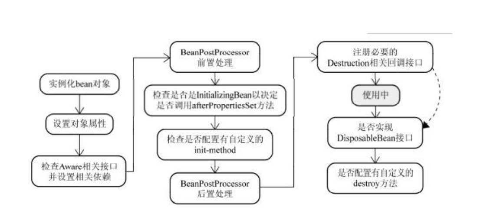
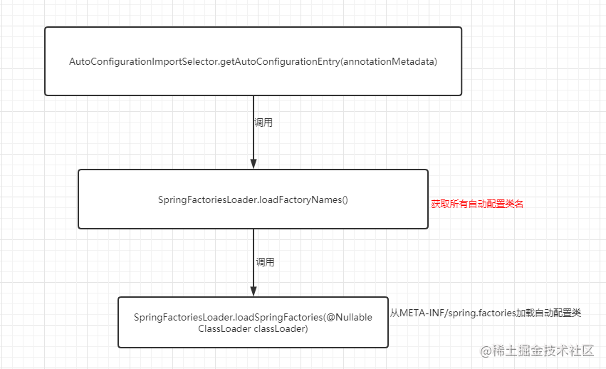
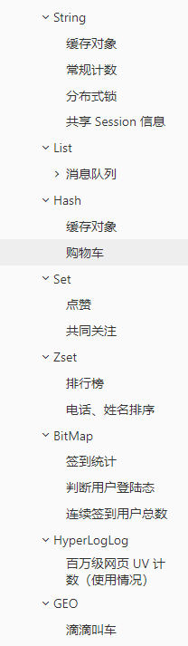

# Java

## 基本数据类型


## Java语言特性

面向对象

生态好，类库

平台无关性

支持多线程

## 说说static修饰符的用法

得分点 static可以修饰什么,static的重要规则

标准答案 Java类中包含了成员变量、方法、构造器、初始化块和内部类（包括接口、枚举）5种成员,**static关键字可以修饰除了构造器外的其他4种成员**。

static关键字修饰的成员被称为**类成员**。类成员**属于整个类**,不属于单个对象。

static关键字有一条非常重要的规则,即类成员不能访问实例成员,因为类成员属于类的,类成员的作用域比实例成员的作用域更大,很容易出现类成员初始化完成时,但实例成员还没被初始化,这时如果类成员访问实力成员就会引起大量错误。

static修饰的部分会和类同时被加载。

被static修饰的成员先于对象存在,因此,当一个类加载完毕,即使没有创建对象也可以去访问被static修饰的部分。 

静态方法中**没有this关键词**,因为静态方法是和类同时被加载的,而this是随着对象的创建存在的。

静态比对象优先存在。也就是说,静态可以访问静态,但静态不能访问非静态而非静态可以访问静态。

## 封装继承多态

### 封装

封装隐藏了类的内部实现机制

属性的封装：限制对属性的不合理操作；

方法的封装：不必关心方法的内部实现，便于使用

### 继承

继承是从已有的类中派生出新的类，新的类能吸收已有类的数据属性和行为，并能扩展新的能力。

### 多态

多态指的是类和类的关系，两个类由继承关系，存在有方法的重写，故而可以在调用时有**父类引用指向子类对象**。


## 抽象类和接口

抽象类：抽象类的设计目的，是代码复用

接口：接口的设计目的，是对类的行为进行约束

使用场景：当你关注一个事物的本质的时候，用抽象类；当你关注一个操作的时候，用接口。


## 重写与重载区别

方法的重载和重写都是实现多态的方式，区别在于前者实现的是编译时的多态性，而后者实现的是运行时的多态性。


重载： 发生在同一个类中，方法名必须相同，参数类型不同、个数不同、顺序不同，方法返回值和访问修饰符可以不同，发生在编译时。
重写： 发生在父子类中，方法名、参数列表必须相同，返回值范围小于等于父类，抛出的异常范围小于等于父类，访问修饰符范围大于等于父类；如果父类方法访问修饰符为private则子类就不能重写该方法。

## hashCode与equals

如果两个对象相等，则hashcode一定也是相同的

两个对象相等,对两个对象分别调用equals方法都返回true

两个对象有相同的hashcode值，它们也不一定是相等的

因此，equals方法被覆盖过，则hashCode方法也必须被覆盖

hashCode()的默认行为是对堆上的对象产生独特值。如果没有重写hashCode()，则该class的两个

对象无论如何都不会相等（即使这两个对象指向相同的数据）


## String  StringBuilder  StringBuffer的区别 

String不可变，每一次改变都是新的引用，不可变的字符数组

底层都是可变的字符数组

StringBuilder

StringBuffer加了同步锁

## 异常

Java中的所有异常都来自顶级父类Throwable。

Throwable下有两个子类Exception和Error。

Error是程序无法处理的错误，一旦出现这个错误，则程序将被迫停止运行。

Exception不会导致程序停止，又分为两个部分RunTimeException运行时异常和CheckedException检查异常。

RunTimeException常常发生在程序运行过程中，会导致程序当前线程执行失败。CheckedException常常发生在程序编译过程中，会导致程序编译不通过。

```
1、ArithmeticException（算术异常） 

2、ClassCastException （类转换异常）

3、IllegalArgumentException （非法参数异常）

4、IndexOutOfBoundsException （下标越界异常）

5、NullPointerException （空指针异常）

6、SecurityException （安全异常）

7、NumberFormatException   （数字格式异常 Integer.parseInt(“a1b2”)）

9、FileNotFoundException （文件找不到异常）

10、ClassNotFoundException （类找不到异常）
```


## 反射

概念，原理，应用

### 概念

反射就是Java可以给我们在运行时获取类的信息以及动态调用对象的方法的功能


### 获取class对象三种方法

第一步：获取Class对象，有4中方法： 

1）Class.forName(“类的路径”)； 

2）类名.class 

3）对象名.getClass() 

4）基本类型的包装类，可以调用包装类的Type属性来获得该包装类的Class对象


### 优缺点

优点： 1）能够运行时动态获取类的实例，提高灵活性； 2）与动态编译结合

缺点： 1）使用反射性能较低，需要解析字节码，将内存中的对象进行解析。

### Java反射 API

反射API用来生成JVM中的类、接口或则对象的信息。
\1. Class 类：反射的核心类，可以获取类的属性，方法等信息。

\2. Field 类：Java.lang.reflec 包中的类，表示类的成员变量，可以用来获取和设置类之中的属性值。

\3. Method 类： Java.lang.reflec 包中的类，表示类的方法，它可以用来获取类中的方法信息或者执
行方法。

\4. Constructor 类： Java.lang.reflec 包中的类，表示类的构造方法。  


### 反射使用步骤

获取 Class 对象、调用对象方法
\1. 获取想要操作的类的 Class 对象，他是反射的核心，通过 Class 对象我们可以任意调用类的方法。

\2. 调用 Class 类中的方法，既就是反射的使用阶段。

\3. 使用反射 API 来操作这些信息。  


## 注解

首先使用 @interface声明注解名称

然后，使用@Retention，@Target等元注解标注注解的生命周期和作用元素

### 概念

Annotation（注解）是 Java 提供的一种对元程序中元素关联信息和元数据（metadata）的途径和方法。

Annatation(注解)是一个接口，程序可以**通过反射来获取**指定程序中元素的 Annotation 对象，然后通过该 Annotation 对象来获取注解中的元数据信息。  

代码中的特殊标记，这些标记可以在编译、类加载、运行时被读取，并执行相对应的处理。


### 元注解

@Target  用于描述所修饰的对象范围，既被描述的注解可以用在什么地方 

@Retention 表示需要在什么级别保存注解信息，用于描述注解运行状态，SOURCE<CLASS<RUNTIME

@Documented  说明该注解将被包含在Javadoc中 表示是否将我们的注解生成在JAVADoc中

@Inherited  说明子类可以继承父类中的注解


# 集合

## List

### LinkedList和ArrayList

Array：数据的随机访问性，获取数据O(1)，删除和插入数据O(n)开销大，需要扩容1.5倍，初始容量10

### ArrayList扩容

ArrayList在创建时，其初始容量应为**0**，即，底层是一个空数组，而我们第一次往其中存入元素的时候，会进行第一次扩容，在这第一个扩容中，扩容为10，而之后的第二次，第三次，第N次扩容，均为前一次容量的1.5倍。

### Vector

Vector是底层结构是数组，一般现在我们已经很少用了。

线程安全的，在扩容的时候它是直接扩容两倍

synchronized

### 线程安全

Collections来将ArrayList来包装一下，变成线程安全

CopyOnWriteArrayList是一个线程安全的List，底层是通过复制数组的方式来实现的。

在add()方法其实他会加lock锁，然后会复制出一个新的数组，往新的数组里边add真正的元素，最后把array的指向改变为新的数组

get()方法又或是size()方法只是获取array所指向的数组的元素或者大小。读不加锁，写加锁

很耗费内存的，只能保证数据的最终一致性，不能保证数据的实时一致性。

假设两个线程，线程A去读取CopyOnWriteArrayList的数据，还没读完，现在线程B把这个List给清空了，线程A此时还是可以把剩余的数据给读出来。


## Map


### HashMap

默认HashMap的大小为16，负载因子的大小为0.75

HashMap的大小只能是2次幂的，假设你传一个10进去，实际上最终HashMap的大小是16，你传一个7进去，HashMap最终的大小是8，具体的实现在tableSizeFor可以看到。

在HashMap里用的是位运算来代替取模，能够更加高效地算出该元素所在的位置。

只有大小为2次幂时，才能合理用位运算替代取模。

num % length优化为num & (length - 1)


### HashMap扩容

jdk8开始链表高度到8、数组长度超过64，链表转变为红黑树，元素以内部类Node节点存在

**长度低于6**则将红黑树转回链表

### hashmap扩容时重新计算hash值吗

通过将数据的hash与扩容前的长度进行与操作，根据结果为0还是不为0来做对应的处理`e.hash & oldCap`。

因为每次扩容都是2的倍数，计算位置的时候是和数组的长度-1做与操作，那么影响位置的数据只有最高的一位

### HashMap和HashTable

区别 ：
（1）HashMap方法没有synchronized修饰，线程非安全，HashTable线程安全；
（2）HashMap允许key和value为null，而HashTable不允许
2.底层实现：数组+链表实现
jdk8开始链表高度到8、数组长度超过64，链表转变为红黑树，元素以内部类Node节点存在
计算key的hash值，二次hash然后对数组长度取模，对应到数组下标，
如果没有产生hash冲突(下标位置没有元素)，则**直接创建Node**存入数组，
如果产生hash冲突，先进行equal比较，相同则取代该元素，不同，则判断链表高度插入链表，**链表高度达到8，并且数组长度到64**则转变为红黑树，**长度低于6**则将红黑树转回链表
key为null，存在下标0的位置


### ConcurrentHashMap

ConcurrentHashMap通过在部分加锁和利用CAS算法来实现同步，在get的时候没有加锁，Node都用了volatile给修饰。

jdk7

分段锁，头插法

jdk8

尾插法

synchronized+CAS+Node+红黑树，Node的val和next都用volatile修饰，保证可见性

HashMap和HashTable


# JVM

## 类加载机制

### 类生命周期

**加载、验证、准备、解析、初始化**

### 类加载器

**启动类加载器**: Bootstrap ClassLoader，负责加载存放在JDK\jre\lib(JDK代表JDK的安装目录，下同)下，或被-Xbootclasspath参数指定的路径中的，并且能被虚拟机识别的类库(如rt.jar，所有的java.*开头的类均被Bootstrap ClassLoader加载)。启动类加载器是无法被Java程序直接引用的。

**扩展类加载器**: Extension ClassLoader，该加载器由`sun.misc.Launcher$ExtClassLoader`实现，它负责加载JDK\jre\lib\ext目录中，或者由java.ext.dirs系统变量指定的路径中的所有类库(如javax.*开头的类)，开发者可以直接使用扩展类加载器。

**应用程序类加载器**: Application ClassLoader，该类加载器由`sun.misc.Launcher$AppClassLoader`来实现，它负责加载用户类路径(ClassPath)所指定的类，开发者可以直接使用该类加载器，如果应用程序中没有自定义过自己的类加载器，一般情况下这个就是程序中默认的类加载器。

**自定义类加载器**: 因为JVM自带的ClassLoader只是懂得从本地文件系统加载标准的java class文件，因此如果编写了自己的ClassLoader，便可以做到如下几点:

- 在执行非置信代码之前，自动验证数字签名。
- 动态地创建符合用户特定需要的定制化构建类。
- 从特定的场所取得java class，例如数据库中和网络中。


### JVM类加载机制有哪些？

1. **全盘负责**，当一个类加载器负责加载某个Class时，该Class所依赖的和引用的其他Class也将由该类加载器负责载入，除非显示使用另外一个类加载器来载入
2. **父类委托**，先让父类加载器试图加载该类，只有在父类加载器无法加载该类时才尝试从自己的类路径中加载该类
3. **缓存机制**，缓存机制将会保证所有加载过的Class都会被缓存，当程序中需要使用某个Class时，类加载器先从缓存区寻找该Class，只有缓存区不存在，系统才会读取该类对应的二进制数据，并将其转换成Class对象，存入缓存区。这就是为什么修改了Class后，必须重启JVM，程序的修改才会生效
4. **双亲委派机制**, 如果一个类加载器收到了类加载的请求，它首先不会自己去尝试加载这个类，而是把请求委托给父加载器去完成，依次向上，因此，所有的类加载请求最终都应该被传递到顶层的启动类加载器中，只有当父加载器在它的搜索范围中没有找到所需的类时，即无法完成该加载，子加载器才会尝试自己去加载该类。


### 双亲委派的好处

   - 每一个类都只会被加载一次，避免了重复加载
   - 每一个类都会被尽可能的加载（从引导类加载器往下，每个加载器都可能会根据优先次序尝试加载它）
   - 有效避免了某些恶意类的加载（比如自定义了Java.lang.Object类，一般而言在双亲委派模型下会加载系统的Object类而不是自定义的Object类）


## 内存模型

- **线程私有**：程序计数器、虚拟机栈、本地方法区
- **线程共享**：堆、方法区, 堆外内存（Java7的永久代或JDK8的元空间、代码缓存）

### 线程私有

#### 程序计数器

PC 寄存器用来存储指向下一条指令的地址，即将要执行的指令代码。由执行引擎读取下一条指令。


多线程在一个特定的时间段内只会执行其中某一个线程方法，CPU会不停的做任务切换，这样必然会导致经常中断或恢复。为了能够准确的记录各个线程正在执行的当前字节码指令地址，所以为每个线程都分配了一个PC寄存器，每个线程都独立计算，不会互相影响。

#### 虚拟机栈

局部变量表（Local Variables）

操作数栈（Operand Stack）(或称为表达式栈)

动态链接（Dynamic Linking）：指向运行时常量池的方法引用

方法返回地址（Return Address）：方法正常退出或异常退出的地址

一些附加信息


操作数栈

- 某些字节码指令将值压入操作数栈，其余的字节码指令将操作数取出栈。使用它们后再把结果压入栈
- 比如：执行复制、交换、求和等操作
- 操作数栈，主要用于保存计算过程的中间结果，同时作为计算过程中变量临时的存储空间。


#### 本地方法栈

Java 虚拟机栈用于管理 Java 方法的调用，而本地方法栈用于管理本地方法的调用

一个 Native Method 就是一个 Java 调用非 Java 代码的接口。我们知道的 Unsafe 类就有很多本地方法。


### 线程共享

#### 堆

对象实例，字符串常量池，静态变量，线程分配缓冲区

年轻代、老年代

#### 方法区（元空间）

存储类信息、常量池、静态变量、JIT编译后的代码等数据

永久代（PermGen）是 Hotspot 虚拟机特有的概念

### JVM对象生命周期

- **年轻代 (Young Generation)**

年轻代是所有新对象创建的地方。当填充年轻代时，执行垃圾收集。这种垃圾收集称为 **Minor GC**。年轻一代被分为三个部分——伊甸园（**Eden Memory**）和两个幸存区（**Survivor Memory**，被称为from/to或s0/s1），默认比例是`8:1:1`

1. 大多数新创建的对象都位于 Eden 内存空间中
2. 当 Eden 空间被对象填充时，执行**Minor GC**，并将所有幸存者对象移动到一个幸存者空间中
3. Minor GC 检查幸存者对象，并将它们移动到另一个幸存者空间。所以每次，一个幸存者空间总是空的
4. 经过多次 GC 循环后存活下来的对象被移动到老年代。通常，这是通过设置年轻一代对象的年龄阈值来实现的，然后他们才有资格提升到老一代

- **老年代(Old Generation)**

旧的一代内存包含那些经过许多轮小型 GC 后仍然存活的对象。通常，垃圾收集是在老年代内存满时执行的。老年代垃圾收集称为 主GC（Major GC），通常需要更长的时间。

大对象直接进入老年代（大对象是指需要大量连续内存空间的对象）。这样做的目的是避免在 Eden 区和两个Survivor 区之间发生大量的内存拷贝


过程

在 JVM 内存模型的堆中，堆被划分为新生代和老年代

- 新生代又被进一步划分为 **Eden区** 和 **Survivor区**，Survivor 区由 **From Survivor** 和 **To Survivor** 组成

当创建一个对象时，对象会被优先分配到新生代的 Eden 区

- 此时 JVM 会给对象定义一个**对象年轻计数器**（`-XX:MaxTenuringThreshold`）

当 Eden 空间不足时，JVM 将执行新生代的垃圾回收（Minor GC）

- JVM 会把存活的对象转移到 Survivor 中，并且对象年龄 +1
- 对象在 Survivor 中同样也会经历 Minor GC，每经历一次 Minor GC，对象年龄都会+1

如果分配的对象超过了`-XX:PetenureSizeThreshold`，对象会**直接被分配到老年代**


### JVM中对象的分配过程?

+ new 的对象先放在伊甸园区，此区有大小限制
+ 当伊甸园的空间填满时，程序又需要创建对象，JVM 的垃圾回收器将对伊甸园区进行垃圾回收（**Minor GC**），将伊甸园区中的不再被其他对象所引用的对象进行销毁。再加载新的对象放到伊甸园区
+ 然后将伊甸园中的剩余对象移动到幸存者 0 区
+ 如果再次触发垃圾回收，此时上次幸存下来的放到幸存者 0 区，如果没有回收，就会放到幸存者 1 区
+ 如果再次经历垃圾回收，此时会重新放回幸存者 0 区，接着再去幸存者 1 区
+ 什么时候才会去养老区呢？ 默认是 15 次回收标记
+ 在养老区，相对悠闲。当养老区内存不足时，再次触发 **Major GC**，进行养老区的内存清理
+ 若养老区执行了 Major GC  之后发现依然无法进行对象的保存，就会产生 OOM 异常


## GC垃圾回收

### 判断是否回收

#### 引用计数法

每个对象有一个引用计数属性，新增一个引用时计数加1，引用释放时计数减1，计数为0时可以回收，没办法解决循环引用的问题。

#### 可达性分析法

从 GC Roots 开始向下搜索，搜索所走过的路径称为引用链。当一个对象到 GCRoots 没有任何引用链相连时，则证明此对象是不可用的，那么虚拟机就判断是可回收对象。


#### GC Roots的对象有：

虚拟机栈(栈帧中的本地变量表）中引用的对象

方法区中类静态属性引用的对象

方法区中常量引用的对象

本地方法栈中JNI(即一般说的Native方法)引用的对象


### 垃圾回收算法

#### 复制算法

复制算法的核心就是，**将原有的内存空间一分为二，每次只用其中的一块**，现在的商业虚拟机都采用这种收集算法**回收新生代**，但是并不是划分为大小相等的两块，而是一块较大的 Eden 空间和两块较小的 Survivor 空间8：1：1

#### 标记清除

当成功区分出内存中存活对象和死亡对象后，GC 接下来的任务就是执行垃圾回收，释放掉无用对象所占用的内存空间，以便有足够的可用内存空间为新对象分配内存。目前在 JVM 中比较常见的三种垃圾收集算法：

- 标记和清除过程效率都不高
- 会产生大量不连续的内存碎片，导致无法给大对象分配内存，需要维护一个空闲链表

#### 标记整理

标记整理（压缩）算法是在标记清除算法的基础之上，做了优化改进的算法

标记阶段和标记清除算法一样，也是从根节点开始，对对象的引用进行标记，在清理阶段，并不是简单的直接清理可回收对象，而是**将存活对象都向内存另一端移动**，然后清理边界以外的垃圾，从而**解决了碎片化**的问题


#### 分代收集

现在的商业虚拟机采用分代收集算法，它根据对象存活周期将内存划分为几块，不同块采用适当的收集算法。

一般将堆分为新生代和老年代。

- 新生代使用: 复制算法
- 老年代使用: 标记 - 清除 或者 标记 - 整理 算法


### 分代收集算法和分区收集算法区别？

- **分代收集算法**

当前主流 VM 垃圾收集都采用”分代收集”(Generational Collection)算法, 这种算法会根据 对象存活周期的不同将内存划分为几块, 如 JVM 中的 新生代、老年代、永久代，这样就可以根据 各年代特点分别采用最适当的 GC 算法

在新生代-复制算法：

每次垃圾收集都能发现大批对象已死, 只有少量存活. 因此选用复制算法, 只需要付出少量 存活对象的复制成本就可以完成收集

在老年代-标记整理算法：

因为对象存活率高、没有额外空间对它进行分配担保, 就必须采用“标记—清理”或“标 记—整理”算法来进行回收, 不必进行内存复制, 且直接腾出空闲内存.

1. **ParNew**： 一款多线程的收集器，采用复制算法，主要工作在 Young 区，可以通过 `-XX:ParallelGCThreads` 参数来控制收集的线程数，整个过程都是 STW 的，常与 CMS 组合使用。
2. **CMS**： 以获取最短回收停顿时间为目标，采用“标记-清除”算法，分 4 大步进行垃圾收集，其中初始标记和重新标记会 STW ，多数应用于互联网站或者 B/S 系统的服务器端上，JDK9 被标记弃用，JDK14 被删除。

- **分区收集算法**

分区算法则将整个堆空间划分为连续的不同小区间, 每个小区间独立使用, 独立回收. 这样做的 好处是可以控制一次回收多少个小区间 , 根据目标停顿时间, 每次合理地回收若干个小区间(而不是 整个堆), 从而减少一次 GC 所产生的停顿。

1. **G1**： 一种服务器端的垃圾收集器，应用在多处理器和大容量内存环境中，在实现高吞吐量的同时，尽可能地满足垃圾收集暂停时间的要求。
2. **ZGC**： JDK11 中推出的一款低延迟垃圾回收器，适用于大内存低延迟服务的内存管理和回收，SPECjbb 2015 基准测试，在 128G 的大堆下，最大停顿时间才 1.68 ms，停顿时间远胜于 G1 和 CMS。


## JVM优化

优化系统的思路

1. 一般来说关系型数据库是先到瓶颈，首先排查是否为数据库的问题（这个过程中就需要评估自己建的索引是否合理、是否需要引入分布式缓存、是否需要分库分表等等）
2. 我们会考虑是否需要扩容（横向和纵向都会考虑）（这个过程中我们会怀疑是系统的压力过大或者是系统的硬件能力不足导致系统频繁出现问题）
3. 应用代码层面上排查并优化（扩容是不能无止境的，里头里外都是钱阿。这个过程中我们会审视自己写的代码是否存在资源浪费的问题，又或者是在逻辑上可存在优化的地方，比如说通过并行的方式处理某些请求）
4. JVM层面上排查并优化（审视完代码之后，这个过程我们观察JVM是否存在多次GC问题等等）
5. 网络和操作系统层面排查（这个过程查看内存/CPU/网络/硬盘读写指标是否正常等等）

### 内存区域大小

内存区域大小以及相关策略（比如整块堆内存占多少、新生代占多少、老年代占多少、Survivor占多少、晋升老年代的条件等等）

比如（-Xmx：设置堆的最大值、-Xms：设置堆的初始值、-Xmn：表示年轻代的大小、-XX:SurvivorRatio：伊甸区和幸存区的比例等等）

按经验来说：IO密集型的可以稍微把「年轻代」空间加大些，因为大多数对象都是在年轻代就会灭亡。内存计算密集型的可以稍微把「老年代」空间加大些，对象存活时间会更长些


### 排查

\1. 通过jps命令查看Java进程「基础」信息（进程号、主类）。这个命令很常用的就是用来看当前服务器有多少Java进程在运行，它们的进程号和加载主类是啥

\2. 通过jstat命令查看Java进程「统计类」相关的信息（类加载、编译相关信息统计，各个内存区域GC概况和统计）。这个命令很常用于看GC的情况

\3. 通过jinfo命令来查看和调整Java进程的「运行参数」。

\4. 通过jmap命令来查看Java进程的「内存信息」。这个命令很常用于把JVM内存信息dump到文件，然后再用MAT( Memory Analyzer tool 内存解析工具)把文件进行分析

\5. 通过jstack命令来查看JVM「线程信息」。这个命令用常用语排查死锁相关的问题

\6. 还有近期比较热门的Arthas（阿里开源的诊断工具），涵盖了上面很多命令的功能且自带图形化界面。这也是我这边常用的排查和分析工具


# JUC

## 基础

**进程**是系统进行**资源分配基本单位**，每一个进程都有它自己的内存空间和系统资源

进程实现多处理机环境下的进程调度，分派，切换时，都需要花费较大的时间和空间开销


**线程**作为资源**调度**的基本单位


**多线程**最主要的原因是提高系统的资源利用率。

现在CPU基本都是多核的，如果你只用单线程，那就是只用到了一个核心，其他的核心就相当于空闲在那里了。

我们系统Web服务器用的是Tomcat，Tomcat处理每一个请求都会从线程连接池里边用一个线程去处理。


现在要跑一个**定时任务**，该任务的链路执行时间和过程都非常长，我这边就用一个线程池将该定时任务的请求进行处理。

还有就是我的系统中用了很多**生产者与消费者模式**，会用多个线程去消费队列的消息，来提高并发度

### 创建线程有哪些方式？

1）继承Thread类创建线程

2）实现Runnable接口创建线程

3）使用Callable和Future创建线程

4）使用线程池例如用Executor框架

通过继承Thread类或者实现Runnable接口、Callable接口都可以实现多线程，不过实现Runnable接口与实现Callable接口的方式基本相同，只是Callable接口里定义的方法返回值，可以声明抛出异常而已


### sleep()和wait() 有什么区别？

sleep()方法导致了程序暂停执行指定的时间，让出cpu该其他线程，但是他的监控状态依然保持者，当指定的时间到了又会自动恢复运行状态。在调用sleep()方法的过程中，线程**不会释放对象锁**。

当调用wait()方法的时候，线程**会放弃对象锁**，进入等待此对象的等待锁定池，只有针对此对象调用notify()方法后本线程才进入对象锁定池准备，获取对象锁进入运行状态。

说说你对ThreadLocal的理解

### 死锁

造成死锁的原因可以简单概括为：当前线程拥有其他线程需要的资源，当前线程等待其他线程已拥有的资源，都不放弃自己拥有的资源。

#### 四个条件

1. 互斥条件 同一时间只能有一个线程获取资源。
1. 不可剥夺条件 一个线程已经占有的资源，在释放之前不会被其它线程抢占
1. 请求和保持条件 线程等待过程中不会释放已占有的资源
1. 循环等待条件 多个线程互相等待对方释放资源

#### 避免死锁的方式一般有以下方案：

1. 固定加锁的顺序，比如我们可以使用Hash值的大小来确定加锁的先后
2. 尽可能缩减加锁的范围，等到操作共享变量的时候才加锁。
3. 使用可释放的定时锁（一段时间申请不到锁的权限了，直接释放掉）（破坏破坏不可剥夺）
4. 分配即每个进程在开始执行时就申请他所需要的全部资源（破坏请求与保持条件）
5. 采用资源**有序分配**其基本思想是将系统中的所有资源顺序编号，将紧缺的，稀少的采用较大的编号，在申请资源时必须按照编号的顺序进行，一个进程只有获得较小编号的进程才能申请较大编号的进程。（破坏循环等待条件）


## 说说线程的状态


得分点 NEW、RUNNABLE、BLOCKED、WTING、TIMED_WTING、TERMINATED

标准回答 Java线程在运行的生命周期中,在任意给定的时刻,只能处于下列6种状态之一：

NEW ：**初始状态**,线程被创建,但是还没有调用start方法。

RUNNABLE：**可运行状态**,线程正在JVM中执行,但是有可能在等待操作系统的调度。（运行状态和就绪状态，因为切换非常快合成一个）

BLOCKED ：**阻塞状态**,线程正在等待获取监视器锁。

WTING ：**等待状态**,线程正在等待其他线程的通知或中断。

TIMED_WTING：**超时等待状态**,在WTING的基础上增加了超时时间,即超出时间**自动返回运行状态**。

TERMINATED：**终止状态**,线程已经执行完毕。

此外,线程在执行同步方法时,在没有获取到锁的情况下,会进入到阻塞状态。线程在执行完run方法之后,会进入到终止状态。 

Java将操作系统中的**就绪和运行**两个状态合并为可运行状态（RUNNABLE）。

线程阻塞于**synchronized的监视器锁时会进入阻塞状态**,而**线程阻塞于Lock锁时进入的却是等待状态**,这是因为Lock接口实现类对于阻塞的实现均使用了LockSupport类中的相关方法。


## 说说你对ThreadLocal的理解

得分点 作用、实现机制

ThreadLocal,即线程变量,它将需要并发访问的资源复制多份,让每个线程拥有一份资源。

由于每个线程都拥有自己的资源副本,从而也就没有必要对该变量进行同步了。ThreadLocal提供了线程安全的共享机制,在编写多线程代码时,可以把不安全的变量封装进ThreadLocal。 


在实现上

Thread类中声明了threadLocals变量,用于存放当前线程独占的资源。ThreadLocal类中定义了该变量的类型（**ThreadLocalMap**）,这是一个类似于Map的结构,用于存放键值对。

ThreadLocal类中还提供了**set和get方法**,set方法会初始化ThreadLocalMap并将其绑定到Thread.threadLocals,从而将传入的值绑定到当前线程。

在数据存储上,传入的值将作为键值对的value,而**key则是ThreadLocal对象本身**（this）。

get方法没有任何参数,它会以当前ThreadLocal对象（this）为key,从Thread.threadLocals中获取与当前线程绑定的数据。 

注意,**ThreadLocal不能替代同步机制,**两者面向的问题领域不同。

**同步机制**是为了同步多个线程对相同资源的并发访问,是多个线程之间进行**通信**的有效方式。

而ThreadLocal是为了隔离多个线程的数据共享,从根本上**避免多个线程之间对共享资源（变量）的竞争**,也就不需要对多个线程进行同步了。 

一般情况下,如果多个线程之间需要共享资源,以达到线程之间的通信功能,就使用同步机制。如果仅仅需要隔离多个线程之间的共享冲突,则可以使用ThreadLocal。


## 线程池

### **线程池的好处**

1、降低资源的消耗，创建和销毁浪费资源

2、提高响应的速度

3、方便管理。


线程池: 三大方法，七大参数，4种拒绝策略

### 三大方法

单个线程：单线程

固定的线程池的大小：不能动态控制数量

可伸缩：没有最大值上限

### 7大参数

ThreadPoolExecutor的7大参数

```java
int corePoolSize, //核心线程池大小
int maximumPoolSize,	//最大的线程池大小
long keepAliveTime,	// 超时了没有人调用就会释放
TimeUnit unit,	//时间单位
BlockingQueue<Runnable> workQueue,  //阻塞队列
ThreadFactory threadFactory,//线程工厂,创建线程的,一般不动
RejectedExecutionHandler handler //拒绝策略
```

### 最大线程到底应该如何定义

1. CPU密集型N核，就是N+1,可以保证CPU的效率最高，避免出现内存中断
2. IO 密集型判断程序中十分耗I/O的线程, 大于两倍


## CAS

compareAndSwarp : 比较并交换！

CAS 有三个操作数：当前值A、内存值V、要修改的新值B

如果我期望的值达到了，那么就更新，否则，就不更新, CAS 是CPU的并发原语！

synchronized锁每次只会让一个线程去操作共享资源

CAS相当于没有加锁，多个线程都可以直接操作共享资源，在实际去修改的时候才去判断能否修改成功

搭配自旋锁使用

### ABA问题

要解决ABA的问题，Java也提供了AtomicStampedReference类供我们用，说白了就是加了个版本，比对的就是内存值+版本是否一致

原子引用 ! 对应的思想: 乐观锁

带版本号的原子操作！

## synchronized

synchronized是一种互斥锁，一次只能允许一个线程进入被锁住的代码块

无论synchronized修饰的是方法还是代码块，对应的锁都是一个实例（对象）

### synchronized的优化

在JDK 1.6之前是重量级锁，线程进入同步代码块/方法 时

JDK1.6 以后引入偏向锁和轻量级锁在JVM层面实现加锁的逻辑，不依赖底层操作系统，就没有切换的消耗

Mark Word对锁的状态记录一共有4种：无锁、偏向锁、轻量级锁和重量级锁


**偏向锁**存储锁偏向的这个线程的ID，以后该线程在进入和退出同步块时不需要花费CAS操作来加锁和解锁，而只需简单的测试一下对象头的Mark Word里是否存储着指向当前线程的偏向锁，

如果CAS失败了，说明有竞争环境，此时会对偏向锁撤销，升级为轻量级锁。

**轻量级锁**在存在锁竞争的情况下，不需要让线程在阻塞与唤醒状态间切换

假设修改失败，则自旋（重试），自旋一定次数后，则升级为重量级锁

**重量级锁**线程在阻塞和唤醒状态间切换需要操作系统将线程在用户态与核心态之间转换，成本很高

1）只有一个线程进入临界区，偏向锁

2）多个线程交替进入临界区，轻量级锁

3）多线程同时进入临界区，重量级锁

### 解决线程安全

- 能不能保证操作的原子性，考虑atomic包下的类够不够我们使用。
- 能不能保证操作的可见性，考虑volatile关键字够不够我们使用
- 如果涉及到对线程的控制（比如一次能使用多少个线程，当前线程触发的条件是否依赖其他线程的结果），考虑CountDownLatch/Semaphore等等。
- 如果是集合，考虑java.util.concurrent包下的集合类。
- 如果synchronized无法满足，考虑lock包下的类


## AQS

一直尝试获取锁，专业点就叫做自旋，需要耗费资源的。

### 公平和非公平锁？

公平锁指的就是：在竞争环境下，先到临界区的线程比后到的线程一定更快地获取得到锁

非公平就很好理解了：先到临界区的线程未必比后到的线程更快地获取得到锁

**实现**

公平锁可以把竞争的线程放在一个先进先出的队列上，只要持有锁的线程执行完了，唤醒队列的下一个线程去获取锁就好了

非公平锁，让线程先尝试能不能获取得到锁，如果获取得到锁了就执行同步代码了，如果获取不到锁，那就再把这个线程放到队列呗

### AQS

是可以给我们实现锁的一个「框架」，内部实现的关键就是维护了一个先进先出的队列以及state状态变量

总体的流程可以总结为：会把需要等待的线程以Node的形式放到这个先进先出的队列上，state变量则表示为当前锁的状态。

像ReentrantLock、ReentrantReadWriteLock、CountDownLatch、Semaphore这些常用的实现类都是基于AQS实现的

AQS支持两种模式：独占（锁只会被一个线程独占）和共享（多个线程可同时执行）


AQS内部维护了一个CLH队列来管理锁。线程会首先尝试获取锁，如果失败就将当前线程及等待状态等信息包装成一个node节点加入到同步队列[sync](https://so.csdn.net/so/search?q=sync&spm=1001.2101.3001.7020) queue里。 接着会不断的循环尝试获取锁，条件是当前节点为head的直接后继才会尝试。如果失败就会阻塞自己直到自己被唤醒。而当持有锁的线程释放锁的时候，会唤醒队列中的后继线程。

### 应用

CountDownLatch（某个线程等待其他线程执行完任务再执行）join类似
CyclicBarrier (同步屏障，运行期间等待)，用于一组线程互相等待到某个状态，然后这组线程再同时执行
Semaphore[ˈseməfɔːr] 类似于锁，它用于控制同时访问特定资源的线程数量，控制并发线程数。


## ThreadLocal


静态方法封装，想用就用，作为上下文变量，简化传参


线程需要多个私有变量，那有多个ThreadLocal对象足以，对应的Map体积不会太大

只要线程销毁了，ThreadLocalMap也会被销毁，堆里面

### 一个线程存储多个ThreadLocal

两种本地变量的使用：ThreadStatic,ThreadLocal<T>

### 内存泄漏

ThreadLocal是一个壳子，真正的存储结构是ThreadLocal里有ThreadLocalMap这么个内部类

所以，得出的结论就是该结构本身就在Thread下定义，而ThreadLocal只是作为key，存储set到ThreadLocalMap的变量当然是线程私有的咯


ThreadLocal被回收了，ThreadLocalMap 键值对的key没有了指向null

Entry仍然有ThreadRef->Thread->ThreadLoalMap-> Entry value-> Object 这条引用一直存在导致内存泄露


ThreadLocal不能是强引用，因为如果是强引用，栈中不使用他时，还存在Key的强引用，永远不会被回收


只要set/get/remove方法，发现key为null，会将其清除掉


### 四种引用

**强引用**是最常见的，只要把一个对象赋给一个引用变量，这个引用变量就是一个强引用

**软引用**相对弱化了一些，需要继承 SoftReference实现

**弱引用**又更弱了一些，需要继承WeakReference实现

**虚引用**，需要继承PhantomReference实现


强引用：只要对象没有被置null，在GC时就不会被回收

软引用：如果内存充足，只有软引用指向的对象不会被回收。如果内存不足了，只有软引用指向的对象就会被回收

弱引用：只要发生GC，只有弱引用指向的对象就会被回收

虚引用的主要作用是：跟踪对象垃圾回收的状态，当回收时通过引用队列做些「通知类」的工作


### 应用

https://blog.csdn.net/weixin_44184990/article/details/122279854

在并发请求情况下，因为每次请求都有不同的用户信息，我们必须保证每次请求保存的用户信息互不干扰，线程独立。注意：这里**不是解决多线程资源共享问题，而是要保证每个线程都有自己的用户资源，互不干扰**。

减少耦合性

否则需要进行传参，浪费资源

可以使用ThreadLocal替代参数的传递或者static静态全局变量

因为使用参数传递造成代码的耦合度高，使用静态全局变量在多线程环境下不安全。


### 线程池和ThreadLocal

主要使用完进行移除

ThreadLocal对象的生命周期跟线程的生命周期一样长，那么如果将ThreadLocal对象和线程池一起使用，就可能会遇到这种情况：一个线程的ThreadLocal对象会和其他线程的ThreadLocal对象串掉，一般不建议将两者一起使用。


TransmittableThreadLocal 继承自 InheritableThreadLocal，这样可以在不破坏ThreadLocal 本身的情况下，使得当用户利用 new Thread() 创建线程时仍然可以达到传递InheritableThreadLocal 的目的。

TransmittableThreadLocal 相比较 InheritableThreadLocal 很关键的一点改进是引入holder变量，这样就不必对外暴露Thread中的 **inheritableThreadLocals**(参考[InheritableThreadLocal详解](https://www.jianshu.com/p/94ba4a918ff5))，保持ThreadLocal.ThreadLocalMap的封装性。

InheritableThreadLocal解决父子线程的问题，它是在线程创建的时候进行复制上下文的。那么对于线程池的已经创建完了就无从下手了，所以在线程提交的时候要进行上下文的复制。这就是TransmittableThreadLocal想要解决的问题。


作者：沈渊
链接：https://www.jianshu.com/p/e0774f965aa3
来源：简书
著作权归作者所有。商业转载请联系作者获得授权，非商业转载请注明出处。


作者：沈渊
链接：https://www.jianshu.com/p/e0774f965aa3
来源：简书
著作权归作者所有。商业转载请联系作者获得授权，非商业转载请注明出处。


### 线程切换和ThreadLocal

使用InheritableThreadLocal，可以在子线程中(包括new Thread和new线程池)获取到

但由于ThreadLocal设计之初就是为了绑定当前线程，如果希望当前线程的ThreadLocal能够被子线程使用，实现方式就会相当困难（需要用户自己在代码中传递）。在此背景下，InheritableThreadLocal应运而生。

调用链追踪：在调用链系统设计中，为了优化系统运行速度，会使用多线程编程，为了保证调用链ID能够自然的在多线程间传递，需要考虑ThreadLocal传递问题（大多数系统会使用线程池技术，这已经不仅仅是InheritableThreadLocal能够解决的了，我会在另外一篇文章中介绍相关技术实现）。

InheritableThreadLocal主要用于子线程创建时，需要自动继承父线程的ThreadLocal变量，方便必要信息的进一步传递。


重写了InheritableThreadLocal类重写了ThreadLocal的3个函数，由于重写了getMap()和createMap()两个函数，所以当启动新线程时进行继承

Thread类中包含 *threadLocals* 和 *inheritableThreadLocals* 两个变量，其中 **inheritableThreadLocals** 即主要存储可自动向子线程中传递的ThreadLocal.ThreadLocalMap。

从ThreadLocalMap可知，子线程将parentMap中的所有记录逐一复制至自身线程。


作者：沈渊
链接：https://www.jianshu.com/p/94ba4a918ff5
来源：简书
著作权归作者所有。商业转载请联系作者获得授权，非商业转载请注明出处。


作者：沈渊
链接：https://www.jianshu.com/p/94ba4a918ff5
来源：简书
著作权归作者所有。商业转载请联系作者获得授权，非商业转载请注明出处。


## CountDownLatch和CyclicBarrier

**现在我有50个任务，这50个任务在完成之后，才能执行下一个「函数」，要是你，你怎么设计？**

可以用JDK给我们提供的线程工具类，CountDownLatch和CyclicBarrier都可以完成这个需求。

主要的区别就是CountDownLatch用完了，就结束了，没法复用。而CyclicBarrier不一样，它可以复用。


CountDownlatch基于AQS实现，会将构造CountDownLatch的入参传递至state，countDown()就是在利用CAS将state减-1，await()实际就是让头节点一直在等待state为0时，释放所有等待的线程

CyclicBarrier则利用ReentrantLock和Condition，自身维护了count和parties变量。每次调用await将count-1，并将线程加入到condition队列上。等到count为0时，则将condition队列的节点移交至AQS队列，并全部释放。


### CountDownLatch减法计数器

countDownLatch.countDown(); //数量减1

countDownLatch.await();// 等待计数器归零,然后再向下执行

每次有线程调用countDown()数量-1,计数器变为0, countDownLatch.await();就会被唤醒,继续执行

### CyclicBarrier加法计数器

到达数量， 才会执行cyclicBarrier的任务

### Semaphore信号

semaphore.acquire(); //获取信号量,假设如果已经满了,等待信号量可用时被唤醒

semaphore.release(); //释放信号量

作用: 多个共享资源互斥的使用!并发限流,控制最大的线程数


## volatile

Volate是java虚拟机提供**轻量级的同步机制**

可见性和有序性(禁止重排序)

内存屏障。CPU指令。

volatile本质是在告诉jvm当前变量在寄存器（工作内存）中的值是不确定的，需要从主存中读取；synchronized则是锁定当前变量，只有当前线程可以访问该变量，其他线程被阻塞住。

volatile仅能实现变量的修改可见性，并不能保证原子性；


## JMM

Java内存*模型*( Java Memory Model)

而Java内存模型中规定所有变量都存储在主内存，主内存是共享内存区域，所有线程都可以访问，但线程对变量的操作(读取赋值等)必须在工作内存中进行

**JMM主要解决的问题： 解决由于多线程通过共享内存进行通信时，存在的本地内存数据不一致、编译器会对代码指令重排序、处理器会对代码乱序执行等带来的问题**


**为什么存在Java内存模型**：Java为了屏蔽硬件和操作系统访问内存的各种差异，提出了「Java内存模型」的规范，保证了Java程序在各种平台下对内存的访问都能得到一致效果


## CopyOnWriteArrayList的缺陷和使用场景

CopyOnWriteArrayList 有几个缺点：

- 由于写操作的时候，需要拷贝数组，会消耗内存，如果原数组的内容比较多的情况下，可能导致young gc或者full gc
- 不能用于实时读的场景，像拷贝数组、新增元素都需要时间，所以调用一个set操作后，读取到数据可能还是旧的,虽然CopyOnWriteArrayList 能做到最终一致性,但是还是没法满足实时性要求；

**CopyOnWriteArrayList 合适读多写少的场景，不过这类慎用**

因为谁也没法保证CopyOnWriteArrayList 到底要放置多少数据，万一数据稍微有点多，每次add/set都要重新复制数组，这个代价实在太高昂了。在高性能的互联网应用中，这种操作分分钟引起故障。

## CopyOnWriteArrayList为什么并发安全且性能比Vector好?

Vector对单独的add，remove等方法都是在方法上加了synchronized; 并且如果一个线程A调用size时，另一个线程B 执行了remove，然后size的值就不是最新的，然后线程A调用remove就会越界(这时就需要再加一个Synchronized)。这样就导致有了双重锁，效率大大降低，何必呢。于是vector废弃了，要用就用CopyOnWriteArrayList 吧。


# Spring

## Spring

Spring给我们封装了一个很好的环境，实现对我们屏蔽了

### IOC

Spring IOC 解决的是对象管理和对象依赖的问题。

本来是我们自己手动new出来的对象，现在则把对象交给Spring的IOC容器管理

IOC容器可以理解为一个对象工厂，我们都把该对象交给工厂，工厂管理这些对象的创建以及依赖关系

主要的好处在于「将对象集中统一管理」并且「降低耦合度」

### 动态代理

InvocationHandler

```java
//用这个类自动生成代理类
public class ProxyInvocationHandler implements InvocationHandler {

    //被代理的接口
    private Object target;

    public void setTarget(Object target) {
        this.target = target;
    }

    //生成得到代理类
    public Object getProxy(){
        return Proxy.newProxyInstance(this.getClass().getClassLoader(),target.getClass().getInterfaces(),this);
    }

    //处理代理示例，并返回结果
    public Object invoke(Object proxy, Method method, Object[] args) throws Throwable {
        log(method.getName());
        Object result = method.invoke(target, args);
        return result;
    }

    public void log(String msg){
        System.out.println("执行了"+msg+"方法");
    }

}
```

测试

```java
public class Client {
    public static void main(String[] args) {
        //真实角色
        UserServiceImpl userService = new UserServiceImpl();
        //代理角色，不存在
        ProxyInvocationHandler pih = new ProxyInvocationHandler();
        //设置需要代理的对象
        pih.setTarget(userService);
        //动态生成代理
        UserService proxy = (UserService) pih.getProxy();
        proxy.query();
    }
}
```


### AOP

AOP面向切面编程。是spring两大核心之一，它是一种编程思想，是对OOP的一种补充。它可以对业务逻辑的各个部分进行隔离，降低耦合，提高代码的可重用性。它的底层是通过动态代理实现的。它的应用场景有事务、日志管理等。


所谓的「面向切面编程」在我理解下其实就是在方法前后增加非业务代码

举几个例子：

- 记录日志(调用方法后记录日志)
- 监控性能(统计方法运行时间)
- 权限控制(调用方法前校验是否有权限)
- 事务管理(调用方法前开启事务，调用方法后提交关闭事务 )
- 缓存优化(第一次调用查询数据库，将查询结果放入内存对象， 第二次调用，直接从内存对象返回，不需要查询数据库 )


### 生命周期

实例化——属性注入——初始化

在Spring里边是通过反射来实现的，一般情况下会通过反射选择合适的构造器来把对象实例化

但这里把对象实例化，只是把对象给创建出来，而对象具体的属性是还没注入的。

相关属性注入完之后，往下接着就是初始化的工作了


### Spring是怎么解决循环依赖的吗？

用到了三级的缓存

singletonObjects（一级，日常实际获取Bean的地方）；

earlySingletonObjects（二级，还没进行属性注入，由三级缓存放进来）；

singletonFactories（三级，Value是一个对象工厂）；


A创建过程中需要B，于是**A将自己放到三级缓存**里面，去**实例化B**

B实例化的时候发现需要A，于是B先查一级缓存，没有，再查二级缓存，还是没有，再查三级缓存，找到了A然后把三级缓存里面的这个**A放到二级缓存里面，并删除三级缓存里面的A****

B顺利初始化完毕**，将自己放到一级缓存里面（**此时B里面的A依然是创建中状态**）然后回来接着创建A，此时B已经创建结束，直接从一级缓存里面拿到B，然后完成创建，并**将A放到一级缓存**中。


## MyBatis


### 优点

1） MyBatis 把 sql 语句从 Java 源程序中独立出来，放在单独的 XML 文件中编写，给程序的维护带来了很大便利。
2） MyBatis 封装了底层 JDBC API 的调用细节，并能自动将结果集转换成 Java Bean 对象，大大简化了 Java 数据库编程的重复工作。
3） 因为 MyBatis 需要程序员自己去编写 sql 语句，程序员可以结合数据库自身的特点灵活控制 sql 语句，因此能够实现比 Hibernate 等全自动 orm 框架更高的查询效率，能够完成复杂查询。

### 缓存

#### 一级缓存

第一次发出一个查询 sql，sql 查询结果写入 sqlsession 的一级缓存中，缓存使用的数据结构是一个 map。
key：MapperID+offset+limit+Sql+所有的入参
value：用户信息
同一个 sqlsession 再次发出相同的 sql，就从缓存中取出数据。如果两次中间出现 commit 操作（修改、添加、删除），本 sql session 中的一级缓存区域全部清空，下次再去缓存中查询不到所以要从数据库查询，从数据库查询到再写入缓存。

#### 二级缓存原理（mapper基本）

二级缓存的范围是mapper 级别（mapper同一个命名空间），mapper以命名空间为单位创建缓存数据结构，结构是 map。

mybatis 的二级缓存是通过 CacheExecutor 实现的。CacheExecutor 其实是 Executor 的代理对象。所有的查询操作，在 CacheExecutor 中都会先匹配
缓存中是否存在，不存在则查询数据库。
key：MapperID+offset+limit+Sql+所有的入参


### ORM

##### 对象关系映射（Object—Relational Mapping，简称ORM）

是一种为了解决面向对象与面向关系数据库存在的互不匹配的现象的技术；简单的说，ORM 是通过使用描述对象和数据库之间映射的元数据，将java 程序中的对象自动持久化到关系数据库中；本质上就是将数据从一种形式转换到另外一种形式。

Mybatis 在查询关联对象或关联集合对象时，需要手动编写 sql 来完成，所以，称之为半自动 ORM 映射工具。

映射关系

Xml 映射文件中，输入标签会被解析为 ParameterMap 对象，其每个子元素会被解析为 ParameterMapping 对象。

输出标签会被解析为 ResultMap对象，其每个子元素会被解析为 ResultMapping 对象。

### 复杂参数声明

parameterType="Comment"


```xml
<select id="selectCountByEntity" resultType="int">
    select count(id)
    from comment
    where status = 0
    and entity_type = #{entityType}
    and entity_id = #{entityId}
</select>

<insert id="insertComment" parameterType="Comment">
    insert into comment(<include refid="insertFields"></include>)
    values(#{userId},#{entityType},#{entityId},#{targetId},#{content},#{status},#{createTime})
</insert>

<select id="selectCommentById" resultType="Comment">
    select <include refid="selectFields"></include>
    from comment
    where id = #{id}
</select>
```


### 常用注解

@MapperScan 该注解主要是扫描某个包目录下的Mapper

@Mapper 该注解目的就是为了不再写mapper映射文件 （UserMapper.xml）

@Param :参数标签，我们在Mapper的方法签名上标注的参数，我们可以指定参数名称，然后在注解中或者xml中的SQL里就可以使用我们自定义的参数名称。

### mybatis中#{}和${}的区别是什么？

a、#{}是预编译处理，$ {}是字符串替换。

b、Mybatis 在处理#{}时，会将 sql 中的#{}替换为?号，调用 PreparedStatement 的 set 方法来赋值；

c、Mybatis 把${}替换成变量的值。

d、使用#{}可以有效的防止 SQL 注入，提高系统安全性


### 多对一


### 一对多


### 动态sql语句

if、where、choose（when,otherwise）、trim(where ,set)

**if** 普通拼接

**where** 若子句的开头为 **“AND” 或 “OR”**，*where* 元素也会将它们去除

**choose（when,otherwise）**顺序判断其内部when标签中的test条件出否成立，如果有一个成立，则 choose 结束。当 choose 中所有 when 的条件都不满则时，则执行 otherwise 中的sql。

**trim(where ,set)** *set* 元素会动态地在行首插入 SET 关键字，并会删掉额外的**逗号**（这些逗号是在使用条件语句给列赋值时引入的），*set* 元素可以用于动态包含需要更新的列，忽略其它不更新的列

**foreach** 遍历对象，补充分隔符，添加开始，结束符号


### 分页

Limit分页 limit #{startIndex},#{pageSize};

RowBounds分页，是在 sql 查询出所有结果的基础上截取数据

分页插件 mybatis pageHelper，在插件的拦截方法内拦截待执行的 SQL，然后重写 SQL，根据 dialect 方言，添加对应的物理分页语句和物理分页参数。


## SpringMVC

SpringMVC我觉得它是对Servlet的封装，屏蔽掉Servlet很多的细节

现在只要在SpringMVC方法定义对应的JavaBean，只要属性名与参数名一致，SpringMVC就可以帮我们实现「将参数封装到JavaBean」上了


### SpringMVC请求处理的流程


1):首先有个统一处理请求的入口

2):随后根据请求路径找到对应的映射器

3):找到处理请求的适配器

4):拦截器前置处理

5):真实处理请求（也就是调用真正的代码)

6):视图解析器处理

7):拦截器后置处理

DispatcherServlet（入口）->DispatcherServlet.properties（会初始化的对象）->HandlerMapping（映射器）->HandlerExecutionChain(映射器+拦截器List) ->HttpRequestHandlerAdapter(适配器)->HttpMessageConverter(数据转换)


1、 用户向服务器发送请求，请求被 Spring 前端控制 Servelt DispatcherServlet 捕获(捕获)

2、 DispatcherServlet对请求  URL进行解析，得到请求资源标识符（URI）。然后根据该  URI，调用 HandlerMapping获得该Handler配置的所有相关的对象（包括  Handler对象以及  Handler对象对应的拦截器），最后以 HandlerExecutionChain对象的形式返回；(查找  handler)

3、 DispatcherServlet  根据获得的 Handler，选择一个合适的  HandlerAdapter。 提取Request 中的模型数据，填充 Handler 入参，开始执行 Handler（Controller), Handler执行完成后，向 DispatcherServlet 返回一个 ModelAndView 对象(执行 handler)

4、DispatcherServlet  根据返回的 ModelAndView，选择一个适合的 ViewResolver（必须是已经注册到 Spring 容器中的 ViewResolver) (选择 ViewResolver)

5、通过 ViewResolver 结合 Model 和 View，来渲染视图,DispatcherServlet 将渲染结果返回给客户端。（渲染返回）

快速记忆技巧：

DispatcherServlet核心控制器捕获请求

查找HandlerMapping映射器配置相关对象

HandlerAdapter适配器执行Handler，并返回相应的数据和视图信息，将其封装至 ModelAndView 对象中。

选择ViewResolver视图解析器，将逻辑视图名解析成真正的视图 View

通过ViewResolver渲染视图并返回

## SpringBoot

自动配置原理

在Spring程序main方法中，添加@SpringBootApplication或者@EnableAutoConfiguration会自动去maven中读取每个starter中的spring.factories文件，该文件里配置了所有需要被创建的Spring容器中的bean

自动配置类由各个starter提供，使用@Configuration + @Bean定义配置类，放到METAINF/spring.factories下

使用Spring spi扫描META-INF/spring.factories下的配置类

使用@Import导入自动配置类

## 说说Spring Boot常用的注解

得分点 Spring Boot常用注解的作用

关于Spring Boot常用注解： 

@SpringBootApplication注解： 

在Spring Boot入口类中,唯一的一个注解就是@SpringBootApplication。它是Spring Boot项目的核心注解,用于开启自动配置,准确说是通过该注解内组合的@EnableAutoConfiguration开启了自动配置。 

@EnableAutoConfiguration注解： 

@EnableAutoConfiguration的主要功能是启动Spring应用程序上下文时进行自动配置,它会尝试猜测并配置项目可能需要的Bean。自动配置通常是基于项目classpath中引入的类和已定义的Bean来实现的。在此过程中,被自动配置的组件来自项目自身和项目依赖的jar包中。 

@Import注解： 

@EnableAutoConfiguration的关键功能是通过@Import注解导入的ImportSelector来完成的。从源代码得知@Import(AutoConfigurationImportSelector.class)是@EnableAutoConfiguration注解的组成部分,也是自动配置功能的核心实现者。 

@Conditional注解： 

@Conditional注解是由Spring 4.0版本引入的新特性,可根据是否满足指定的条件来决定是否进行Bean的实例化及装配,比如,设定当类路径下包含某个jar包的时候才会对注解的类进行实例化操作。总之,就是根据一些特定条件来控制Bean实例化的行为。


## 注解

### 注入

@Component

- dao，mapper层----> @Repository  和Conponent一样，
- service层 --->@Service   
- controller层  --->@Controller  代表这个类被spring托管


## 说说Bean的生命周期

得分点 Spring Bean生命周期的四大部分以及详细步骤 


Bean 生命周期大致分为 Bean 定义、Bean 的初始化、Bean的生存期和 Bean 的销毁4个部分。具体步骤如下 

1. Spring启动,查找并加载需要被Spring管理的bean,进行Bean的实例化 
2. Bean实例化后对将Bean的引入和值注入到Bean的属性中 
3. 如果Bean实现了BeanNameAware接口的话,Spring将Bean的Id传递给setBeanName()方法
4.  如果Bean实现了BeanFactoryAware接口的话,Spring将调用setBeanFactory()方法,将BeanFactory容器实例传入 
5. 如果Bean实现了ApplicationContextAware接口的话,Spring将调用Bean的setApplicationContext()方法,将bean所在应用上下文引用传入进来。
6. 如果Bean实现了BeanPostProcessor接口,Spring就将调用他们的postProcessBeforeInitialization()方法。
7. 如果Bean 实现了InitializingBean接口,Spring将调用他们的afterPropertiesSet()方法。类似的,如果bean使用init-method声明了初始化方法,该方法也会被调用 
8. 如果Bean 实现了BeanPostProcessor接口,Spring就将调用他们的postProcessAfterInitialization()方法。 
9. 此时,Bean已经准备就绪,可以被应用程序使用了。他们将一直驻留在应用上下文中,直到应用上下文被销毁。 
10. 如果bean实现了DisposableBean接口,Spring将调用它的destory()接口方法,同样,如果bean使用了destory-method 声明销毁方法,该方法也会被调用。


加分回答 这个过程是由Spring容器自动管理的,其中有两个环节我们可以进行干预。

1. 我们可以**自定义初始化方法**,并在该方法前增加@PostConstruct注解,届时Spring容器将在调用SetBeanFactory方法之后调用该方法。
2. 我们可以**自定义销毁方法,**并在该方法前增加@PreDestroy注解,届时Spring容器将在自身销毁前,调用这个方法。

### 自动装配

@Autowired 自动装配通过类型，名字，如果Autowired不能唯一装配上属性，就用

@Qualifier("dog222")

@Nullable 字段标记了这个注解，说明这个字段可以为null

@Resource:名字  使用方式  @Resource(name="cat2")自动装配通过名字、类型

### Controller

@Component   代表是spring一个组件

@Service     代表service

@Controller    代表controller

@Repository  介于业务逻辑层和数据库之间，进行数据的访问和操作。


@RequestMapping("/HelloController")

@GetMapping就是一个组合注解

他相当于  @ReqeustMapping(mathod=RequestMethod.GET )的一个快捷方式，平时使用的会比较多


**@ResponseBody**的作用其实是将java对象转为json格式的数据，

注解的作用是将controller的方法返回的对象通过适当的转换器转换为指定的格式之后，写入到response对象的body区，通常用来返回JSON数据或者是XML数据。
注意：在使用此注解之后不会再走视图处理器，而是直接将数据写入到输入流中，他的效果等同于通过response对象输出指定格式的数据。


**@RestController** 是@Controller和@ResponseBody 的结合

@RestController 里面所有的方法都只会返回 json 字符串了，不用再每一个都添加@ResponseBody 


**@CookieValue**的作用

用来获取Cookie中的值

```
public String toList(HttpSession session, Model model, @CookieValue("userTicket") String ticket)
```

**@cookieValue是springMvc中的注解：**

@CookieValue的作用

　　用来获取Cookie中的值

@**Transactional**事务注解

当一个方法添加@Transactional注解之后，spring会基于这个类生成一个代理对象，会将这个代理对象作为bean，当使用这个代理对象的方法的时候，如果有事务处理，那么会先把事务的自动提交给关系，然后去执行具体的业务逻辑，如果执行逻辑没有出现异常，那么代理逻辑就会直接提交，如果出现任何异常情况，那么直接进行回滚操作，当然用户可以控制对哪些异常进行回滚操作。


### SpringBoot

 **@SpringBootApplication`**

作用: 标注在某个类上面，说明这个类是springboot的主配置类，springboot就应该运行这个类的main方法来启动springboot应用，进入这个注解，可以看到上面还有很多其他的注解!

**@ComponentScan**

这个注解在spring中很重要，它对应XML配置中的元素，

作用： 自动扫描并加载符合条件的组件或者BEAN，将这个bean定义加载到ioc容器中

**@SpringBootConfiguration**

作用: SpringBoot的配置类，标注在某个类上，表示这是一个SrpingBoot的配置类

**@Configuration**，说明这是一个配置类 ，配置类就是对应Spring的xml 配置文件；

**@EnableAutoConfiguration ：开启自动配置功能**

**@AutoConfigurationPackage ：自动配置包**

**@import** ：Spring底层注解@import ， 给容器中导入一个组件

Registrar.class 作用：将主启动类的所在包及包下面所有子包里面的所有组件扫描到Spring容器 ；

这个分析完了，退到上一步，继续看

@Import(AutoConfigurationImportSelector.class)  给容器导入组件

**@EnableAsync**异步任务

**@EnableScheduling**   //开启定时功能的注解


# Spring

## 基础

### Spring,Spring MVC,Spring Boot 之间什么关系?

Spring 包含了多个功能模块（上面刚刚提高过），其中最重要的是 Spring-Core（主要提供 IoC 依赖注入功能的支持） 模块， Spring 中的其他模块（比如 Spring MVC）的功能实现基本都需要依赖于该模块。

Spring MVC 是 Spring 中的一个很重要的模块，主要赋予 Spring 快速构建 MVC 架构的 Web 程序的能力。MVC 是模型(Model)、视图(View)、控制器(Controller)的简写，其核心思想是通过将业务逻辑、数据、显示分离来组织代码。

Spring 旨在简化 J2EE 企业应用程序开发。Spring Boot 旨在简化 Spring 开发（减少配置文件，开箱即用！）。

Spring Boot 只是简化了配置，如果你需要构建 MVC 架构的 Web 程序，你还是需要使用 Spring MVC 作为 MVC 框架，只是说 Spring Boot 帮你简化了 Spring MVC 的很多配置，真正做到开箱即用！

### Spring Boot的核心功能

1、 可独立运行的Spring项目：Spring Boot可以以jar包的形式独立运行。

2、 内嵌的Servlet容器：Spring Boot可以选择内嵌Tomcat、Jetty或者Undertow，无须以war包形式部署项目。

3、 简化的Maven配置：Spring提供推荐的基础 POM 文件来简化Maven 配置。

4、 自动配置Spring：Spring Boot会根据项目依赖来自动配置Spring 框架，极大地减少项目要使用的配置。

5、 提供生产就绪型功能：提供可以直接在生产环境中使用的功能，如性能指标、应用信息和应用健康检查。

6、 无代码生成和xml配置：Spring Boot不生成代码。完全不需要任何xml配置即可实现Spring的所有配置。

### Spring 框架中用到了哪些设计模式？

- **工厂设计模式** : Spring 使用工厂模式通过 `BeanFactory`、`ApplicationContext` 创建 bean 对象。
- **代理设计模式** : Spring AOP 功能的实现。
- **单例设计模式** : Spring 中的 Bean 默认都是单例的。
- **模板方法模式** : Spring 中 `jdbcTemplate`、`hibernateTemplate` 等以 Template 结尾的对数据库操作的类，它们就使用到了模板模式。
- **包装器设计模式** : 我们的项目需要连接多个数据库，而且不同的客户在每次访问中根据需要会去访问不同的数据库。这种模式让我们可以根据客户的需求能够动态切换不同的数据源。
- **观察者模式:** Spring 事件驱动模型就是观察者模式很经典的一个应用。
- **适配器模式** : Spring AOP 的增强或通知(Advice)使用到了适配器模式、spring MVC 中也是用到了适配器模式适配`Controller`。

https://snailclimb.gitee.io/javaguide/#/docs/system-design/framework/spring/spring-design-patterns-summary?id=%e8%a3%85%e9%a5%b0%e8%80%85%e6%a8%a1%e5%bc%8f


## IOC

### 将一个类声明为 Bean 的注解有哪些?

@Component ：通用的注解，可标注任意类为 Spring 组件。如果一个 Bean 不知道属于哪个层，可以使用@Component 注解标注。

@Repository : 对应持久层即 Dao 层，主要用于数据库相关操作。

@Service : 对应服务层，主要涉及一些复杂的逻辑，需要用到 Dao 层。

@Controller : 对应 Spring MVC 控制层，主要用户接受用户请求并调用 Service 层返回数据给前端页面。

### @Component 和 @Bean 的区别是什么？

@Component 注解作用于类，而@Bean注解作用于方法。
@Component通常是通过类路径扫描来自动侦测以及自动装配到 Spring 容器中（我们可以使用 @ComponentScan 注解定义要扫描的路径从中找出标识了需要装配的类自动装配到 Spring 的 bean 容器中）。@Bean 注解通常是我们在标有该注解的方法中定义产生这个 bean,@Bean告诉了 Spring 这是某个类的实例，当我需要用它的时候还给我。
@Bean 注解比 @Component 注解的自定义性更强，而且很多地方我们只能通过 @Bean 注解来注册 bean。比如当我们引用第三方库中的类需要装配到 Spring容器时，则只能通过 @Bean来实现。

### IOC原理

Spring实现IOC容器的是通过：工厂 + 反射，实现的。

spring容器

Spring提供了一个接口BeanFactory

我们一般使用的是BeanFactory的子接口ApplicationContext接口，这个接口提供了更多并且更加强大的功能。

容器的创建需要读取配置文件或配置类，通过这些配置告诉Spring哪些bean是需要Spring来进行管理的。

Spring启动时读取bean配置信息，并在spring中生成一份相应bean配置注册表，然后会根据注册表实例化Bean，并且装配好bean 之间的依赖关系，为上层应用提供bean实例，其中bean的缓存池是通过hashmap实现的

### 简述spring bean的生命周期？

在一般业务场景，可能你不大关心一个bean是如何被注册进spring容器的。只需要把需要注册进容器的bean声明为@Component即可，spring会自动扫描到这个Bean完成初始化并加载到spring上下文容器。


5个阶段，创建前准备，创建实例化，依赖注入，容器缓存，销毁实例。

1.创建前准备，比如调用工厂的后置处理器

2.对象实例化，根据bean定义，找到类信息，使用反射创建对象

3.对象属性装填，装填成员变量，如果成员变量有其他bean，则加载其他bean

4.执行初始化，某些对象可能有初始化方法，在此时调用

5.销毁

注:在实例化和初始化前后都可以放置beanPostProcessor，对bean做各式各样的修改


创建前准备:要从让下文和一些配置中去查找与解析bean相关的扩展实现，比如像init-methmod，容器在初始化bean的时候会调用的方法

第二阶段是创建实例阶段，这个阶段的主要作用是通过**反射**，去创建bean的实例对像，并且会扫描和解析bean声明的一些属性

第三阶段是依赖注入阶段，如果实例化的bean存在依赖其他bean对象的一些情况，则需要对这些依赖的bean进行对象注入，比如常见的@autoeired,以及setter注入的配置形式，同时在这个阶段会触发一些扩展的调用，比如说常见的扩展类beanpostProcessors,用来去实现bean初始化前，后的扩展回调，以及像beablnFactoryAware等等

第四个阶段是容器缓存阶段，主要作用是把bean保存在容器，以及spring的缓存中，到了这个阶段bean就可以被开发者使用了
这个阶段涉及到的操作，常见init-method,这个属性配置一些方法，或者这个阶段会被调用，以及像beanPostProcessors的后置处理器方法也会在这这个阶段被触发

第五个阶段销毁实例阶段，当spring的应用上下文被关闭的时候，这个上下文中所有的bean会被销毁，如果存在bean实现了像disposableBean接口，或者配置了destory-method属性的一些方法会在这个阶段被调用，以上就是我对springbean生命周期的理解




1、实例化bean对象

​	通过反射的方式进行对象的创建，此时的创建只是在堆空间中申请空间，属性都是默认值

2、设置对象属性

​	给对象中的属性进行值的设置工作

3、检查Aware相关接口并设置相关依赖

​	如果对象中需要引用容器内部的对象，那么需要调用aware接口的子类方法来进行统一的设置

4、BeanPostProcessor的前置处理

​	对生成的bean对象进行前置的处理工作

5、检查是否是InitializingBean的子类来决定是否调用afterPropertiesSet方法

​	判断当前bean对象是否设置了InitializingBean接口，然后进行属性的设置等基本工作

6、检查是否配置有自定义的init-method方法

​	如果当前bean对象定义了初始化方法，那么在此处调用初始化方法

7、BeanPostProcessor后置处理

​	对生成的bean对象进行后置的处理工作

8、注册必要的Destruction相关回调接口

​	为了方便对象的销毁，在此处调用注销的回调接口，方便对象进行销毁操作

9、获取并使用bean对象

​	通过容器来获取对象并进行使用

10、是否实现DisposableBean接口

​	判断是否实现了DisposableBean接口，并调用具体的方法来进行对象的销毁工作

11、是否配置有自定义的destory方法

​	如果当前bean对象定义了销毁方法，那么在此处调用销毁方法


### 自己实现一个@Autowired注入怎么实现

Bean缓存池HashMap实现

有这个接口，查看是否在缓存池中

不在就进行创建，放入缓存池


## AOP

### Spring AOP 和 AspectJ AOP 有什么区别？

Spring AOP 属于运行时增强，而 AspectJ 是编译时增强。 Spring AOP 基于代理(Proxying)，而 AspectJ 基于字节码操作(Bytecode Manipulation)。

Spring AOP 已经集成了 AspectJ ，AspectJ 应该算的上是 Java 生态系统中最完整的 AOP 框架了。AspectJ 相比于 Spring AOP 功能更加强大，但是 Spring AOP 相对来说更简单，

如果我们的切面比较少，那么两者性能差异不大。但是，当切面太多的话，最好选择 AspectJ ，它比 Spring AOP 快很多。

### AspectJ 定义的通知类型有哪些？

Before（前置通知）：目标对象的方法调用之前触发

After （后置通知）：目标对象的方法调用之后触发

AfterReturning（返回通知）：目标对象的方法调用完成，在返回结果值之后触发

AfterThrowing（异常通知） ：目标对象的方法运行中抛出 / 触发异常后触发。AfterReturning 和 AfterThrowing 两者互斥。如果方法调用成功无异常，则会有返回值；如果方法抛出了异常，则不会有返回值。

Around： （环绕通知）编程式控制目标对象的方法调用。环绕通知是所有通知类型中可操作范围最大的一种，因为它可以直接拿到目标对象，以及要执行的方法，所以环绕通知可以任意的在目标对象的方法调用前后搞事，甚至不调用目标对象的方法


### 多个切面的执行顺序如何控制？

1、通常使用`@Order` 注解直接定义切面顺序

```java
// 值越小优先级越高
@Order(3)
@Component
@Aspect
public class LoggingAspect implements Ordered {
```

**2、实现`Ordered` 接口重写 `getOrder` 方法。**

```java
@Component
@Aspect
public class LoggingAspect implements Ordered {

    // ....

    @Override
    public int getOrder() {
        // 返回值越小优先级越高
        return 1;
    }
}
```

### 10种切点表达式


简单介绍下AspectJ中常用的3个通配符：

*：匹配任何数量的字符
..：匹配任何数量字符的重复，如任何数量子包，任何数量方法参数
+：匹配指定类型及其子类型，仅作为后缀防过载类型模式后面。

## SpringMVC


### Spring MVC 的核心组件有哪些？


记住了下面这些组件，也就记住了 SpringMVC 的工作原理。

- **`DispatcherServlet`** ：**核心的中央处理器**，负责接收请求、分发，并给予客户端响应。
- **`HandlerMapping`** ：**处理器映射器**，根据 uri 去匹配查找能处理的 `Handler` ，调用映射器获得该Handler配置的所有相关的对象（包括Handler对象以及Handler对象对应的拦截器）。
- **`HandlerAdapter`** ：**处理器适配器**，根据 `HandlerMapping` 找到的 `Handler` ，适配执行对应的 `Handler`；
- **`Handler`** ：**请求处理器**，处理实际请求的处理器。
- **`ViewResolver`** ：**视图解析器**，根据 `Handler` 返回的逻辑视图 / 视图，解析并渲染真正的视图，并传递给 `DispatcherServlet` 响应客户端

### 工作流程


**流程说明（重要）：**

1. 客户端（浏览器）发送请求， `DispatcherServlet`拦截请求。
2. `DispatcherServlet` 根据请求信息调用 `HandlerMapping` 。`HandlerMapping` 根据 uri 去匹配查找能处理的 `Handler`（也就是我们平常说的 `Controller` 控制器） ，并会将请求涉及到的拦截器和 `Handler` 一起封装。
3. `DispatcherServlet` 调用 `HandlerAdapter`适配执行 `Handler` 。
4. `Handler` 完成对用户请求的处理后，会返回一个 `ModelAndView` 对象给`DispatcherServlet`，`ModelAndView` 顾名思义，包含了数据模型以及相应的视图的信息。`Model` 是返回的数据对象，`View` 是个逻辑上的 `View`。
5. `ViewResolver` 会根据逻辑 `View` 查找实际的 `View`。
6. `DispaterServlet` 把返回的 `Model` 传给 `View`（视图渲染）。
7. 把 `View` 返回给请求者（浏览器）


### 统一异常处理怎么做？

推荐使用注解的方式统一异常处理，具体会使用到 `@ControllerAdvice` + `@ExceptionHandler` 这两个注解 。

```java
@ControllerAdvice
@ResponseBody
public class GlobalExceptionHandler {

    @ExceptionHandler(BaseException.class)
    public ResponseEntity<?> handleAppException(BaseException ex, HttpServletRequest request) {
      //......
    }

    @ExceptionHandler(value = ResourceNotFoundException.class)
    public ResponseEntity<ErrorReponse> handleResourceNotFoundException(ResourceNotFoundException ex, HttpServletRequest request) {
      //......
    }
}
```

这种异常处理方式下，会给所有或者指定的 `Controller` 织入异常处理的逻辑（AOP），当 `Controller` 中的方法抛出异常的时候，由被`@ExceptionHandler` 注解修饰的方法进行处理。

`ExceptionHandlerMethodResolver` 中 `getMappedMethod` 方法决定了异常具体被哪个被 `@ExceptionHandler` 注解修饰的方法处理异常。

```java
@Nullable
    private Method getMappedMethod(Class<? extends Throwable> exceptionType) {
        List<Class<? extends Throwable>> matches = new ArrayList<>();
    //找到可以处理的所有异常信息。mappedMethods 中存放了异常和处理异常的方法的对应关系
        for (Class<? extends Throwable> mappedException : this.mappedMethods.keySet()) {
            if (mappedException.isAssignableFrom(exceptionType)) {
                matches.add(mappedException);
            }
        }
    // 不为空说明有方法处理异常
        if (!matches.isEmpty()) {
      // 按照匹配程度从小到大排序
            matches.sort(new ExceptionDepthComparator(exceptionType));
      // 返回处理异常的方法
            return this.mappedMethods.get(matches.get(0));
        }
        else {
            return null;
        }
    }
```

从源代码看出： **`getMappedMethod()`会首先找到可以匹配处理异常的所有方法信息，然后对其进行从小到大的排序，最后取最小的那一个匹配的方法(即匹配度最高的那个)。**

### 拦截器preHandle,postHandle,afterCompletion

#### preHandle

调用时间：Controller方法处理之前

执行顺序：链式Intercepter情况下，Intercepter按照声明的顺序一个接一个执行

若返回false，则中断执行，注意：不会进入afterCompletion

#### postHnadle 

调用前提：preHandle返回true

调用时间：Controller方法处理完之后，DispatcherServlet进行视图的渲染之前，也就是说在这个方法中你可以对ModelAndView进行操作。

执行顺序：链式Intercepter情况下，Intercepter按照声明的顺序倒着执行。

备注：postHandle虽然post打头，但post、get方法都能处理

#### afterCompletion

调用前提：preHandle返回true

调用时间：DispatcherServlet进行视图的渲染之后

多用于清理资源


## Spring 事务

### Spring 管理事务的方式有几种？

- **编程式事务** ： 在代码中硬编码(不推荐使用) : 通过 `TransactionTemplate`或者 `TransactionManager` 手动管理事务，实际应用中很少使用，但是对于你理解 Spring 事务管理原理有帮助。
- **声明式事务** ： 在 XML 配置文件中配置或者直接基于注解（推荐使用） : 实际是通过 AOP 实现（基于`@Transactional` 的全注解方式使用最多）


### Spring 事务中哪几种事务传播行为?

**事务传播行为是为了解决业务层方法之间互相调用的事务问题**。

当事务方法被另一个事务方法调用时，必须指定事务应该如何传播。例如：方法可能继续在现有事务中运行，也可能开启一个新事务，并在自己的事务中运行。

正确的事务传播行为可能的值如下:

**1.`TransactionDefinition.PROPAGATION_REQUIRED`**

使用的最多的一个事务传播行为，我们平时经常使用的`@Transactional`注解默认使用就是这个事务传播行为。如果当前存在事务，则加入该事务；如果当前没有事务，则创建一个新的事务。

**`2.TransactionDefinition.PROPAGATION_REQUIRES_NEW`**

创建一个新的事务，如果当前存在事务，则把当前事务挂起。也就是说不管外部方法是否开启事务，`Propagation.REQUIRES_NEW`修饰的内部方法会新开启自己的事务，且开启的事务相互独立，互不干扰。

**3.`TransactionDefinition.PROPAGATION_NESTED`**

如果当前存在事务，则创建一个事务作为当前事务的嵌套事务来运行；如果当前没有事务，则该取值等价于`TransactionDefinition.PROPAGATION_REQUIRED`。

**4.`TransactionDefinition.PROPAGATION_MANDATORY`**

如果当前存在事务，则加入该事务；如果当前没有事务，则抛出异常。（mandatory：强制性）

这个使用的很少。

若是错误的配置以下 3 种事务传播行为，事务将不会发生回滚：

- **`TransactionDefinition.PROPAGATION_SUPPORTS`**: 如果当前存在事务，则加入该事务；如果当前没有事务，则以非事务的方式继续运行。
- **`TransactionDefinition.PROPAGATION_NOT_SUPPORTED`**: 以非事务方式运行，如果当前存在事务，则把当前事务挂起。
- **`TransactionDefinition.PROPAGATION_NEVER`**: 以非事务方式运行，如果当前存在事务，则抛出异常。


### @Transactional(rollbackFor = Exception.class)注解了解吗？

`Exception` 分为运行时异常 `RuntimeException` 和非运行时异常。事务管理对于企业应用来说是至关重要的，即使出现异常情况，它也可以保证数据的一致性。

当 `@Transactional` 注解作用于类上时，该类的所有 public 方法将都具有该类型的事务属性，同时，我们也可以在方法级别使用该标注来覆盖类级别的定义。如果类或者方法加了这个注解，那么这个类里面的方法抛出异常，就会回滚，数据库里面的数据也会回滚。

在 `@Transactional` 注解中如果不配置`rollbackFor`属性,那么事务只会在遇到`RuntimeException`的时候才会回滚，加上 `rollbackFor=Exception.class`,可以让事务在遇到非运行时异常时也回滚。


## SpringBoot


### SpringBoot启动

一、SpringBoot启动的时候，会构造一个SpringApplication的实例，构造SpringApplication的时候会进行初始化的工作，初始化的时候会做以下几件事：

1、把参数sources设置到SpringApplication属性中，这个sources可以是任何类型的参数.
2、判断是否是web程序，并设置到webEnvironment的boolean属性中.
3、创建并初始化ApplicationInitializer，设置到initializers属性中 。
4、创建并初始化ApplicationListener，设置到listeners属性中 。
5、初始化主类mainApplicatioClass。


二、SpringApplication构造完成之后调用run方法，启动SpringApplication，run方法执行的时候会做以下几件事：

1、构造一个StopWatch计时器，用来记录SpringBoot的启动时间 。
2、初始化监听器，获取SpringApplicationRunListeners并启动监听，用于监听run方法的执行。
3、创建并初始化ApplicationArguments,获取run方法传递的args参数。
4、创建并初始化ConfigurableEnvironment（环境配置）。封装main方法的参数，初始化参数，写入到 Environment中，发布 ApplicationEnvironmentPreparedEvent（环境事件），做一些绑定后返回Environment。
5、打印banner和版本。
6、构造Spring容器(ApplicationContext)上下文。先填充Environment环境和设置的参数，如果application有设置beanNameGenerator（bean）、resourceLoader（加载器）就将其注入到上下文中。调用初始化的切面，发布ApplicationContextInitializedEvent（上下文初始化）事件。
7、SpringApplicationRunListeners发布finish事件。
8、StopWatch计时器停止计时，日志打印总共启动的时间。
9、发布SpringBoot程序已启动事件(started())
10、调用ApplicationRunner和CommandLineRunner
11、最后发布就绪事件ApplicationReadyEvent，标志着SpringBoot可以处理就收的请求了(running())
————————————————
版权声明：本文为CSDN博主「智由静生」的原创文章，遵循CC 4.0 BY-SA版权协议，转载请附上原文出处链接及本声明。
原文链接：https://blog.csdn.net/zsh2050/article/details/124514882

### [什么是 SpringBoot 自动装配？](https://snailclimb.gitee.io/javaguide/#/docs/system-design/framework/spring/spring-boot-auto-assembly-principles?id=什么是-springboot-自动装配？)

我们现在提到自动装配的时候，一般会和 Spring Boot 联系在一起。但是，实际上 Spring Framework 早就实现了这个功能。Spring Boot 只是在其基础上，通过 SPI 的方式，做了进一步优化。

> SpringBoot 定义了一套接口规范，这套规范规定：SpringBoot 在启动时会扫描外部引用 jar 包中的`META-INF/spring.factories`文件，将文件中配置的类型信息加载到 Spring 容器（此处涉及到 JVM 类加载机制与 Spring 的容器知识），并执行类中定义的各种操作。对于外部 jar 来说，只需要按照 SpringBoot 定义的标准，就能将自己的功能装置进 SpringBoot。

没有 Spring Boot 的情况下，如果我们需要引入第三方依赖，需要手动配置，非常麻烦。但是，Spring Boot 中，我们直接引入一个 starter 即可。比如你想要在项目中使用 redis 的话，直接在项目中引入对应的 starter 即可。

```xml
<dependency>
    <groupId>org.springframework.boot</groupId>
    <artifactId>spring-boot-starter-data-redis</artifactId>
</dependency>
```

引入 starter 之后，我们通过少量注解和一些简单的配置就能使用第三方组件提供的功能了。

在我看来，自动装配可以简单理解为：**通过注解或者一些简单的配置就能在 Spring Boot 的帮助下实现某块功能。**

### [SpringBoot 是如何实现自动装配的？](https://snailclimb.gitee.io/javaguide/#/docs/system-design/framework/spring/spring-boot-auto-assembly-principles?id=springboot-是如何实现自动装配的？)

我们先看一下 SpringBoot 的核心注解 `SpringBootApplication` 。

```java
@Target({ElementType.TYPE})
@Retention(RetentionPolicy.RUNTIME)
@Documented
@Inherited
<1.>@SpringBootConfiguration
<2.>@ComponentScan
<3.>@EnableAutoConfiguration
public @interface SpringBootApplication {

}

@Target({ElementType.TYPE})
@Retention(RetentionPolicy.RUNTIME)
@Documented
@Configuration //实际上它也是一个配置类
public @interface SpringBootConfiguration {
}
```

大概可以把 `@SpringBootApplication`看作是 `@Configuration`、`@EnableAutoConfiguration`、`@ComponentScan` 注解的集合。根据 SpringBoot 官网，这三个注解的作用分别是：

- `@EnableAutoConfiguration`：启用 SpringBoot 的自动配置机制

- `@Configuration`：允许在上下文中注册额外的 bean 或导入其他配置类

- `@ComponentScan`： 扫描被`@Component` (`@Service`,`@Controller`)注解的 bean，注解默认会扫描启动类所在的包下所有的类 ，可以自定义不扫描某些 bean。如下图所示，容器中将排除`TypeExcludeFilter`和`AutoConfigurationExcludeFilter`。

  

`@EnableAutoConfiguration` 是实现自动装配的重要注解，我们以这个注解入手。

### [@EnableAutoConfiguration:实现自动装配的核心注解](https://snailclimb.gitee.io/javaguide/#/docs/system-design/framework/spring/spring-boot-auto-assembly-principles?id=enableautoconfiguration实现自动装配的核心注解)

`EnableAutoConfiguration` 只是一个简单地注解，自动装配核心功能的实现实际是通过 `AutoConfigurationImportSelector`类。

```java
@Target({ElementType.TYPE})
@Retention(RetentionPolicy.RUNTIME)
@Documented
@Inherited
@AutoConfigurationPackage //作用：将main包下的所有组件注册到容器中
@Import({AutoConfigurationImportSelector.class}) //加载自动装配类 xxxAutoconfiguration
public @interface EnableAutoConfiguration {
    String ENABLED_OVERRIDE_PROPERTY = "spring.boot.enableautoconfiguration";

    Class<?>[] exclude() default {};

    String[] excludeName() default {};
}
```

我们现在重点分析下`AutoConfigurationImportSelector` 类到底做了什么？

### [AutoConfigurationImportSelector:加载自动装配类](https://snailclimb.gitee.io/javaguide/#/docs/system-design/framework/spring/spring-boot-auto-assembly-principles?id=autoconfigurationimportselector加载自动装配类)

`AutoConfigurationImportSelector`类的继承体系如下：

```java
public class AutoConfigurationImportSelector implements DeferredImportSelector, BeanClassLoaderAware, ResourceLoaderAware, BeanFactoryAware, EnvironmentAware, Ordered {

}

public interface DeferredImportSelector extends ImportSelector {

}

public interface ImportSelector {
    String[] selectImports(AnnotationMetadata var1);
}
```

可以看出，`AutoConfigurationImportSelector` 类实现了 `ImportSelector`接口，也就实现了这个接口中的 `selectImports`方法，该方法主要用于**获取所有符合条件的类的全限定类名，这些类需要被加载到 IoC 容器中**。

```java
private static final String[] NO_IMPORTS = new String[0];

public String[] selectImports(AnnotationMetadata annotationMetadata) {
        // <1>.判断自动装配开关是否打开
        if (!this.isEnabled(annotationMetadata)) {
            return NO_IMPORTS;
        } else {
          //<2>.获取所有需要装配的bean
            AutoConfigurationMetadata autoConfigurationMetadata = AutoConfigurationMetadataLoader.loadMetadata(this.beanClassLoader);
            AutoConfigurationImportSelector.AutoConfigurationEntry autoConfigurationEntry = this.getAutoConfigurationEntry(autoConfigurationMetadata, annotationMetadata);
            return StringUtils.toStringArray(autoConfigurationEntry.getConfigurations());
        }
    }
```

这里我们需要重点关注一下`getAutoConfigurationEntry()`方法，这个方法主要负责加载自动配置类的。

该方法调用链如下：



现在我们结合`getAutoConfigurationEntry()`的源码来详细分析一下：

```java
private static final AutoConfigurationEntry EMPTY_ENTRY = new AutoConfigurationEntry();

AutoConfigurationEntry getAutoConfigurationEntry(AutoConfigurationMetadata autoConfigurationMetadata, AnnotationMetadata annotationMetadata) {
        //<1>.
        if (!this.isEnabled(annotationMetadata)) {
            return EMPTY_ENTRY;
        } else {
            //<2>.
            AnnotationAttributes attributes = this.getAttributes(annotationMetadata);
            //<3>.
            List<String> configurations = this.getCandidateConfigurations(annotationMetadata, attributes);
            //<4>.
            configurations = this.removeDuplicates(configurations);
            Set<String> exclusions = this.getExclusions(annotationMetadata, attributes);
            this.checkExcludedClasses(configurations, exclusions);
            configurations.removeAll(exclusions);
            configurations = this.filter(configurations, autoConfigurationMetadata);
            this.fireAutoConfigurationImportEvents(configurations, exclusions);
            return new AutoConfigurationImportSelector.AutoConfigurationEntry(configurations, exclusions);
        }
    }
```

**第 1 步**:

判断自动装配开关是否打开。默认`spring.boot.enableautoconfiguration=true`，可在 `application.properties` 或 `application.yml` 中设置


**第 2 步** ：

用于获取`EnableAutoConfiguration`注解中的 `exclude` 和 `excludeName`。


**第 3 步**

获取需要自动装配的所有配置类，读取`META-INF/spring.factories`

```
spring-boot/spring-boot-project/spring-boot-autoconfigure/src/main/resources/META-INF/spring.factories
```


从下图可以看到这个文件的配置内容都被我们读取到了。`XXXAutoConfiguration`的作用就是按需加载组件。


不光是这个依赖下的`META-INF/spring.factories`被读取到，所有 Spring Boot Starter 下的`META-INF/spring.factories`都会被读取到。

所以，你可以清楚滴看到， druid 数据库连接池的 Spring Boot Starter 就创建了`META-INF/spring.factories`文件。

如果，我们自己要创建一个 Spring Boot Starter，这一步是必不可少的。


**第 4 步** ：

到这里可能面试官会问你:“`spring.factories`中这么多配置，每次启动都要全部加载么？”。

很明显，这是不现实的。我们 debug 到后面你会发现，`configurations` 的值变小了。


因为，这一步有经历了一遍筛选，`@ConditionalOnXXX` 中的所有条件都满足，该类才会生效。

```java
@Configuration
// 检查相关的类：RabbitTemplate 和 Channel是否存在
// 存在才会加载
@ConditionalOnClass({ RabbitTemplate.class, Channel.class })
@EnableConfigurationProperties(RabbitProperties.class)
@Import(RabbitAnnotationDrivenConfiguration.class)
public class RabbitAutoConfiguration {
}
```

有兴趣的童鞋可以详细了解下 Spring Boot 提供的条件注解

- `@ConditionalOnBean`：当容器里有指定 Bean 的条件下
- `@ConditionalOnMissingBean`：当容器里没有指定 Bean 的情况下
- `@ConditionalOnSingleCandidate`：当指定 Bean 在容器中只有一个，或者虽然有多个但是指定首选 Bean
- `@ConditionalOnClass`：当类路径下有指定类的条件下
- `@ConditionalOnMissingClass`：当类路径下没有指定类的条件下
- `@ConditionalOnProperty`：指定的属性是否有指定的值
- `@ConditionalOnResource`：类路径是否有指定的值
- `@ConditionalOnExpression`：基于 SpEL 表达式作为判断条件
- `@ConditionalOnJava`：基于 Java 版本作为判断条件
- `@ConditionalOnJndi`：在 JNDI 存在的条件下差在指定的位置
- `@ConditionalOnNotWebApplication`：当前项目不是 Web 项目的条件下
- `@ConditionalOnWebApplication`：当前项目是 Web 项 目的条件下

### [如何实现一个 Starter](https://snailclimb.gitee.io/javaguide/#/docs/system-design/framework/spring/spring-boot-auto-assembly-principles?id=如何实现一个-starter)

光说不练假把式，现在就来撸一个 starter，实现自定义线程池

第一步，创建`threadpool-spring-boot-starter`工程


第二步，引入 Spring Boot 相关依赖


第三步，创建`ThreadPoolAutoConfiguration`


第四步，在`threadpool-spring-boot-starter`工程的 resources 包下创建`META-INF/spring.factories`文件


最后新建工程引入`threadpool-spring-boot-starter`


测试通过！！！


### [总结](https://snailclimb.gitee.io/javaguide/#/docs/system-design/framework/spring/spring-boot-auto-assembly-principles?id=总结)

Spring Boot 通过`@EnableAutoConfiguration`开启自动装配，通过 SpringFactoriesLoader 最终加载`META-INF/spring.factories`中的自动配置类实现自动装配，自动配置类其实就是通过`@Conditional`按需加载的配置类，想要其生效必须引入`spring-boot-starter-xxx`包实现起步依赖

## Spring常用注解

https://snailclimb.gitee.io/javaguide/#/./docs/system-design/framework/spring/spring-common-annotations?id=_0%e5%89%8d%e8%a8%80

### @SpringBootApplication

我们可以把 `@SpringBootApplication`看作是 `@Configuration`、`@EnableAutoConfiguration`、`@ComponentScan` 注解的集合。

根据 SpringBoot 官网，这三个注解的作用分别是：

- `@EnableAutoConfiguration`：启用 SpringBoot 的自动配置机制
- `@ComponentScan`： 扫描被`@Component` (`@Repository`,`@Service`,`@Controller`)注解的 bean，注解默认会扫描该类所在的包下所有的类。
- `@Configuration`：允许在 Spring 上下文中注册额外的 bean 或导入其他配置类


### Spring Bean 相关

#### 2.1. @Autowired


#### 2.2. @Component,@Repository,@Service, @Controller


#### 2.3. @RestController


#### 2.4. @Scope


#### 2.5. @Configuration


### 处理常见的 HTTP 请求类型

3.1. GET 请求
3.2. POST 请求
3.3. PUT 请求
3.4. DELETE 请求
3.5. PATCH 请求


### 前后端传值

4.1. @PathVariable 和 @RequestParam
4.2. @RequestBody


### 读取配置信息

5.1. @Value(常用)
5.2. @ConfigurationProperties(常用)
5.3. @PropertySource（不常用）


### 参数校验

6.1. 一些常用的字段验证的注解
6.2. 验证请求体(RequestBody)
6.3. 验证请求参数(Path Variables 和 Re


### 全局处理 Controller 层异常


### JPA 相关


### 事务 @Transactional


### json 数据处理


### 测试相关


## MyBatis

#### [1、#{}和${}的区别是什么？](https://snailclimb.gitee.io/javaguide/#/docs/system-design/framework/mybatis/mybatis-interview?id=_1、和的区别是什么？)

注：这道题是面试官面试我同事的。

答：

- `${}`是 Properties 文件中的变量占位符，它可以用于标签属性值和 sql 内部，属于静态文本替换，比如${driver}会被静态替换为`com.mysql.jdbc. Driver`。
- `#{}`是 sql 的参数占位符，MyBatis 会将 sql 中的`#{}`替换为? 号，在 sql 执行前会使用 PreparedStatement 的参数设置方法，按序给 sql 的? 号占位符设置参数值，比如 ps.setInt(0, parameterValue)，`#{item.name}` 的取值方式为使用反射从参数对象中获取 item 对象的 name 属性值，相当于 `param.getItem().getName()`。

#### [2、Xml 映射文件中，除了常见的 select|insert|update|delete 标签之外，还有哪些标签？](https://snailclimb.gitee.io/javaguide/#/docs/system-design/framework/mybatis/mybatis-interview?id=_2、xml-映射文件中，除了常见的-selectinsertupdatedelete-标签之外，还有哪些标签？)

注：这道题是京东面试官面试我时问的。

答：还有很多其他的标签， `<resultMap>` 、 `<parameterMap>` 、 `<sql>` 、 `<include>` 、 `<selectKey>` ，加上动态 sql 的 9 个标签， `trim|where|set|foreach|if|choose|when|otherwise|bind` 等，其中 `<sql>` 为 sql 片段标签，通过 `<include>` 标签引入 sql 片段， `<selectKey>` 为不支持自增的主键生成策略标签。

#### [3、最佳实践中，通常一个 Xml 映射文件，都会写一个 Dao 接口与之对应，请问，这个 Dao 接口的工作原理是什么？Dao 接口里的方法，参数不同时，方法能重载吗？](https://snailclimb.gitee.io/javaguide/#/docs/system-design/framework/mybatis/mybatis-interview?id=_3、最佳实践中，通常一个-xml-映射文件，都会写一个-dao-接口与之对应，请问，这个-dao-接口的工作原理是什么？dao-接口里的方法，参数不同时，方法能重载吗？)

注：这道题也是京东面试官面试我被问的。

答：Dao 接口，就是人们常说的 `Mapper` 接口，接口的全限名，就是映射文件中的 namespace 的值，接口的方法名，就是映射文件中 `MappedStatement` 的 id 值，接口方法内的参数，就是传递给 sql 的参数。 `Mapper` 接口是没有实现类的，当调用接口方法时，接口全限名+方法名拼接字符串作为 key 值，可唯一定位一个 `MappedStatement` ，举例： `com.mybatis3.mappers. StudentDao.findStudentById` ，可以唯一找到 namespace 为 `com.mybatis3.mappers. StudentDao` 下面 `id = findStudentById` 的 `MappedStatement` 。在 MyBatis 中，每一个 `<select>` 、 `<insert>` 、 `<update>` 、 `<delete>` 标签，都会被解析为一个 `MappedStatement` 对象。

~~Dao 接口里的方法，是不能重载的，因为是全限名+方法名的保存和寻找策略。~~

Dao 接口里的方法可以重载，但是 Mybatis 的 XML 里面的 ID 不允许重复。

Mybatis 版本 3.3.0，亲测如下：

```java
/**
 * Mapper接口里面方法重载
 */
public interface StuMapper {

    List<Student> getAllStu();

    List<Student> getAllStu(@Param("id") Integer id);
}
```

然后在 `StuMapper.xml` 中利用 Mybatis 的动态 sql 就可以实现。

```java
    <select id="getAllStu" resultType="com.pojo.Student">
         select * from student
        <where>
            <if test="id != null">
                id = #{id}
            </if>
        </where>
     </select>
```

能正常运行，并能得到相应的结果，这样就实现了在 Dao 接口中写重载方法。

**Mybatis 的 Dao 接口可以有多个重载方法，但是多个接口对应的映射必须只有一个，否则启动会报错。**

相关 issue ：[更正：Dao 接口里的方法可以重载，但是 Mybatis 的 XML 里面的 ID 不允许重复！](https://github.com/Snailclimb/JavaGuide/issues/1122)。

Dao 接口的工作原理是 JDK 动态代理，MyBatis 运行时会使用 JDK 动态代理为 Dao 接口生成代理 proxy 对象，代理对象 proxy 会拦截接口方法，转而执行 `MappedStatement` 所代表的 sql，然后将 sql 执行结果返回。

##### [==补充：==](https://snailclimb.gitee.io/javaguide/#/docs/system-design/framework/mybatis/mybatis-interview?id=补充：)

Dao 接口方法可以重载，但是需要满足以下条件：

1. 仅有一个无参方法和一个有参方法
2. 多个有参方法时，参数数量必须一致。且使用相同的 `@Param` ，或者使用 `param1` 这种

测试如下：

```
PersonDao.java
Person queryById();

Person queryById(@Param("id") Long id);

Person queryById(@Param("id") Long id, @Param("name") String name);
PersonMapper.xml
<select id="queryById" resultMap="PersonMap">
    select
      id, name, age, address
    from person
    <where>
        <if test="id != null">
            id = #{id}
        </if>
        <if test="name != null and name != ''">
            name = #{name}
        </if>
    </where>
    limit 1
</select>
```

`org.apache.ibatis.scripting.xmltags. DynamicContext. ContextAccessor#getProperty` 方法用于获取 `<if>` 标签中的条件值

```java
public Object getProperty(Map context, Object target, Object name) {
  Map map = (Map) target;

  Object result = map.get(name);
  if (map.containsKey(name) || result != null) {
    return result;
  }

  Object parameterObject = map.get(PARAMETER_OBJECT_KEY);
  if (parameterObject instanceof Map) {
    return ((Map)parameterObject).get(name);
  }

  return null;
}
```

`parameterObject` 为 map，存放的是 Dao 接口中参数相关信息。

`((Map)parameterObject).get(name)` 方法如下

```java
public V get(Object key) {
  if (!super.containsKey(key)) {
    throw new BindingException("Parameter '" + key + "' not found. Available parameters are " + keySet());
  }
  return super.get(key);
}
```

1. `queryById()`方法执行时，`parameterObject`为 null，`getProperty`方法返回 null 值，`<if>`标签获取的所有条件值都为 null，所有条件不成立，动态 sql 可以正常执行。
2. `queryById(1L)`方法执行时，`parameterObject`为 map，包含了`id`和`param1`两个 key 值。当获取`<if>`标签中`name`的属性值时，进入`((Map)parameterObject).get(name)`方法中，map 中 key 不包含`name`，所以抛出异常。
3. `queryById(1L,"1")`方法执行时，`parameterObject`中包含`id`,`param1`,`name`,`param2`四个 key 值，`id`和`name`属性都可以获取到，动态 sql 正常执行。

#### [4、MyBatis 是如何进行分页的？分页插件的原理是什么？](https://snailclimb.gitee.io/javaguide/#/docs/system-design/framework/mybatis/mybatis-interview?id=_4、mybatis-是如何进行分页的？分页插件的原理是什么？)

注：我出的。

答：**(1)** MyBatis 使用 RowBounds 对象进行分页，它是针对 ResultSet 结果集执行的内存分页，而非物理分页；**(2)** 可以在 sql 内直接书写带有物理分页的参数来完成物理分页功能，**(3)** 也可以使用分页插件来完成物理分页。

分页插件的基本原理是使用 MyBatis 提供的插件接口，实现自定义插件，在插件的拦截方法内拦截待执行的 sql，然后重写 sql，根据 dialect 方言，添加对应的物理分页语句和物理分页参数。

举例： `select _ from student` ，拦截 sql 后重写为： `select t._ from （select \* from student）t limit 0，10`

#### [5、简述 MyBatis 的插件运行原理，以及如何编写一个插件。](https://snailclimb.gitee.io/javaguide/#/docs/system-design/framework/mybatis/mybatis-interview?id=_5、简述-mybatis-的插件运行原理，以及如何编写一个插件。)

注：我出的。

答：MyBatis 仅可以编写针对 `ParameterHandler` 、 `ResultSetHandler` 、 `StatementHandler` 、 `Executor` 这 4 种接口的插件，MyBatis 使用 JDK 的动态代理，为需要拦截的接口生成代理对象以实现接口方法拦截功能，每当执行这 4 种接口对象的方法时，就会进入拦截方法，具体就是 `InvocationHandler` 的 `invoke()` 方法，当然，只会拦截那些你指定需要拦截的方法。

实现 MyBatis 的 Interceptor 接口并复写 `intercept()` 方法，然后在给插件编写注解，指定要拦截哪一个接口的哪些方法即可，记住，别忘了在配置文件中配置你编写的插件。

#### [6、MyBatis 执行批量插入，能返回数据库主键列表吗？](https://snailclimb.gitee.io/javaguide/#/docs/system-design/framework/mybatis/mybatis-interview?id=_6、mybatis-执行批量插入，能返回数据库主键列表吗？)

注：我出的。

答：能，JDBC 都能，MyBatis 当然也能。

#### [7、MyBatis 动态 sql 是做什么的？都有哪些动态 sql？能简述一下动态 sql 的执行原理不？](https://snailclimb.gitee.io/javaguide/#/docs/system-design/framework/mybatis/mybatis-interview?id=_7、mybatis-动态-sql-是做什么的？都有哪些动态-sql？能简述一下动态-sql-的执行原理不？)

注：我出的。

答：MyBatis 动态 sql 可以让我们在 Xml 映射文件内，以标签的形式编写动态 sql，完成逻辑判断和动态拼接 sql 的功能，MyBatis 提供了 9 种动态 sql 标签 `trim|where|set|foreach|if|choose|when|otherwise|bind` 。

其执行原理为，使用 OGNL 从 sql 参数对象中计算表达式的值，根据表达式的值动态拼接 sql，以此来完成动态 sql 的功能。

#### [8、MyBatis 是如何将 sql 执行结果封装为目标对象并返回的？都有哪些映射形式？](https://snailclimb.gitee.io/javaguide/#/docs/system-design/framework/mybatis/mybatis-interview?id=_8、mybatis-是如何将-sql-执行结果封装为目标对象并返回的？都有哪些映射形式？)

注：我出的。

答：第一种是使用 `<resultMap>` 标签，逐一定义列名和对象属性名之间的映射关系。第二种是使用 sql 列的别名功能，将列别名书写为对象属性名，比如 T_NAME AS NAME，对象属性名一般是 name，小写，但是列名不区分大小写，MyBatis 会忽略列名大小写，智能找到与之对应对象属性名，你甚至可以写成 T_NAME AS NaMe，MyBatis 一样可以正常工作。

有了列名与属性名的映射关系后，MyBatis 通过反射创建对象，同时使用反射给对象的属性逐一赋值并返回，那些找不到映射关系的属性，是无法完成赋值的。

#### [9、MyBatis 能执行一对一、一对多的关联查询吗？都有哪些实现方式，以及它们之间的区别。](https://snailclimb.gitee.io/javaguide/#/docs/system-design/framework/mybatis/mybatis-interview?id=_9、mybatis-能执行一对一、一对多的关联查询吗？都有哪些实现方式，以及它们之间的区别。)

注：我出的。

关联对象查询，有两种实现方式，一种是单独发送一个 sql 去查询关联对象，赋给主对象，然后返回主对象。另一种是使用嵌套查询，嵌套查询的含义为使用 join 查询，一部分列是 A 对象的属性值，另外一部分列是关联对象 B 的属性值，好处是只发一个 sql 查询，就可以把主对象和其关联对象查出来。

那么问题来了，join 查询出来 100 条记录，如何确定主对象是 5 个，而不是 100 个？其去重复的原理是 `<resultMap>` 标签内的 `<id>` 子标签，指定了唯一确定一条记录的 id 列，MyBatis 根据 `<id>` 列值来完成 100 条记录的去重复功能， `<id>` 可以有多个，代表了联合主键的语意。

同样主对象的关联对象，也是根据这个原理去重复的，尽管一般情况下，只有主对象会有重复记录，关联对象一般不会重复。

举例：下面 join 查询出来 6 条记录，一、二列是 Teacher 对象列，第三列为 Student 对象列，MyBatis 去重复处理后，结果为 1 个老师 6 个学生，而不是 6 个老师 6 个学生。

| t_id | t_name  | s_id |
| ---- | ------- | ---- |
| 1    | teacher | 38   |
| 1    | teacher | 39   |
| 1    | teacher | 40   |
| 1    | teacher | 41   |
| 1    | teacher | 42   |
| 1    | teacher | 43   |

#### [10、MyBatis 是否支持延迟加载？如果支持，它的实现原理是什么？](https://snailclimb.gitee.io/javaguide/#/docs/system-design/framework/mybatis/mybatis-interview?id=_10、mybatis-是否支持延迟加载？如果支持，它的实现原理是什么？)

注：我出的。

答：MyBatis 仅支持 association 关联对象和 collection 关联集合对象的延迟加载，association 指的就是一对一，collection 指的就是一对多查询。在 MyBatis 配置文件中，可以配置是否启用延迟加载 `lazyLoadingEnabled=true|false。`

它的原理是，使用 `CGLIB` 创建目标对象的代理对象，当调用目标方法时，进入拦截器方法，比如调用 `a.getB().getName()` ，拦截器 `invoke()` 方法发现 `a.getB()` 是 null 值，那么就会单独发送事先保存好的查询关联 B 对象的 sql，把 B 查询上来，然后调用 a.setB(b)，于是 a 的对象 b 属性就有值了，接着完成 `a.getB().getName()` 方法的调用。这就是延迟加载的基本原理。

当然了，不光是 MyBatis，几乎所有的包括 Hibernate，支持延迟加载的原理都是一样的。

#### [11、MyBatis 的 Xml 映射文件中，不同的 Xml 映射文件，id 是否可以重复？](https://snailclimb.gitee.io/javaguide/#/docs/system-design/framework/mybatis/mybatis-interview?id=_11、mybatis-的-xml-映射文件中，不同的-xml-映射文件，id-是否可以重复？)

注：我出的。

答：不同的 Xml 映射文件，如果配置了 namespace，那么 id 可以重复；如果没有配置 namespace，那么 id 不能重复；毕竟 namespace 不是必须的，只是最佳实践而已。

原因就是 namespace+id 是作为 `Map<String, MappedStatement>` 的 key 使用的，如果没有 namespace，就剩下 id，那么，id 重复会导致数据互相覆盖。有了 namespace，自然 id 就可以重复，namespace 不同，namespace+id 自然也就不同。

#### [12、MyBatis 中如何执行批处理？](https://snailclimb.gitee.io/javaguide/#/docs/system-design/framework/mybatis/mybatis-interview?id=_12、mybatis-中如何执行批处理？)

注：我出的。

答：使用 BatchExecutor 完成批处理。

#### [13、MyBatis 都有哪些 Executor 执行器？它们之间的区别是什么？](https://snailclimb.gitee.io/javaguide/#/docs/system-design/framework/mybatis/mybatis-interview?id=_13、mybatis-都有哪些-executor-执行器？它们之间的区别是什么？)

注：我出的

答：MyBatis 有三种基本的 Executor 执行器，** `SimpleExecutor` 、 `ReuseExecutor` 、 `BatchExecutor` 。**

** `SimpleExecutor` ：**每执行一次 update 或 select，就开启一个 Statement 对象，用完立刻关闭 Statement 对象。

** `ReuseExecutor` ：**执行 update 或 select，以 sql 作为 key 查找 Statement 对象，存在就使用，不存在就创建，用完后，不关闭 Statement 对象，而是放置于 Map<String, Statement>内，供下一次使用。简言之，就是重复使用 Statement 对象。

** `BatchExecutor` ：**执行 update（没有 select，JDBC 批处理不支持 select），将所有 sql 都添加到批处理中（addBatch()），等待统一执行（executeBatch()），它缓存了多个 Statement 对象，每个 Statement 对象都是 addBatch()完毕后，等待逐一执行 executeBatch()批处理。与 JDBC 批处理相同。

作用范围：Executor 的这些特点，都严格限制在 SqlSession 生命周期范围内。

#### [14、MyBatis 中如何指定使用哪一种 Executor 执行器？](https://snailclimb.gitee.io/javaguide/#/docs/system-design/framework/mybatis/mybatis-interview?id=_14、mybatis-中如何指定使用哪一种-executor-执行器？)

注：我出的

答：在 MyBatis 配置文件中，可以指定默认的 ExecutorType 执行器类型，也可以手动给 `DefaultSqlSessionFactory` 的创建 SqlSession 的方法传递 ExecutorType 类型参数。

#### [15、MyBatis 是否可以映射 Enum 枚举类？](https://snailclimb.gitee.io/javaguide/#/docs/system-design/framework/mybatis/mybatis-interview?id=_15、mybatis-是否可以映射-enum-枚举类？)

注：我出的

答：MyBatis 可以映射枚举类，不单可以映射枚举类，MyBatis 可以映射任何对象到表的一列上。映射方式为自定义一个 `TypeHandler` ，实现 `TypeHandler` 的 `setParameter()` 和 `getResult()` 接口方法。 `TypeHandler` 有两个作用，一是完成从 javaType 至 jdbcType 的转换，二是完成 jdbcType 至 javaType 的转换，体现为 `setParameter()` 和 `getResult()` 两个方法，分别代表设置 sql 问号占位符参数和获取列查询结果。

#### [16、MyBatis 映射文件中，如果 A 标签通过 include 引用了 B 标签的内容，请问，B 标签能否定义在 A 标签的后面，还是说必须定义在 A 标签的前面？](https://snailclimb.gitee.io/javaguide/#/docs/system-design/framework/mybatis/mybatis-interview?id=_16、mybatis-映射文件中，如果-a-标签通过-include-引用了-b-标签的内容，请问，b-标签能否定义在-a-标签的后面，还是说必须定义在-a-标签的前面？)

注：我出的

答：虽然 MyBatis 解析 Xml 映射文件是按照顺序解析的，但是，被引用的 B 标签依然可以定义在任何地方，MyBatis 都可以正确识别。

原理是，MyBatis 解析 A 标签，发现 A 标签引用了 B 标签，但是 B 标签尚未解析到，尚不存在，此时，MyBatis 会将 A 标签标记为未解析状态，然后继续解析余下的标签，包含 B 标签，待所有标签解析完毕，MyBatis 会重新解析那些被标记为未解析的标签，此时再解析 A 标签时，B 标签已经存在，A 标签也就可以正常解析完成了。

#### [17、简述 MyBatis 的 Xml 映射文件和 MyBatis 内部数据结构之间的映射关系？](https://snailclimb.gitee.io/javaguide/#/docs/system-design/framework/mybatis/mybatis-interview?id=_17、简述-mybatis-的-xml-映射文件和-mybatis-内部数据结构之间的映射关系？)

注：我出的

答：MyBatis 将所有 Xml 配置信息都封装到 All-In-One 重量级对象 Configuration 内部。在 Xml 映射文件中， `<parameterMap>` 标签会被解析为 `ParameterMap` 对象，其每个子元素会被解析为 ParameterMapping 对象。 `<resultMap>` 标签会被解析为 `ResultMap` 对象，其每个子元素会被解析为 `ResultMapping` 对象。每一个 `<select>、<insert>、<update>、<delete>` 标签均会被解析为 `MappedStatement` 对象，标签内的 sql 会被解析为 BoundSql 对象。

#### [18、为什么说 MyBatis 是半自动 ORM 映射工具？它与全自动的区别在哪里？](https://snailclimb.gitee.io/javaguide/#/docs/system-design/framework/mybatis/mybatis-interview?id=_18、为什么说-mybatis-是半自动-orm-映射工具？它与全自动的区别在哪里？)

注：我出的

答：Hibernate 属于全自动 ORM 映射工具，使用 Hibernate 查询关联对象或者关联集合对象时，可以根据对象关系模型直接获取，所以它是全自动的。而 MyBatis 在查询关联对象或关联集合对象时，需要手动编写 sql 来完成，所以，称之为半自动 ORM 映射工具。

面试题看似都很简单，但是想要能正确回答上来，必定是研究过源码且深入的人，而不是仅会使用的人或者用的很熟的人，以上所有面试题及其答案所涉及的内容，在我的 MyBatis 系列博客中都有详细讲解和原理分析。


# MySQL

# 基础

存储引擎innodb、myisam

int 类型字段 4字节，在mysql 里面 ，括号后面的 数字， 跟存储的int 数值 范围 半毛钱关系没有

### char和varchar区别

char是一种固定长度的类型，无论储存的数据有多少都会固定长度，如果插入的长度小于定义长度，则可以用空格进行填充。而varchar是一种可变长度的类型，当插入的长度小于定义长度时，插入多长就存多长。

1、最大长度：
char最大长度是255字符，varchar最大长度是65535个字节。

2、定长：
char是定长的，不足的部分用隐藏空格填充，varchar是不定长的。

3、空间使用：
char会浪费空间，varchar会更加节省空间。

4、查找效率：
char查找效率会很高，varchar查找效率会更低。

5、尾部空格：
char插入时可省略，varchar插入时不会省略，查找时省略。


## 索引

### 索引的分类

- 按「数据结构」分类：**B+tree索引、Hash索引、Full-text索引**。
- 按「物理存储」分类：**聚簇索引（主键索引）、二级索引（辅助索引）**。
- 按「字段特性」分类：**主键索引、唯一索引、普通索引、前缀索引**。
- 按「字段个数」分类：**单列索引、联合索引**。

### 聚簇和非聚簇索引

innodb存储引擎在进行数据插入的时候，**数据必须要跟索引放在一起**，如果有主键就使用主键，没有主键就使用唯一键，没有唯一键就使用6字节的rowid，因此跟数据绑定在一起的就是聚簇索引，而为了避免数据冗余存储，其他的索引的叶子节点中存储的都是聚簇索引的key值，因此innodb中既有聚簇索引也有非聚簇索引，而myisam中只有非聚簇索引。

### B+

平衡的多叉树，叶子节点保存所有数据，并通过双向链表顺序链接在一起

B树在提高了磁盘IO性能的同时并没有解决元素遍历的效率低下的问题。

B+树的查询效率更加稳定。

B+树是一个平衡的多叉树，从根节点到每个叶子节点的高度差值不超过1，而且同层级的二节点间有指针相关连接，在B+树上的常规检索，从根节点到叶子节点的搜索效率基本相当，不会出现大幅波动，而且基于索引的顺序扫描时，也可以利用双向指针快速左右移动，效率非常高。因为，B+树索引被广泛应用于数据库、文件系统等场景。

哈希无法范围查询

### 索引的设计原则

经常查询的列，数据多的表，字段越短越好还可以是部分，不频繁更新的字段


### 分类

主键索引:数据列不允许重复，不允许为NULL，一个表只能有一个主键。

唯一索引:数据列不允许重复，允许为NULL值，一个表允许多个列创建唯一索引。

普通索引:基本的索引类型，没有唯一性的限制，允许为NULL值。

全文索引：是目前搜索引擎使用的一种关键技术。

### 前缀索引

区分度要高

### 最左前缀原则

组合索引里，前面的是有序，后面的字段是部分有序

### 覆盖索引优化

假设我们只需要查询商品的名称、价格，有什么方式可以避免回表呢？

我们可以建立一个联合索引，即「商品ID、名称、价格」作为一个联合索引。如果索引中存在这些数据，查询将不会再次检索主键索引，从而避免回表。

### 防止索引失效

使用前缀模糊匹配，最左匹配原则，函数计算，or（只要有条件列不是索引列，就会进行全表扫描。），表达式计算id+1，隐式类型转换（字符串会自动转换成数字，记得加引号），

使用not in ,not exist一般不走索引。

is null,is not null

**where 子句中**使用<>或者**!=**


外层大表内层小表，用in。外层小表内层大表，in和exists效率差不多（甚至 in 比 exists 还快，而并不是网上说的 exists 比 in 效率高）。


### count()

count(*) =count(0)=count(1) 不需要读取任何字段

count(主键字段) 不用回表比count(字段) 全表查询快


## 事务

### 事务四大特征

事务四大特征：原子性，一致性，隔离性和持久性。

1. 原子性（Atomicity）
   一个原子事务要么完整执行，要么干脆不执行。
2. 一致性（Consistency）
   一致性代表了底层数据存储的完整性。
3. 隔离性（Isolation）
   隔离性意味着事务必须在不干扰其他进程或事务的前提下独立执行。换言之，在事务或工作单元执行完毕之前，其所访问的数据不能受系统其他部分的影响。
4. 持久性（Durability）
   持久性表示在某个事务的执行过程中，对数据所作的所有改动都必须在事务成功结束前保存至某种物理存储设备。这样可以保证，所作的修改在任何系统瘫痪时不至于丢失。

### 并发问题

#### 脏读

**如果一个事务「读到」了另一个「未提交事务修改过的数据」，就意味着发生了「脏读」现象。**

#### 不可重复读

**在一个事务内多次读取同一个数据，如果出现前后两次读到的数据不一样的情况，就意味着发生了「不可重复读」现象。**

#### 幻读

**在一个事务内多次查询某个符合查询条件的「记录数量」，如果出现前后两次查询到的记录数量不一样的情况，就意味着发生了「幻读」现象。**


### 隔离级别

- **读未提交（\*read uncommitted\*）**，指一个事务还没提交时，它做的变更就能被其他事务看到；
- **读提交（\*read committed\*）**，指一个事务提交之后，它做的变更才能被其他事务看到；
- **可重复读（\*repeatable read\*）**，指一个事务执行过程中看到的数据，一直跟这个事务启动时看到的数据是一致的，**MySQL InnoDB 引擎的默认隔离级别**；
- **串行化（\*serializable\* ）**；会对记录加上读写锁，在多个事务对这条记录进行读写操作时，如果发生了读写冲突的时候，后访问的事务必须等前一个事务执行完成，才能继续执行；

### MVCC

多版本并发控制技术

用来解决**无锁**并发安全的技术

undolog和Read View 来实现

乐观锁

这种通过「版本链」来控制并发事务访问同一个记录时的行为就叫 MVCC（多版本并发控制）。

#### Read View 在 MVCC 里如何工作的？

每条Read View不可变

**事务 id 列表**指的是在创建 Read View 时，当前数据库中「活跃事务」的**事务 id 列表**，注意是一个列表，**“活跃事务”指的就是，启动了但还没提交的事务**。

**id 最小的事务**（低水位）

**创建 Read View 时当前数据库中应该给下一个事务的 id 值**（高水位）

**创建该 Read View 的事务的事务 id**


低水位以下，可见

高水位以上，不可见

之间，看是否在事务列表中，在就说明还在活跃，不在就说明


#### 可重复读是如何工作的？

「可重复读」隔离级别是启动事务时生成一个 Read View，然后整个事务期间都在用这个 Read View，这样就保证了在事务期间读到的数据都是事务启动前的记录。

#### 读提交是如何工作的？

「读提交」隔离级别是在每个 select 都会生成一个新的 Read View，也意味着，事务期间的多次读取同一条数据，前后两次读的数据可能会出现不一致，因为可能这期间另外一个事务修改了该记录，并提交了事务。

### 当前读

当前读, 读取的是最新版本, 并且对读取的记录加锁, 阻塞其他事务同时改动相同记录，避免出现安全问题。

### 解决幻读

在快照读情况下，MySQL通过 mvcc 来避免幻读。
在当前读情况下，MySQL通过 next-key 来避免幻读（加行锁和间隙锁来实现的）。

next-key包括两部分：行锁和间隙锁。行锁是加在索引上的锁，间隙锁是加在索引之间的。
Serializable 隔离级别也可以避免幻读，会锁住整张表，并发性极低，一般不会使用  


## 锁机制

### 全局锁


### 表级锁

#### 表锁

#### 元数据锁

- 对一张表进行 CRUD 操作时，加的是 **MDL 读锁**；
- 对一张表做结构变更操作的时候，加的是 **MDL 写锁**；

MDL 是为了保证当用户对表执行 CRUD 操作时，防止其他线程对这个**表结构做了变更**。


#### 意向锁

- 在使用 InnoDB 引擎的表里对某些记录加上「共享锁」之前，需要先在表级别加上一个「意向共享锁」；
- 在使用 InnoDB 引擎的表里对某些纪录加上「独占锁」之前，需要先在表级别加上一个「意向独占锁」；

**意向锁的目的是为了快速判断表里是否有记录被加锁**。

### 行锁

行级锁的类型主要有三类：

- Record Lock，**记录锁**，也就是仅仅把一条记录锁上；
- Gap Lock，**间隙锁**，锁定一个范围，但是不包含记录本身；
- Next-Key Lock：Record Lock + Gap Lock 的组合，**锁定一个范围，并且锁定记录本身。**


### update

update 语句必须满足如下条件之一才能执行成功：

- 使用 where，并且 where 条件中必须有索引列；
- 使用 limit；
- 同时使用 where 和 limit，此时 where 条件中可以没有索引列；

delete 语句必须满足以下条件能执行成功：

- 同时使用 where 和 limit，此时 where 条件中可以没有索引列；

如果 where 条件带上了索引列，但是优化器最终扫描选择的是全表，而不是索引的话，我们可以使用 `force index([index_name])` 可以告诉优化器使用哪个索引，以此避免有几率锁全表带来的隐患。

## 日志

- **undo log（回滚日志）**：是 Innodb 存储引擎层生成的日志，实现了事务中的**原子性**，主要**用于事务回滚和 MVCC**。
- **redo log（重做日志）**：是 Innodb 存储引擎层生成的日志，实现了事务中的**持久性**，主要**用于掉电等故障恢复**；
- **binlog （归档日志）**：是 Server 层生成的日志，主要**用于数据备份和主从复制**；

### redolog

重做日志文件组是以**循环写**的方式工作的，从头开始写，写到末尾就又回到开头，相当于一个环形。

redo log 是物理日志，记录了**某个数据页做了什么修改**，对 XXX 表空间中的 YYY 数据页 ZZZ 偏移量的地方做了AAA 更新，每当执行一个事务就会产生这样的一条物理日志。


### binlog

*1、适用对象不同：*

- binlog 是 MySQL 的 Server 层实现的日志，所有存储引擎都可以使用；
- redo log 是 Innodb 存储引擎实现的日志；

*2、文件格式不同：*

- binlog 有 3 种格式类型，分别是 STATEMENT（默认格式）、ROW、 MIXED，区别如下：
  - STATEMENT：每一条修改数据的 SQL 都会被记录到 binlog 中（相当于记录了逻辑操作，所以针对这种格式， binlog 可以称为**逻辑日志**），主从复制中 slave 端再根据 SQL 语句重现。但 STATEMENT 有动态函数的问题，比如你用了 uuid 或者 now 这些函数，你在主库上执行的结果并不是你在从库执行的结果，这种随时在变的函数会导致复制的数据不一致；
  - ROW：记录行数据最终被修改成什么样了（这种格式的日志，就不能称为逻辑日志了），不会出现 STATEMENT 下动态函数的问题。但 ROW 的缺点是每行数据的变化结果都会被记录，比如执行批量 update 语句，更新多少行数据就会产生多少条记录，使 binlog 文件过大，而在 STATEMENT 格式下只会记录一个 update 语句而已；
  - MIXED：包含了 STATEMENT 和 ROW 模式，它会根据不同的情况自动使用 ROW 模式和 STATEMENT 模式；
- redo log 是物理日志，记录的是在某个数据页做了什么修改，比如对 XXX 表空间中的 YYY 数据页 ZZZ 偏移量的地方做了AAA 更新；

*3、写入方式不同：*

- binlog 是追加写，写满一个文件，就创建一个新的文件继续写，不会覆盖以前的日志，保存的是全量的日志。
- redo log 是循环写，日志空间大小是固定，全部写满就从头开始，保存未被刷入磁盘的脏页日志。

*4、用途不同：*

- binlog 用于备份恢复、主从复制；
- redo log 用于掉电等故障恢复。

### undolog

- **实现事务回滚，保障事务的原子性**。事务处理过程中，如果出现了错误或者用户执 行了 ROLLBACK 语句，MySQL 可以利用 undo log 中的历史数据将数据恢复到事务开始之前的状态。
- **实现 MVCC（多版本并发控制）关键因素之一**。MVCC 是通过 ReadView + undo log 实现的。undo log 为每条记录保存多份历史数据，MySQL 在执行快照读（普通 select 语句）的时候，会根据事务的 Read View 里的信息，顺着 undo log 的版本链找到满足其可见性的记录。


### 两阶段提交

redolog是用来持久化的，binlog是用来主从复制的

两阶段提交是为了解决数据最终一致性问题

- **如果 binlog 中没有当前内部 XA 事务的 XID，说明 redolog 完成刷盘，但是 binlog 还没有刷盘，则回滚事务**。对应时刻 A 崩溃恢复的情况。
- **如果 binlog 中有当前内部 XA 事务的 XID，说明 redolog 和 binlog 都已经完成了刷盘，则提交事务**。对应时刻 B 崩溃恢复的情况。

保证回滚


# Redis



## 详细的说说Redis的数据类型

得分点 Redis5种数据结构

Redis主要提供了5种数据结构：字符串(string)、哈希(hash)、列表(list)、集合(set)、有序集合(zset)，还有bitmap、hyperloglog等，新增加了Streams数据类型,它是一个功能强大的、支持多播的、可持久化的消息队列。

list（有序可重）的底层数据结构是双向链表/压缩列表

set（不可重）=hash+整数数组

zset（有序不重）=ziplist+跳表

hash（存键值对）=ziplist+hash

跳表:skiplist，hashtable底层实现为字典

### 压缩列表结构设计

压缩列表是 Redis 为了节约内存而开发的，它是**由连续内存块组成的顺序型数据结构**，有点类似于数组。

在压缩列表中，如果我们要查找定位第一个元素和最后一个元素，可以通过表头三个字段的长度直接定位，复杂度是 O(1)。而**查找其他元素时，就没有这么高效了，只能逐个查找，此时的复杂度就是 O(N) 了，因此压缩列表不适合保存过多的元素**。

当我们往压缩列表中插入数据时，压缩列表就会根据数据是字符串还是整数，以及数据的大小，会使用不同空间大小的 prevlen 和 encoding 这两个元素里保存的信息，**这种根据数据大小和类型进行不同的空间大小分配的设计思想，正是 Redis 为了节省内存而采用的**。

### 跳表

Redis 只有在 Zset 对象的底层实现用到了跳表，跳表的优势是能支持平均 O(logN) 复杂度的节点查找。

Zset 对象是唯一一个同时使用了两个数据结构来实现的 Redis 对象，这两个数据结构一个是跳表，一个是哈希表。这样的好处是既能进行高效的范围查询，也能进行高效单点查询。

链表在查找元素的时候，因为需要逐一查找，所以查询效率非常低，时间复杂度是O(N)，于是就出现了跳表。**跳表是在链表基础上改进过来的，实现了一种「多层」的有序链表**，这样的好处是能快读定位数据。


**跳表的相邻两层的节点数量最理想的比例是 2:1，查找复杂度可以降低到 O(logN)**。

## 单线程

主要限制变成了网络I/O

**Redis 单线程指的是「接收客户端请求->解析请求 ->进行数据读写等操作->发生数据给客户端」这个过程是由一个线程（主线程）来完成的**

Redis 为「关闭文件、AOF 刷盘、释放内存」这些任务创建单独的线程来处理

### 为什么这么快

- Redis 的大部分操作**都在内存中完成**，并且采用了高效的数据结构，因此 Redis 瓶颈可能是机器的内存或者网络带宽，而并非 CPU，既然 CPU 不是瓶颈，那么自然就采用单线程的解决方案了；
- Redis 采用单线程模型可以**避免了多线程之间的竞争**，省去了多线程切换带来的时间和性能上的开销，而且也不会导致死锁问题。
- Redis 采用了 **I/O 多路复用机制**处理大量的客户端 Socket 请求，IO 多路复用机制是指一个线程处理多个 IO 流，就是我们经常听到的 select/epoll 机制。简单来说，在 Redis 只运行单线程的情况下，该机制允许内核中，同时存在多个监听 Socket 和已连接 Socket。内核会一直监听这些 Socket 上的连接请求或数据请求。一旦有请求到达，就会交给 Redis 线程处理，这就实现了一个 Redis 线程处理多个 IO 流的效果。


## RDB 和 AOF

- **AOF 日志**：每执行一条写操作命令，就把该命令以追加的方式写入到一个文件里；
- **RDB 快照**：将某一时刻的内存数据，以二进制的方式写入磁盘；
- **混合持久化方式**：Redis 4.0 新增的方式，集成了 AOF 和 RBD 的优点；

### 重启

RDB在启动的时候恢复数据会比AOF快很多

在Redis4.0以后也支持了AOF和RDB混合

那就是将 RDB 和 AOF 合体使用，这个方法是在 Redis 4.0 提出的，该方法叫**混合使用 AOF 日志和内存快照**，也叫混合持久化。

**前半部分是 RDB 格式的全量数据，后半部分是 AOF 格式的增量数据**。

### 保存方式

AOF先写入内存，再写命令

RDB BGSAVE或SAVE命令


### 重写AOF操作

为每一个键值对生成一条写操作命令


### 执行快照时，数据能被修改吗？

使用写时复制的方法，

如果主线程（父进程）要**修改共享数据里的某一块数据**（比如键值对 `A`）时，就会发生写时复制，于是这块数据的**物理内存就会被复制一份（键值对 `A'`）**，然后**主线程在这个数据副本（键值对 `A'`）进行修改操作**。与此同时，**bgsave 子进程可以继续把原来的数据（键值对 `A`）写入到 RDB 文件**。


## 过期删除策略

- 定时删除；**在设置 key 的过期时间时，同时创建一个定时事件，当时间到达时，由事件处理器自动执行 key 的删除操作。**
- 惰性删除；**不主动删除过期键，每次从数据库访问 key 时，都检测 key 是否过期，如果过期则删除该 key。**
- 定期删除；**每隔一段时间「随机」从数据库中取出一定数量的 key 进行检查，并删除其中的过期key。**

 **Redis 选择「惰性删除+定期删除」这两种策略配和使用**


## 内存淘汰策略

范围：有过期时间的数据、全部数据

功能：随机删除、最近最少使用（LRU）、最近最不常用（LFU）


LRU：记录最后访问时间，**随机采样的方式来淘汰数据**，它是随机取 5 个值（此值可配置），然后**淘汰最久没有使用的那个**。

LFU：记录访问次数，访问频次（访问频率），因为 **logc 会随时间推移而衰减的**。


## 集群


## 缓存

缓存穿透：根本不存在某些数据。（非法请求限制、设置空值或默认值、布隆过滤器）

缓存击穿：某个热点数据过期。（互斥锁、不过期）

缓存雪崩：大量缓存数据在同一时间过期（失效）时。（**随机打散、不过期**）

### 一致性问题

#### 先更新数据库，再删除缓存


防止的问题是旧读取的数据覆盖新的缓存（之前一直想错了）

**因为缓存的写入通常要远远快于数据库的写入**，所以在实际中很难出现请求 B 已经更新了数据库并且删除了缓存，请求 A 才更新完缓存的情况。

**「先更新数据库 + 再删除缓存」的方案，是可以保证数据一致性的**。

加消息队列防止删除失败

**如果要想保证「先更新数据库，再删缓存」策略第二个操作能执行成功，我们可以使用「消息队列来重试缓存的删除」，或者「订阅 MySQL binlog 再操作缓存」，这两种方法有一个共同的特点，都是采用异步操作缓存。**


#### 先删除缓存，再更新数据库

延时双删的第一个删除没有意义，写的速度慢，在这之前已经会读很多次，重新建立旧缓存


## 高可用

### 完全重同步

主服务器验证是否是全新的服务器

主服务器会在后台生成RDB文件，通过前面建立好的连接发给从服务器

主服务器把生成RDB文件「之后修改的命令」会用「buffer」记录下来，等到从服务器加载完RDB之后，主服务器会把「buffer」记录下的命令都发给从服务器

主从服务器就达到了数据一致性了（复制过程是异步的，所以数据是『最终一致性』）

### 部分重同步

记录偏移量

其实就是靠「offset」来进行部分重同步。每次主服务器传播命令的时候，都会把「offset」给到从服务器

主服务器和从服务器都会将「offset」保存起来（如果两边的offset存在差异，那么说明主从服务器数据未完全同步）

### 哨兵模式

Redis 增加了哨兵模式（**Redis Sentinel**），因为哨兵模式做到了可以监控主从服务器，并且提供**主从节点故障转移的功能。**

监控（监控主服务器的状态）、选主（主服务器挂了，在从服务器选出一个作为主服务器）、通知（故障发送消息给管理员）和配置（作为配置中心，提供当前主服务器的信息）

选举算法
1、先过滤故障节点
2、划分选举周期（raft算法可以随机定义一个时间周期，这个周期就是选举的周期，如果该周期中没有选出leader，则进入下个时间周期）
3、每个follow几点的选举时钟不一样，这样就可以避免所有的follow节点向其它节点同时发送选举指令
4、首先follow节点选投票给自己，然后发送请求给其它节点给自己投票
5、其它节点收到投票请求之后，先比较 优先级，如果自己的大，则给自己投票，否则投票给别人。如果 优先级相同，则比较复制偏移量（从主节点同步的数据偏移量），如果自己大，则给自己投票，否则投票给别人，如果偏移量相同，则比较runid(redis的标识，随机生成)，如果自己的小，则投票给自己，否则投票给别人，每个节点只能投票一次，而每个节点有自己的投票箱
6、最后比较投票的数量，数量最多，则成功leader，如果数量相同，则进入下一个选举周期，重新投票

## 分片

纵向扩展：加内存

横向扩展：分片

数据分发：16384个哈希槽，取模分配


# 微服务

## Dubbo

### Dubbo 和 Spring Cloud 有什么哪些区别？

Dubbo 底层是使用 Netty 这样的 NIO 框架，是基于 TCP 协议传输的，配合以Hession 序列化完成 RPC 通信。


Spring Cloud 是基于 Http 协议 Rest 接口调用远程过程的通信，相对来说Http 请求会有更大的报文，占的带宽也会更多。但是 REST 相比 RPC 更为灵活，服务提供方和调用方的依赖只依靠一纸契约，不存在代码级别的强依赖，这在强调快速演化的微服务环境下，显得更为合适，至于注重通信速度还是方便灵活性，具体情况具体考虑。


### 过程

1、服务器开机注册接口

2、客户机开机订阅

3、注册中心有变更通知客户

4、客户拿到接口位置进行调用


### 动态感应下线

服务订阅通常有 pull 和 push 两种方式：

pull 模式需要客户端定时向注册中心拉取配置；

push 模式采用注册中心主动推送数据给客户端。


### Dubbo 负载均衡策略？

随机（默认）：随机来

轮训：一个一个来

活跃度：机器活跃度来负载

一致性 hash：落到同一台机器上

### 使用

1、提供者提供服务

​	1、导入依赖

​	2、配置注册中心的地址，以及服务发现名和要扫描的包~

​	3、在想要被注册的服务上，增加**@DubboService**

​	4、启动项目

2、消费者如何消费

​	1、导入依赖

​	2、配置注册中心地址以及配置自己的服务名

​	3、从远程注入服务**@DubboReference**

​	4、一定要注意，提供者的com.kuang.service.TicketService一定要和消费者包路径一样


## SpringCloud

### 面试题

#### 1.1、 什么是微服务？

以前所有的代码都放在同一个工程中、部署在同一个服务器、同一项目的不同模块不同功能互相抢占资源，微服务就是将工程根据不同的业务规则拆分成微服务，部署在不同的服务器上，服务之间相互调用。

复杂的业务简单化

可以跨语言

独立部署

#### 1.2 、微服务之间是如何独立通讯的？

同步：远程过程调用 1）RPC TCP协议 2）REST HTTP 协议

异步：消息队列


#### 1.3 、SpringCloud 和 Dubbo有那些区别？

服务调用方式：dubbo是RPC  ，SpringCloud Rest Api

注册中心：dubbo 是zookeeper springcloud是eureka，也可以是zookeeper

服务网关，dubbo本身没有实现，只能通过其他第三方技术整合，springcloud有Zuul路由网关，作为路由服务器，进行消费者的请求分发,springcloud支持断路器，与git完美集成配置文件支持版本控制，事物总线实现配置文件的更新与服务自动装配等等一系列的微服务架构要素。


#### 1.4 、SpringBoot 和 SpringCloud，请谈谈你对他们的理解

SpringBoot：是一个快速开发框架，通过用MAVEN依赖的继承方式，帮助我们快速整合第三方常用框架，完全采用注解化（使用注解方式启动SpringMVC），简化XML配置，内置HTTP服务器（Tomcat，Jetty），最终以Java应用程序进行执行。

SpringCloud： 是一套目前完整的微服务框架，它是是一系列框架的有序集合。它只是将目前各家公司开发的比较成熟、经得起实际考验的服务框架组合起来，通过SpringBoot风格进行再封装屏蔽掉了复杂的配置和实现原理，最终给开发者留出了一套简单易懂、易部署和易维护的分布式系统开发工具包。它利用Spring Boot的开发便利性巧妙地简化了分布式系统基础设施的开发，如服务发现注册、配置中心、消息总线、负载均衡、断路器、数据监控等，都可以用SpringBoot的开发风格做到一键启动和部署。


#### 1.5 、什么是服务熔断？什么是服务降级？

服务熔断：当下游的服务因为某种原因突然变得不可用或响应过慢，上游服务为了保证自己整体服务的可用性，不再继续调用目标服务，直接返回，快速释放资源。如果目标服务情况好转则恢复调用

服务降级：

当下游的服务因为某种原因响应过慢，下游服务主动停掉一些不太重要的业务，释放出服务器资源，增加响应速度！

当下游的服务因为某种原因不可用，上游主动调用本地的一些降级逻辑，避免卡顿，迅速返回给用户！

第一个场景怎么和服务熔断的概念有异曲同工之妙，没错，服务熔断可视为降级方式的一种！


#### 1.6 、微服务的优缺点分别是什么？说下你在项目开发中遇到的坑

- **微服务的优势**

1. 将一个复杂的业务拆分为若干小的业务，将复杂的业务简单化，新人只需要了解他所接管的服务的代码，减少了新人的学习成本。
2. 由于微服务是分布式服务，服务于服务之间没有任何耦合。微服务系统的微服务单元具有很强的横向拓展能力。
3. 服务于服务之间采用HTTP网络通信协议来通信，单个服务内部高度耦合，服务与服务之间完全独立，无耦合。这使得微服务可以采用任何的开发语言和技术来实现，提高开发效率、降低开发成本。
4. 微服务是按照业务进行拆分的，并有坚实的服务边界，若要重写某一业务代码，不需了解所有业务，重写简单。
5. 微服务的每个服务单元是独立部署的，即独立运行在某个进程中，微服务的修改和部署对其他服务没有影响。
6. 微服务在CAP理论中采用的AP架构，具有高可用分区容错特点。高可用主要体现在系统7x24不间断服务，他要求系统有大量的服务器集群，从而提高系统的负载能力。分区容错也使得系统更加健壮。

- **微服务的不足**

1. 微服务的复杂度：构建一个微服务比较复杂，服务与服务之间通过HTTP协议或其他消息传递机制通信，开发者要选出最佳的通信机制，并解决网络服务差时带来的风险。 2.分布式事物：将事物分成多阶段提交，如果一阶段某一节点失败仍会导致数据不正确。如果事物涉及的节点很多，某一节点的网络出现异常会导致整个事务处于阻塞状态，大大降低数据库的性能。
2. 服务划分：将一个完整的系统拆分成很多个服务，是一件非常困难的事，因为这涉及了具体的业务场景
3. 服务部署：最佳部署容器Docker


#### 1.7 、你所知道的微服务技术栈有哪些？列举一二


#### 1.8、 Eureka和Zookeeper都可以提供服务注册与发现的功能，请说说两者的区别


### 组成

Eureka（尤里卡）：服务治理组件，包括服务端的注册中心和客户端的服务发现机制；

Ribbon：负载均衡的服务调用组件，具有多种负载均衡调用策略；

Hystrix：服务容错组件，实现了断路器模式，为依赖服务的出错和延迟提供了容错能力；

Feign：基于Ribbon和Hystrix的声明式服务调用组件；

Zuul：API网关组件，对请求提供路由及过滤功能。

网关相当于一个网络服务架构的入口，所有网络请求必须通过网关转发到具体的服务。

### 优缺点

- **SpringCloud的优点**

1. 耦合度比较低。不会影响其他模块的开发。
2. 减轻团队的成本，可以并行开发，不用关注其他人怎么开发，先关注自己的开发。
3. 配置比较简单，基本用注解就能实现，不用使用过多的配置文件。
4. 微服务跨平台的，可以用任何一种语言开发。
5. 每个微服务可以有自己的独立的数据库也有用公共的数据库。
6. 直接写后端的代码，不用关注前端怎么开发，直接写自己的后端代码即可，然后暴露接口，通过组件进行服务通信。

- **SpringCloud的缺点**

1. 部署比较麻烦，给运维工程师带来一定的麻烦。
2. 针对数据的管理比麻烦，因为微服务可以每个微服务使用一个数据库。
3. 系统集成测试比较麻烦
4. 性能的监控比较麻烦。

### 使用

#### Eureka

主程序：

编辑XxxApllication.java

添加@EnableEurekaServer，通过注解触发自动配置

主程序添加@EnableDiscoveryClient注解，添加服务注册发现客户端

@EnableEurekaClient //开启Eureka 客户端

url就是服务端application的名字

#### Ribbon

@LoadBalanced //配置负载均衡实现RestTemplate

RoundRobinRule 轮询

RandomRule 随机

AvailabilityFilteringRule ： 会先过滤掉，跳闸，访问故障的服务，对剩下的进行轮询

RetryRule ： 会先按照轮询获取服务，如果服务获取失败，则会在指定的时间内进行，重试


### Rest

```
@RestController //提供Restful服务！
```


### Eureka

#### 使用

主程序：

编辑XxxApllication.java

添加@EnableEurekaServer，通过注解触发自动配置

主程序添加@EnableDiscoveryClient注解，添加服务注册发现客户端

@EnableEurekaClient //开启Eureka 客户端

url就是服务端application的名字

#### 什么是Eureka？

Eureka作为SpringCloud的服务注册功能服务器，他是服务注册中心，系统中的其他服务使用Eureka的客户端将其连接到Eureka Service中，并且保持心跳，这样工作人员可以通过Eureka Service来监控各个微服务是否运行正常。

#### Eureka怎么实现高可用？

集群吧，注册多台Eureka，然后把SpringCloud服务互相注册，客户端从Eureka获取信息时，按照Eureka的顺序来访问。

#### 什么是Eureka的自我保护模式？

默认情况下，如果Eureka Service在一定时间内没有接收到某个微服务的心跳，Eureka Service会进入自我保护模式，在该模式下Eureka Service会保护服务注册表中的信息，不再删除注册表中的数据，当网络故障恢复后，Eureka Servic 节点会自动退出自我保护模式

#### DiscoveryClient的作用？

可以从注册中心中根据服务别名获取注册的服务器信息。

#### Eureka和ZooKeeper都可以提供服务注册与发现的功能,请说说两个的区别？

1. ZooKeeper中的节点服务挂了就要选举，在选举期间注册服务瘫痪,虽然服务最终会恢复,但是选举期间不可用的，选举就是改微服务做了集群，必须有一台主其他的都是从
2. Eureka各个节点是平等关系,服务器挂了没关系，只要有一台Eureka就可以保证服务可用，数据都是最新的。如果查询到的数据并不是最新的，就是因为Eureka的自我保护模式导致的
3. Eureka本质上是一个工程,而ZooKeeper只是一个进程
4. Eureka可以很好的应对因网络故障导致部分节点失去联系的情况,而不会像ZooKeeper 一样使得整个注册系统瘫痪
5. ZooKeeper保证的是CP，Eureka保证的是AP


### Ribbon

#### Ribbon是什么？

Ribbon是Netflix发布的开源项目，主要功能是提供客户端的软件负载均衡算法

Ribbon客户端组件提供一系列完善的配置项，如连接超时，重试等。简单的说，就是在配置文件中列出后面所有的机器，Ribbon会自动的帮助你基于某种规则（如简单轮询，随机连接等）去连接这些机器。我们也很容易使用Ribbon实现自定义的负载均衡算法。（有点类似Nginx）

#### Nginx与Ribbon的区别？

Nginx是反向代理同时可以实现负载均衡，nginx拦截客户端请求采用负载均衡策略根据upstream配置进行转发，相当于请求通过nginx服务器进行转发。Ribbon是客户端负载均衡，从注册中心读取目标服务器信息，然后客户端采用轮询策略对服务直接访问，全程在客户端操作。

#### Ribbon底层实现原理？

Ribbon使用discoveryClient从注册中心读取目标服务信息，对同一接口请求进行计数，使用%取余算法获取目标服务集群索引，返回获取到的目标服务信息。

#### @LoadBalanced注解的作用？

 开启客户端负载均衡。


### Hystrix

#### 什么是 Hystrix？

在分布式系统，我们一定会依赖各种服务，那么这些个服务一定会出现失败的情况，就会导致雪崩，Hystrix就是这样的一个工具，防雪崩利器，它具有服务降级，服务熔断，服务隔离，监控等一些防止雪崩的技术。

Hystrix有四种防雪崩方式:

- 服务降级：接口调用失败就调用本地的方法返回一个空
- 服务熔断：接口调用失败就会进入调用接口提前定义好的一个熔断的方法，返回错误信息
- 服务隔离：隔离服务之间相互影响
- 服务监控：在服务发生调用时,会将每秒请求数、成功请求数等运行指标记录下来。

@HystrixCommand(fallbackMethod = "hystrixGet")如果根据id查询出现异常,走这段代码

#### 服务熔断和降级的区别

- **服务熔断—>服务端**：某个服务超时或异常，引起熔断~，类似于保险丝(自我熔断)
- **服务降级—>客户端**：从整体网站请求负载考虑，当某个服务熔断或者关闭之后，服务将不再被调用，此时在客户端，我们可以准备一个 FallBackFactory ，返回一个默认的值(缺省值)。会导致整体的服务下降，但是好歹能用，比直接挂掉强。
- 触发原因不太一样，服务熔断一般是某个服务（下游服务）故障引起，而服务降级一般是从整体负荷考虑；管理目标的层次不太一样，熔断其实是一个框架级的处理，每个微服务都需要（无层级之分），而降级一般需要对业务有层级之分（比如降级一般是从最外围服务开始）
- 实现方式不太一样，服务降级具有代码侵入性(由控制器完成/或自动降级)，熔断一般称为**自我熔断**。

限流：限制并发的请求访问量，超过阈值则拒绝； 降级：服务分优先级，牺牲非核心服务（不可用），保证核心服务稳定；从整体负荷考虑； 熔断：依赖的下游服务故障触发熔断，避免引发本系统崩溃；系统自动执行和恢复


### Feign

#### 什么是Feign？

Feign 是一个声明web服务客户端，这使得编写web服务客户端更容易

他将我们需要调用的服务方法定义成抽象方法保存在本地就可以了，不需要自己构建Http请求了，直接调用接口就行了，不过要注意，调用方法要和本地抽象方法的签名完全一致。

#### SpringCloud有几种调用接口方式？

- Feign
- RestTemplate

#### Ribbon和Feign调用服务的区别？

调用方式同：Ribbon需要我们自己构建Http请求，模拟Http请求然后通过RestTemplate发给其他服务，步骤相当繁琐

而Feign则是在Ribbon的基础上进行了一次改进，采用接口的形式，将我们需要调用的服务方法定义成抽象方法保存在本地就可以了，不需要自己构建Http请求了，直接调用接口就行了，不过要注意，调用方法要和本地抽象方法的签名完全一致。

#### 什么是 Spring Cloud Bus？

- Spring Cloud Bus就像一个分布式执行器，用于扩展的Spring Boot应用程序的配置文件，但也可以用作应用程序之间的通信通道。
- Spring Cloud Bus 不能单独完成通信，需要配合MQ支持
- Spring Cloud Bus一般是配合Spring Cloud Config做配置中心的
- Springcloud config实时刷新也必须采用SpringCloud Bus消息总线


### Zuul

#### 什么是网关?

网关相当于一个网络服务架构的入口，所有网络请求必须通过网关转发到具体的服务。

#### 网关的作用是什么？

统一管理微服务请求，权限控制、负载均衡、路由转发、监控、安全控制黑名单和白名单等

#### 什么是Spring Cloud Zuul（服务网关）？

Zuul是对SpringCloud提供的成熟对的路由方案，他会根据请求的路径不同，网关会定位到指定的微服务，并代理请求到不同的微服务接口，他对外隐蔽了微服务的真正接口地址。

将Zuul自身注册为Eureka服务治理下的应用，同时从Eureka中获得其他服务的消息，也即以后的访问微服务都是通过Zuul跳转后获得。

- 三个重要概念：动态路由表，路由定位，反向代理：
  - 动态路由表：Zuul支持Eureka路由，手动配置路由，这俩种都支持自动更新
  - 路由定位：根据请求路径，Zuul有自己的一套定位服务规则以及路由表达式匹配
  - 反向代理：客户端请求到路由网关，网关受理之后，在对目标发送请求，拿到响应之后在 给客户端
- 它可以和Eureka,Ribbon,Hystrix等组件配合使用，
- Zuul的应用场景：
  - 对外暴露，权限校验，服务聚合，日志审计等

#### 网关与过滤器有什么区别？

网关是对所有服务的请求进行分析过滤，过滤器是对单个服务而言。

#### 常用网关框架有那些？

Nginx、Zuul、Gateway

#### Zuul与Nginx有什么区别？

Zuul是java语言实现的，主要为java服务提供网关服务，尤其在微服务架构中可以更加灵活的对网关进行操作。Nginx是使用C语言实现，性能高于Zuul，但是实现自定义操作需要熟悉lua语言，对程序员要求较高，可以使用Nginx做Zuul集群。

#### 既然Nginx可以实现网关？为什么还需要使用Zuul框架?

Zuul是SpringCloud集成的网关，使用Java语言编写，可以对SpringCloud架构提供更灵活的服务。

#### ZuulFilter常用有那些方法?

- Run()：过滤器的具体业务逻辑
- shouldFilter()：判断过滤器是否有效
- filterOrder()：过滤器执行顺序
- filterType()：过滤器拦截位置

#### 如何实现动态Zuul网关路由转发?

通过path配置拦截请求，通过ServiceId到配置中心获取转发的服务列表，Zuul内部使用Ribbon实现本地负载均衡和转发。

#### Zuul网关如何搭建集群?

使用Nginx的upstream设置Zuul服务集群，通过location拦截请求并转发到upstream，默认使用轮询机制对Zuul集群发送请求。


## Zookeeper

ZooKeeper 是一个开源的[分布式](https://so.csdn.net/so/search?q=分布式&spm=1001.2101.3001.7020)协调服务。它是一个为分布式应用提供一致性服务的软件，分布式应用程序可以基于 Zookeeper 实现诸如数据发布/订阅、负载均衡、命名服务、分布式协调/通知、集群管理、Master 选举、分布式锁和分布式队列等功能。

注册中心

### 架构

![[外链图片转存失败,源站可能有防盗链机制,建议将图片保存下来直接上传(img-adkdMqpg-1649763349906)(/Users/lvqiushi/Library/Application Support/typora-user-images/image-20220329201630980.png)]](img/watermark,type_d3F5LXplbmhlaQ,shadow_50,text_Q1NETiBAbHZxaW5nbG91,size_20,color_FFFFFF,t_70,g_se,x_16.png)

写请求转发


### 文件系统

Zookeeper 提供一个多层级的节点命名空间（节点称为 znode）。与文件系统不同的是，这些节点都可以设置关联的数据，而文件系统中只有文件节点可以存放数据而目录节点不行。

Zookeeper 为了保证高吞吐和低延迟，在内存中维护了这个树状的目录结构，这种特性使得 Zookeeper 不能用于存放大量的数据，每个节点的存放数据上限为1M。


### Watch通知机制

客户端，可以通过在znode上设置watch，实现实时监听znode的变化

Watch事件是一个一次性的触发器，当被设置了Watch的数据发生了改变的时候，则服务器将这个改变

发送给设置了Watch的客户端

+ 父节点的创建，修改，删除都会触发Watcher事件。
+ 子节点的创建，删除会触发Watcher事件。

一次性：一旦被触发就会移除，再次使用需要重新注册，因为每次变动都需要通知所有客户端，一次性

可以减轻压力，3.6.0默认持久递归，可以触发多次

轻量：只通知发生了事件，不会告知事件内容，减轻服务器和带宽压力


### ZooKeeper保证的是CP，Eureka保证的是AP

- C (Consistency) 强一致性
- A (Availability) 可用性
- P (Partition tolerance) 分区容错性：分区容错性能让你的系统在部分断网的情况下仍然可以完全正常地运转。以实际效果而言，分区相当于***对通信的时限要求***。系统如果不能在时限内达成数据一致性，就意味着发生了分区的情况，必须就当前操作在C和A之间做出选择。


根据对分区容错性的处理方式，分为C和A，C为停止服务开始同步保证一致性（zookeeper一半成功就算同步成功，也会出现不一致情况，这里加了version缓解），A为保证当前节点依然可用，查到的信息**可能不是最新的**。


**Zookeeper保证的是CP**

 当向注册中心查询服务列表时，我们可以容忍注册中心返回的是几分钟以前的注册信息，但不能接收服务直接down掉不可用。也就是说，**服务注册功能对可用性的要求要高于一致性**。但zookeeper会出现这样一种情况，当master节点因为网络故障与其他节点失去联系时，剩余节点会重新进行leader选举。问题在于，选举leader的时间太长，30-120s，且选举期间整个zookeeper集群是不可用的，这就导致在**选举期间注册服务瘫痪**。在云部署的环境下，因为网络问题使得zookeeper集群失去master节点是较大概率发生的事件，虽然服务最终能够恢复，但是，漫长的选举时间导致注册长期不可用，是不可容忍的。

不要求A（可用），相当于每个请求都需要在服务器之间保持强一致，

而P（分区）会导致同步时间无限延长(也就是等待数据同步完才能正常访问服务)，一旦发生网络故障或者消息丢失等情况，就要牺牲用户的体验，等待所有数据全部一致了之后再让用户访问系统。


**Eureka保证的是AP**

 Eureka看明白了这一点，因此在设计时就优先保证可用性。**Eureka各个节点都是平等的**，几个节点挂掉不会影响正常节点的工作，剩余的节点依然可以提供注册和查询服务。而Eureka的客户端在向某个Eureka注册时，如果发现连接失败，则会自动切换至其他节点，只要有一台Eureka还在，就能保住注册服务的可用性，只不过查到的信息**可能不是最新的**，除此之外，Eureka还有之中自我保护机制，如果在15分钟内超过85%的节点都没有正常的心跳，那么Eureka就认为客户端与注册中心出现了网络故障，此时会出现以下几种情况：

- Eureka不在从注册列表中移除因为长时间没收到心跳而应该过期的服务
- Eureka仍然能够接受新服务的注册和查询请求，但是不会被同步到其他节点上 (即保证当前节点依然可用)
- 当网络稳定时，当前实例新的注册信息会被同步到其他节点中

高可用并允许分区，则需放弃一致性。一旦分区发生，节点之间可能会失去联系，为了高可用，每个节点只能用本地数据提供服务，而这样会导致全局数据的不一致性。


### zookeeper选举过程

两种投票：初始选举、重新选举

投票过程：先投自己，接收投票，处理投票，统计投票，改变服务器状态

集群重新选举时，根据 myid 和 zxid 的大小共同决断，zxid 更大的优先成为 Leader。


在选出Leader之前不是比票数而是比Zxid或者Mxid，票数进行统计大于一半才会直接通知其他节点follow。

5个节点情况

0 0 0 0 0

1 1 1 1 1

0 2 1 1 1

0 0 3 1 1 这里三号为leader，下面直接follow

0 0 4 0 1

0 0 5 0 0

三号直接Leader


集群初始化时：

1）集群有 3 台机器，第 2 大的 myid 所在服务器就是 Leader；

2）集群有 4 台机器，第 3 大的 myid 所在服务器就是 Leader；

3）集群有 5 台机器，第 3 大的 myid 所在服务器就是 Leader；

3）集群有 6 台机器，第 4 大的 myid 所在服务器就是 Leader；


### zookeeper网络波动怎么处理

会话创建

会话重连机制解决网络波动

https://www.lmlphp.com/user/361407/article/item/8214939/

#### 会话状态

客户端的状态**CONNECTION**（获取中）、**CONNECTED**（获取到）、**CLOSE**

#### 会话创建

Session是Zookeeper中会话的实例载体，一个Session则是指代一个客户端会话。

- **SessionID** : 会话的ID，用来唯一标识一个会话，每一次客户端建立连接的时候，Zookeeper服务端都会给其分配一个全局唯一的**sessionID**
- **TimeOut**：一次会话的超时时间，客户端在构造Zookeeper实例的时候，会配置一个**sessionTimeOut**参数用于指定会话的超时的时间。Zookeeper服务端会按照连接的客户端发来的**TimeOut**参数来计算并确定超时的时间
- **TickTime**：下一次会话超时的时间点，为了方便Zookeeper对会话进行所谓的分桶策略进行管理，同时也可以实现高效的对会话的一个检查和清理。**TickTime**是一个13位的Long类型的数值，一般情况下这个值接近**TimeOut**，但是并不完全相等
- **isCloseing**：用来标记当前会话是否已经处于被关闭的状态。如果服务端检测到当前会话的超时时间已经到了，就会将**isCloseing**属性标记为已经关闭，这样以后即使再有这个会话的请求访问也不会被处理

##### 会话创建

创建会话的过程，大体可以分为几个步骤，分别是处理ConnectRequest请求、创建会话、处理器链路处理和响应，在zk服务端中，首先是NIOServerCnxn来负责接受来自客户端的会话创建请求，并且进行反序列化工作，然后开始分配超时时间。分配完毕后，会开始创建sessionId,并且将其注册到SessionsById和sessionsWithTimeOut，进行激活，这个时候就可以考虑处理流转。


#### 会话重连

在Zookeeper运行过程中，也可能会出现会话断开后重连的情况，这个时候客户端会从连接列表中按照顺序的方式重新建立连接，直到连接上其中一台机器为止，这个时候可能出现两种状态，一种是正常的连接**CONNECTED**，这种情况是Zookeeper客户端在超时时间内连接上了服务端，而超时以后才连接上服务端的话，这个时候的客户端会话状态则为**EXPIRED**，被视为非法会话。

而在重连之前，可能因为其他原因导致的断开连接，即CONNECTION_LESS，会抛出异常 **org.apache.zookeeper.KeeperException$ConnectionLossException**，我们需要捕获异常，并且在重连成功后，收到**None-SyncConnection**通知里面进行setData的处理操作即可。而在这个过程中，会话可能会出现两种情况：

##### 会话失效:SESSION_EXPIRED

会话失效一般发生在ConnectionLoss期间，客户端尝试开始重连，但是在超时时间以后，才与服务端建立连接的情况，这个时候服务端就会通知客户端当前会话已经失效，我们只能选择重新创建一个会话，进行数据的处理操作

##### 会话转移:SESSION_MOVED

会话转移也是在重连过程中常发生的一种情况，例如在断开连接之前，会话是在服务端A上，但是在断开连接重连以后，最终与服务端B重新恢复了会话，这种情况就称之为会话转移。而会话转移可能会带来一个新的问题，例如在断开连接之前，可能刚刚发送一个创建节点的请求，请求发送完毕后断开了，很短时间内再次重连上了另一台服务端，这个时候又发送了一个一样的创建节点请求，这个时候一样的事物请求可能会被执行了多次。因此在Zookeeper3.2版本开始，就有了会话转移的概念，并且封装了一个**SessionMovedExection**异常出来，在处理客户端请求之前，会检查一遍，请求的会话是不是当前服务端的，如果不存在当前服务端的会话，会直接抛出**SessionMovedExection**异常，当然这个时候客户端已经断开了连接，接受不到服务端的异常响应了。


### 分布式锁

Zookeeper 里面的节点可以分为两大类，一种是临时节点，一种是持久化节点。

有两种方案：1. 基于临时节点实现;2. 基于临时顺序节点实现。第一种方案会有羊群效应，这里不做介绍。

ZooKeeper的节点监听机制，可以保障占有锁的传递有序而且高效。

顺序发生器——多个线程去 Zookeeper 里面去创建同一个节点的时候，只会有一个线程执行成功。

在父永久节点下创建序号递增的节点——有序且高效

监听机制——节点只需要监控上一个节点的通知，上一个节点消失，判断自己是否是第一个，不是则再监控一个节点，无需全体监控

临时节点异常就自动释放

避免羊群效应——都只监控前一个，避免一个节点出现问题，所有人都监控，无需维护顺序


### Zookeeper节点抢占问题解决——写数据流程

所有写操作都是Leader进行，保证数据一致性

1）Client 向 ZooKeeper 的 Server1 上写数据，发送一个写请求。

2）如果Server1不是Leader，那么Server1 会把接受到的请求进一步转发给Leader，因为每个ZooKeeper的Server里面有一个是Leader。这个Leader 会将写请求广播给各个Server，比如Server1和Server2，各个Server会将该写请求加入待写队列，并向Leader发送成功信息。

3）当Leader收到半数以上 Server 的成功信息，说明该写操作可以执行。Leader会向各个Server 发送提交信息，各个Server收到信息后会落实队列里的写请求，此时写成功。

4）Server1会进一步通知 Client 数据写成功了，这时就认为整个写操作成功。


## Netty

### NIO三个主要模块

通道channel，缓存区buffer，选择器selector

一个buffer对应一个channel，

一个选择器对应多个channel

### Netty模型

Netty抽象出**两组线程池**

+ BossGroup 专门负责接收客户端的连接

+ WorkerGroup 专门负责网络的读写

每个Boss轮询事件，处理事件，建立连接，注册到某个worker

每个worker轮询read, write 事件，处理i/o事件

管道pipeline，里面编解码器和过滤器， pipeline 中包含了 channel , 即通过pipeline 可以获取到对应通道, 管道中维护了很多的 处理器

请求来了注册到Boss的selector里面进行轮询，如果有事件触发，将channel注册到worker的selector里面进行轮询事件，再把数据发回channelHandler进行处理，写回缓冲区


### 名词

NioEventLoopGroup：默认大小是处理器核数 * 2, 这样就构成了一个线程池

NioEventLoop

ScocketChannel

NioScocketChannel

### RPC项目流程图


Netty抽象出**两组线程池** BossGroup 专门负责接收客户端的连接, WorkerGroup 专门负责网络的读写
BossGroup 和 WorkerGroup 类型都是 NioEventLoopGroup
NioEventLoopGroup 相当于一个事件循环组, 这个组中含有多个事件循环 ，每一个事件循环是 NioEventLoop
NioEventLoop 表示一个不断循环的执行处理任务的线程， 每个NioEventLoop 都有一个selector , 用于监听绑定在其上的socket的网络通讯
NioEventLoopGroup 可以有多个线程, 即可以含有多个NioEventLoop
每个Boss中NioEventLoop 循环执行的步骤有3步
	轮询accept 事件
	 处理accept 事件 , 与client建立连接 , 生成NioScocketChannel , 并将其注册到某个worker中NIOEventLoop上的selector
	 处理任务队列的任务 ,即 runAllTasks
每个 Worker中NIOEventLoop 循环执行的步骤
	轮询read, write 事件
 	处理i/o事件， 即read , write 事件，在对应NioScocketChannel 处理
	c. 处理任务队列的任务 ， 即 runAllTasks
 每个Worker NIOEventLoop 处理业务时，会使用pipeline(管道), pipeline 中包含了 channel , 即通过pipeline 可以获取到对应通道, 管道中维护了很多的 处理器


# 分布式

## 全局唯一ID

### 分布式id生成方案有哪些？

UUID,数据库主键自增，Redis自增ID，雪花算法。

|                       | 描述                                                         | 优点                                                         | 缺点                                                         |
| --------------------- | ------------------------------------------------------------ | ------------------------------------------------------------ | ------------------------------------------------------------ |
| UUID                  | UUID是通用唯一标识码的缩写，其目的是让分布式系统中的所有元素都有唯一的辨识信息，而不需要通过中央控制器来指定唯一标识。 | 1. 降低全局节点的压力，使得主键生成速度更快；<br/>2. 生成的主键全局唯一；<br/>3. 跨服务器合并数据方便。 | 1. UUID占用16个字符，空间占用较多；<br/>2. 不是递增有序的数字，数据写入IO随机性很大，且索引效率下降 |
| 数据库主键自增        | MySQL数据库设置主键且主键自动增长                            | 1. INT和BIGINT类型占用空间较小；<br/>2. 主键自动增长，IO写入连续性好；<br/>3. 数字类型查询速度优于字符串 | 1. 并发性能不高，受限于数据库性能；<br/>2. 分库分表，需要改造，复杂；<br/>3. 自增：数据和数据量泄露 |
| Redis自增             | Redis计数器，原子性自增                                      | 使用内存，并发性能好                                         | 1. 数据丢失；<br/>2. 自增：数据量泄露                        |
| 雪花算法（snowflake） | 大名鼎鼎的雪花算法，分布式ID的经典解决方案                   | 1. 不依赖外部组件；<br/>2. 性能好                            | 时钟回拨                                                     |


### 雪花算法生成的ID由哪些部分组成?

1. 符号位，占用1位。
2. 时间戳，占用41位，可以支持69年的时间跨度。
3. 机器ID，占用10位。
4. 序列号，占用12位。一毫秒可以生成4095个ID。


## 分布式锁


## 分布式事务


## ACID

指数据库事务正确执行的四个基本要素：

1. 原子性（Atomicity）
2. 一致性（Consistency）
3. 隔离性（Isolation）
4. 持久性（Durability）  

## CAP

CAP原则又称CAP定理，指的是在一个分布式系统中，一致性（Consistency）、可用性
（Availability）、分区容忍性（Partition tolerance）。CAP 原则指的是，这三个要素最多只能同时实现两点，不可能三者兼顾。  

一致性：在分布式系统中的所有数据备份，在同一时刻是否同样的值。

可用性：在集群中一部分节点故障后，集群整体是否还能响应客户端的读写请求。

分区容忍性：以实际效果而言，分区相当于对通信的时限要求。系统如果不能在时限内达成数据一致性，就意味着发生了分区的情况，必须就当前操作在C和A之间做出选择。  


## BASE

BASE理论是CAP理论中AP的延申，强调可用性。它的核心是**基本可用（Basically Available）和最终一致性（Eventually consistent）**

BASE理论是对CAP中的一致性和可用性进行一个权衡的结果，理论的核心思想就是：我们无法做到强一致，但每个应用都可以根据自身的业务特点，采用适当的方式来使系统达到最终一致性。
Basically Available（基本可用）
Soft state（软状态）
Eventually consistent（最终一致性）  


## 你知道哪些分布式事务解决方案？

我目前知道的有五种：

两阶段提交(2PC)强一致

三阶段提交(3PC)强一致

补偿事务(TCC=Try-Confirm-Cancel)最终一致性

本地消息队列表(MQ)最终一致性

Sagas事务模型(最终一致性)  


## 2PC

牺牲可用性：一发送事务内容执行不提交（失败就全部回滚），二提交

两阶段提交2PC是分布式事务中最强大的事务类型之一，两段提交就是分两个阶段提交：

+ 第一阶段询问各个事务数据源是否准备好。
+ 第二阶段才真正将数据提交给事务数据源。

为了保证该事务可以满足ACID，就要引入一个协调者（Cooradinator）。其他的节点被称为参与者（Participant）。协调者负责调度参与者的行为，并最终决定这些参与者是否要把事务进行提交。  


阶段一
a) 协调者向所有参与者发送事务内容，询问是否可以提交事务，并等待答复。

b) 各参与者**执行**事务操作，将 undo 和 redo 信息记入事务日志中（但不提交事务）。

c) 如参与者执行成功，给协调者反馈 yes，否则反馈 no。


阶段二

如果协调者收到了参与者的失败消息或者超时，直接给每个参与者发送回滚(rollback)消息；否则，发送提交(commit)消息。两种情况处理如下：

情况**1**：当所有参与者均反馈 yes，提交事务

a) 协调者向所有参与者发出正式提交事务的请求（即 commit 请求）。

b) 参与者执行 commit 请求，并释放整个事务期间占用的资源。

c) 各参与者向协调者反馈 ack(应答)完成的消息。

d) 协调者收到所有参与者反馈的 ack 消息后，即完成事务提交。


情况**2**：当有一个参与者反馈 no，回滚事务

a) 协调者向所有参与者发出回滚请求（即 rollback 请求）。

b) 参与者使用阶段 1 中的 undo 信息执行回滚操作，并释放整个事务期间占用的资源。

c) 各参与者向协调者反馈 ack 完成的消息。

d) 协调者收到所有参与者反馈的 ack 消息后，即完成事务。  


1) 性能问题：所有参与者在事务提交阶段处于同步阻塞状态，占用系统资源，容易导致性能瓶颈。
2) 可靠性问题：如果协调者存在单点故障问题，或出现故障，提供者将一直处于锁定状态。
3) 数据一致性问题：在阶段 2 中，如果出现协调者和参与者都挂了的情况，有可能导致数据不一致。


优点：尽量保证了数据的**强一致**，适合对数据强一致要求很高的关键领域。（其实也不能100%保证强一致）。

缺点：实现复杂，牺牲了可用性，对性能影响较大，不适合高并发高性能场景  


## 3PC

三阶段提交是在二阶段提交上的改进版本，3PC最关键要解决的就是协调者和参与者同时挂掉的问题，所以3PC把2PC的准备阶段再次一分为二，这样三阶段提交


第一次收到不直接执行事务，而是进入准备状态，等待第二次确认

第二次确认失败，就中断事务

第三次失败，则回滚


优点：相比二阶段提交，三阶段提交降低了阻塞范围，在等待超时后协调者或参与者会中断事务。避免了协调者单点问题。阶段 3 中协调者出现问题时，参与者会继续提交事务。

缺点：数据不一致问题依然存在，当在参与者收到 preCommit 请求后等待 do commite 指令时，此时如果协调者请求中断事务，而协调者无法与参与者正常通信，会导致参与者继续提交事务，造成数据不一致。  


## TCC

TCC （Try Confirm Cancel）是服务化的二阶段编程模型，采用的补偿机制：  

TCC 其实就是采用的补偿机制，其核心思想是：针对每个操作，都要注册一个与其对应的确认和补偿（撤销）操作。

它分为三个步骤：

+ Try 阶段主要是对业务系统做检测及资源预留。
+ Confirm 阶段主要是对业务系统做确认提交，Try阶段执行成功并开始执行 Confirm阶段时，默认 Confirm阶段是不会出错的。即：只要Try成功，Confirm一定成功。
+ Cancel 阶段主要是在业务执行错误，需要回滚的状态下执行的业务取消，预留资源释放。  


优点：

性能提升：具体业务来实现控制资源锁的粒度变小，不会锁定整个资源。

**数据最终一致性**：基于 Confirm 和 Cancel 的幂等性，保证事务最终完成确认或者取消，保证数据的一致性。

可靠性：解决了 XA 协议的协调者单点故障问题，由**主业务方发起并控制整个业务活动**，业务活动管理器也变成多点，引入集群。

缺点：TCC 的 Try、Confirm 和 Cancel 操作功能要按具体业务来实现，业务耦合度较高，提高了开发成本。  


## 消息队列

基本思路就是：

消息生产方，需要额外建一个**消息表**，并记录消息发送状态。消息表和业务数据要在一个事务里提交，也就是说他们要在一个数据库里面。然后消息会经过MQ发送到消息的消费方。如果消息发送失败，会进行重试发送。

消息消费方，需要处理这个消息，并完成自己的业务逻辑。此时如果本地事务处理成功，表明已经处理成功了，如果处理失败，那么就会重试执行。如果是业务上面的失败，可以给生产方发送一个业务补偿消息，通知生产方进行回滚等操作。

生产方和消费方定时扫描本地消息表，把还没处理完成的消息或者失败的消息再发送一遍。如果有靠谱的自动对账补账逻辑，这种方案还是非常实用的。

这种方案遵循BASE理论，采用的是**最终一致性**，笔者认为是这几种方案里面比较适合实际业务场景的，即不会出现像2PC那样复杂的实现(当调用链很长的时候，2PC的可用性是非常低的)，也不会像TCC那样可能出现确认或者回滚不了的情况。


生成方，本地消息表，发送失败重发，成功改状态，消费方再发状态回来

消费方，本地消息表，执行失败重试，业务失败返回信息


**优点：** 一种非常经典的实现，避免了分布式事务，实现了最终一致性。在 .NET中 有现成的解决方案。

**缺点：** 消息表会耦合到业务系统中，如果没有封装好的解决方案，会有很多杂活需要处理。  


## 幂等性

### 什么是幂等？

常见描述：对于相同的请求应该返回相同的结果，所以查询类接口是天然的幂等性接口。

真正的回答方式：幂等指的是相同请求（identical request）执行一次或者多次所带来的副作用（side-effects）是一样的。

### 什么常见会出现幂等？

前端调后端接口发起支付超时，然后再次发起重试。可能会导致多次支付。

Dubbo中也有重试机制。

页面上多次点击。

我们想要的是：接口的幂等性实际上就是接口可重复调用，在调用方多次调用的情况下，接口最终得到的结果是一致的 。

### 解决方案

去重表，唯一索引。悲观锁。先查询后修改。状态机。token防止重复提交。全局唯一ID。

在插入数据的时候，插入去重表，利用数据库的唯一索引特性，保证唯一的逻辑。


悲观锁，select for update，整个执行过程中锁定该订单对应的记录。注意：这种在DB读大于写的情况下尽量少用。  


先查询后修改数据，并发不高的后台系统，或者一些任务JOB，为了支持幂等，支持重复执行，简单的处理方法是，先查询下一些关键数据，判断是否已经执行过，在进行业务处理，就可以了。注意：核心高并发流程不要用这种方法。


状态机幂等，在设计单据相关的业务，或者是任务相关的业务，肯定会涉及到状态机，就是业务单据上面有个状态，状态在不同的情况下会发生变更，一般情况下存在有限状态机，这时候，如果状态机已经处于下一个状态，这时候来了一个上一个状态的变更，理论上是不能够变更的，这样的话，保证了有限状态机的幂等。


token机制，防止页面重复提交：

+ 集群环境：采用token加redis（redis单线程的，处理需要排队）或者

+ 单JVM环境：采用token加redis或token加jvm内存

数据提交前要向服务的申请token，token放到redis或jvm内存，设置token有效时间，提交后后台校验token，同时删除token，生成新的token返回。token特点：要申请，一次有效性，可以限流。

全局唯一ID，如果使用全局唯一ID，就是根据业务的操作和内容生成一个全局ID，在执行操作前先根据这个全局唯一ID是否存在，来判断这个操作是否已经执行。如果不存在则把全局ID，存储到存储系统中，比如数据库、redis等。如果存在则表示该方法已经执行


## 限流

### 计数器算法（固定窗口）

计数器算法是使用计数器在周期内累加访问次数，当达到设定的限流值时，触发限流策略。下一个周期开始时，进行清零，重新计数。  

使用redis的incr原子自增性和线程安全即可轻松实现。  失效时间，存在就计数，没有就重新计数。

**临界问题**：计数器算法方式限流对于周期比较长的限流，存在很大的弊端。  


### 滑动窗口

滑动窗口算法是将时间周期分为N个小周期，分别记录每个小周期内访问次数，并且根据时间滑动删除过期的小周期。

当滑动窗口的格子划分的越多，那么滑动窗口的滚动就越平滑，限流的统计就会越精
确。

此算法可以很好的解决固定窗口算法的临界问题。  


### 漏桶算法

漏桶算法是访问请求到达时直接放入漏桶，如当前容量已达到上限（限流值），则进行丢弃（触发限流策略）。

漏桶以固定的速率进行释放访问请求（即请求通过），直到漏桶为空。  


### 令牌桶算法  

令牌桶算法是程序以r（r=时间周期/限流值）的速度向令牌桶中增加令牌，直到令牌桶满，请求到达时向令牌桶请求令牌，如获取到令牌则通过请求，否则触发限流策略  


# 消息队列

## Kafka

```java
// 将事件发送到指定主题，其中把内容转换为json对象，消费者受到json后，可以将json转换成Event
kafkaTemplate.send(event.getTopic(), JSONObject.toJSONString(event));
// 接收
@KafkaListener(topics = {TOPIC_COMMENT, TOPIC_FOLLOW, TOPIC_LIKE})
public void handleCommentMessage(ConsumerRecord record) {}

```

### 面试

解耦、削峰

生产者、消费者、消息中间件

基于不同的订阅，消费者访问不同主题，主题下面有不同分区，分区可以在不同的服务器进行消费

消费者在分区中使用偏移量顺序读取消息


### 使用场景

三种情况：解耦、异步和削峰

1. 接口的吞吐量会大幅度提高（因为未做真正实际调用，接口RT会非常低）【异步】

2. 即便有大批量的消息调用接口都不会让系统受到影响（流量由消息队列承载）【削峰】

### Kafka简介

Kafka是一个分布式的流媒体平台。

应用：消息系统、日志收集、用户行为追踪、流式处理。

### Kafka特点

高吞吐量

消息持久化：kafka会把消息存在硬盘上，能永久保存

高可靠性

高扩展性：容易配备集群


### Kafka术语

Broker：kafka的服务器

Zookeeper：是一个独立的应用，能用于管理其它的集群

Topic：消息队列实现方式有两种：点对点、发布订阅模式，这个消息可以被多个消费者先后读到，生产者把消息发布的地方就是topic

Partition：分区，一个主题分为多个分区，一个分区从前往后添加数据

Offset：消息在分区内存放的索引（序列）

Replica：副本，对数据作备份 ，每个分区拥有多个副本，

Leader Replica：负责作响应

Follower Replica：只负责备份数据


点对点模式、发布订阅模式

### 过程

消息队列是为了解决消息间通信繁忙而诞生的，体现了**解耦和异步**的实现

为了解决消息间通信繁忙的问题，我们可以理解为引入了一个中间件(消息队列),发送方在发送信息的时候，不是直接发送到接收方，而是**发送信息到中间件**，接收方通过中间件获取自己想要的信息。

在这个过程中，我们可以把发送方理解为**生产者**，接收方认为是**消费者**。

生产者发布信息,消费者订阅信息(通过中间件)

引出一个问题，消费者如何拿到自己想要的数据，这个问题的解决方法就是主题(topic)，生产者将**不同主题**的信息发布到中间件(kafka)中，消费者通过订阅不同的主题来消费自己想要的数据在**主题下面会有分区**，分区可以实现分布在不同的服务器上，

生产者将数据存储在主题下的不同分区里面两种模式：1.生产者指定分区 2.分区器（一个算法）通过消息的键（一个标记）来安排数据的存储空间

我们现在可以知道一条消息可能带有以下几个数据：1.主题 2.分区 3.键 4.值(想传送的数据)

**那消费者如何读取数据呢？**引出偏移量
偏移量（offset）：第几个
一个分区里面，每个消息的偏移量都是唯一的
消费者只能**顺序读取**

这样的话我们就实现了一个borker，borker里面包含主题，分区、
borker为传来的消息根据分区设置偏移量，将其存储在磁盘上，borker也为消费者提供服务，提供响应。
多个Borker集群就是kafka集群，这样就提供了消息的安全性。在这个集群中可能还会有一个集群负责控制器的角色。


### kafka是怎么体现消息顺序性的？

某个分区的消息消费是顺序的，但不同分区之间的消费不是顺序的。

对于如何保证 Kafka 中消息消费的顺序，有了下面两种方法：

1. 1 个 Topic 只对应一个 Partition分区。
2. （推荐）发送消息的时候指定 key/Partition。

### 有哪些情形会造成重复消费？

a、重复消费主要是消费者消费完后还没来得及提交offset，然后宕机了，下次右从上次记录的offset消费，导致重复消费。

b、或者leader将消息同步给follower后还未来得及发ack，producer重试了，leader没有设置幂等，就会产生重复数据


### 为什么Kafka能承载这么大的QPS？

「存储」和「读取」这个过程中又做了很多的优化

我们往一个Topic发送消息或者读取消息时，实际内部是多个分区在处理【并行】

在存储消息时，Kafka内部是顺序写磁盘的，并且利用了操作系统的缓冲区来提高性能【append+cache】

在读写数据中也减少CPU拷贝文件的次数【零拷贝】

### 零拷贝

「一次读写」需要2次DMA拷贝，2次CPU拷贝。而DMA拷贝是省不了的，所谓的零拷贝技术就是把CPU的拷贝给省掉

并且为了避免用户进程直接操作内核，保证内核安全，应用程序在调用系统函数时，会发生上下文切换（上述的过程一共会发生4次）

mmap是将读缓冲区的地址和用户空间的地址进行映射，实现读内核缓冲区和应用缓冲区共享。在内核态进行处理数据的分发，再持久化到硬件

而sendfile+DMA Scatter/Gather则是把读内核缓存区的文件描述符/长度信息发到Socket内核缓冲区，实现CPU零拷贝。直接内核态去写入硬件持久化。

### 丢数据（可靠性）


一般来说，还是client 消费 broker 丢消息的场景比较多


map缓存消息和顺序，队列中用完删除，比较后提交偏移量


### 幂等性

唯一性标识

幂等Key我们由订单编号+订单状态所组成（一笔订单的状态只会处理一次）

在处理之前，我们首先会去查Redis是否存在该Key，如果存在，则说明我们已经处理过了，直接丢掉

Redis其实只是一个「前置」处理，最终的幂等性是依赖数据库的唯一Key来保证的（唯一Key实际上也是订单编号+状态）

就是通过Redis做前置处理，DB唯一索引做最终保证来实现幂等性的


### 顺序消费的问题


订单所有状态存储

非顺序就重新发送

顺序发送到同一个服务器


### 点对点模式与订阅模式的实现

#### 点对点

```java
@KafkaListener(topics = {"topictest1"})
public void message1(ConsumerRecord<?, ?> record){
    // 消费的哪个topic、partition的消息,打印出消息内容
    System.out.println("点对点消费1："+record.topic()+"-"+record.partition()+"-"+record.value());
}

@KafkaListener(topics = {"topictest1"})
public void message(ConsumerRecord<?, ?> record){
    // 消费的哪个topic、partition的消息,打印出消息内容
    System.out.println("点对点消费2："+record.topic()+"-"+record.partition()+"-"+record.value());
}
```

#### 订阅

使用分组实现，同一个机器的在不同组下，不共用偏移量

```java
@KafkaListener(topics = {"topictest2"},groupId = "1")
public void message2(ConsumerRecord<?, ?> record){
    // 消费的哪个topic、partition的消息,打印出消息内容
    System.out.println("发布订阅模式1："+record.topic()+"-"+record.partition()+"-"+record.value());
}

@KafkaListener(topics = {"topictest2"},groupId = "2")
public void message3(ConsumerRecord<?, ?> record){
    // 消费的哪个topic、partition的消息,打印出消息内容
    System.out.println("发布订阅模式2："+record.topic()+"-"+record.partition()+"-"+record.value());
}
```


# 设计模式

## 七大原则

开闭、里氏、依赖、单一、隔离、迪米特、合成复用

+ **开闭原则**（总纲）：**对扩展开放，对修改关闭**。扩展的新代码尽量不修改原来的代码，不影响之前的功能。
+ **里氏替换原则**：继承必须确保超类所拥有的性质在**子类中仍然成立**。尽量不修改父类中的功能，添加新的功能完成新的需求。正方形不是长方形，企鹅不是鸟的子类，因为不会飞。
+ **依赖倒置原则**：要**面向接口编程**，不要面向实例编程。**高层模块不要依赖低层模块**，都要依赖他们的抽象。抽象不依赖细节，细节依赖抽象。降低程序之间的耦合性。
+ **单一职责原则**：控制类的粒度大小、将对象解耦、提高其内聚性。一个方法**尽量干好一件事情**，原子性。
+ **接口隔离原则**：要为各个类建立他们需要的专用接口。每个接口中不存在子类用不到却必须实现的方法，如果不然，就要将接口拆分。使用**多个隔离的接口**，比使用单个接口（多个接口方法集合到一个的接口）要好。
+ **迪米特法则**：如果两个类不必彼此直接通信，那么两个类就不应该发生直接的相互作用。如果其中一个类调用其中的一个方法的话，应该通过第三者来转发。降低程序耦合性。
+ **合成复用原则**：尽量先使用**组合**或者**聚合**等关联关系来实现，其次才考虑使用**继承**关系来实现。组合（人和头部的关系），继承（狗和动物的关系）。

**总体来说设计模式分为三大类：**

**创建型模式**，共**五**种：工厂方法模式、抽象工厂模式、单例模式、建造者模式、原型模式。

**结构型模式**，共**七**种：适配器模式、装饰器模式、代理模式、外观模式、桥接模式、组合模式、享元模式。

**行为型模式**，共**十一**种：策略模式、模板方法模式、观察者模式、迭代器模式、责任链模式、命令模式、备忘录模式、状态模式、访问者模式、中介者模式、解释器模式。


## 单例

单例模式是一种常用的软件设计模式，在应用这个模式时，单例对象的类必须保证只有一个实例存在，整个系统只能使用一个对象实例。

优点：不会频繁地创建和销毁对象，浪费系统资源。

可能这会需要你手写一个单例模式，这就得自己去学了，因为单例模式有很多种写法，懒汉模式，饿汉模式，双重检查模式等。懒汉模式就是用的时候再去创建对象，饿汉模式就是提前就已经加载好的静态static对象，双重检查模式就是两次检查避免多线程造成创建了多个对象。

单例模式有很多种的写法，我总结一下：

（1）饿汉式单例模式的写法：线程安全

（2）懒汉式单例模式的写法：非线程安全

（3）双检锁单例模式的写法：线程安全  


```java
// 饿汉式
public class Singleton1 {
    //私有构造方法
    private Singleton1(){};

    private static Singleton1 instance = new Singleton1();

    public static Singleton1 getInstance(){
        return instance;
    }

}
```


```java
// 双检测锁
public class Singleton3 {
    private Singleton3(){};

    private static Singleton3 instance = null;

    public static Singleton3 getInstance(){
        if(instance == null){
            synchronized (Singleton3.class){
                // 进入同步以后还需要检测是否符合
                if(instance == null){
                    instance = new Singleton3();
                }
            }
        }
        return instance;
    }
}
```


```java
// 内部类
public class Singleton4 {
    private Singleton4(){};

    private static class SingletonHolder{
        // 类似饿汉式，但在外部类 getInstance 方法被调用的时候内部类才会被加载，巧妙地避免了线程安全问题
        // 类的静态属性只会在第一次加载类的时候初始化
        private static Singleton4 instance = new Singleton4();
    }

    private static Singleton4 getInstance(){
        return SingletonHolder.instance;
    }

}
```


```java
// 枚举型
public enum SingletonEnum {
    instance;

    private SingletonEnum(){}

    public void method(){

    }

    public static SingletonEnum getInstance(){
        return instance;
    }
}
```


## 简单工厂模式

简单工厂模式又叫静态工厂方法模式，就是建立一个工厂类，对实现了同一接口的一些类进行实例的创建。

比如，一台咖啡机就可以理解为一个工厂模式，你只需要按下想喝的咖啡品类的按钮（摩卡或拿铁），它就会给你生产一杯相应的咖啡，你不需要管它内部的具体实现，只要告诉它你的需求即可。

**优点**：

工厂类含有必要的**判断逻辑**，可以决定在什么时候创建哪一个产品类的实例，客户端可以免除直接创建产品对象的责任，而仅仅“消费”产品；简单工厂模式通过这种做法实现了对责任的分割，它提供了专门的工厂类用于创建对象；

客户端无须知道所创建的具体产品类的类名，只需要知道具体产品类所对应的参数即可，对于一些复杂的类名，通过简单工厂模式可以减少使用者的记忆量；

通过引入配置文件，可以在不修改任何客户端代码的情况下更换和增加新的具体产品类，在一定程度上提高了系统的灵活性。

**缺点**：

不易拓展，一旦添加新的产品类型，就不得不修改工厂的创建逻辑；

产品类型较多时，工厂的创建逻辑可能过于复杂，一旦出错可能造成所有产品的创建失败，不利于系统的维护。  


## 抽象工厂模式

抽象工厂模式是在简单工厂的基础上将未来可能需要修改的代码抽象出来，通过继承的方式让子类去做决定。  

比如，以上面的咖啡工厂为例，某天我的口味突然变了，不想喝咖啡了想喝啤酒，这个时候如果直接修改简单工厂里面的代码，这种做法不但不够优雅，也不符合软件设计的“开闭原则”，因为每次新增品类都要修改原来的代码。这个时候就可以使用抽象工厂类了，抽象工厂里只声明方法，具体的实现交给子类（子工厂）去实现，这个时候再有新增品类的需求，只需要新创建代码即可。  


## 代理模式

代理模式是给某一个对象提供一个代理，并由代理对象控制对原对象的引用。

**优点**：

代理模式能够协调调用者和被调用者，在一定程度上降低了系统的耦合度；

可以灵活地隐藏被代理对象的部分功能和服务，也增加额外的功能和服务。  


**缺点：**

由于使用了代理模式，因此程序的性能没有直接调用性能高；

使用代理模式提高了代码的复杂度。

黄牛卖火车票：没有流行网络购票的年代是很喜欢找黄牛买火车票的，因为工作忙的原因，没时间去买票，然后就托黄牛给你买张回家过年的火车票。这个过程中黄牛就是代理人，火车票就是被代理的对象。

婚姻介绍所：婚姻介绍所的工作人员，搜集单身人士信息，婚介所的工作人员为这个单身人士找对象，这个过程也是代理模式的生活案例。对象就是被代理的对象  

## 装饰器模式

装饰器模式是指动态地给一个对象增加一些额外的功能，同时又不改变其结构。

优点：装饰类和被装饰类可以独立发展，不会相互耦合，装饰模式是继承的一个替代模式，装饰模式可以动态扩展一个实现类的功能。

装饰器模式的关键：装饰器中使用了被装饰的对象。

比如，创建一个对象“laowang”，给对象添加不同的装饰，穿上夹克、戴上帽子......，这个执行过程就是装饰者模式。

一句名言：人靠衣裳马靠鞍。都是装饰器模式的生活案列。  

## 模板方法模式

模板方法模式是指定义一个算法骨架，将具体内容延迟到子类去实现。

**优点**：

提高代码复用性：将相同部分的代码放在抽象的父类中，而将不同的代码放入不同的子类中；

实现了反向控制：通过一个父类调用其子类的操作，通过对子类的具体实现扩展不同的行为，实现了反向控制并且符合开闭原则。

喝茶茶：烧水----放入茶叶---喝茶。放入的茶叶每个人自己的喜好不一样，有的是普洱、有的是铁观音等。

每日工作：上班打卡----工作---下班打卡。每个人工作的内容不一样，后端开发的、前端开发、测试、产品每个人的工作内容不一样。  


## 享元模式

顾名思义就是被共享的单元。享元模式的意图是复用对象，节省内存，前提是享元对象是不可变对象。  

具体来讲，当一个系统中存在大量重复对象的时候，如果这些重复的对象是不可变对象，我们就可以利用享元模式将对象设计成享元，在内存中只保留一份实例，供多处代码引用。这样可以减少内存中对象的数量，起到节省内存的目的。

典型的使用场景：Integer中cache，就是享元模式很经典的实现。

怎么看起来享元模式和单例模式是一毛一样的？面试官很有可能会继续问：  


**享元模式和单例模式的区别？**

答：单例模式是创建型模式，重在只能有一个对象。而享元模式是结构型模式，重在节约内存使用，提升程序性能。

享元模式：把一个或者多可对象缓冲起来，用的时候，直接从缓存里获取。也就是说享元模式不一定只有一个对象。  


## 观察者模式

观察者模式是定义对象间的一种一对多依赖关系，使得每当一个对象状态发生改变时，其相关依赖对象皆得到通知并被自动更新。观察者模式又叫做发布-订阅（Publish/Subscribe）模式、 模型-视图（Model/View）模式、 源-监听器（Source/Listener）模式或从属者（Dependents） 模式。 

**优点**：
观察者模式可以实现表示层和数据逻辑层的分离，并定义了稳定的消息更新传递机制，抽象了更新接口，使得可以有各种各样不同的表示层作为具体观察者角色；

观察者模式在观察目标和观察者之间建立一个抽象的耦合；

观察者模式支持广播通信；

观察者模式符合开闭原则（对拓展开放，对修改关闭）的要求。

**缺点**：

如果一个观察目标对象有很多直接和间接的观察者的话，将所有的观察者都通知到会花费很多时间；

如果在观察者和观察目标之间有循环依赖的话，观察目标会触发它们之间进行循环调用，可能导致系统崩溃；

观察者模式没有相应的机制让观察者知道所观察的目标对象是怎么发生变化的，而仅仅只是知道观察目标发生了变化。  


## 策略模式

策略模式是指定义一系列算法，将每个算法都封装起来，并且使他们之间可以相互替换。

**优点**：遵循了开闭原则，扩展性良好。

**缺点**：随着策略的增加，对外暴露越来越多。

条条大路通罗马，条条大路通北京。

我们去北京的交通方式（策略）很多，比如说坐飞机、坐高铁、自己开车等方式。每一种方式就可以理解为每一种策略。

这就是生活中的策略模式。  


## spring框架中使用了哪些设计模式及应用场景

1.工厂模式，在各种BeanFactory以及ApplicationContext创建中都用到了

2.模版模式，在各种BeanFactory以及ApplicationContext实现中也都用到了

3.代理模式，Spring AOP 利用了 AspectJ AOP实现的! AspectJ AOP 的底层用了动态代理

4.策略模式，加载资源文件的方式，使用了不同的方法，比如：ClassPathResourece，FileSystemResource，ServletContextResource，UrlResource但他们都有共同的借口Resource；在Aop的实现中，采用了两种不同的方式，JDK动态代理和CGLIB代理

5.单例模式，比如在创建bean的时候。

6.观察者模式，spring中的ApplicationEvent，ApplicationListener, ApplicationEventPublisher

7.适配器模式MethodBeforeAdviceAdapter, ThrowsAdviceAdapter, AfterReturningAdapter 

8.装饰者模式，源码中类型带Wrapper或者Decorator的都是

# DevOps

## Docker

### 什么是 Docker 容器？

Docker 容器 在应用程序层创建抽象并将应用程序及其所有依赖项打包在一起。这使我们能够快速可靠地部署应用程序。容器不需要我们安装不同的操作系统。相反，它们使用底层系统的 CPU 和内存来执行任务。这意味着任何容器化应用程序都可以在任何平台上运行，而不管底层操作系统如何。我们也可以将容器视为 Docker 镜像的运行时实例。


### Docker和虚拟机的区别？

虚拟机Virtual Machine与容器化技术（代表Docker）都是虚拟化技术，两者的区别在于虚拟化的程度不同。

Docker直接利用宿主机的系统内核

基于虚拟化角度

1. **隔离性** 由于vm对操作系统也进行了虚拟化，隔离的更加彻底。而Docker共享宿主机的操作系统，隔离性较差。
2. **运行效率** 由于vm的隔离操作，导致生成虚拟机的速率大大低于容器Docker生成的速度，因为Docker直接利用宿主机的系统内核。因为虚拟机增加了一层虚拟硬件层，运行在虚拟机上的应用程序在进行数值计算时是运行在Hypervisor虚拟的CPU上的；另外一方面是由于计算程序本身的特性导致的差异。虚拟机虚拟的cpu架构不同于实际cpu架构，数值计算程序一般针对特定的cpu架构有一定的优化措施，虚拟化使这些措施作废，甚至起到反效果。
3. **资源利用率** 在资源利用率上虚拟机由于隔离更彻底，因此利用率也会相对较低。


### 底层原理

**命名空间（Namespaces）**：每个容器都有自己单独的命名空间，运行在其中的应用都像是在独立的操作系统中运行一样。命名空间保证了容器之间彼此互不影响。


**控制组（Control groups）**：控制组（cgroups (opens new window)）是 Linux 内核的一个特性，主要用来对共享资源进行隔离、限制、审计等。只有能控制分配到容器的资源，才能避免当多个容器同时运行时的对系统资源的竞争。


Union 文件系统（Union file systems）

**联合文件系统**（UnionFS (opens new window)）是一种分层、轻量级并且高性能的文件系统，它支持对文件系统的修改**作为一次提交来一层层的叠加**，同时可以将不同目录挂载到同一个虚拟文件系统下(unite several directories into a single virtual filesystem)。

联合文件系统是 Docker 镜像的基础。**镜像可以通过分层来进行继承**，基于基础镜像（没有父镜像），可以制作各种具体的应用镜像。

另外，不同 Docker 容器就可以**共享一些基础的文件系统层**，同时再加上自己独有的改动层，大大提高了存储的效率。

Docker 中使用的 AUFS（Advanced Multi-Layered Unification Filesystem）就是一种联合文件系统。 AUFS 支持为每一个成员目录（类似 Git 的分支）设定只读（readonly）、读写（readwrite）和写出（whiteout-able）权限, 同时 AUFS 里有一个类似分层的概念, 对只读权限的分支可以逻辑上进行增量地修改(不影响只读部分的)。


### 特点

分层复用

分层继承

提交叠加


## CI/CD

CI的英文名称是Continuous Integration，中文翻译为：持续集成。

CD可对应多个英文名称，**持续交付Continuous Delivery**和**持续部署Continuous Deployment**。下面我们分别来看看上面是持续交付和持续部署。


# 计算机网络

## 基础

### 架构

**OSI 网络模型**，该模型主要有 7 层，分别是应用层、表示层、会话层、传输层、网络层、数据链路层以及物理层。

每一层负责的职能都不同，如下：

+ 应用层，负责给应用程序提供统一的接口；
+ 表示层，负责把数据转换成兼容另一个系统能识别的格式；
+ 会话层，负责建立、管理和终止表示层实体之间的通信会话；
+ 传输层，负责端到端的数据传输；
+ 网络层，负责数据的路由、转发、分片；
+ 数据链路层，负责数据的封帧和差错检测，以及 MAC 寻址；
+ 物理层，负责在物理网络中传输数据帧；


**TCP/IP 网络模型**共有 4 层，分别是应用层、传输层、网络层和网络接口层，每一层负责的职能如下：

+ 应用层，负责向用户提供一组应用程序，比如 HTTP、DNS、FTP 等;
+ 传输层，负责端到端的通信，比如 TCP、UDP 等；
+ 网络层，负责网络包的封装、分片、路由、转发，比如 IP、ICMP 等；
+ 网络接口层，负责网络包在物理网络中的传输，比如网络包的封帧、 MAC 寻址、差错检测，以及通过网卡传输网络帧等；


封装格式

+ 传输层，给应用数据前面增加了 TCP 头；
+ 网络层，给 TCP 数据包前面增加了 IP 头；
+ 网络接口层，给 IP 数据包前后分别增加了帧头和帧尾；


### 键入网址到网页显示

HTTP（解析）DNS（指路）协议栈（委派工作）TCP（可靠传输）IP（远程定位）MAC（两点传输）网卡（信号传输）交换机（MAC查表）路由器（网络传输）

#### HTTP

进行解析

#### DNS

**只指路不带路**

再去 hosts 文件看

本地 DNS 服务器

根域名服务器

顶级域名服务器

权威 DNS 服务器

#### 协议栈

应用程序（浏览器）通过调用 Socket 库，来委托协议栈工作。

协议栈的上半部分有两块，分别是负责收发数据的 TCP 和 UDP 协议，这两个传输协议会接受应用层的委托执行收发数据的操作。

协议栈的下面一半是用 IP 协议控制网络包收发操作，在互联网上传数据时，数据会被切分成一块块的网络包，而将网络包发送给对方的操作就是由 IP 负责的。


#### TCP

源端口号和目标端口号

**确认号**

**状态位** `SYN` 是发起一个连接，`ACK` 是回复，`RST` 是重新连接，`FIN` 是结束连接等

**窗口大小**

**拥塞控制**


#### IP

源地址和目标地址


**假设客户端有多个网卡，就会有多个 IP 地址，那 IP 头部的源地址应该选择哪个 IP 呢？**

根据**路由表**规则，来判断哪一个网卡作为源地址 IP

如果匹配上了就使用局域网网卡的ip

第三条目比较特殊，它目标地址和子网掩码都是 `0.0.0.0`，这表示**默认网关**，如果其他所有条目都无法匹配，就会自动匹配这一行。并且后续就把包发给路由器，`Gateway` 即是路由器的 IP 地址。


#### MAC

**路由表**

**ARP**地址解析协议

广播


#### 网卡

**开头加上报头和起始帧分界符，在末尾加上用于检测错误的帧校验序列**。


#### 交换机

**二层**网络设备

网卡本身具有 MAC 地址

**交换机的端口不具有 MAC 地址**，不核对接收方 MAC 地址，而是直接接收所有的包并存放到缓冲区中

 MAC 地址表

广播地址


#### 路由器

**三层**网络设备，路由器的各个端口都具有 MAC 地址和 IP 地址

**路由表**

发送出去的网络包会通过**交换机**到达下一个路由器。由于接收方 MAC 地址就是下一个路由器的地址，所以交换机会根据这一地址将包传输到下一个路由器。


## HTTP

### 各版本区别

#### 长连接

HTTP1.0默认是短连接，每次与服务器交互，都需要新开一个连接

HTTP1.1版本最主要的是「默认持久连接」。只要客户端服务端没有断开TCP连接，就一直保持连接，可以发送多次HTTP请求。其次就是「断点续传」（Chunked transfer-coding）。利用HTTP消息头使用分块传输编码，将实体主体分块进行传输

HTTP/2不再以文本的方式传输，采用「二进制分帧层」，对头部进行了「压缩」


#### 管道化和多路复用

**HTTP1.1版本有个管线化(pipelining)理论，但默认是关闭的**

**HTTP/2 实现了 Stream 并发**，多个 Stream 只需复用 1 个 TCP 连接，节约了 TCP 和 TLS 握手时间，以及减少了 TCP 慢启动阶段对流量的影响。不同的 Stream ID 才可以并发，即时乱序发送帧也没问题，但是同一个 Stream 里的帧必须严格有序。


HTTP1.1提出的「管线化」只能「串行」（一个响应必须完全返回后，下一个请求才会开始传输）

HTTP/2多路复用则是利用「分帧」数据流，把HTTP协议分解为「互不依赖」的帧（为每个帧「标序」发送，接收回来的时候按序重组），进而可以「乱序」发送避免「一定程度上」的队首阻塞问题

#### 阻塞

无论是HTTP1.1还是HTTP/2，response响应的「处理顺序」总是需要跟request请求顺序保持一致的。假如某个请求的response响应慢了，还是同样会有阻塞的问题。

受限于HTTP底层的传输协议是TCP，没办法完全解决「线头阻塞」的问题

### HTTPS

混合加密

1. 建立连接时候：https 比 http多了 TLS 的握手过程；
2. 传输内容的时候：https 会把数据进行加密，通常是对称加密数据；

第一次握手（打招呼）客户端请求连接

第二次握手（）服务端发送身份信息、证书、服务器公钥

第三次握手（）客户端验证证书，生成随机密码，用服务器公钥加密密码，用密码加密消息内容

第四次握手（）服务器用私钥解析出密码，再用密码解析出消息，验证消息hash，再用密码发送握手消息

客户端解密和验证握手消息，握手结束

之后使用对称加密

1) 客户端请求建立SSL连接，并将自己支持的一套加密规则发送给网站。
2) 网站从中选出一组加密算法与HASH算法，并将自己的身份信息以证书的形式发回给浏览器。证书里面包含了网站地址，加密公钥，以及证书的颁发机构等信息
3) 获得网站证书之后浏览器要做以下工作：
Ø 验证证书的合法性
Ø 如果证书受信任，浏览器会生成一串随机数的密码，并用证书中提供的公钥加密。
Ø 使用约定好的HASH*计算握手消息*，
Ø 使用生成的随机数对消息进行加密，最后将之前生成的所有信息发送给网站。
4) 网站接收浏览器发来的数据之后要做以下的操作：
Ø 使用自己的私钥将信息解密取出密码
Ø 使用密码解密浏览器发来的握手消息，并验证HASH是否与浏览器发来的一致。
Ø *使用密码加密*一段握手消息，发送给浏览器
5) 浏览器解密并计算握手消息的*HASH*，如果与服务端发来的HASH一致，此时握手结束。
6) 使用随机密码和对称加密算法对传输的数据加密，传输。


### CA认证

数字证书的作用，是用来认证公钥持有者的身份，以防止第三方进行冒充。说简单些，证书就是用来告诉客户端，该服务端是否是合法的，因为只有证书合法，才代表服务端身份是可信的。


## TCP

SYN为1时，表示希望创建连接。

ACK为1时，确认号字段有效。

FIN为1时，表示希望断开连接。

RST为1时，表示TCP连接出现异常，需要断开。

### 三次握手

#### 必要性

因为三次握手才能保证双方具有接收和发送的能力（片面）

+ 三次握手才可以阻止重复历史连接的初始化（主要原因）seq确认
+ 三次握手才可以同步双方的初始序列号
+ 三次握手才可以避免资源浪费


### 四次挥手

客户端我想断开连接FIN，进入FIN_WAIT_1状态

服务器我收到了你的请求ACK，客户端进入FIN_WAIT_2 状态，服务器进入 CLOSE 状态

服务器我准备好断开连接FIN，进入等待确认状态

客户端收到了你的请求，并且客户端在TIME_WAIT等到2MSL


其实很好理解，当客户端第一次发送 FIN 报文之后，只是代表着客户端不再发送数据给服务端，但此时客户端还是有接收数据的能力的。而服务端收到FIN报文的时候，**可能还有数据要传输**给客户端，所以只能先回复 ACK给客户端


### 序列号为什么是随机的？以及序列号是怎么生成的？

一方面为了安全性（随机ISN能避免非同一网络的攻击）

另一方面防止历史数据的影响


### 2MSL

为什么不是 4 或者 8 MSL 的时长呢？你可以想象一个丢包率达到百分之一的糟糕网络，连续两次丢包的概率只有万分之一，这个概率实在是太小了，忽略它比解决它更具性价比。

客户端又接收到了服务端重发的 FIN 报文，那么 **2MSL 时间将重新计时**

原因一：防止历史连接中的数据，被后面相同四元组的连接错误的接收（所有相同TCP的报文在网络中过期）让历史数据消亡

原因二：保证「被动关闭连接」的一方，能被正确的关闭


### 半连接队列

服务端收到客户端发起的 SYN 请求后，**内核会把该连接存储到半连接队列**，并向客户端响应 SYN+ACK，接着客户端会返回 ACK，服务端收到第三次握手的 ACK 后，**内核会把连接从半连接队列移除，然后创建新的完全的连接，并将其添加到 accept 队列，等待进程调用 accept 函数时把连接取出来。**


不管是半连接队列还是全连接队列，都有最大长度限制，超过限制时，内核会直接丢弃，或返回 RST 包。

### 粘包拆包

客户端在发送数据包的时候，每个包都**固定长度**，比如1024个字节大小，如果客户端发送的数据长度不足1024个字节，则通过补充空格的方式补全到指定长度；
客户端在每个包的末尾使用固定的**分隔符**，例如\r\n，如果一个包被拆分了，则等待下一个包发送过来之后找到其中的\r\n，然后对其拆分后的头部部分与前一个包的剩余部分进行合并，这样就得到了一个完整的包；
将消息分为头部和消息体，在头部中保存有**当前整个消息的长度**，只有在读取到足够长度的消息之后才算是读到了一个完整的消息；
通过自定义协议进行粘包和拆包的处理。


### 说说TCP 如何保证可靠性的？

序列号和确认号机制：

TCP 发送端发送数据包的时候会选择一个 seq 序列号，接收端收到数据包后会检测数据包的完整
性，如果检测通过会响应一个 ack 确认号表示收到了数据包。

超时重发机制：

TCP 发送端发送了数据包后会启动一个定时器，如果一定时间没有收到接受端的确认后，将会重新
发送该数据包。

对乱序数据包重新排序：

从 IP 网络层传输到 TCP 层的数据包可能会乱序，TCP 层会对数据包重新排序再发给应用层。

丢弃重复数据：

从 IP 网络层传输到 TCP 层的数据包可能会重复，TCP 层会丢弃重复的数据包。

流量控制：

TCP 发送端和接收端都有一个固定大小的缓冲空间，为了防止发送端发送数据的速度太快导致接收
端缓冲区溢出，发送端只能发送接收端可以接纳的数据，为了达到这种控制效果，TCP 用了流量控
制协议（可变大小的滑动窗口协议）来实现。  


### 滑动窗口和流量控制

**TCP 利用滑动窗口实现流量控制。流量控制是为了控制发送方发送速率，保证接收方来得及接收。** 接收方发送的确认报文中的窗口字段可以用来控制发送方窗口大小，从而影响发送方的发送速率。将窗口字段设置为 0，则发送方不能发送数据。

## IP

### IP


### ping

ping 是基于 `ICMP` 协议工作的，所以要明白 ping 的工作，首先我们先来熟悉 **ICMP 协议**。

`ICMP` 主要的功能包括：**确认 IP 包是否成功送达目标地址、报告发送过程中 IP 包被废弃的原因和改善网络设置等。**

在 `IP` 通信中如果某个 `IP` 包因为某种原因未能达到目标地址，那么这个具体的原因将**由 ICMP 负责通知**。

ping命令除了依托于ICMP，在局域网下还要借助于ARP协议，ARP协议能根据IP地址查出计算机MAC地址。ARP是有缓存的，为了保证ARP的准确性，计算机会更新ARP缓存。

网络不可达

主机不可达

协议不可达

端口不可达

重定向

拥堵 原点抑制

超时

### 检查网络问题

ping本机127.0.0.1，测试当前计算机是否存在IP地址配置问题或者是TCP/IP协议问题。如果测试没有问题，则说明本地的交换机不存在故障。

ping本地网关，测试路由器是否有返回信息

ping外部ip，有数据返回则代表本地网络没有问题

ip能ping通，但域名不行，说明域名服务器有问题


## 各协议

### DNS协议

本机host——本地域名服务器——根服务器（.）——顶级域名服务器（.com）——权威 DNS 服务器

###  ICMP 

ping 命令使用 ICMP 回送请求和应答报文

- `ICMP` 用于告知网络包传送过程中产生的错误以及各种控制信息。
- `ARP` 用于根据 IP 地址查询相应的以太网 MAC 地址。

### ARP

**地址解析协议**：过目标 IP 地址,定位下一个接收数据包的网络设备的 MAC 地址

首先检查ARP列表中是否有对应IP地址的目的主机的MAC地址，如果有，则直接发送数据，如果没有，就向本网段的所有主机发送ARP数据包，该数据包包括的内容有：源主机 IP地址，源主机MAC地址，目的主机的IP 地址。


### Telnet:远程登陆协议

**Telnet 协议** 通过一个终端登陆到其他服务器，建立在可靠的传输协议 TCP 之上。Telnet 协议的最大缺点之一是所有数据（包括用户名和密码）均以明文形式发送，这有潜在的安全风险。这就是为什么如今很少使用Telnet并被一种称为SSH的非常安全的协议所取代的主要原因。


### SSH:安全的网络传输协议

**SSH（ Secure Shell）** 是目前较可靠，专为远程登录会话和其他网络服务提供安全性的协议。利用 SSH 协议可以有效防止远程管理过程中的信息泄露问题。SSH 建立在可靠的传输协议 TCP 之上。

**Telnet 和 SSH 之间的主要区别在于 SSH 协议会对传输的数据进行加密保证数据安全性。**

它使用的是对称加密算法和非对称加密算法的结合。

当客户端第一次登陆服务器时会有以下提示

我们手动将客户端的公钥复制到服务器的 authorized_keys 文件中后才能实现。相当于服务器获取了客户端的公钥。**那么不需要密码便可登陆**（hash身份判断）


# 操作系统

## 线程和进程

**进程**是系统进行**资源分配基本单位**，每一个进程都有它自己的内存空间和系统资源

进程实现多处理机环境下的进程调度，分派，切换时，都需要花费较大的时间和空间开销

**线程**作为资源**调度**的基本单位，CPU 调度的单位；


## 线程安全的理解和实现


## 进程间通信

管道——管道通信方式是效率低的，因此管道不适合进程间频繁地交换数据

消息队列——消息队列的读取和写入的过程，都会有发生用户态与内核态之间的消息拷贝过程

共享内存——如果多个进程同时修改同一个共享内存，很有可能就冲突

信号量——解决互斥与同步问题

信号——对于异常情况下的工作模式，就需要用「信号」的方式来通知进程。

socket——网络通信

## 线程间通信

锁，消息队列

volatile关键字，共享内存

wait/notify/notifyAll

消息队列，生产者消费者

Condition用来替代传统的 Object 的wait()/notify()实现线程间的协作，它的使用依赖于 Lock。

## 内存管理

虚拟内存：内存管理机制，解决内存不足、内存碎片、内存安全问题

分段：无固定大小分段

分页：**分页是把整个虚拟和物理内存空间切成一段段固定尺寸的大小**。

多级页表

段页式

- 先将程序划分为多个有逻辑意义的段，也就是前面提到的分段机制；
- 接着再把每个段划分为多个页，也就是对分段划分出来的连续空间，再划分固定大小的页；


## 调度算法

### 进程调度

- 先来先服务调度算法
- 最短作业优先调度算法
- 高响应比优先调度算法
- 时间片轮转调度算法
- 最高优先级调度算法
- 多级反馈队列调度算法


- 「多级」表示有多个队列，每个队列优先级从高到低，同时优先级越高时间片越短。
- 「反馈」表示如果有新的进程加入优先级高的队列时，立刻停止当前正在运行的进程，转而去运行优先级高的队列；

Linux上现在缺省用的CFS（完全公平调度器），时间片的长度是会变的。没修改过的话，是从0.75ms到6ms。进程数，也是影响时间片长度的因素之一。所以，即使有100个，轮到的一次的时间，也没那么长。


### 内存页面调度

缺页异常：不怎么使用的页，调出内核到磁盘。内核重新分配，再回用户空间

页面置换：先进先出，LRU（最近最久未使用），LFU（最少使用）

Clock算法（一个标记位，初始化和缺页异常恢复都为1，出现缺页，遍历把所有1变成0，取第一个0）

改进Clock算法（两个标记位，A是否访问和M是否修改，A代表是否最近可能会使用，M没有修改代表可以直接删除，无需拷贝到磁盘，是很好的淘汰页）


### 磁盘调度

先来先服务算法（公平，跨度大）

最短寻找时间优先（可能饥饿）

扫描算法（到头往返，也就是到0）电梯算法LOOK（优化只需要到最远的那个请求）

循环扫描算法（只有一个方向，反向不会读取）C-LOOK算法（同上优化）


## 文件系统

### 存储

链表

索引

链表+索引

多级索引块

### 软连接和硬链接

硬链接是**多个目录项中的「索引节点」指向一个文件**，那么**只有删除文件的所有硬链接以及源文件时，系统才会彻底删除该文件。**

软链接只是指向文件的路径，**目标文件被删除了，链接文件还是在的，只不过指向的文件找不到了而已。**

## 网络系统

### 零拷贝

DMA拷贝：cpu和磁盘

CPU拷贝：用户态和内核态拷贝

mmap：读缓冲区的地址和用户空间的地址进行映射，节省了内核态到义和团的读拷贝，写拷贝在内核态进行

sendfile：缓冲区描述符和数据长度传到 socket 缓冲区，从内核态直接将数据写到网卡


「一次读写」需要2次DMA拷贝，2次CPU拷贝。而DMA拷贝是省不了的，所谓的零拷贝技术就是把CPU的拷贝给省掉

并且为了避免用户进程直接操作内核，保证内核安全，应用程序在调用系统函数时，会发生上下文切换（上述的过程一共会发生4次）

mmap是将读缓冲区的地址和用户空间的地址进行映射，实现读内核缓冲区和应用缓冲区共享。在内核态进行处理数据的分发，再持久化到硬件

而sendfile+DMA Scatter/Gather则是把读内核缓存区的文件描述符/长度信息发到Socket内核缓冲区，实现CPU零拷贝。直接内核态去写入硬件持久化。

### 多路复用

poll/select：每次都通过文件描述符遍历一遍，找到可读写socket

epoll：使用**事件驱动**的机制，找到被触发的socket加入就绪队列，无需轮询整个表


### 一致性hash

哈希算法虽然能建立数据和节点的映射关系，但是每次在节点数量发生变化的时候，最坏情况下所有数据都需要迁移，这样太麻烦了，所以不适用节点数量变化的场景。

为了减少迁移的数据量，就出现了一致性哈希算法。

一致性哈希是指将「存储节点」和「数据」都映射到一个首尾相连的哈希环上，如果增加或者移除一个节点，仅影响该节点在哈希环上顺时针相邻的后继节点，其它数据也不会受到影响。

但是一致性哈希算法不能够均匀的分布节点，会出现大量请求都集中在一个节点的情况，在这种情况下进行容灾与扩容时，容易出现雪崩的连锁反应。

为了解决一致性哈希算法不能够均匀的分布节点的问题，就需要引入虚拟节点，对一个真实节点做多个副本。不再将真实节点映射到哈希环上，而是将虚拟节点映射到哈希环上，并将虚拟节点映射到实际节点，所以这里有「两层」映射关系。

引入虚拟节点后，可以会提高节点的均衡度，还会提高系统的稳定性。所以，带虚拟节点的一致性哈希方法不仅适合硬件配置不同的节点的场景，而且适合节点规模会发生变化的场景。


# 数据结构

## 排序


**冒泡排序**(Bubble Sort)

- 它是一种较简单的排序算法。它会遍历若干次要排序的数列，每次遍历时，它都会从前往后依次的比较相邻两个数的大小；如果前者比后者大，则交换它们的位置。这样，一次遍历之后，最大的元素就在数列的末尾！ 采用相同的方法再次遍历时，第二大的元素就被排列在最大元素之前。重复此操作，直到整个数列都有序为止

**快速排序**(Quick Sort)

- 它的基本思想是: 选择一个基准数，通过一趟排序将要排序的数据分割成独立的两部分；其中一部分的所有数据都比另外一部分的所有数据都要小。然后，再按此方法对这两部分数据分别进行快速排序，整个排序过程可以递归进行，以此达到整个数据变成有序序列。
- 左指针找比基准大的数，右指针找比基准小的数，然后交换，相遇后交换基准

**插入排序**(Insertion Sort)

- 直接插入排序(Straight Insertion Sort)的基本思想是: 把n个待排序的元素看成为一个有序表和一个无序表。开始时有序表中只包含1个元素，无序表中包含有n-1个元素，排序过程中每次从无序表中取出第一个元素，将它插入到有序表中的适当位置，使之成为新的有序表，重复n-1次可完成排序过程。

**Shell排序**(Shell Sort)

- 希尔排序实质上是一种分组插入方法。它的基本思想是: 对于n个待排序的数列，取一个小于n的整数gap(gap被称为步长)将待排序元素分成若干个组子序列，所有距离为gap的倍数的记录放在同一个组中；然后，对各组内的元素进行直接插入排序。 这一趟排序完成之后，每一个组的元素都是有序的。然后减小gap的值，并重复执行上述的分组和排序。重复这样的操作，当gap=1时，整个数列就是有序的。

**选择排序**(Selection sort)

- 它的基本思想是: 首先在未排序的数列中找到最小(or最大)元素，然后将其存放到数列的起始位置；接着，再从剩余未排序的元素中继续寻找最小(or最大)元素，然后放到已排序序列的末尾。以此类推，直到所有元素均排序完毕。

**堆排序**(Heap Sort)

- 堆排序是指利用堆这种数据结构所设计的一种排序算法。堆是一个近似完全二叉树的结构，并同时满足堆积的性质：即子结点的键值或索引总是小于（或者大于）它的父节点。

**归并排序**(Merge Sort)

- 将两个的有序数列合并成一个有序数列，我们称之为"归并"。归并排序(Merge Sort)就是利用归并思想对数列进行排序。

**桶排序**(Bucket Sort)

- 桶排序(Bucket Sort)的原理很简单，将数组分到有限数量的桶子里。每个桶子再个别排序（有可能再使用别的排序算法或是以递归方式继续使用桶排序进行排序）

**基数排序**(Radix Sort)

- 它的基本思想是: 将整数按位数切割成不同的数字，然后按每个位数分别比较。具体做法是: 将所有待比较数值统一为同样的数位长度，数位较短的数前面补零。然后，从最低位开始，依次进行一次排序。这样从最低位排序一直到最高位排序完成以后, 数列就变成一个有序序列


# 开发场景

## 为什么不能使用外键

表的外键是另一个表的主键，每次插入外键要去确认在另一个表中是否存在


缺点：

+ 触发对另一个表的查询操作，性能消耗大
+ 触发内部锁的竞争，或者造成死锁
+ 数据一致性交给数据库进行
+ 没办法分库分表

解决方法

+ 在业务层面上解决级联操作，数据一致性操作


