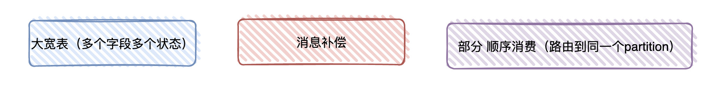

# Java

## 请你说说Java的特点和优点,为什么要选择Java？

1.java语言的特点是：一次编译，到处运行，即平台无关性；是纯面向对象的语言。

2.JAVA语言的优点有：内置的类库**简化**了开发人员的设计工作；具有较好的**安全性**和**健壮性**；开发人员不需要对内存的使用进行管理。

3.选择JAVA的原因是：使用范围很广，安卓操作系统的应用软件目前大部分还是使用JAVA语言编写。（生态繁荣）


## 说说你对面向对象的理解

得分点 封装,继承,多态 标准回答9
1、面向对象三大基本特征：封装、继承、多态。

2、封装：将对象的状态信息隐藏在对象内部,不允许外部程序直接访问对象内部信息,让外部程序通过该类提供的方法来实现对内部信息的操作和访问,提高了代码的**可维护性**；

3、继承：实现**代码复用**的重要手段,通过extends实现类的继承,实现继承的类被称为子类,被继承的类称为父类；

4、多态的实现离不开继承,在设计程序时,我们可以将**参数的类型定义为父类型**。在调用程序时根据实际情况,传入该父类型的某个子类型的实例,这样就实现了多态。解耦。父类引用指向子类对象。


## 请你说说Java基本数据类型和引用类型


1.提供8种基本数据类型：byte(8), short(16), int(32), long(64), float(32), double(64), char(16), boolean，这些基本数据类型有对应的封装类；这基本数据类型在声明之后就会**立刻在栈上被分配**内存空间。

2.其他类型都是引用类型：类，接口，数组，String等，这些变量在**声明时不会被分配**内存空间，只是存储了一个内存地址。


## 介绍一下包装类的自动拆装箱与自动装箱

得分点 包装类的作用,应用场景

1、自动装箱、自动拆箱是JDK1.5提供的功能。

2、自动装箱：把一个基本类型的数据直接赋值给对应的包装类型；

3、自动拆箱是指把一个包装类型的对象直接赋值给对应的基本类型；

4、通过自动装箱、自动拆箱功能,简化基本类型变量和包装类对象之间的转换过程

## 请介绍一下访问修饰符

得分点 private、default、protected、public

它们访问级别控制从小到大为：private -> default -> protected -> public。

private：类中被private修饰的成员只能在**当前类**的内部被访问。

default：如果类中的成员或者一个外部类不适用任何访问修饰符来进行修饰，那么它就是default级别，default访问控制的类成员或外部类可以被相应**包下**的其他类访问。

protected：如果一个类成员被protected修饰，按摩这个成员不但可以被**同一个包**下的其他类访问，还可以被**其他包下的子类**访问。

public：这是Java中最宽松的访问级别,如果类成员被这个修饰符修饰,那么无论访问类和被访问类在不在一个包下,有没有父子关系,这个类成员都可以被访问到。


## 说说static修饰符的用法

得分点 static可以修饰什么,static的重要规则

标准答案 Java类中包含了成员变量、方法、构造器、初始化块和内部类（包括接口、枚举）5种成员,**static关键字可以修饰除了构造器外的其他4种成员**。

static关键字修饰的成员被称为**类成员**。类成员**属于整个类**,不属于单个对象。

static关键字有一条非常重要的规则,即类成员不能访问实例成员,因为类成员属于类的,类成员的作用域比实例成员的作用域更大,很容易出现类成员初始化完成时,但实例成员还没被初始化,这时如果类成员访问实力成员就会引起大量错误。

static修饰的部分会和类同时被加载。

被static修饰的成员先于对象存在,因此,当一个类加载完毕,即使没有创建对象也可以去访问被static修饰的部分。 

静态方法中**没有this关键词**,因为静态方法是和类同时被加载的,而this是随着对象的创建存在的。

静态比对象优先存在。也就是说,静态可以访问静态,但静态不能访问非静态而非静态可以访问静态。


## 请你说一下final关键字

得分点 final类,final方法,final变量

1.final被用来修饰类和类的成分。

2.final属性：变量**引用不可变**，但对象内部**内容可变**；被final修饰的变量**必须被初始化**。 

3.final方法：该方法**不能被重写**，但子类可以使用该方法。 

4.final参数：参数在方法内部**不允许被修改**

5.final类：该类**不能被继承**，所有方法不能被重写，但未被声明为final的**成员变量可以改变**。

final是java关键字，用于声明属性，方法和类，分别表示属性不可交变，方法不可覆盖，类不可继承。

finally是java中异常处理语句结构的一部分，表示总是执行。

finalize是Object类的一个方法，如果子类中重写了该方法，在垃圾收集器执行的时候会调用被回收对象的此方法。


## transient关键字

### 1、transient关键字

​    transient关键字只能修饰变量，而不能修饰方法和类。

​    **一旦变量被transient修饰，变量将不再是对象持久化的一部分**，该变量内容在**序列化后**无法获得访问。


### 2、应用场景

1）一些安全性的信息，比如密码，一般情况下是不能离开JVM的，不能被序列化。

2）类中的字段值可以根据其它字段推导出来，如一个长方形类有三个属性长度、宽度、面积，面积不需要序列化。


## 请你说说重载和重写的区别,构造方法能不能重写

得分点 重载定义、重写定义


重载要求发生在**同一个类中,**多个方法之间方法名相同且**参数列表不同**（数量、顺序、属性）。注意重载与方法的**返回值**以及访问**修饰符**无关。

重写发生在**父类子类中**,若子类方法想要和父类方法构成重写关系,则它的**方法名、参数列表**必须与父类方法相同。另外,返回值要小于等于父类方法,抛出的异常要小于等于父类方法,访问修饰符则要大于等于父类方法。若父类方法的访问修饰符为private,则子类不能对其重写。

同一个类中有多个构造器,多个构造器的形参列表不同就被称为**构造器重载**,构造器重载让Java类包含了多个初始化逻辑,从而允许使用不同的构造器来初始化对象。 构造方法**不能重写**。因为构造方法需要和类保持**同名**,而重写的要求是子类方法要和父类方法保持同名。


如果允许重写构造方法的话,那么子类中将会存在与类名不同的构造方法,这与构造方法的要求是矛盾的。 **父类方法和子类方法之间也有可能发生重载**,因为子类会获得父类的方法,如果子类中定义了一个与父类方法名字相同但参数列表不同的方法,就会形成子类方法和父类方法的重载。


## 请你说一下抽象类和接口的区别

得分点 接口与抽象类的方法,接口与抽象类的常量与变量,单继承多实现

接口和抽象类相同点有：

- 接口和抽象类都不能被实例化,它们都位于继承树的顶端,用于被其它类实现和继承 
- 接口和抽象类都可以有抽象方法,实现接口或继承抽象类的普通子类都必须实现这些抽象方法


在用法上,接口和抽象类也有如下差异： 

- 接口里只能包含抽象方法和默认方法,不能为普通方法提供方法实现；抽象类则可以包含普通方法。
- 接口里只能定义静态常量,不能定义普通成员变量；抽象类里既可以定义普通成员变量,也可以定义静态常量
- 接口里不包含构造器；抽象类可以包含构造器,但抽象类的构造器并不是用于创建对象,而是让其子类调用这些构造器来完成属于抽象类的初始化操作
- 接口里不能包含初始化块,抽象类则可以包含初始化块
- 一个类最多只能有一个父类,包括抽象类；但一个类可以直接实现多个接口,通过实现多个接口可以弥补Java单继承的不足


总之,接口通常是定义允许多个实现的类型的最佳途径,但当演变的容易性比灵活性和功能更加重要时,应该使用抽象类来定义类型。 

在二者的设计目的上,接口作为系统与外界交互的窗口,体现了一种规范。

对于接口的实现者来说,接口规定了实现者必须**向外提供哪些服务**；对于接口的调用者而言,接口规定了调用者可以调用哪些服务,以及如何调用这些服务。

当在一个程序中使用接口时,接口是多个模块间的耦合标准；当在多个应用程序之间使用接口时,接口是多个程序之间的通信标准。 

抽象类则不一样,抽象类作为系统中多个子类的共同父类,它体现的是一种**模板式设计**。抽象类作为多个子类的父类,它可以被当作系统实现过程中的中间产品,这个中间产品已经实现了系统的部分功能,但这个产品依然不能当作最终产品,必须要有更进一步的完善。


## 请你说说==与equals()的区别

得分点 `==`和equals()比较基本变量用法,`==`和equals()对比引用变量的用法

`==`比较基本数据类型时，比较的是数值，比较引用类型时，比较的是引用的内存地址。对象的equals重写前默认是`==`进行比较，重写后比较的是引用的值是否相等

所以如果我们希望自定义判断相等的标准时,可以通过重写EQUALS方法来实现。重写EQUALS()方法时,相等条件是由业务要求决定的,因此EQUALS()方法的实现是由业务要求决定的。


## 请你说说hashCode()和equals()的区别,为什么重写equals()就要重写hashcod()

得分点 hashCode()用途,equals()用途,hashCode()、equals()约定

1、hashCode()：获取哈希码, equals()：比较两个对象是否相等。

2、二者两个约定：如果两个对象相等,它们必须有相同的哈希码；若两个对象的哈希码相同,他们却不一定相等。也就是说,equals()比较两个对象相等时hashCode()一定相等,hashCode()相等的两个对象equqls()不一定相等。

3、加分回答：由于hashCode()与equals()具有联动关系,equals()重写时,hashCode()进行重写,使得这两个方法始终满足相关的约定。

hash不相等直接put，相等再进行equals比较，看是否相同


## 请你说说String类,以及new

String类被final修饰，所以不能被继承。底层是数组，String的底层存储结构是char[]，JDK9之后，字符串的底层存储变成了byte[]。

创建String对象时可以使用字符串直接量，如String str="1abc", 另一种String str=new String("1abc"),前者使用常量池来管理，后者先判断常量池中是否已存在此字符串，不存在就也在常量池创建，再在堆内存创建一个新的对象，因此后者开销更大。


## String、StringBuffer、Stringbuilder有什么区别

得分点 字符串是否可变,StringBuffer、StringBuilder线程安全问题

String:不可变字符序列，效率低，但是复用率高。

StringBuffer:可变字符序列、效率较高(增删)、线程安全

StringBuilder:可变字符序列、效率最高、线程不安全


因此,如果是在单线程下操作大量数据,应优先使用StringBuilder类；如果是在多线程下操作大量数据,应优先使用StringBuffer类。


## 请你说说ArrayList和LinkedList的区别

得分点 数据结构、访问效率

1、 ArrayList的实现是基于**数组**,LinkedList的实现是基于**双向链表**。

2、对于**随机访问**ArrayList要优于LinkedList,ArrayList可以根据下标以O(1)时间复杂度对元素进行随机访问,而LinkedList的每一个元素都依靠地址指针和它后一个元素连接在一起,查找某个元素的时间复杂度是O(N)。 

3、 对于插入和删除操作,LinkedList要优于ArrayList,因为当元素被添加到LinkedList任意位置的时候,不需要像ArrayList那样重新计算大小或者是更新索引。 

4、 LinkedList比ArrayList更占内存,因为LinkedList的节点除了存储数据,还存储了两个引用,一个指向前一个元素,一个指向后一个元素。


ArrayList底层是一个数组,在没指定容量的时候:初始容量为**0**,当进行第一次添加的时候扩容为**10**,,当添加第一个十一个元素时按**1.5**倍扩容,特点是查询快,增删慢.

LinkedList底层是一个双向链表和双端队列特点,查询慢,增删快.

共同点;都是线程不安全的.


## 请说说你对反射的了解

得分点 反射概念,通过反射机制可以实现什么 

反射就是在程序运行期间**动态的获取**对象的属性和方法的功能叫做反射。

它能够在程序运行期间，对于任意一个类，都能知道它所有的方法和属性，对于任意一个对象，都能知道他的属性和方法。

获取Class对象的三种方式：getClass();xx.class;Class.forName("xxx"); 

反射的优缺点： 

优点：运行期间能够动态的获取类，提高代码的灵活性。 

缺点：性能比直接的Java代码要慢很多。 

应用场景：spring的xml配置模式，以及动态代理模式都用到了反射。

## 请说说你对Java集合的了解

得分点 Set、List、Quque、Map

Java中的集合类分为4大类,分别由4个接口来代表,它们是Set、List、Queue、Map。其中,Set、List、Queue、都继承自Collection接口。 

- Set代表无序的、元素不可重复的集合。 
- List代表有序的、元素可以重复的集合。 
- Queue代表先进先出（FIFO）的队列。
- Map代表具有映射关系（key-value）的集合。

java.util包下的集合类中,也有少数的线程安全的集合类,例如Vector、Hashtable,它们都是非常古老的API。虽然它们是线程安全的,但是性能很差,已经不推荐使用了。 

TreeMap排序，通过红黑树实现的

LinkedHashMap记录添加顺序


## 说说你对ArrayList的理解

得分点 数组实现、默认容量10、每次扩容1.5倍

ArrayList 底层是用Object[]数组实现的，通过默认构造器创建容器时，首先会初始化为一个空数组，然后在第一次添加元素时创建大小为10的数组，超出限制会增加50%的容量，并且数据以System.arraycopy()复制到新数组，当然也可以指定初始容量。如果一次添加多个元素，如addAll，如果添加元素的个数大于默认扩容的长度，则会使用两者中最大的作为扩容后的容量


 ArrayList支持缩容,但不会自动缩容,即便是ArrayList中只剩下少量数据时也不会主动缩容。如果我们希望缩减ArrayList的容量,则需要自己调用它的trimToSize()方法,届时数组将按照元素的实际个数进行缩减。

## HashMap

### 请你说说HashMap底层原理

得分点 数据结构、put()流程、扩容机制

HashMap的底层是数组加链表，在1.8之后是数组+链表+红黑树；


put流程是：基于哈希算法来确定元素位置，当我们向集合存入数据时，他会计算传入的key的哈希值，并利用哈希值取绝对值再根据集合长度取余来确定元素的位置，如果这个位置已经存在其他元素了，就会发生哈希碰撞，则hashmap就会通过链表将这些元素组织起来，如果链表的长度达到**8**时，并且数组长度大于等于**64**时，就会转化为红黑树，从而提高查询速度。 

num % length优化为num & (length - 1)


扩容机制：HashMap中数组的默认初始容量为**16**，当达到默认负载因子**0.75**时，会以**2**的指数倍进行扩容。 Hashmap时非线程安全的，在多线程环境下回产生循环死链，因此在多线程环境下建议使用ConcurrentHashMap。


HashMap的细节我们不谈，只看这个哈希算法的细节(h = key.hashCode()) ^ (h >>> 16)

1、^按位异或运算，只要位不同结果为1，不然结果为0；

2、无符号右移：右边补0

可以将**高低位二进制特征混合起来**

异或运算能更好的保留各部分的特征，如果采用&运算计算出来的值会向0靠拢，采用|运算计算出来的值会向1靠拢


### 请你说说HashMap和Hashtable的区别

得分点 线程安全、null

1. Hashtable在实现Map接口时保证了**线程安全性**,而HashMap则是非线程安全的。所以,Hashtable的性能不如HashMap,因为为了保证线程安全它牺牲了一些性能。

2. Hashtable**不允许存入null**,无论是以null作为key或value,都会引发异常。而HashMap是允许存入null的,无论是以null作为key或value,都是可以的。 

虽然Hashtable是线程安全的,但仍然不建议在多线程环境下使用Hashtable。因为它是一个古老的API,从Java 1.0开始就出现了,它的同步方案还不成熟,性能不好。

如果要在多线程环下使用HashMap,建议使用ConcurrentHashMap。它不但保证了线程安全,也通过降低锁的粒度提高了并发访问时的性能。


### 红黑树

红黑树：二叉查找树，近似平衡二叉树，最长路径不超过最短路径的两倍，所以红黑树只追求树的大致平衡

红黑树性质：

- 红黑树中节点分为黑色节点和红色节点。
- 根节点和所有叶子结点（NIL节点）是黑色。
- 每条从根到叶子的路基上不能出现连续两个红色节点。
- 从任一节点到所有叶子结点的路径上的黑色节点数量相同。

上面的性质就保证了从一个节点到叶结点的最长路径不会比这个节点到叶结点的最短路径大两倍。

### 请你说说ConcurrentHashMap

得分点 数组+链表+红黑树、锁的粒度 

 在JDK8中,ConcurrentHashMap的底层数据结构与HashMap一样,也是采用“数组+链表+红黑树”的形式。

同时,它又采用锁定头节点的方式降低了锁粒度,以较低的性能代价实现了线程安全。

底层数据结构的逻辑可以参考HashMap的实现,下面我重点介绍它的线程安全的实现机制。 

1. **初始化**数组或头节点时,ConcurrentHashMap并没有加锁,而是**CAS**的方式进行原子替换（原子操作,基于Unsafe类的原子操作API）。 
2. **插入数据**时会进行**加锁**处理,但锁定的不是整个数组,而是槽中的头节点。所以,ConcurrentHashMap中锁的粒度是槽,而不是整个数组,并发的性能很好。 
3. **扩容**时会进行加锁处理,**锁定的仍然是头节点**。并且,支持多个线程同时对数组扩容,提高并发能力。每个线程需先以CAS操作抢任务,争抢一段连续槽位的数据转移权。抢到任务后,该线程会锁定槽内的头节点,然后将链表或树中的数据迁移到新的数组里。 
4. **查找**数据时并不会加锁,所以性能很好。


另外,在扩容的过程中,依然可以支持查找操作。**如果某个槽还未进行迁移,则直接可以从旧数组里找到数据。**如果某个槽已经迁移完毕,但是整个扩容还没结束,则扩容线程会创建一个**转发节点存入旧数组**,届时查找线程根据转发节点的提示,从新数组中找到目标数据。 


## 请你说说Java的异常处理机制

得分点 异常处理、抛出异常、异常跟踪栈

1、异常处理机制让程序具有**容错性**和**健壮性**,程序运行出现状况时,系统会生成一个Exception对象来通知程序

2、处理异常的语句由**try、catch、finally**三部分组成。try块用于包裹业务代码,catch块用于捕获并处理某个类型的异常,finally块则用于回收资源。

3、如果业务代码发生异常,系统创建一个Exception异常对象,并将其提交给JVM,由JVM寻找可以处理这个异常的catch块,并将异常对象交给这个catch块处理。如果JVM没有找到，运行环境终止,Java程序退出。

4、Java也允许程序主动抛出异常。当业务代码中,判断某项错误的条件成立时,可以使用throw关键字向外抛出异常。


## 请你讲一下Java 8的新特性

得分点 Lambda表达式、Java8对接口的改进
1、Lambda表达式：可将功能视为方法参数,或者将代码视为数据。使用 Lambda 表达式,可以更简洁地表示**单方法接口**（称为功能接口）的实例。

2、方法引用：提供了非常有用的语法,可直接引用已有Java类或对象（实例）的方法或构造器。与Lambda联合使用,方法引用可以使语言的构造更紧凑简洁,减少冗余代码。（::）四个点

3、对接口进行了改进：允许在接口中定义**默认方法**,默认方法必须使用**default**修饰。

4、Stream API：新添加的Stream API（java.util.stream）支持对元素流进行函数式操作。Stream API 集成在 Collections API 中,可以对集合进行批量操作,例如顺序或并行的 map-reduce 转换。 

5、Date Time API：加强对日期与时间的处理。


## 请你说说泛型、泛型擦除

Java是伪泛型，我们在代码中写好的泛型，在编译时还会去掉，这就是泛型擦除

解耦

泛型：Java在jdk1.5引入了泛型，在没有泛型之前，每次从集合中读取的对象都必须进行类型转换，如果在插入对象时，类型出错，那么在运行时转换处理的阶段就出错；在提出泛型之后就可以代码中明确的**指定集合接受哪些对象类型**，编译器就能知晓并且自动为插入的代码进行泛化，在编译阶段告知是否插入类型错误的对象，程序会变得更加安全清晰。 


泛型擦除：Java泛型是伪泛型，因为Java代码在**编译阶段**，所有的泛型信息会被擦除，Java的泛型基本上都是在编辑器这个层次上实现的，在生成的字节码文件中是不包含泛型信息的，使用泛型的时候加上的类型，在编译阶段会被擦除掉，这个过程称为泛型擦除。


# JVM

## 简单说下你对JVM的了解

得分点 跨平台、HotSpot、内存模型

JVM是java语言跨平台的关键，程序员可以把主要精力放在具体业务逻辑,而不是放在保障物理硬件的兼容性上。


HotSpot是Sun / Oracle JDK / Open JDK的默认Java虚拟机，也是目前使用范围最广的Java虚拟机 


JVM由三部分组成：1.类加载子系统，2.执行引擎，3.运行时数据区

1. 类加载子系统,可以根据指定的全限定名来载入类或接口。 
2. 执行引擎,负责执行那些包含在被载入类的方法中的指令。
3. 当程序运行时,JVM需要内存来存储许多内容,例如：字节码、对象、参数、返回值、局部变量、运算的中间结果,等等,JVM会把这些东西都存储到运行时数据区中,以便于管理。而运行时数据区又可以分为方法区、堆、虚拟机栈、本地方法栈、程序计数器。

## 说说Java运行时数据区

得分点 程序计数器、虚拟机栈、本地方法栈、堆、方法区


1）程序计数器：程序计数器是一块很小的内存空间，它可以看作是当前线程所执行的字节码的行号指示器。由于Java虚拟机的多线程是通过线程轮流切换、分配处理器执行时间的方式来实现的，在任何一个确定的时刻，一个处理器都只会执行一条线程中的指令。因此，为了线程切换后能恢复到正确的执行位置，每条线程都需要有一个独立的程序计数器，各个线程之间的计数器互不影响，独立存储，我们称这类内存区域为“**线程私有**”的内存。 

2）虚拟机栈：虚拟机栈也是**线程私有**的，它的生命周期与线程相同。虚拟机栈描述的是Java方法执行的线程内存模型：每个方法被执行的时候，Java虚拟机都会同步创建一个栈帧用于存储**局部变量表、操作数栈（方法执行过程中各指令的操作数）、动态链接、方法出口**等信息。每一个方法被调用直至执行完毕的过程，就对应着一个栈帧在虚拟机栈中从入栈到出栈的过程。 

3）本地方法栈：本地方法栈与虚拟机栈所发挥的作用是非常相似的，其区别只是虚拟机栈为虚拟机执行Java方法服务，而本地方法栈则是为了虚拟机使用到的本地方法服务。 

4）堆：堆是虚拟机所管理的最大的一块内存空间。Java堆是被所有**线程共享**的一块内存区域，在虚拟机启动时创建，此内存区域的唯一目的就是存放**对象实例**，Java世界里“几乎”所有的对象实例都是在这里分配内存的。堆是垃圾收集器管理的存储区域，因此也称为“GC堆”。 

5）方法区：方法区与堆一样，是各个线程共享的内存区域，它用于存储已被虚拟机加载的**类型信息、常量、静态变量、即时编译器编译后的代码缓存**等数据。运行时常量池是方法区的一部分。Class文件中除了有类的版本、字段、方法、接口等描述信息外，还有一项信息时常量池表，用于存放编译期生成的各种字面量与符号。**元空间**


`JDK1.8`之前，`Hotspot`虚拟机中，字符串[常量池](https://so.csdn.net/so/search?q=常量池&spm=1001.2101.3001.7020)存放于方法区的实现永久代（Perm Space）中，`JDK1.8`开始，字符串常量池移到了堆中。


## 说说你了解的JVM内存模型

得分点 类加载子系统、执行引擎、运行时数据区


1、类加载子系统：可以根据指定的全限定名来载入类或接口。 

2、执行引擎：负责执行那些包含在被载入类的方法中的指令。 

3、运行时数据区：分为方法区、堆、虚拟机栈、本地方法栈、程序计数器。当程序运行时,JVM需要内存来存储许多内容,例如：字节码、对象、参数、返回值、局部变量、运算的中间结果等,把这些东西都存储到运行时数据区中,以便于管理。

## 说说JVM的垃圾回收机制

得分点 新生代收集、老年代收集、混合收集、整堆收集

1. 新生代收集（Minor GC/Young GC）：指目标只是新生代的垃圾收集。
2. 老年代收集（Major GC/Old GC）：指目标只是老年代的垃圾收集。目前只有CMS收集器会有单独收集老年代的行为。
3. 混合收集（Mixed GC）：指目标是收集整个新生代以及部分老年代的垃圾收集。目前只有G1收集器会有这种行为。
4. 整堆收集（Full GC）：收集整个Java堆和方法区的垃圾收集，包括新生代、老年代、方法区的回收，一般 Full GC 等价于 Old GC。
   


第一将决定哪些对象要回收，jvm决定了将未被引用的对象占用空间回收，通常用引用计数法或者可达性分析法，后者是jvm主流使用根可达算法，当对象不可达时会被回收。

第二什么时候回收JVM，通常在内存不够用时，或定期回收， 

第三用什么方式回收。有分代回收，分区域回收法，收集器由年轻代收集器Serial,ParNew,Parallel Scavenge, 老年代有CMS,Serial Old, Parallel Old . G1 是分区回收器的新工具，可以并发标记，并发回收。

## 说说JVM的垃圾回收算法

得分点 标记清除、标记复制、标记整理

1.标记清除算法：优点：垃圾回收速度快。缺点：存在内存碎片。

2.标记复制算法：优点：内存开销大。缺点：没有内存碎片。

3.标记整理算法：优点：没有内存碎片。缺点：整理速度慢。

4.分代收集算法:根据对象存活周期的不同将内存划分为几块。一般是把Java堆分为新生代和老年代，这样就可以根据各个年代的特点采用最适当的收集算法


## 为什么需要幸存者区

老年区很大，避免对象过多进入老年区频繁触发FullGC，进行一次Full GC消耗的时间比Minor GC长得多。

增加老年代空间：更多存活对象才能填满老年代。降低Full GC频率   随着老年代空间加大，一旦发生Full GC，执行所需要的时间更长

减少老年代空间：Full GC所需时间减少   老年代很快被存活对象填满，Full GC频率增加


## 所有对象新建后都会在Eden区吗？ 

新创建的对象都会被分配到Eden区，一些特殊的大的对象会直接分配到Old区。


## 说说垃圾收集器

得分点
Serial、Serial Old、PawNew、CMS、Parallel Scavenge、Parallel Old、G1

Serial（新生代）、Serial Old（老年代）：适用于单核小CPU，单核工作，回收时会暂停其他工作stop the word。

PawNew（新生代）、CMS（老年代）：适用于多核CPU，最求短暂停时间，多核工作，使用标记清除算法，最短的暂停时间。

Parallel Scavenge（新生代-标记复制算法）、Parallel Old（老年代-标记整理算法）：1.7,1.8默认的组合，适用于多核CPU，追求最大吞吐量

G1 jdk1.9默认，适用于大内存多核CPU服务器，它不按整个新生代或老年代去回收，而是开辟了面向局部收集，实现了较小的收集暂停时间和高吞吐量。


## 说说GC的可达性分析

得分点
GC Roots、引用链

这个算法的基本思路就是通过一系列称为“GC Roots”的根对象作为起始节点集，从这些节点开始，根据引用关系向下搜索，搜索过程所走过的路径称为“引用链”，如果某个对象到GC Roots间没有任何引用链相连，或者用图论的话来说就是从GC Roots到这个对象不可达时，则证明此对象是不可能再被使用的。

在Java技术体系里面，固定可作为GC Roots的对象包括以下几种：
- 在**虚拟机栈中引用的对象**，譬如各个线程被调用的方法堆栈中使用到的参数、局部变量、临时变量等；
- 在方法区中**类静态属性引用的对象**，譬如Java类的引用类型静态变量；
- 在方法区中**常量**引用的对象，譬如字符串常量池里的引用；
- 在**本地方法栈**中引用的对象；
- **JVM内部的引用**，如基本数据类型对应的Class对象，常驻的异常对象，以及系统类加载器；
- 所有被**同步锁**持有的对象；
- 反映Java虚拟机内部情况的JMXBean、JVMTI中注册的回调、本地代码缓存等。

真正宣告一个对象死亡，至少要经历两次标记过程：

如果对象在进行可达性分析后发现没有与GC Roots相连接的引用链，那它将会被第一次标记，随后进行一次筛选，筛选的条件是此对象是否有必要执行finalize()方法。假如对象没有覆盖finalize()方法，或者finalize()方法已经被虚拟机调用过，那么虚拟机将这两种情况都视为“没有必要执行”。

反之，该对象将会被放置在一个名为F-Queue的队列之中，并在稍后由一条由虚拟机自动建立的、低调度优先级的Finalizer线程去执行它们的finalize()方法。

 finalize()方法是对象逃脱死亡命运的最后一次机会，需要注意的是，任何一个对象的finalize()方法都**只会被系统自动调用一次**，如果对象面临下一次回收，它的finalize()方法不会被再次执行。另外，finalize()方法的运行代价高昂，不确定性大，无法保证各个对象的调用顺序，如今已被官方明确声明为不推荐使用的语法。


## 请你讲下CMS垃圾回收器

得分点 老年代、低停顿、标记清除、四个步骤

CMS收集器是一种以获取最短回收停顿时间为目标的收集器

CMS垃圾收集器采用**标记清除算法**，使用多线程实现，所以它的应用场景一般为服务端系统的老年代。它是一个以达到在垃圾回收期间用户线程低停顿为目标的垃圾收集器。

CMS垃圾收集器垃圾回收分为四个阶段：

1，初始标记：只对与GCRoots有直接关键的对象进行可达性分析的标记。

2，并发标记：标记整个GCRoots引用链中的对象，与用户线程并发执行。

3，重新标记：用于更新在并发标记过程中被复活的对象。

4，并发清除：清除标记阶段判断的已死亡的对象。该流程与用户线程并发执行。

优点

并发收集

低延迟


缺点：

1，它使用标记清除算法导致内存碎片化，

2，会产生在并发清除阶段的浮动垃圾，只有到下一次垃圾回收时才会被清除。


## 请你讲下G1垃圾回收器

按块把剩余对象复制合并到其他块，整体上看就像在整理一样

整体上是标记+整理算法，两个区域之间是复制算法

G1从整体来看是基于**标记整理算法**实现的收集器,但从局部上看又是基于**标记复制算法**实现，面向**混合收集**（同时收集新生带和老年带）的一个垃圾收集器。

G1收集器将整个堆内存区域划分为多个大小相等的region，每一个Region都可以根据需要,扮演新生代的Eden空间、Survivor空间,或者老年代空间。

以region为单位进行垃圾收集并获取每个region的收集效率和收集收益，通过一张优先级表对其进行维护。同时每个region中维护了一个remember set用来存储该分区中的对象所引用的对象在其他分区的位置来避免在做可达性分析算法时全堆扫描。

G1垃圾收集器垃圾回收主要包括四个流程：1，初始标记，2，并发标记（类似于CMS），3，最终标记在并发标记中维护了一个remember set log用来记录在该阶段发生变化的对象引用关系，在该阶段就是将该信息同步到最终标记信息中。4，并发筛选回收：根据优先级表选择分区进行垃圾回收，用户线程不停顿。


G1认为只要超过了Region一半的对象即可判定为**大对象**。而对于那些超过了整个Region容量的超级大对象,将会被存放在N个连续的Humongous Region之中,G1的大多数行为都把Humongous Region作为老年代的一部分来进行看待。 

**并行与并发**

- 并行性：G1在回收期间，可以有多个GC线程同时工作，有效利用多核计算能力。此时用户线程STW
- 并发性：G1拥有与应用程序交替执行的能力，部分工作可以和应用程序同时执行，因此，一般来说，不会在整个回收阶段发生完全阻塞应用程序的情况

**初始标记阶段：**标记从根节点直接可达的对象。这个阶段是sTw的，并且会触发一次年轻代GC。

**根区域扫描（Root Region Scanning）：**G1 Gc扫描survivor区直接可达的老年代区域对象，并标记被引用的对象。这一过程必须在youngGC之前完成。

**并发标记（Concurrent Marking）：**在整个堆中进行并发标记（和应用程序并发执行），此过程可能被youngGC中断。在并发标记阶段，若发现区域对象中的所有对象都是垃圾，那这个区域会被立即回收。同时，并发标记过程中，会计算每个区域的对象活性（区域中存活对象的比例）。

**再次标记（Remark）：**由于应用程序持续进行，需要修正上一次的标记结果。是STW的。G1中采用了比CMS更快的初始快照算法：snapshot-at-the-beginning（SATB）。

**独占清理（cleanup，STW）：**计算各个区域的存活对象和GC回收比例，并进行排序，识别可以混合回收的区域。为下阶段做铺垫。是sTw的。这个阶段并不会实际上去做垃圾的收集

**并发清理阶段：**识别并清理完全空闲的区域。

## 说说类加载机制

得分点
加载、验证、准备、解析、初始化

类加载的

1. 通过类的全限定名获取定义此类的**二进制字节流**
2. 将字节流所代表的静态存储结构转换为方法区的**运行时数据结构**
3. 在内存中生成一个代表该类的 Class 对象，作为方法区类信息的访问入口  


接下来是链接过程，分为三步：验证，准备，解析。

验证：确保文件符合规范，不会危害虚拟机自身的安全，对文件格式，字节码，元数据，符号引用进行验证。 

准备:为类变量分配初始空间以及默认初始值，即零值。这里不会为实例变量分配，类变量分配在方法区中，实例变量跟随对象分配在堆中，final修饰的在编译期间就分配了，在准备阶段会显式的初始化。 

解析：将常量池内的间接引用转为直接引用的过程。 


初始化阶段就是执行类构造器方法的过程。此方法不需要定义，一个类只会被加载一次，虚拟机必须保证在多线程条件下类的构造方法是被加锁的。


## 说说JVM的双亲委派模型

得分点 启动类加载器、扩展类加载器、应用程序类加载器

双亲委派模型的工作过程是,如果一个类加载器收到了类加载的请求,它**首先不会自己去尝试**加载这个类,而是把这个请求**委派给父类加载器**去完成,每一个层次的类加载器都是如此,因此所有的加载请求最终都应该传送到最顶层的启动类加载器中,只有当父加载器反馈自己无法完成这个加载请求时,子加载器才会尝试自己去完成加载

稳定运行、避免重复加载、核心 API 不被篡改、破坏loadClass()、findClass()


## 说说类的实例化过程

得分点 类加载、分配内存、初始化零值、状态设置、构造函数 

类加载--分配内存--初始化0值--状态设置--构造函数--初始化

在JVM中，对象的创建遵循如下过程：

+ 当JVM遇到一条字节码new指令时，首先会去检查这个指令的参数是否能在常量池中定位到一个类的符号引用，并且检查这个符号引用代表的类是否已被加载、解析和初始化过。
+ 如果没有，那必须先执行相应的类加载过程。
+ 在类加载检查通过后，接下来虚拟机将为新生对象分配内存。对象所需内存的大小在类加载完成后便可完全确定，为对象分配空间的任务实际上便等同于把一块确定大小的内存块从Java堆中划分出来。
+ 内存分配完成之后，虚拟机必须将分配到的内存空间都**初始化为零值**，如果使用了TLAB的话，这一项工作也可以提前直TLAB分配时顺便进行。这步操作保证了对象的实例字段在Java代码中可以不赋初始值就直接使用，使程序能访问到这些字段的数据类型所对应的零值。
+ 接下来，虚拟机还要对对象进行必要的设置，例如这个对象是哪个类的实例、如何才能找到类的元数据信息、对象的哈希码、对象的GC分代年龄等信息。这些信息存放在对象的对象头之中。根据虚拟机当前运行状态的不同，如是否启动偏向锁等，对象头会有不同的设置方式。在上面工作都完成之后，从虚拟机的视角来看，一个新的对象已经产生了，
+ 但是从Java程序的视角来看，对象创建才刚刚开始——构造函数，即Class文件中的init（）方法还没执行，所有的字段都为默认的零值，对象需要的其他资源和状态信息也还没有按照预订的意图构造好。一般来说，new指令之后会接着执行init（）方法，按照程序猿的意愿对对象进行初始化，这样一个真正可用的对象才能完全被构造出来。


## 子类对象实例化过程


+ 方法区调用父类和子类class类文件
+ 栈中申请开机，声明引用变量
+ 堆中开辟空间
+ 初始化0值
+ 子类构造函数
+ 显示初始化父类的属性
+ 父类构造函数，通过子类使用super调用，并出栈
+ 显示初始化子类的属性，有值就赋值
+ 初始化结束，将堆内存地址赋给引用变量，子类构造器出栈


## 请你说说内存溢出

内存溢出：指程序运行过程中申请的内存大于系统能够提供的内存，导致无法申请到足够的内存，于是就发生了内存溢出。

引起内存溢出的原因：

1.内存加载的数据量过于庞大。如一次从数据库取出的过多的数据。

2.代码中存在死循环或者死循环中产生大量的对象实体。

3.启动内存值设定过小。

解决内存溢出的方案：

1.修改JVM启动参数，直接增加内存。

2.检查错误日志，查看“OutOfMemory”错误之前是否存在异常。

3.对代码进行debug分析。

4.使用内存工具动态查看内存使用情况。

常见的内存溢出出现在：

1.堆。对象创建过多

2.栈溢出

3.方法区和运行时常量池；创建大量动态类。


## 请你说说内存泄漏

内存泄露：指不再使用的对象仍然被引用，导致垃圾收集器无法回收它们的内存，最终导致OOM。

通俗地说,我们可以将内存泄漏视为一种**疾病**,它通过阻塞重要的内存资源来降低应用程序的性能。和所有其他疾病一样,如果不治愈,随着时间的推移,它可能导致致命的应用程序崩溃。 内存泄漏很难解决,找到它们需要对Java语言有很深的理解并掌握复杂的命令。在处理内存泄漏时,没有一刀切的解决方案,因为泄漏可能通过各种不同的事件发生。 但是,如果我们采用最佳实践并定期执行严格的代码演练和分析,那么我们就可以将应用程序中内存泄漏的风险降到最低。


# JUC

## 请你说说JUC

得分点 原子类、锁、线程池、并发容器、同步工具 标准回答 JUC是java.util.concurrent的缩写,这个包是JDK 1.5提供的并发包,包内主要提供了支持并发操作的各种工具。这些工具大致分为如下5类：原子类、锁、线程池、并发容器、同步工具。

1. **原子类** 从JDK 1.5开始,并发包下提供了atomic子包,这个包中的原子操作类提供了一种用法简单、性能高效、线程安全地更新一个变量的方式。在atomic包里一共提供了17个类,属于4种类型的原子更新方式,分别是原子更新基本类型、原子更新引用类型、原子更新属性、原子更新数组。

2. **锁** 从JDK 1.5开始,并发包中新增了Lock接口以及相关实现类用来实现锁功能,它提供了与synchronized关键字类似的同步功能,只是在使用时需要显式地获取和释放锁。虽然它缺少了隐式获取释放锁的便捷性,但是却拥有了多种synchronized关键字所不具备的同步特性,包括：可中断地获取锁、非阻塞地获取锁、可超时地获取锁。

3. **线程池** 从JDK 1.5开始,并发包下新增了内置的线程池。其中,ThreadPoolExecutor类代表常规的线程池,而它的子类ScheduledThreadPoolExecutor对定时任务提供了支持,在子类中我们可以周期性地重复执行某个任务,也可以延迟若干时间再执行某个任务。此外,Executors是一个用于创建线程池的工具类,由于该类创建出来的是带有无界队列的线程池,所以在使用时要慎重。

4. 并发容器 从JDK 1.5开始,并发包下新增了大量高效的并发的容器,这些容器按照实现机制可以分为三类。第一类是以降低锁粒度来提高并发性能的容器,它们的类名以Concurrent开头,如ConcurrentHashMap。第二类是采用写时复制技术实现的并发容器,它们的类名以CopyOnWrite开头,如CopyOnWriteArrayList。第三类是采用Lock实现的阻塞队列,内部创建两个Condition分别用于生产者和消费者的等待,这些类都实现了BlockingQueue接口,如ArrayBlockingQueue。

5. **同步工具** 从JDK 1.5开始,并发包下新增了几个有用的并发工具类,一样可以保证线程安全。其中,Semaphore类代表**信号量**,可以控制同时访问特定资源的线程数量；CountDownLatch类则允许一个或多个线程等待其他线程完成操作；CyclicBarrier可以让一组线程到达一个屏障时被阻塞,直到最后一个线程到达屏障时,屏障才会打开,所有被屏障拦截的线程才会继续运行。

## 请你说说进程与线程的区别

得分点：地址空间、开销、并发性、内存

进程是资源分配的最小单位，线程是cpu调度的最小单位。

1、进程有独立的**地址空间**,线程有自己的堆栈和局部变量,但线程之间没有单独的地址空间； 

2、进程和线程切换时,需要切换进程和线程的**上下文**,进程的上下文切换时间开销远远大于线程上下文切换时间,耗费资源较大,效率要差一些；

上下文切换：先把前一个任务的CPU上下文（CPU寄存器和程序计数器）保存起来，然后加载新任务的上下文到这些寄存器和程序计数器，最后再跳转到程序计数器所指的新位置运行新任务。


## 请你说说线程和协程的区别

协程是线程的抽象单位，减少了线程切换过程中的资源代价

线程是同步的，协程是异步的。协程能保留上一次调用时的状态,每次过程重入时,就相当于进入上一次调用的状态

线程是抢占式的，协程是非抢占式的，所以需要用户释放使用权来切换给其他协程，因此同一时间只有一个协程拥有执行权。

而创建协程不需要调用操作系统的功能，编程语言自身就可以完成，所以协程也被称为用户态线程，协程比线程轻量很多。

## 说说线程的状态


得分点 NEW、RUNNABLE、BLOCKED、WTING、TIMED_WTING、TERMINATED

标准回答 Java线程在运行的生命周期中,在任意给定的时刻,只能处于下列6种状态之一：

NEW ：**初始状态**,线程被创建,但是还没有调用start方法。

RUNNABLE：**可运行状态**,线程正在JVM中执行,但是有可能在等待操作系统的调度。（运行状态和就绪状态，因为切换非常快合成一个）

BLOCKED ：**阻塞状态**,线程正在等待获取监视器锁。

WTING ：**等待状态**,线程正在等待其他线程的通知或中断。

TIMED_WTING：**超时等待状态**,在WTING的基础上增加了超时时间,即超出时间**自动返回运行状态**。

TERMINATED：**终止状态**,线程已经执行完毕。

此外,线程在执行同步方法时,在没有获取到锁的情况下,会进入到阻塞状态。线程在执行完run方法之后,会进入到终止状态。 

Java将操作系统中的**就绪和运行**两个状态合并为可运行状态（RUNNABLE）。

线程阻塞于**synchronized的监视器锁时会进入阻塞状态**,而**线程阻塞于Lock锁时进入的却是等待状态**,这是因为Lock接口实现类对于阻塞的实现均使用了LockSupport类中的相关方法。


## 说说线程的创建方式

创建线程有3种方式：1.继承Thread类，重写run()方法；2.实现Runnable接口，并实现该接口的run()方法；3.实现Callable接口，重写call()方法。前两种方式线程执行完后都没有返回值，最后一种带返回值；一般推荐实现Runnable接口的方式。


创建线程有三种方式，分别是继承Thread类，实现Runnable接口，实现Callable接口

继承Thread类之后我们需要重写run（）方法，方法中是我们希望这个线程执行什么操作，再创建对象的实例，通过实例对象的start（）方法开启这个线程，

实现runnable接口之后，我们需要实现run方法，方法中同样写我们需要执行的操作，然后将实现了接口的类作为参数创建一个Thread对象，通过这个对象的start方法开启线程，

实现Callable之后，需要实现call方法，方法中写我们需要的操作，然后创建实现接口类的对象，将对象作为参数创建FurtureTask对象，再将task对象作为参数创建thread对象，调用start方法开启线程，还可以使用task对象的get方法获取返回值。

他们的区别是前二者不能获取返回值，callable接口可以获得返回值，一般在实际使用中，更多使用实现接口的方式开启线程，因为接口不会占用类的继承位置。


## 说说你对线程池的理解

得分点 核心参数、处理流程、拒绝策略

池化技术

1）它可以管理线程的数量，可以避免无节制的创建线程，导致超出系统负荷直至奔溃。

2）它还可以让线程复用，可以大大地**减少创建和销毁**线程所带来的开销。

参数有：

corePoolSize（核心线程池数）、workQueue（等待队列）、maxinumPoolSize（最大线程池数）、handler（拒绝策略）、keepAliveTime（空闲线程存活时间）。


corePoolSize：核心线程数，也是线程池中**常驻的线程数**，线程池初始化时默认是没有线程的，当任务来临时才开始创建线程去执行任务

maximumPoolSize：最大线程数，在核心线程数的基础上可能会额外增加一些非核心线程，需要注意的是**只有当workQueue队列填满时**才会创建多于corePoolSize的线程(线程池总线程数不超过maxPoolSize)

keepAliveTime：**非核心线程的空闲时间**超过keepAliveTime就会被自动终止回收掉，注意当corePoolSize=maxPoolSize时，keepAliveTime参数也就不起作用了(因为不存在非核心线程)；

unit：keepAliveTime的时间单位

workQueue：用于保存任务的队列，可以为无界、有界、同步移交三种队列类型之一，当池子里的工作线程数大于corePoolSize时，这时新进来的任务会被放到队列中

threadFactory：创建线程的工厂类，默认使用Executors.defaultThreadFactory()，也可以使用guava库的ThreadFactoryBuilder来创建

handler：线程池无法继续接收任务(队列已满且线程数达到maximunPoolSize)时的饱和策略，取值有AbortPolicy、CallerRunsPolicy、DiscardOldestPolicy、DiscardPolicy


## 请你说说BIO、NIO、AIO

得分点 阻塞IO模型、非阻塞IO模型、异步IO模型

根据UNIX网络编程对I/O模型的分类,UNIX提供了5种I/O模型,分别是阻塞I/O模型、非阻塞I/O模型、I/O复用模型、信号驱动I/O模型、异步I/O模型。

BIO、NIO、AIO这五种模型中的三种,它们分别是阻塞I/O模型、非阻塞I/O模型、异步非阻塞I/O模型的缩写。

+ 阻塞I/O模型（blocking I/O）：是最常用的I/O模型,缺省情形下,所有文件操作都是阻塞的。我们以套接字接口为例来理解此模型,即在进程空间中调用recvfrom,其系统调用直到数据包到达且被复制到应用进程的缓冲区中或者发生错误时才返回,在此期间**一直会等待**,进程在从调用recvfrom开始到它返回的整段时间内都是被阻塞的,因此被称为阻塞I/O模型。 
+ 非阻塞I/O模型（nonblocking I/O）：recvfrom从应用层到内核的时候,如果该缓冲区没有数据的话,就直接返回一个EWOULDBLOCK错误,一般都对非阻塞I/O模型进行**轮询检查**这个状态,看内核是不是有数据到来。 
+ 异步I/O模型（asynchronous I/O）：告知内核启动某个操作,并让内核在整个操作完成后（包括将数据从内核复制到用户自己的缓冲区）**通知**我们。这种模型与信号驱动模型的主要区别是：信号驱动I/O由内核通知我们**何时可以开始**一个I/O操作,异步I/O模型由内核通知我们I/O操作何时**已经完成**。
+ I/O复用模型（I/O multiplexing）：Linux提供select/poll,进程通过将一个或多个fd传递给select或poll系统调用,阻塞在select操作上,这样select/poll可以帮我们侦测多个fd是否处于就绪状态。select/poll是顺序扫描fd是否就绪,而且支持的fd数量有限,因此它的使用受到了一些制约。Linux还提供了一个epoll系统调用,epoll使用基于事件驱动方式代替顺序扫描,因此性能更高。当有fd就绪时,立即回调函数rollback。 
+ 信号驱动I/O模型（signal-driven I/O）：首先开启套接口信号驱动I/O功能,并通过系统调用sigaction执行一个信号处理函数（此系统调用立即返回,进程继续工作,它是非阻塞的）。当数据**准备就绪时**,就为该进程生成一个SIGIO信号,通过信号回调**通知应用程序**调用recvfrom来读取数据,并通知主循环函数处理数据。


## 请你讲一下Java NIO

得分点 Buffer、Channel、Selector

NIO包含三个核心的组件：Buffer（缓冲区）、Channel（通道）、Selector（多路复用器）。 

Buffer是一个对象,它包含一些要写入或者要读出的数据。在NIO类库中加入Buffer对象,体现了新库与原I/O的一个重要区别。在面向流的I/O中,可以将数据直接写入或者将数据直接读到Stream对象中。在NIO库中,所有数据都是用缓冲区处理的。在读取数据时,它是直接读到缓冲区中的。在写入数据时,写入到缓冲区中。任何时候访问NIO中的数据,都是通过缓冲区进行操作。 

Channel是一个通道,可以通过它读取和写入数据,它就像自来水管一样,网络数据通过Channel读取和写入。通道与流的不同之处在于通道是双向的,流只是在一个方向上移动而且通道可以用于读、写或者同时用于读写。因为Channel是全双工的,所以它可以比流更好地映射底层操作系统的API。特别是在UNIX网络编程模型中,底层操作系统的通道都是全双工的,同时支持读写操作。 

Selector会不断地轮询注册在其上的Channel,如果某个Channel上面有新的TCP连接接入、读和写事件,这个Channel就处于就绪状态,会被Selector轮询出来,然后通过SelectionKey可以获取就绪Channel的集合,进行后续的I/O操作。

一个多路复用器Selector可以同时轮询多个Channel,由于JDK使用了epoll()代替传统的select实现,所以它并没有最大连接句柄1024/2048的限制。这也就意味着只需要一个线程负责Selector的轮询,就可以接入成千上万的客户端,这确实是个非常巨大的进步。


## 说说你对ThreadLocal的理解

得分点 作用、实现机制

ThreadLocal,即线程变量,它将需要并发访问的资源复制多份,让每个线程拥有一份资源。

由于每个线程都拥有自己的资源副本,从而也就没有必要对该变量进行同步了。ThreadLocal提供了线程安全的共享机制,在编写多线程代码时,可以把不安全的变量封装进ThreadLocal。 


在实现上

Thread类中声明了threadLocals变量,用于存放当前线程独占的资源。ThreadLocal类中定义了该变量的类型（**ThreadLocalMap**）,这是一个类似于Map的结构,用于存放键值对。

ThreadLocal类中还提供了**set和get方法**,set方法会初始化ThreadLocalMap并将其绑定到Thread.threadLocals,从而将传入的值绑定到当前线程。

在数据存储上,传入的值将作为键值对的value,而**key则是ThreadLocal对象本身**（this）。

get方法没有任何参数,它会以当前ThreadLocal对象（this）为key,从Thread.threadLocals中获取与当前线程绑定的数据。 

注意,**ThreadLocal不能替代同步机制,**两者面向的问题领域不同。

**同步机制**是为了同步多个线程对相同资源的并发访问,是多个线程之间进行**通信**的有效方式。

而ThreadLocal是为了隔离多个线程的数据共享,从根本上**避免多个线程之间对共享资源（变量）的竞争**,也就不需要对多个线程进行同步了。 

一般情况下,如果多个线程之间需要共享资源,以达到线程之间的通信功能,就使用同步机制。如果仅仅需要隔离多个线程之间的共享冲突,则可以使用ThreadLocal。


## 请你说说Java的四种引用方式

1.强引用：是最传统的引用方式， 是指在程序代码中普遍存在的引用赋值，以new关键字创建，无论什么情况下，只要强引用关系还在，垃圾收集器就**永远不会**回收被引用对象 

2.软引用：用来描述一些还有用，但非必要的对象，被软引用关联的对象，在系统将要**发生内存溢出时**，该引用对象就会被列入回收范围中 

3.弱引用：也是用来描述那些**非必要的对象**，但其强度比软引用更弱，被弱引用关系的对象，在下一次垃圾收集器**进行回收时**，无论内存是否足够，都会被进行垃圾回收 

4.虚引用：是一种最弱的引用关系，一个对象是否有虚引用的存在，完全不影响其生存时间，也无法通过虚引用来获取一个对象的实例，设置对象的虚引用的唯一目的是为了能在这个虚引用对象被**回收时能够收到系统的通知**。


## 请你说说多线程

得分点：线程和进程的关系、为什么使用多线程

线程是操作系统调度的最小单元,他可以使一个进程并发的处理多个任务

一个进程可以包含多个线程,每个线程用有自己的计数器、堆栈、局部变量，并且能够共享进程内的资源。

因为现代CPU拥有多核心、多线程，使用多线程可以显著的提升程序执行的效率、响应时间。

CPU、内存、I/O 设备的速度是有极大差异的，为了合理利用 CPU 的高性能，平衡这三者的速度差异

## 说说怎么保证线程安全

原子类、volatile、锁synchronized

1、原子类：遵循CAS即“**比较和替换**”规则,比较要更新的值是否等于期望值,如果是则更新,如果不是则失败（单共享变量）

2、volatile关键字：轻量级的synchronized,在多处理器开发中保证了共享变量的“**可见性**”,从而可以保证单个变量读写时的线程安全（单共享变量）

3、synchronized，java中常用的锁有两种：synchronized+juc包下的lock锁。支持响应中断、支持超时机制、支持以非阻塞的方式获取锁、支持多个条件变量

## 说说你了解的线程同步方式

得分点 synchronized、Lock

Java主要通过加锁的方式实现线程同步,而锁有两类,分别是synchronized和Lock。

synchronized可以加在三个不同的位置,对应三种不同的使用方式,这三种方式的区别是锁对象不同： 

1. 加在普通方法上,则锁是当前的实例（this）。 
2. 加在静态方法上,则锁是当前类的Class对象。 
3. 加在代码块上,则需要在关键字后面的小括号里,显式指定一个对象作为锁对象。

synchronized是比较早期的API,在设计之初没有考虑到**超时机制、非阻塞形式**,以及多个条件变量。

因此,JDK的开发团队在1.5引入了Lock接口,并通过Lock支持了上述的功能。Lock支持的功能包括：支持响应中断、支持超时机制、支持以非阻塞的方式获取锁、支持多个条件变量（阻塞队列）。

 Lock则采用“CAS+volatile”实现,其实现的核心是AQS。AQS是线程同步器,是一个线程同步的基础框架,它基于模板方法模式。在具体的Lock实例中,锁的实现是通过继承AQS来实现的,并且可以根据锁的使用场景,派生出**公平锁、不公平锁、读锁、写锁等具体的实现**。


## 说说wait()和sleep()的区别

线程状态，锁是否释放，是否占用cpu

1. 所属的类型不同 - wt()是Object类的实例方法,调用该方法的线程将进入WTING等待状态。 - sleep()是Thread类的静态方法,调用该方法的线程将进入TIMED_WTING定时等待状态。
2. 对锁的依赖不同 - wt()依赖于synchronized锁,通过监视器进行调用,调用后线程会释放锁。 - sleep()不依赖于任何锁,所以在调用后它也不会释放锁。
3. 返回的条件不同 - 调用wt()进入等待状态的线程,需要由notify()/notifyAll()唤醒,从而返回。 - 调用sleep()进入超时等待的线程,需要在超时时间到达后自动返回。


sleep方法是当前线程的休眠，让出cpu，但是不释放锁，它是Thread的静态方法；wait是当前线程等待，释放锁，是Object的方法。

Sleep没有释放锁，wait释放锁。 两者都可暂停线程的执行。 Wait用于线程间的通信，sleep用于暂停线程。 Wait等待过程不占用CPU，sleep仍然占用。 Wait调用后，需要别的线程调用同一个对象的notify方法。


## 说说Java中常用的锁及原理

得分点 对象头、AQS

其中,synchronized的实现依赖于对象头,Lock接口的实现则依赖于AQS。

synchronized的底层是采用Java对象头来存储锁信息的,对象头包含三部分,分别是Mark Word、Class Metadata Address、Array length。其中,Mark Word用来存储对象的hashCode及锁信息,Class Metadata Address用来存储对象类型的指针,而Array length则用来存储数组对象的长度。 

AQS是队列同步器,是用来构建锁的基础框架,Lock实现类都是基于AQS实现的。AQS是基于模板方法模式进行设计的,所以锁的实现需要继承AQS并重写它指定的方法。AQS内部定义了一个FIFO的队列来实现线程的同步,同时还定义了同步状态来记录锁的信息。


## 说说synchronize的用法及原理（锁的升级）

得分点 作用于三个位置、对象头、锁升级

### 三个位置

\1. 作用在静态方法上,则锁是当前类的Class对象。

 \2. 作用在普通方法上,则锁是当前的实例（this）。

 \3. 作用在代码块上,则需要在关键字后面的小括号里,显式指定一个对象作为锁对象。


### 对象头

synchronized的底层是采用Java对象头来存储锁信息的,并且还支持锁升级。

Java对象头包含三部分,分别是Mark Word、Class Metadata Address、Array length。

其中,Mark Word用来存储对象的hashCode及锁信息,

Class Metadata Address用来存储对象类型的指针,而Array length则用来存储数组对象的长度。

如果对象不是数组类型,则没有Array length信息。

synchronized的锁信息包括锁的标志和锁的状态,这些信息都存放在对象头的Mark Word这一部分。


### 锁升级

无锁，偏向锁，轻量级锁，自旋等待，等待计数，重量级锁

锁一共被分为4种状态,级别由低到高依次是：无锁状态、偏向锁状态、轻量级锁状态、重量级锁状态。

随着线程竞争情况的升级,锁的状态会从无锁状态逐步升级到重量级锁状态。

锁可以升级却不能降级,这种**只能升不能降**的策略,是为了提高效率。

**偏向锁**，顾名思义就是锁偏向于某一个线程。当一个线程访问同步块并获取锁时,会在对象头和栈帧中的锁记录里存储锁偏向的**线程ID**,以后该线程再进入和退出同步块时就不需要做加锁和解锁操作了,只需要简单地测试一下Mark Word里是否存储着自己的线程ID即可。 

**轻量级锁**，就是加锁时JVM先在当前线程栈帧中创建用于存储锁记录的空间,并将Mark Word复制到锁记录中,官方称之为Displaced Mark Word。然后线程尝试以CAS方式将Mark Word替换为指向锁记录的指针,如果成功则当前线程获得锁,如果失败则表示其他线程竞争锁,此时当前线程就会通过自旋来尝试获取锁。


来具体说说锁升级的过程： 

\1. 开始,没有任何线程访问同步块,此时同步块处于**无锁状态**。

 \2. 然后,线程1首先访问同步块,它以CAS的方式修改Mark Word,尝试加**偏向锁**。由于此时没有竞争,所以偏向锁加锁成功,此时Mark Word里存储的是线程1的ID。

 \3. 然后,线程2开始访问同步块,它以CAS的方式修改Mark Word,尝试加偏向锁。由于此时存在竞争,所以偏向锁加锁失败,于是线程2会发起撤销偏向锁的流程（清空线程1的ID）,于是同步块从偏向线程1的状态恢复到了可以**公平竞争的状态**。

 \4. 然后,线程1和线程2共同竞争,它们同时以CAS方式修改Mark Word,尝试加**轻量级锁**。由于存在竞争,只有一个线程会成功,假设线程1成功了。但线程2不会轻易放弃,它认为线程1很快就能执行完毕,执行权很快会落到自己头上,于是线程2继续**自旋加锁**。

 \5. 最后,如果线程1很快执行完,则线程2就会加轻量级锁成功,锁不会晋升到重量级状态。也可能是线程1执行时间较长,那么线程2**自旋一定次数**后就放弃自旋,并发起锁膨胀的流程。届时,锁被线程2修改为重量级锁,之后线程2进入阻塞状态。而线程1重复加锁或者解锁时,CAS操作都会失败,此时它就会释放锁并唤醒等待的线程。

总之,在锁升级的机制下,锁不会一步到位变为重量级锁,而是根据竞争的情况逐步升级的。当竞争小的时候,只需以较小的代价加锁,直到竞争加剧,才使用重量级锁,从而减小了加锁带来的开销。


## synchronized和Lock有什么区别

得分点 使用方式、主要特性、实现机制

使用方式：

synchronized**隐式锁**,**自动释放锁**，在这种同步方式下,我们需要依赖Monitor（同步监视器）来实现线程通信。作用在静态方法上,类的Class对象；实例方法上,当前实例（this）；代码块上,则需要在关键字后面的小括号里显式指定一个对象作为Monitor。
Lock接口是**显式锁**,**手动释放**，Lock接口具备更大的灵活性。

功能特性：

Lock弥补了synchronized的不足,它新增特性包括：**可中断地获取锁，非阻塞地获取锁，可超时地获取锁**

实现机制：

synchronized的底层是采用**Java对象头**来存储锁信息的，lock通过trylock查看是否加锁成功

异常：

synchronized在代码执行完或出现异常时会自动释放锁，Locl不会自动释放，需要在finally中释放。 

synchronized会导致线程拿不到锁一直等待，Lock可以设置获取锁失败的超时时间。

Lock特点
与synchronized类似的同步功能，只是需要显式地获取和释放锁。缺少隐式获取锁的便捷性。

拥有锁获取与释放的可操作性、可中断的获取锁以及超时获取锁等多种同步特性。

可扩展性好。


尝试非阻塞地获取锁：如果当前时刻锁没有被占用，则获得锁。

能被中断地获取锁：获得锁的线程能被中断，当获得锁的线程被中断，中断异常会被抛出，然后锁会被释放 。

超时获取锁：在一定时间内尝试获取锁，如果超时，就返回。


## 说说volatile的用法及原理

得分点 特性、内存语义、实现机制

volatile是轻量级的synchronized,它在多处理器开发中保证了共享变量的“可见性”。

可见性：对一个volatile变量的读,总是能看到（任意线程）对这个volatile变量最后的写入，解决多核CPU缓存可见性问题 

有序性：采用**内存屏障**来实现的,就是在编译器生成字节码时,会在指令序列中插入内存屏障来禁止特定类型的处理器重排序 

原子性：对单个volatile变量的**读写具有原子性**,对“volatile变量++”这种复合操作则不具有原子性，但是volatile写与锁的释放有相同的内存语义。 volatile只能保证单个变量读写的原子性,而锁则可以保证对整个临界区的代码执行具有原子性

原理：在本文中,大家可以将其简单理解为缓存。 

- 写内存语义：当写一个volatile变量时,JMM会把该线程本地内存中的共享变量的值刷新到主内存中。使其他线程的缓存无效。
- 读内存语义：当读一个volatile变量时,检测该线程本地内存置为无效时,使其从主内存中读取共享变量。

如果volatile使用恰当的话,它比synchronized的执行成本更低,因为它不会引起线程上下文的切换和调度。


指令重排

（1）编译器优化

编译器（包括 JVM、JIT 编译器等）出于优化的目的，例如当前有了数据 a，把对 a 的操作放到一起效率会更高，避免读取 b 后又返回来重新读取 a 的时间开销，此时在编译的过程中会进行一定程度的重排。不过重排序并不意味着可以任意排序，它需要需要保证重排序后，不改变单线程内的语义，否则如果能任意排序的话，程序早就逻辑混乱了。

（2）CPU 重排序

CPU 同样会有优化行为，这里的优化和编译器优化类似，都是通过乱序执行的技术来提高整体的执行效率。
所以即使之前编译器不发生重排，CPU 也可能进行重排，我们在开发中，一定要考虑到重排序带来的后果。

## JMM

JMM规定

所有的变量都存储在主内存（Main Memory）中。每个线程还有自己的工作内存（Working Memory）,线程的工作内存中保存了该线程使用到的变量的主内存的副本拷贝，线程对变量的所有操作（读取、赋值等）都必须在工作内存中进行，而不能直接读写主内存中的变量。不同的线程之间也无法直接访问对方工作内存中的变量，线程之间值的传递都需要通过主内存来完成


**为什么存在Java内存模型**：Java为了屏蔽硬件和操作系统访问内存的各种差异，提出了「Java内存模型」的规范，保证了Java程序在各种平台下对内存的访问都能得到一致效果


## 说说你对AQS的理解

volatile+CAS

得分点 模板方法、同步队列、同步状态

1、AQS队列同步器,用来构建锁的基础框架,Lock实现类都是基于AQS实现的。 

2、AQS是基于**模板方法**模式进行设计的,所以锁的实现需要继承AQS并重写它指定的方法。 

3、AQS内部定义了一个FIFO的队列来实现线程的同步,同时还定义了同步状态来记录锁的信息。 

4、AQS的模板方法,将管理同步状态的逻辑提炼出来形成标准流程,这些方法主要包括：独占式获取同步状态、独占式释放同步状态、共享式获取同步状态、共享式释放同步状态。


实际上,同步状态是被volatile修饰的,该关键字可以保证状态变量的内存可见性,从而解决了线程安全问题。

是一个内部实现了两个队列的抽象类，分别是同步队列和条件队列。

这里就描述了一个可能的AQS的同步队列和条件队列的一起使用的厂景.
1.VIP直接进入同步队列按FIFO进行处理
2.一般客户进行条件队列,当同步队列没有Node时,调用signal将条件队列的waiter放入到同步队列中,进行处理.
3.在上厂景中,如果一直有VIP插队,那么条件队列中的等待者将无法被执行.

最上面的是同步队列,VIP的.在另一篇里面讲过.下面主要说下条件队列的大体处理过程
1.条件队列调用awit()函数,首先创建一个Node.CONDITION 类型的Node对象.然后把它加入到条件队列的最后面

2.加入成功后,将会有一个while死循环一直等待它自己的node被加载到同步队列中.一旦进行同步队列就没有任何机会被插队了.

3.主线程调用者,觉得条件合适的时候会调用signal函数,将条件队列的第一个等待着加入到同步队列尾部.或者signalAll全部加入


### 口述

目的：排它锁和共享锁

三个设计：

+ 互斥变量的设计与保证，0无竞争
+ 等待与唤醒，双向链表阻塞，头部唤醒
+ 公平性与非公平性，排队等待或直接更改state


公平性：会查看同步队列是否有人，有就将锁给他

非公平就直接更改资源状态

## Java哪些地方使用了CAS

得分点 原子类、AQS、并发容器

对于原子类,以AtomicInteger为例,它的内部提供了诸多原子操作的方法。如原子替换整数值、增加指定的值、加1,这些方法的底层便是采用操作系统提供的CAS原子指令来实现的。

对于AQS,在向同步队列的尾部追加节点时,它首先会以CAS的方式尝试一次,如果失败则进入自旋状态,并反复以CAS的方式进行尝试。此外,在以共享方式释放同步状态时,它也是以CAS方式对同步状态进行修改的。

对于并发容器,以ConcurrentHashMap为例,它的内部多次使用了CAS操作。

在初始化数组时,它会以CAS的方式修改初始化状态,避免多个线程同时进行初始化。

在执行put方法初始化头节点时,它会以CAS的方式将初始化好的头节点设置到指定槽的首位,避免多个线程同时设置头节点。

在数组扩容时,每个线程会以CAS方式修改任务序列号来争抢扩容任务,避免和其他线程产生冲突。

在执行get方法时,它会以CAS的方式获取头指定槽的头节点,避免其他线程同时对头节点做出修改。 


## 你知道哪些线程安全的集合？

得分点 Collections、java.util.concurrent (JUC)

java.util包下的集合类中,大部分都是非线程安全的,但也有少数的线程安全的集合类,例如Vector、Hashtable,它们都是非常古老的API。


对于这个包下非线程安全的集合,可以利用Collections工具类,该工具类提供的synchronizedXxx()方法,可以将这些集合类包装成线程安全的集合类。

从JDK 1.5开始,并发包下新增了大量高效的并发的容器,这些容器按照实现机制可以分为三类。

第一类是以降低锁粒度来提高并发性能的容器,它们的类名以Concurrent开头,如ConcurrentHashMap。

第二类是采用写时复制技术实现的并发容器,它们的类名以CopyOnWrite开头,如CopyOnWriteArrayList。

第三类是采用Lock实现的阻塞队列,内部创建两个Condition分别用于生产者和消费者的等待,这些类都实现了BlockingQueue接口,如ArrayBlockingQueue。 


## 请你说说死锁定义及发生的条件

得分点 争夺共享资源、相互等待、互斥条件、请求和保持条件、不剥夺条件、环路等待条件

死锁：两个或两个以上的进程在执行过程中,因争夺共享资源而造成的一种互相等待的现象,若无外力作用,它们都将无法推进下去。此时称系统处于死锁状态或系统产生了死锁。这些永远在互相等待的进程称为死锁进程。


死锁的必要条件：

互斥条件: 一个资源每次只能被一个线程使用

请求和保持条件: 一个线程在阻塞等待某个资源时，不释放已占有资源

不剥夺条件: 一个线程已经获得的资源，在未使用完之前，不能被强行剥夺

环路等待条件: 若干线程形成头尾相接的循环等待资源关系


这是造成死锁必须要达到的4个条件，如果要避免死锁，只需要不满足其中某一个条件即可。而其中前3个条件是作为锁要符合的条件，所以要避免死锁就需要打破第4个条件，不出现循环等待锁的关系.


运行前分配好所有资源

资源顺序访问，争抢激烈的资源放在后面（让持有时间更短）


## 请你说说进程间的通信方式

得分点 管道、命名管道、信号、消息队列、共享内存、内存映射、信号量、Socket

管道——管道通信方式是效率低的，因此管道不适合进程间频繁地交换数据

消息队列——消息队列的读取和写入的过程，都会有发生用户态与内核态之间的消息拷贝过程

共享内存——如果多个进程同时修改同一个共享内存，很有可能就冲突

信号量——解决互斥与同步问题

信号——对于异常情况下的工作模式，就需要用「信号」的方式来通知进程。

socket——网络通信

## 说说你了解的线程通信方式

得分点 Monitor、Condition

synchronize，lock

在Java中提供了两种多线程通信方式分别是利用monitor实现通信方式和使用condition实现线程通信方式。使用不同的线程同步方式也就相应的使用不同的线程通信方式。当我们使用synchronize同步时就会使用monitor来实现线程通信，这里的monitor其实就是锁对象，其利用object的wait，notify，notifyAll等方法来实现线程通信。

而使用Lock进行同步时就是使用Condition来实现线程通信，Condition对象通过Lock创建出来依赖于Lock对象，使用其await，sign或signAll方法实现线程通信。

1. **互斥量(Mutex)**：采用互斥对象机制，只有拥有互斥对象的线程才有访问公共资源的权限。因为互斥对象只有一个，所以可以保证公共资源不会被多个线程同时访问。比如 Java 中的 synchronized 关键词和各种 Lock 都是这种机制。
2. **信号量(Semaphore)** ：它允许同一时刻多个线程访问同一资源，但是需要控制同一时刻访问此资源的最大线程数量。
3. **事件(Event)** :Wait/Notify：通过通知操作的方式来保持多线程同步，还可以方便的实现多线程优先级的比较操作。


## 请你说说乐观锁和悲观锁

得分点 乐观锁、悲观锁定义及使用场景

乐观锁：乐观锁总是假设最好的情况，每次去拿数据的时候默认别人不会修改，所以不会上锁，只有当更新的时候会判断一下在此期间有没有人更新了这个数据。适用于**多读**，可以使用**版本号**机制进行控制

悲观锁：悲观锁总是假设最坏的情况，每次去拿数据是都认为别人会修改，所以每次在拿数据时都会**上锁**，这样别人想拿这个数据时会阻塞直到拿到锁。

mysql数据库的共享锁和排他锁都是悲观锁的实现。


## 请你说说IO多路复用

得分点 特点（单线程可以处理多个客户端请求）、优势（系统开销小）

每次需要对socket描述符进行扫描，和用户态到内核态的复制，

select调用：查询有多少个文件描述符需要进行IO操作，特点：**轮询**次数多，内存开销大，支持文件**描述符的个数有限**。

poll调用：和select几乎差不多。但是它的底层数据结构为链表，所以支持文件**描述符的个数无上限**。

epoll：更加高效的调用方式，底层的数据结构为红黑树加链表。避免大内存分配和轮询。


为了克服select的缺点,epoll作了很多重大改进： 

1. 支持一个进程打开的**socket描述符（FD）不受限制** select最大的缺陷就是单个进程所打开的FD是有一定限制的,它由FD_SETSIZE设置,默认值是1024
1. **I/O效率不会随着FD数目的增加而线性下降** 传统的select/poll另一个致命弱点就是当你拥有一个很大的socket集合,由于网络延时或者链路空闲,任一时刻只有少部分的socket是“活跃”的,但是select/poll每次调用都会线性扫描全部的集合,导致效率呈现线性下降。epoll不存在这个问题,它只会对“活跃”的socket进行操作


## 请你说说IO多路复用（select、poll、epoll）

得分点 概念、select、poll、epoll

IO多路复用指的是单个进程或者线程能同时处理多个IO请求，select，epoll，poll是LinuxAPI提供的复用方式。本质上由操作系统内核缓冲IO数据，使得单个进程线程能监视多个文件描述符。

select是将装有文件描述符的集合从用户空间拷贝到内核空间，底层是数组，poll和select差距不大，但是底层是链表，这就代表没有上限，而select有数量限制。需要每次拷贝连接状态。

相比于select机制，poll只是取消了最大监控文件描述符数限制

epoll则是回调的形式，底层是红黑树，避免轮询，时间复杂度从O（n）变为O（1）。使用查找的方法，不需要遍历获取信息。


epoll在实现上采用红黑树去存储所有套接字，当添加或者删除一个套接字时（epoll_ctl），都在红黑树上去处理，红黑树本身插入和删除性能比较好，时间复杂度O(logN)。

当相应的事件发生后，就会调用这个回调函数，该回调函数在内核中被称为：ep_poll_callback,**这个回调函数其实就所把这个事件添加到rdllist这个双向链表中**。

## epoll原理

得分点 epoll_create、epoll_ctrl、epoll_wt、红黑树、双向链表、epoll的两种工作模式 


epoll 是一种更加高效的 IO 复用技术,epoll 的使用步骤及原理如下： 

1、调用 epoll_create() 会在内核中创建一个 eventpoll 结构体数据,称之为 epoll 对象,在这个结构体中有 2 个比较重要的数据成员,一个是需要检测的文件描述符的信息 struct_root rbr（红黑树）,还有一个是就绪列表struct list_head rdlist,存放检测到数据发送改变的文件描述符信息（双向链表）； 

2、调用 epoll_ctrl() 可以向 epoll 对象中添加、删除、修改要监听的文件描述符及事件； 

3、调用 epoll_wt() 可以让内核去检测就绪的事件,并将就绪的事件放到就绪列表中并返回,通过返回的事件数组做进一步的事件处理。 

epoll 的两种工作模式： 

1、LT 模式（水平触发） LT（Level - Triggered）是缺省的工作方式,并且同时支持 Block 和 Nonblock Socket。在这种做法中,内核检测到一个文件描述符就绪了,然后可以对这个就绪的 fd 进行 IO 操作,如果不作任何操作,内核还是会继续通知。 

2、ET 模式（边沿触发） ET（Edge - Triggered）是高速工作方式,只支持 Nonblock socket。在这种模式下,当描述符从未就绪变为就绪时,内核通过 epoll 检测到。然后它会假设你知道文件描述符已经就绪,并且不会再为那个文件描述符发送更多的就绪通知,直到你做了某些操作导致那个文件描述符不再为就绪状态了。但是请注意,如果一直不对这个 fd 进行 IO 操作（从而导致它再次变成未就绪）,内核不会发送更多的通知（only once）。 ET 模式在很大程度上减少了 epoll 事件被重复触发的次数,因此效率要比 LT 模式高。epoll 工作在 ET 模式的时候,必须使用非阻塞套接口,以避免由于一个文件描述符的阻塞读/阻塞写操作把处理多个文件描述符的任务饿死。


# MySQL

## Explain关键字

使用EXPLAIN关键字可以模拟优化器执行SQL语句，分析你的查询语句或是结构的性能瓶颈 在 select 语句之前增加 explain 关键字，MySQL 会在查询上设置一个标记，执行查询会返回执行计划的信息


### type

连接使用了哪种类别,有无使用索引,常用的类型有：`system`, `const`, `eq_ref`, `ref`, `range`, `index`, `ALL`（从左到右，性能越来越差）

全表，全索引树，索引范围查询，部分索引，唯一索引，只能最多匹配到一行，表只有一行

sql的级别能够达到`eq_ref`~`index`的话，都算是性能尚可的查询。


mysql 有自己的执行优化器, 有时我们认为会走索引 可能mysql认为还不如全表扫描来的快,因为走非聚簇索引需要有回表的成本;

|  ALL        |  全表扫描

|  index       |  索引全扫描

|  range       |  索引范围扫描，常用语<,<=,>=,between等操作

|  ref         |  使用非[唯一索引](https://so.csdn.net/so/search?q=唯一索引&spm=1001.2101.3001.7020)扫描或唯一索引前缀扫描，返回单条记录，常出现在关联查询中

|  eq_ref      |  类似ref，区别在于使用的是唯一索引，使用主键的关联查询

|  const/system  |  单条记录，系统会把匹配行中的其他列作为常数处理，如主键或唯一索引查询

|  null         |  MySQL不访问任何表或索引，直接返回结果


## 请你说说数据库引擎有哪些,各自有什么区别

1.InnoDB引擎支持MySQL事务，具有提交，回滚和崩溃恢复功能能够更加安全的保护用户数据；支持行级锁，提高多用户并发和性能；支持外键，维护数据完整性。 

2.MyISAM引擎，占用空间较小，支持表级锁，能够限制读写工作的负载的性能，查询效率较高，常用于只读场景。 

3.Memory引擎，将所有数据存储在RAM（主存）中，在非关键字查询时，查询效率较高。


## 请你说说数据库索引的底层数据结构

索引可选的底层数据结构有：二叉树、红黑树、hash、B+树

因为二叉树和红黑树缺陷：

首先，二叉树在某些场景下会退化成链表，树的高度多少，就要进行多少次查找，数据存在磁盘上，访问需要进行磁盘IO，这回导致效率过低。

而B+树由B树和索引顺序访问方法演化而来，它是为磁盘或其他直接存取辅助设备设计的一种平衡查找树，在B+树中，所有记录点都是按键值的大小顺序存放在同一层的叶子节点，各叶子节点通过链表进行链接。B+树索引在数据库中的一个特点就是高扇出性。

例如在InnoDB存储引擎中,每个页的大小为16KB。在数据库中,B+树的高度一般都在2～4层,这意味着查找某一键值最多只需要2到4次IO操作,这还不错。因为现在一般的磁盘每秒至少可以做100次IO操作,2～4次的IO操作意味着查询时间只需0.02～0.04秒。


## 请你说说聚簇索引和非聚簇索引

得分点 索引即数据、二次查询

两者主要区别是数据和索引是否分离。

**聚簇索引是将数据与索引存储到一起**,找到索引也就找到了数据；而非聚簇索引是将数据和索引存储分离开,索引树的叶子节点存储了数据行的地址。

在InnoDB中,一个表有且仅有一个聚簇索引（因为原始数据只留一份,而数据和聚簇索引在一起）,并且该索引是建立在主键上的,即使没有指定主键,也会特殊处理生成一个聚簇索引；其他索引都是辅助索引,使用辅助索引访问索引外的其他字段时都需要进行二次查找。 

而在MyISAM中,所有索引都是非聚簇索引,叶子节点存储着数据的地址,对于主键索引和普通索引在存储上没有区别。


加分回答 在InnoDB存储引擎中,可以将B+树索引分为聚簇索引和辅助索引（非聚簇索引）。无论是何种索引,每个页的大小都为**16KB**且不能更改。 聚簇索引是根据主键创建的一棵B+树,聚簇索引的叶子节点存放了表中的所有记录。辅助索引是根据索引键创建的一棵B+树,与聚簇索引不同的是,其叶子节点仅存放索引键值,以及该索引键值指向的主键。也就是说,如果通过辅助索引来查找数据,那么当找到辅助索引的叶子节点后,很有可能还需要根据主键值查找聚簇索引来得到数据,这种查找方式又被称为书签查找。因为辅助索引不包含行记录的所有数据,这就意味着每页可以存放更多的键值,因此其高度一般都要小于聚簇索引。

## B+树特征

特征：

+ 非叶子节点不存储数据，只存储索引信息和下一层节点的**指针信息**， 不保存实际数据记录；
+ 所有数据都存储在叶子节点当中，**叶子节点包含所有索引字段**
+ 每个叶子节点都存有相邻叶子节点的指针，提高**区间访问**的性能
+ 叶子节点按照本身关键字从小到大**排序**。
+ 相同节点数量的情况下，B+tree高度远低于B-tree
+ 索引节点指示该节点的左子树比这个 Flag 小， 而右子树大于等于这个 Flag
+ 叶子节点本身按照数据的升序排序进行链接(串联起来)
+ 叶子节点中的数据在 物理存储上是无序 的， 仅仅是在 逻辑上有序 （通过指针串在一起）


## 请你讲讲B树和B+树

B树和B+树都是多路**平衡查找树**。

B树中所有节点都存放数据。B+树只有**叶子结点存放数据**，其他节点存放key（指向叶子节点）。

B树中的叶子结点是独立的，B+书中的叶子结点通过链**与相邻叶子结点连接**。

B树查找使用的是二分查找，没有查找到叶子结点就可能结束，而B+树必须从根节点进行查找，查询效率更稳定。


## 请你说说索引怎么实现的B+树,为什么选这个数据结构？

得分点 B+树、叶子节点建立连接 

关键词：多叉解决深度也就是减少IO次数，链接实现范围查找，叶子节点存储数据

索引本质上就是通过预排序+树型结构来加快检索的效率,而MySQL中使用InnoDB和MyISAM引擎时都使用了B+树实现索引。 

它是一棵**平衡多路查找树**,是在二叉查找树基础上的改进数据结构。

在二叉查找树上查找一个数据时,**最坏情况的查找次数为树的深度**,当数据量很大时,查询次数可能还是很大,造成大量的磁盘IO,从而影响查询效率； 

为了减少磁盘IO的次数,**必须降低树的深度**,因此在二叉查找树基础上将树改成了多叉加上一些限制条件,就形成了B树； 

B+树中所有叶子节点值的总集就是全部关键字集合；

B+树为所有叶子节点增加了链接,从而实现了快速的范围查找； 

在B+树中,所有记录节点都是按键值的大小顺序存放在同一层的叶子节点上,由各叶子节点指针进行连接。

在数据库中,B+树的高度一般都在2～4层,这也就是说查找某一键值的行记录时最多只需要2到4次 IO。这很不错,因为当前一般的机械磁盘每秒至少可以做100次IO,2～4次的IO意味着查询时间只需0.02～0.04秒。 

在数据库中,B+树索引还可以分为聚集索引和辅助索引,但不管是聚集索引还是辅助索引,其内部都是B+树的,即高度平衡的,叶子节点存放着所有的数据。聚集索引与辅助索引不同的是,叶子节点存放的是否是一整行的信息。


## 数据库为什么不用红黑树而用B+树？

得分点 磁盘IO

首先,红黑树是一种近似平衡二叉树（不完全平衡）,结点非黑即红的树,它的树高最高不会超过 2*log(n),因此查找的时间复杂度为 O(log(n)),无论是增删改查,它的性能都十分稳定；

但是,红黑树本质还是二叉树,在数据量非常大时,需要访问+判断的节点数还是会比较多,同时数据是存在磁盘上的,访问需要进行磁盘IO,导致效率较低； 

而B+树是多叉的,可以有效减少磁盘IO次数；同时B+树增加了叶子结点间的连接,能保证范围查询时找到起点和终点后快速取出需要的数据。


## 请你说说数据库的索引是什么结构,为什么不用哈希表

得分点 B+树、内存资源

哈希表的查询效率的确最高,时间复杂度O(1),但是它要求将所有**数据载入内存**,而数据库存储的数据量级可能会非常大,全部载入内存基本上是不可能实现的；

B+树可以**分段加载**需要的节点数据,可以在内存资源有限的前提下,极大提高查询效率


## 索引的好处和坏处

MySQL索引是一种帮助快速查找数据的数据结构，可以把它理解为书的目录，通过索引能够快速找到数据所在位置。

Hash表可以快速定位数据，但不适合范围查询

二叉树（查找和修改效率都比较高）

InnoDB引擎中使用的索引是B+Tree，相较于二叉树，B+Tree这种多叉树，更加矮宽，更适合存储在磁盘中。


缺点： 1.时间方面：创建索引和维护索引要耗费时间，索引需要动态的维护 2.空间方面：需要占物理空间

## 请你介绍一下数据库的ACID

得分点 原子性、一致性、隔离性、持久性

**原子性**

事务被视为不可分割的最小单元，事务的所有操作要么**全部提交成功，要么全部失败回滚**。

回滚可以用回滚日志（Undo Log）来实现，回滚日志记录着事务所执行的修改操作，在回滚时反向执行这些修改操作即可。

**一致性**

数据库在事务执行**前后都保持**一致性状态。在一致性状态下，所有事务对同一个数据的读取结果都是相同的。

**隔离性**

一个事务所做的修改在最终提交以前，**对其他事务是不可见**的。

**持久性**

一旦事务提交，则其所做的修改将会永远保存到数据库中。即使系统**发生崩溃**，事务执行的结果也**不能丢失**。


系统发生崩溃可以用重做日志（Redo Log）进行恢复，从而实现持久性。与回滚日志记录数据的逻辑修改不同，重做日志记录的是数据页的物理修改。

事务的 ACID 特性概念简单，但不是很好理解，主要是因为这几个特性不是一种平级关系：

- 只有满足一致性，事务的执行结果才是正确的。
- 在无并发的情况下，事务串行执行，隔离性一定能够满足。此时只要能满足原子性，就一定能满足一致性。
- 在并发的情况下，多个事务并行执行，事务不仅要满足原子性，还需要满足隔离性，才能满足一致性。
- 事务满足持久化是为了能应对系统崩溃的情况。


## 请你说说MySQL的事务隔离级别

得分点 未提交读、已提交读、可重复读、可串行化

事务隔离是为了解决脏读、不可重复读、幻读问题

上述4种隔离级别MySQL都支持,并且InnoDB存储引擎默认的支持隔离级别是REPEATABLE READ,但是与标准SQL不同的是,InnoDB存储引擎在REPEATABLE READ事务隔离级别下,使用Next-Key Lock的锁算法,因此避免了幻读的产生。

读已提交，读的时候加共享锁,其他事务可以并发读,但是不能写。写的时候加排它锁,其他事务不能并发写也不能并发读。

为了解决不可重复读,MySQL 采用了 MVVC (多版本并发控制) 的方式。

在MVCC中每一个事务都会有一个readview，在readcommited隔离级别中：一个事务每快照读一次都会重新生成一次readview。所以他无法避免不可重复度，而repeatable中，仅在事务开启时生成一次readview，后续的读取操作都会复用这个readview所以每次读取同一个数据时读取的值都是一样的，这就是它实现避免不可重复读的原理。


## 请你说说innodb和myisam的区别？

得分点 事务、锁、读写性能、存储结构


1、数据存储结构：innodb是B+tree，myisam是B tree 

2、事务是否支持：innodb支持事务，myisam不支持事务 

3、锁粒度：innodb是行级锁，myisam是表级锁 

4、读写性能：innoDB增删改性能更优；MyISAM查询性能更优


## 请你说说InnoDB的MVCC

得分点 无锁并发

ReadView，打快照，高水位低水位，是否可见三种情况，RR每个事务一个ReadView，读可见每条语句一个ReadView。

全称 Multi-Version Concurrency Control ,即**多版本并发控制**,逻辑是维持一个数据的多个版本,使得读写操作没有冲突。

MVCC主要是为了提高数据库并发性能,用更好的方式去**处理读-写冲突**,做到即使有读写冲突时,也能做到不加锁,非阻塞并发读。 

它是一种用来解决读-写冲突的无锁并发控制机制。在并发读写数据库时,可以做到在读操作时不用阻塞写操作,写操作也不用阻塞读操作,

提高了数据库并发读写的性能,还可以解决脏读、幻读、不可重复读等事务隔离问题,但不能解决更新丢失问题。 

InnoDB存储引擎默认的隔离级别是不可重复读，不可重复读解决了脏读，不可重复读，幻读等问题，使用的是MVCC，InnoDB实现了MVCC，多个版本的数据可以共存： 

（1）.隐藏列：InnoDB每行数据中都有隐藏列，隐藏列中包含了本行数据的事务id，指向undo log的指针等； 

（2）.基于undo log的版本链：每行数据的隐藏列中包含了指向undo log的指针，而每条undo log指向了更高级的undo log，从而形成了undo log的版本链； 

（3）ReadView：通过隐藏列和版本链，MySQL可以将数据恢复到指针版本，但是具体恢复到哪个版本，需要根据ReadView确定；


ReadView：指事务在某个时刻给整个事务系统打快照，之后在进行读写操作时，会将读取到的数据中的事务id于trx_sys快照比较，从而判断数据对该ReadView是否可见，即对事务是否可见。


## MySQL主从同步是如何实现的？

复制（replication）是MySQL数据库提供的一种高可用高性能的解决方案,一般用来建立大型的应用。总体来说,replication的工作原理分为以下3个步骤： 

1. 主服务器（master）把数据更改记录到二进制日志（binlog）中。 
2. 从服务器（slave）把主服务器的二进制日志复制到自己的中继日志（relay log）中。 
3. 从服务器重做中继日志中的日志,把更改应用到自己的数据库上,以达到数据的最终一致性


# Spring

## 简单介绍Spring

Spring是一个轻量级的免费框架，它有两大核心功能，分别是ioc和aop，ioc控制反转是将创建对象的权限交给spring容器来进行管理，可以很好的起到解耦和的作用，aop是一种编程思想，底层使用的是动态代理，可以在程序原有的功能上进行增强，常用的地方有日志记录，权限验证等

1.Spring是一个开源免费的框架，容器 

2.Spring是一个轻量级的框架，非侵入式的（非侵入式则不需要用户代码引入框架代码的信息，从类的编写者角度来看，察觉不到框架的存在。）

3.控制反转ioc,面相切面Aop


## 说说Bean的生命周期

得分点 Spring Bean生命周期的四大部分以及详细步骤 

**实例化，属性设置，初始化，销毁**

Bean 生命周期大致分为 Bean 定义、Bean 的初始化、Bean的生存期和 Bean 的销毁4个部分。具体步骤如下 

+ Spring对bean进行实例化，默认bean是单例；
+ Spring对bean进行依赖注入；
+ 如果bean实现了BeanNameAware接口，Spring将bean的名称传给setBeanName()方法；
+ 如果bean实现了BeanFactoryAware接口，Spring将调用setBeanFactory()方法，将BeanFactory实例传进来；
+ 如果bean实现了ApplicationContextAware接口，它的setApplicationContext()方法将被调用，将应用上下文的引用传入到bean中；
+ 如果bean实现了BeanPostProcessor接口，它的postProcessBeforeInitialization()方法将被调用；
+ 如果bean中有方法添加了@PostConstruct注解，那么该方法将被调用；
+ 如果bean实现了InitializingBean接口，spring将调用它的afterPropertiesSet()接口方法，类似的如果bean使用了init-method属性声明了初始化方法，该方法也会被调用；
+ 如果在xml文件中通过标签的init-method元素指定了初始化方法，那么该方法将被调用；
+ 如果bean实现了BeanPostProcessor接口，它的postProcessAfterInitialization()接口方法将被调用；


此时bean已经准备就绪，可以被应用程序使用了，他们将一直驻留在应用上下文中，直到该应用上下文被销毁；

如果bean中有方法添加了@PreDestroy注解，那么该方法将被调用；
若bean实现了DisposableBean接口，spring将调用它的distroy()接口方法。同样的，如果bean使用了destroy-method属性声明了销毁方法，则该方法被调用；

加分回答 这个过程是由Spring容器自动管理的,其中有两个环节我们可以进行干预。

1. 我们可以**自定义初始化方法**,并在该方法前增加@PostConstruct注解,届时Spring容器将在调用SetBeanFactory方法之后调用该方法。
2. 我们可以**自定义销毁方法,**并在该方法前增加@PreDestroy注解,届时Spring容器将在自身销毁前,调用这个方法。


## 说说@Autowired和@Resource注解的区别

得分点 注解来源、注入方式

@Autowied是Spring提供的注解，@Resource是JDK提供的注解。

@Autowied是只能按类型注入，

@Resource默认按名称注入，也支持按类型注入。

@Autowired按类型装配依赖对象,默认情况下它要求依赖对象必须存在,如果允许null值,可以设置它required属性为false,如果我们想使用按名称装配,可以结合**@Qualifier**注解一起使用


## 说说Spring事务管理

得分点 两种事务编程模型

spring支持**编程式事务**管理和**声明式事务**管理两种方式： 

1.编程式事务：Spring提供了TransactionTeplate模板，利用模板我们可以通过编程的方式实现事务管理，而无需关心资源获取，复用，释放事务以及异常处理，编程式事务用法麻烦，但是可以事务管理的范围控制得更加精准； 

2.声明式事务：声明式事务用法十分方便，我们只需要在类或方法上加上@Transactional注解便可以声明事务性；它是Spring事务管理的亮点，在IOC配置中，指定事务的边界和事务属性，Spring会自动在特定的事务边界上应用事务特性。在springboot中，创建项目的添加的数据库访问的起步依赖时，springboot会自动进行配置，即自动实例化正确的事务管理；另外在@Transcational注解上，我们还可以使用isolation属性声明事务的隔离级别。


## 说说Bean的作用域,以及默认的作用域

得分点 singleton、prototype、request、session、globalSession

singleton 默认作用域，单例bean，每个容器中只有一个bean的实例。

prototype 为每一个bean请求创建一个实例。

session 同个会话共享一个

request 一次请求创建一个

global-session 全局作用域，所有会话共享一个实例


## 说说你对AOP的理解

得分点 AOP概念、AOP作用、AOP的实现方式

### 概念

AOP是一种编程思想,是通过预编译方式和运行期动态代理的方式实现不修改源代码的情况下给程序动态统一添加功能的技术。

面向对象编程将程序抽象成各个层次的对象,而面向切面编程是将程序抽象成各个切面。

所谓的切面,简单来说就是与业务无关,却为业务模块所共同调用的逻辑,将其封装起来便于减少系统的重复代码,降低模块的耦合度,有利用未来的可操作性和可维护性。 

### 作用

利用AOP可以对业务逻辑各个部分进行隔离,从而使业务逻辑各部分之间的耦合度降低,提高程序的可重用性,同时提高开发效率。

### 实现方式

JDK动态代理：这是Java提供的动态代理技术,可以在运行时创建接口的代理实例。Spring AOP默认采用这种方式,在接口的代理实例中织入代码。

CGLib动态代理：采用底层的字节码技术,在运行时创建子类代理的实例。当目标对象不存在接口时,Spring AOP就会采用这种方式,在子类实例中织入代码。 


## IOC

得分点 控制反转与依赖注入含义

控制反转：是一种面向对象编程的设计思想。在不采用这种思想的情况下,我们需要自己维护对象与对象之间的依赖关系,很容易造成对象之间的耦合度过高,在一个大型的项目中这十分的不利于代码的维护。IoC则可以解决这种问题,它可以帮我们维护对象与对象之间的依赖关系,并且降低对象之间的耦合度。

依赖注入：是一种实现方式

实现依赖注入的关键是IoC容器,它的本质就是一个工厂。

之前我们创建对象时用new，现在直接从spring容器中取，维护对象之间的依赖关系，降低对象之间的耦合度。 实现方式为DI,依赖注入，有三种注入方式：构造器、setter、接口注入


接口注入：Spring会扫描所有的bean，如果发现某个bean实现了某些接口，就会自动调用其接口方法，把特定对象（比如Spring容器本身）传进去；


## 说说BeanFactory和FactoryBean的区别

BeanFactory是最基础的IOC容器，给Spring 的容器定义一套规范，给IOC容器提供了一套完整的规范；

FactoryBean只是SpringIOC容器创建Bean的一种形式，这个Bean不是简单的Bean,而是一个能产生或者修饰对象生成的工厂Bean,它的实现与设计模式中的工厂模式和修饰器模式类似。


一个是Factory，也就是IOC容器或者对象工厂。一个是Bean，在Spring中，所有的Bean都是由BeanFactory（也就是IOC容器）来进行管理的。但对FactoryBean而言，这个Bean不是简单的Bean，而是一个能产生或者修饰对象生成的工厂Bean，它的实现与设计模式中的工厂模式和修饰器模式类似。用户使用容器时，可以使用转义符“&”来得到FactoryBean本身，用来区分获取FactoryBean产生的对象和获取FactoryBean本身。


# SpringMVC

## 说说你对MVC的理解

得分点 mvc概念,model、view、controller模块功能

Model代表的是数据

View代表的是用户界面

Controller代表的是数据的处理逻辑，它是Model和View这两层的桥梁

可以将对象之间的耦合度降低,便于代码的维护。


## 介绍一下Spring MVC的执行流程

1、 用户向服务器发送请求，请求被 Spring 前端控制 Servelt DispatcherServlet 捕获(捕获)

2、 DispatcherServlet对请求  URL进行解析，得到请求资源标识符（URI）。然后根据该  URI，调用 HandlerMapping获得该Handler配置的所有相关的对象（包括  Handler对象以及  Handler对象对应的拦截器），最后以 HandlerExecutionChain对象的形式返回；(查找  handler)

3、 DispatcherServlet  根据获得的 Handler，选择一个合适的  HandlerAdapter。 提取Request 中的模型数据，填充 Handler 入参，开始执行 Handler（Controller), Handler执行完成后，向 DispatcherServlet 返回一个 ModelAndView 对象(执行 handler)

4、DispatcherServlet  根据返回的 ModelAndView，选择一个适合的 ViewResolver（必须是已经注册到 Spring 容器中的 ViewResolver) (选择 ViewResolver)

5、通过 ViewResolver 结合 Model 和 View，来渲染视图,DispatcherServlet 将渲染结果返回给客户端。（渲染返回）

快速记忆技巧：

DispatcherServlet核心控制器捕获请求

查找HandlerMapping映射器配置相关对象

HandlerAdapter适配器执行Handler，并返回相应的数据和视图信息，将其封装至 ModelAndView 对象中。

选择ViewResolver视图解析器，将逻辑视图名解析成真正的视图 View

通过ViewResolver渲染视图并返回


# Spring Boot

## 说说你对Spring Boot的理解,以及它和Spring的区别？

得分点 Spring Boot与Spring 的关系 、Spring Boot的主要功能 、Spring Boot的优点

关系

1、从本质上来说,Spring Boot就是Spring,它帮你完成了一些Spring Bean配置。
2、Spring Boot使用“约定大于配置”的理念让你的项目快速地运行起来
3、但Spring Boot本身不提供Spring的核心功能,而是作为Spring的脚手架框架,达到快速构建项目的目的

Spring Boot优点

- 可以快速构建项目
- 可以对主流开发框架的无配置集成
- 项目可独立运行,无需外部依赖Servlet容器
- 提供运行时的应用监控
- 可以极大地提高开发、部署效率
- 可以与云计算天然集成


核心功能

1. **自动配置** 针对很多Spring应用程序常见的应用功能,Spring Boot能自动提供相关配置。 
2. 起步依赖 Spring Boot通过起步依赖为项目的依赖管理提供帮助。起步依赖其实就是特殊的Maven依赖和Gradle依赖,利用了传递依赖解析,把常用库聚合在一起,组成了几个为特定功能而定制的依赖。
3. **端点监控** Spring Boot 可以对正在运行的项目提供监控。


## 说说Spring Boot的起步依赖

starter配置，约定大于配置

spring boot将日常企业应用研发中的各种场景都抽取出来，做成一个个的starter（启动器），starter中整合了该场景下各种可能用带的依赖，用户只需要在Maven中引入starter依赖，spring boot就能自动扫描到要加载的信息并启动响应的默认配置


1.在spring-boot-starter-parent中定义了各种技术的**版本信息**，组合了一套最优搭配的技术版本。

2.在各种starter中，定义完成了该功能需要的**坐标合集**，其中大部分版本信息来自于父工程。

3.我们的工程继承parent，引入starter后，通过**依赖传递**，就可以简单方便获取到需要的jar包，并不会存在版本的冲突问题。

## 说说Spring Boot的自动装配

得分点 自动装配概念,自动装配流程

整个自动装配的过程是：Spring Boot通过**@EnableAutoConfiguration**注解开启自动配置,加载**spring.factories**中注册的各种**AutoConfiguration**类,当某个AutoConfiguration类满足其注解**@Conditional**指定的生效条件（Starters提供的依赖、配置或Spring容器中是否存在某个Bean等）时,实例化该AutoConfiguration类中定义的**Bean**（组件等）,并注入Spring容器,就可以完成依赖框架的自动配置。


## 说说Spring Boot的启动流程

得分点 调用run方法,run方法执行流程

调用run方法，run方法的执行流程：

+ 当Springboot项目创建完成后会默认生成一个Application的入口类，该类中的main方法可以启动Springboot项目，在main方法中，通过SpringApplication的静态方法，即run方法进行SpringApplication的实例化操作，然后针对该实例化对象调用另一个run方法去完成整个项目的初始化和启动；
+ SpringApplication的run方法的重要操作：获取监听器的参数配置，打印Banner信息，创建并初始化容器，监听器发送通知

创建springApplication实例化对象，再这个对象调用自身的run方法，获取监听器参数配置=》打印banner信息=》创建初始化容器=》监听器消息推送


## 说说Spring Boot常用的注解

 **@SpringBootApplication`**

作用: 标注在某个类上面，说明这个类是springboot的主配置类，springboot就应该运行这个类的main方法来启动springboot应用，进入这个注解，可以看到上面还有很多其他的注解!

**@ComponentScan**

这个注解在spring中很重要，它对应XML配置中的元素，

作用： 自动扫描并加载符合条件的组件或者BEAN，将这个bean定义加载到ioc容器中

**@SpringBootConfiguration**

作用: SpringBoot的配置类，标注在某个类上，表示这是一个SrpingBoot的配置类

**@Configuration**，说明这是一个配置类 ，配置类就是对应Spring的xml 配置文件；

**@EnableAutoConfiguration ：开启自动配置功能**

**@AutoConfigurationPackage ：自动配置包**

**@import** ：Spring底层注解@import ， 给容器中导入一个组件

Registrar.class 作用：将主启动类的所在包及包下面所有子包里面的所有组件扫描到Spring容器 ；

这个分析完了，退到上一步，继续看

@Import(AutoConfigurationImportSelector.class)  给容器导入组件

**@EnableAsync**异步任务

**@EnableScheduling**   //开启定时功能的注解

# MyBatis

## 介绍一下MyBatis的缓存机制

得分点 一、二级缓存概念

一级缓存也称为本地缓存,它默认启用且不能关闭。一级缓存存在于于SqlSession的生命周期中,即它是SqlSession级别的缓存。在同一个 SqlSession 中查询时,MyBatis 会把执行的方法和参数通过算法生成缓存的键值,将键值和查询结果存入一个Map对象中。如果同一个SqlSession 中执行的方法和参数完全一致,那么通过相同的键值,当Map缓存对象中己经存在该键值时,则会返回缓存中的对象。 

二级缓存存在于SqlSessionFactory 的生命周期中,即它是SqlSessionFactory级别的缓存。若想使用二级缓存,需要在如下两处进行配置： - 在MyBatis 的全局配置settings 中有一个参数cacheEnabled,这个参数是二级缓存的全局开关,默认值是true ,初始状态为启用状态。

由于默认的MyBatis Cache实现都是基于本地的,这导致在分布式环境下,一定会出现读取到脏数据的情况,且开发成本较高,所以开发环境中一般都会直接使用Redis,Memcached等分布式缓存

## 在MyBatis中$和#有什么区别

得分点 使用传参方式MyBatis创建SQL的不同,安全和效率问题

使用`$`设置参数时，MyBatis会创建普通的SQL语句，执行SQL时，**直接将参数拼接**在SQL中，可能会产生SQL注入攻击，但在某些场景中，比如需要**动态指定**SQL语句中的列名时，就只能使用`$`占位符了.

使用#设置参数时,MyBatis会创建**预编译**的SQL语句，预编译的SQL语句执行效率高，并且可以防止SQL注入攻击，在实际开发中，大部分情况下使用#占位符


# 设计模式

## 设计模式了解么

得分点 单例模式、工厂模式

创建型、结构型、行为型

创建型包括：单例模式、工厂方法模式、抽象工厂模式、建造者模式和原型模式；

结构型包括：代理模式、装饰模式、适配器模式、组合模式、桥梁模式、外观模式和享元模式； 

行为型包括：模板方法模式、命令模式、责任链模式、策略模式、迭代器模式、中介者模式、观察者模式、备忘录模 式、访问者模式、状态模式和解释器模式。

面试中不要求23种设计模式全部了解,但至少应掌握单例模式和工厂模式。 

加分回答 可以说出知道的框架所用到的设计模式或底层设计模式, 例如Spring中的单例模式、工厂模式,AQS的模板模式等等。

## 请你讲讲单例模式、请你手写一下单例模式

得分点 饿汉式单例模式、懒汉式单例模式、线程安全的懒汉式单例模式

饿汉式单例类在资源利用效率上不如懒汉式单例类,但从速度和反应时间来看,饿汉式单例类要优于懒汉式单例类。

## 请你讲讲工厂模式,手写实现工厂模式

得分点 简单工厂、工厂方法、抽象工厂

工厂模式（Factory Method Pattern）也叫虚拟构造函数模式或多态性工厂模式,其用意是定义一个创建产品对象的工厂接口,将实际创建性工作推迟到子类中。

简单工厂模式严格来讲并不算是一种设计模式,更多的时候是一种编程习惯。

简单工厂的实现思路是,定义一个工厂类,根据传入的参数不同返回不同的实例,被创建的实例具有共同的父类或接口。

简单工厂适用于需要创建的对象**较少**或客户端不关心对象的创建过程的情况。


工厂方法模式是典型的解耦框架,高层模块只需要知道产品的抽象类或接口,其他的实现类都不用关心。

为创建一组相关或相互依赖的对象提供一个接口,而且无须指定它们的具体类。

工厂方法模式是简单工厂的**进一步深化**, 在工厂方法模式中,我们不再提供一个统一的工厂类来创建所有的对象,而是针对不同的对象提供不同的工厂。也就是说每个对象都有一个与之对应的工厂。工厂方法的实现思路是,定义一个用于创建对象的接口,让子类决定将哪一个类实例化。工厂方法模式让一个类的实例化延迟到其子类。


抽象工厂模式是工厂方法模式的升级版本。在有多个业务品种、业务分类时,通过抽象工厂模式产生需要的对象是一种非常好的解决方式,


工厂模式：不暴露创建对象的具体逻辑，而是将逻辑封装在一个函数中，那么这个函数就可以被视为一个工厂。；分为简单工厂、工厂方法、抽象工厂模式 简单工厂：提供一个统一的工厂类来创造对象,应用场景：需要创建的对象较少。客户端不关心对象的创建过程 工厂方法：针对不同的对象提供不同的工厂，应用场景： 客户端不需要知道它所创建的对象的类。 客户端可以通过子类来指定创建对应的对象。 抽象工厂模式


# Redis

## 说说你对Redis的了解

得分点 Redis概念,Redis优点及用途

NoSQL，内存数据库，数据类型，持久化，附加功能，应用场景

Redis是一款基于键值对的NoSQL数据库，不仅仅实现数据存储的功能。

Redis中拥有string（字符串）、hash（哈希）、 list（列表）、set（集合）、zset（有序集合）、Bitmaps（位图）、 HyperLogLog、GEO（地理信息定位）等多种数据结构,这给Redis带来了满足多种应用场景的能力,而且,Redis将所有数据放到内存中的做法让它的读写性能十分惊人。

不仅如此,Redis的**持久化机制**保证了在发生类似断电,机械故障等情况时,内存中的数据不会丢失。

此外Redis还提供了键过期、发布订阅、事务、流水线、Lua脚本等多个附加功能。

总之,在合适的情况下使用Redis会大大增强系统的性能,减少开发人员工作量。

适合Redis使用的场景：

+ 热点数据的缓存：redis访问速度块、支持的数据类型丰富,很适合用来存储热点数据。
+ 限时业务：redis中可以使用expire命令设置一个键的生存时间,到时间后redis会删除它。因此,Redis在限时业务中的表现很亮眼。
+ 计数器：incrby命令可以实现原子性的递增,所以可以运用于高并发的秒杀活动、分布式序列号的生成。 
+ 排行榜：关系型数据库在排行榜方面查询速度普遍偏慢,所以可以借助redis的SortedSet进行热点数据的排序。
+ 分布式锁：这个主要利用redis的setnx命令进行,在后面的如何用Redis实现一个分布式锁中会进行详解。
+ 延时操作：redis自2.8.0之后版本提供Keyspace Notifications功能,允许客户订阅Pub/Sub频道,以便以某种方式接收影响Redis数据集的事件。
+ 点赞,好友等相互关系的存储：Redis set对外提供的功能与list类似是一个列表的功能,特殊之处在于set是可以自动排重的,我们可以通过这一点实现类似共同好友等功能。
+ 队列：由于redis有list push和list pop这样的命令,所以能够很方便的执行队列操作。


## 说说Redis的单线程架构

得分点 单线程的前提,单线程的优劣,简单的io模型

哪些是单线程，优缺点，io多路复用

Redis的**网络IO和键值对读写**是由一个线程来完成的,但Redis的其他功能,例如**持久化、异步删除、集群数据同步**等操作依赖于其他线程来执行。

单线程可以简化数据结构和算法的实现,并且可以**避免线程切换**和**锁的竞争**造成的消耗。但要注意如果某个命令执行时间过长,会造成其他命令的**阻塞**。

Redis采用了**io多路复用机制**,这带给了Redis并发处理大量客户端请求的能力。

**Redis单线程实现为什么这么快呢？**

因为对服务端程序来说,线程切换和锁通常是性能杀手,而单线程避免了线程切换和竞争所产生的消耗。另外Redis的大部分操作是在**内存上完成的**,这是它实现高性能的一个重要原因；Redis还采用了IO多路复用机制,使其在**网络IO**操作中能并发处理大量的客户端请求,实现高吞吐率。  


## 详细的说说Redis的数据类型

得分点 Redis5种数据结构

数据类型：String字符串，list列表，set集合，hash字典，zset有序集合，地理位置，Hyperloglog基数统计，Bitmap位图（活跃状态）

底层实现：String（动态字符串，long），list（双向链表/压缩列表，快表）：set（dict+整数数组）：zset（压缩列表+跳表）：hash（小数据量压缩列表+大数据量dict）


动态字符串：可修改追加，预留冗余减少频繁分配，二进制安全（存储任意二进制），有header保存长度

dict：hash存储，拉链法，满扩容2倍，0.1缩容2倍

压缩列表：不定长数组，不同类型不同大小决定不同长度，除头尾只能顺序查找，不能存太多数据

整数数组：数据是整数，且数据量小于512个，有序整数集合，二分查找，只能升级不能降

快表：结合了双向链表和ziplist的优点，每个节点都是一个ziplist，改善修改操作，调整减少内存碎片

跳表： **O(logN)**多层有序链表，有序链表上面增加了多级索引，快速读取定位数据，范围查找简单，可以设置阈值p控制内存（默认0.25），没有树的调整


## 请你说说Redis数据类型中的zset,它和set有什么区别？底层是怎么实现的？

得分点 有序无序、底层结构

Redis 有序集合和集合一样也是 string 类型元素的集合,且**不允许重复**的成员。

不同的是每个元素都会关联一个 **double 类型的分数**Redis 正是通过分数来为集合中的成员进行从小到大的排序。

有序集合的成员是唯一的,但分数 ( score ) 却可以重复。集合是通过哈希表实现的,所以添加,删除,查找的复杂度都是 O(1)。集合中最大的成员数为 232 – 1 ( 4294967295 ) , 每个集合可存储 40 多亿个成员。 

zset底层的存储结构包括ziplist或skiplist,在同时满足有序集合保存的元素数量小于128个和有序集合保存的所有元素的长度小于64字节的时候使用ziplist,其他时候使用skiplist。

当ziplist作为zset的底层存储结构时候,每个集合元素使用两个紧挨在一起的压缩列表节点来保存,第一个节点保存元素的成员,第二个元素保存元素的分值。

当skiplist作为zset的底层存储结构的时候,使用skiplist按序保存元素及分值,使用dict来保存元素和分值的映射关系。


## 说说Redis的持久化策略

得分点 RDB、AOF

Redis有RDB持久化、AOF持久化、RDB-AOF混合持久化这三种持久化方式。

### RDB

RDB持久化是将当前进程数据以生成**快照**的方式保存到硬盘的过程,也是Redis默认的持久化机制。

优点是其生成的紧凑压缩的二进制文件体积小,使用该文件**恢复**数据的速度非常快；

缺点则是BGSAVE每次运行都要执行fork操作创建子进程,这属于**重量级操作**,不宜频繁执行,因此,RBD没法做到实时的持久化。 

save和bgsave命令

### AOF

AOF以**独立日志**的方式记录了每次写入的命令,重启时再重新执行AOF文件中的命令来恢复数据。

AOF持久化的优点是与RDB持久化可能丢失大量的数据相比,AOF持久化的安全性要高很多。

AOF在进行重写时也需要创建子进程,在数据库体积较大时将占用大量资源,会导致服务器的短暂阻塞。

### 混合持久化

用户可以同时获得RDB持久化和AOF持久化的优点,服务器既可以通过AOF文件包含的RDB数据来实现快速的数据恢复操作,又可以通过AOF文件包含的AOF数据来将丢失数据的时间窗口限制在1s之内

## Redis如何与数据库保持双写一致性

得分点 四种同步策略及其可能出现的问题,重试机制

即先更新缓存再更新数据库、先更新数据库再更新缓存、先删除缓存再更新数据库、先更新数据库再删除缓存。

**先更新缓存**的优点是每次数据变化时都能及时地更新缓存,这样不容易出现查询未命中的情况,但这种操作的消耗很大,如果数据需要经过复杂的计算再写入缓存的话,频繁的更新缓存会影响到服务器的性能。如果是写入数据比较频繁的场景,可能**会导致频繁的更新缓存却没有业务来读取该数据**。 

**删除缓存**的优点是**操作简单**,无论更新的操作复杂与否,都是直接删除缓存中的数据。这种做法的缺点则是,当删除了缓存之后,下一次查询容易出现未命中的情况,那么这时就需要再次读取数据库。 


1.先更新数据库再更新缓存。缺点：多线程并发下会存在数据库中数据和缓存不一致的的现象。可能出现

2.先更新缓存在更新数据库，优点就是每次数据变化都可以及时的更新缓存，但是消耗很大，影响服务器性能。

3.先删除缓存在更新数据库。缺点：也会导致缓存和数据库数据不一致。

4.先更新数据库再删除缓存。缺点仍然可能存在缓存和数据库中数据不一致的情况，但是，我们可以使用重试机制进行操作，所以说这是效果最好的解决方案。


canal mysql和redis一致性问题：

canal，译意为水道/管道/沟渠，主要用途是基于 MySQL 数据库增量日志解析，提供增量数据订阅和消费。

## 如何实现Redis高可用

得分点 哨兵模式、集群模式

主要有哨兵和集群两种方式可以实现Redis高可用。 

### 哨兵模式

哨兵模式：检测存活、选举

当哨兵节点发现有节点不可达时,会对该节点做下线标识。如果是主节点下线,它还会和其他Sentinel节点进行“协商”,当大多数Sentinel节点都认为主节点不可达时,它们会选举出一个Sentinel节点来完成自动故障转移的工作,同时会将这个变化实时通知给Redis应用方。 

监控存活、选举、集群、监控其他哨兵

哨兵节点包含如下的特征：

 \1. 哨兵节点会定期**监控**数据节点,其他哨兵节点是否可达；心跳机制

 \2. 哨兵节点会将故障转移的结果通知给应用方；

 \3. 哨兵节点可以将从节点晋升为主节点,并维护后续正确的主从关系；

 \4. 哨兵模式下,客户端连接的是哨兵节点集合,从中获取主节点信息；

 \5. 节点的故障判断是由**多个哨兵节点共同完成的**,可有效地防止误判；

 \6. 哨兵节点集合是由多个哨兵节点组成的,即使个别哨兵节点不可用,整个集合依然是健壮的；

 \7. 哨兵节点也是独立的Redis节点,是特殊的Redis节点,它们不存储数据,只支持部分命令。 

### 集群

Redis集群采用**虚拟槽分区**来实现**数据分片**,它把所有的键根据哈希函数映射到`0-16383`整数槽内,计算公式为`slot=CRC16(key)&16383`,每一个节点负责维护一部分槽以及槽所映射的键值数据。虚拟槽分区具有如下特点：。

 \1. 解耦数据和节点之间的关系,**简化了节点扩容和收缩**的难度；

 \2. 节点自身维护槽的映射关系,**不需要客户端或者代理服务维护槽分区**元数据；

 \3. 支持节点、槽、键之间的**映射查询**,用于数据路由,在线伸缩等场景。

## 说说Redis的主从同步机制

得分点 psync,全量复制、部分复制

主从同步分为全量同步和增量同步，发送RDB还是命令的区别

从机第一次连接主机时不会携带主机id和数据偏移量，主机会对从机的主机id进行校验，如果不是则说明是第一次连接需要进行全量同步，原理就是将当前数据写到**RDB文件**发送给从机，从机接收到文件之后将数据读取到从机的内存中

增量同步是第二次和之后连接才会发生，当从机第一次同步完成之后，主机在这期间数据发生变化，会将**命令存储在缓冲区**，当校验到从机的id正确时会获取从机的偏移量，主机从偏移量记录的命令开始将从机没同步的数据的**操作命令发送**给从机执行，执行完成后即完成了数据同步


## 如何利用Redis实现一个分布式锁？

得分点 为什么要实现分布式锁、实现分布式锁的方式 

会发生多个server并发修改同一个资源的情况,这种情况下,由于多个server是多个不同的JRE环境,而Java自带的锁局限于当前JRE,所以Java自带的锁机制在这个场景下是无效的,那么就需要我们自己来实现一个分布式锁。

方案一：SETNX + EXPIRE

方案二：SETNX + value值是（系统时间+过期时间）

方案三：使用Lua脚本(包含SETNX + EXPIRE两条指令) 

方案四：SET的扩展命令（SET EX PX NX）

方案五：SET EX PX NX + 校验唯一随机值,再释放锁

方案六：开源框架:Redisson 

方案七：多机实现的分布式锁Redlock


唯一id，原子性，过期时间，验证是否是自己的锁的随机标识，

## 说说Redis的缓存过期删除策略

惰性删除、定期删除、maxmemory-policy

惰性删除：客户端访问一个key的时候，Redis会先检查它的过期时间，如果发现过期就立刻删除这个key。

定期删除：redis会将设置了过期时间的key放到一个独立的字典中，并对该字典进行每秒10次的过期扫描，过期扫描不会遍历字典中所有的key

**Redis 选择「惰性删除+定期删除」这两种策略配和使用**，贪心策略，该策略如下：

1、从过期字典红随机选择20个key,

2、删除这20个key中已过期的key，

3、如果已过期key的比例超过25%，则重复步骤1；

## 缓存淘汰策略

范围：有过期时间的数据、全部数据

功能：随机删除、最近最少使用（LRU）、最近最不常用（LFU）


LRU：记录最后访问时间，**随机采样的方式来淘汰数据**，它是随机取 5 个值（此值可配置），然后**淘汰最久没有使用的那个**。

LFU：记录访问次数，访问频次（访问频率），因为 **logc 会随时间推移而衰减的**。


# 分布式

## 说说缓存穿透、击穿、雪崩的区别

### 缓存穿透

客户端访问**不存在的数据**，使得请求直达存储层，导致负载过大，直至宕机。

原因可能是业务层误删了缓存和库中的数据，或是有人恶意访问不存在的数据。

解决方式：

1.存储层未命中后，返回空值存入缓存层，客户端再次访问时，缓存层直接返回空值。

2.将数据存入布隆过滤器，访问缓存之前经过滤器拦截，若请求的数据不存在则直接返回空值。 


布隆过滤器（Bloom Filter）是非常经典的，以空间换时间的算法。布隆过滤器由布隆在 1970 年提出。它实际上是一个很长的二进制向量和一系列随机映射函数。布隆过滤器可以用于检索一个元素是否在一个集合中。它的优点是空间效率和查询时间都远远超过一般的算法，缺点是有一定的误识别率和删除困难。

会存在放过不在过滤器里面数据通过的误判，但如果在里面就不会误判不在里面。


### 缓存击穿

一份**热点数据**，它的访问量非常大，在它缓存失效的瞬间，大量请求直达存储层，导致服务崩溃。

解决方案：

1.永不过期：对热点数据不设置过期时间。

2.加互斥锁，当一个线程访问该数据时，另一个线程只能等待，这个线程访问之后，缓存中的数据将被重建，届时其他线程就可以从缓存中取值。

### 缓存雪崩

大量数据同时过期、或是redis节点故障导致服务不可用，缓存层无法提供服务，所有的请求直达存储层，造成数据库宕机。

解决方案：

1.避免数据同时过期，设置随机过期时间。

2.启用降级和熔断措施。

3.设置热点数据永不过期。

4.采用redis集群，一个宕机，另外的还能用

## 2PC、3PC、TCC、消息队列

2PC：牺牲可用性、一发送事务内容执行不提交（失败就全部回滚），二提交。强一致，单点故障问题

3PC：第一次收到不直接执行事务，而是进入准备状态。等待超时后协调者或参与者会中断事务。

TCC （Try Confirm Cancel）是服务化的二阶段编程模型，采用的补偿机制：  

TCC 其实就是采用的补偿机制，其核心思想是：针对每个操作，都要注册一个与其对应的确认和补偿（撤销）操作。最终一致性，解决单点故障，耦合高成本高

Saga：其核心思想是将长事务拆分为多个本地短事务，由Saga事务协调器协调，如果正常结束那就正常完成，如果某个步骤失败，则根据相反顺序一次调用补偿操作。


## ACID、CAP、BASE

ACID事务：原子性、一致性、隔离性、持久性

CAP：一致性、可用性、分区容忍性（发生分区以后只能在C和A之间选一个）

BASE是AP的扩展，强调可用性：基本可用（时间损失）（削峰、延时异步、非实时、熔断）、软状态（不强一致，中间状态）、最终一致性（读时修复，写时修复，异步修复）


Eureka：对等复制，心跳机制修复一致性

zookeeper：主从复制，按序处理，版本信息zxid


# 计算机网络

## 1，HTTP 响应码有哪些？分别代表什么含义？

200：成功，Web 服务器成功处理了客户端的请求。
301：永久重定向，当客户端请求一个网址的时候，Web 服务器会将当前请求重定向到另一个
网址，搜索引擎会抓取重定向后网页的内容并且将旧的网址替换为重定向后的网址。
302：临时重定向，搜索引擎会抓取重定向后网页的内容而保留旧的网址，因为搜索引擎认为
重定向后的网址是暂时的。
400：客户端请求错误，多为参数不合法导致 Web 服务器验参失败。
404：未找到，Web 服务器找不到资源。
500：Web 服务器错误，服务器处理客户端请求的时候发生错误。
503：服务不可用，服务器停机。
504：网关超时。

## 2，Forward 和 Redirect 的区别？

浏览器 URL 地址：

Forward 是服务器内部的重定向，服务器内部请求某个 servlet，然后获取响应的内容，浏览器的 URL 地址是不会变化的；

Redirect 是客户端请求服务器，然后服务器给客户端返回了一个 302 状态码和新的 location，客户端重新发起 HTTP 请求，服务器给客户端响应 location 对应的 URL 地址，浏览器的 URL 地址发生了变化。

数据的共享：Forward 是服务器内部的重定向，request 在整个重定向过程中是不变的，request 中的信息在 servlet 间是共享的。Redirect 发起了两次 HTTP 请求分别使用不同的request。

请求的次数：Forward 只有一次请求；Redirect 有两次请求。

## 3， Get 和 Post 请求有哪些区别？

用途：
get 请求用来从服务器获取资源
post 请求用来向服务器提交数据
表单的提交方式：
get 请求直接将表单数据以 name1=value1&name2=value2 的形式拼接到 URL 上（http://www.
baidu.com/action?name1=value1&name2=value2），多个参数参数值需要用 & 连接起来并
且用 ? 拼接到 action 后面；
post 请求将表单数据放到请求头或者请求的消息体中。
传输数据的大小限制：
get 请求传输的数据受到 URL 长度的限制，而 URL 长度是由浏览器决定的；
post 请求传输数据的大小理论上来说是没有限制的。
参数的编码：
get 请求的参数会在地址栏明文显示，使用 URL 编码的文本格式传递参数；
post 请求使用二进制数据多重编码传递参数。
缓存：
get 请求可以被浏览器缓存被收藏为标签；
post 请求不会被缓存也不能被收藏为标签。

## 4，说说 **TCP** 与 **UDP** 的区别，以及各自的优缺点

1、TCP面向连接（如打电话要先拨号建立连接）：UDP是无连接的，即发送数据之前不需要建立连
接。

2、TCP提供可靠的服务。也就是说，通过TCP连接传送的数据，无差错，不丢失，不重复，且按序
到达;UDP尽最大努力交付，即不保证可靠交付。tcp通过校验和，重传控制，序号标识，滑动窗口、确认应答实现可靠传输。如丢包时的重发控制，还可以对次序乱掉的分包进行顺序控制。

3、UDP具有较好的实时性，工作效率比TCP高，适用于对高速传输和实时性有较高的通信或广播通
信。

4.每一条TCP连接只能是点到点的;UDP支持一对一，一对多，多对一和多对多的交互通信

5、TCP对系统资源要求较多，UDP对系统资源要求较少。

## 5，说一下 **HTTP** 和 **HTTPS** 的区别

端口不同：HTTP和 HTTPS 的连接方式不同没用的端口也不一样，HTTP是80， HTTPS 用的是443
消耗资源：和HTTP相比，HTTPS通信会因为加解密的处理消耗更多的CPU和内存资源。
开销： HTTPS 通信需要证书，这类证书通常需要向认证机构申请或者付费购买。

## 6，说说HTTP、TCP、Socket 的关系是什么？

TCP/IP 代表传输控制协议/网际协议，指的是一系列协议族。
HTTP 本身就是一个协议，是从 Web 服务器传输超文本到本地浏览器的传送协议。
Socket 是 TCP/IP 网络的 API ，其实就是一个门面模式，它把复杂的 TCP/IP 协议族隐藏在
Socket 接口后面。对用户来说，一组简单的接口就是全部，让 Socket 去组织数据，以符合指
定的协议。
综上所述：
需要 IP 协议来连接网络
TCP 是一种允许我们安全传输数据的机制，使用 TCP 协议来传输数据的 HTTP 是 Web 服务器
和客户端使用的特殊协议。
HTTP 基于 TCP 协议，所以可以使用 Socket 去建立一个 TCP 连接。

## 7，说一下HTTP的长连接与短连接的区别

HTTP协议的长连接和短连接，实质上是TCP协议的长连接和短连接。
短连接
在HTTP/1.0中默认使用短链接,也就是说，浏览器和服务器每进行一次HTTP操作，就建立一次连
接，但任务结束就中断连接。如果客户端访问的某个HTML或其他类型的Web资源，如 JavaScript
文件、图像文件、 CSS 文件等。当浏览器每遇到这样一个Web资源，就会建立一个HTTP会话.
长连接
从HTTP/1.1起，默认使用长连接，用以保持连接特性。在使用长连接的情况下，当一个网页打开完
成后，客户端和服务器之间用于传输HTTP数据的 TCP连接不会关闭。如果客户端再次访问这个服务
器上的网页，会继续使用这一条已经建立的连接。Keep-Alive不会永久保持连接，它有一个保持时
间，可以在不同的服务器软件（如Apache）中设定这个时间。

## 8，TCP 为什么要三次握手，两次不行吗？为什么？

TCP 客户端和服务端建立连接需要三次握手，首先服务端需要开启监听，等待客户端的连接请
求，这个时候服务端处于“收听”状态；
客户端向服务端发起连接，选择 seq=x 的初始序列号，此时客户端处于“同步已发送”的状态；
服务端收到客户端的连接请求，同意连接并向客户端发送确认，确认号是 ack=x+1 表示客户
端可以发送下一个数据包序号从 x+1 开始，同时选择 seq=y 的初始序列号，此时服务端处
于“同步收到”状态；
客户端收到服务端的确认后，向服务端发送确认信息，确认号是 ack=y+1 表示服务端可以发
送下一个数据包序号从 y+1 开始，此时客户端处于“已建立连接”的状态；
服务端收到客户端的确认后，也进入“已建立连接”的状态。
从三次握手的过程可以看出如果只有两次握手，那么客户端的起始序列号可以确认，服务端的起始
序列号将得不到确认。

## 9，说一下 TCP 粘包是怎么产生的？怎么解决粘包问题的？

上文中讲 TCP 和 UDP 区别的时候提到 TCP 传输数据基于字节流，从应用层到 TCP 传输层的多个数
据包是一连串的字节流是没有边界的，而且 TCP 首部并没有记录数据包的长度，所以 TCP 传输数
据的时候可能会发送粘包和拆包的问题；而 UDP 是基于数据报传输数据的，UDP 首部也记录了数
据报的长度，可以轻易的区分出不同的数据包的边界。
接下来看下 TCP 传输数据的几种情况，首先第一种情况是正常的，既没有发送粘包也没有发生拆
包。
第二种情况发生了明显的粘包现象，这种情况对于数据接收方来说很难处理。
接下来的两种情况发生了粘包和拆包的现象，接收端收到的数据包要么是不完整的要么是多出来一
块儿。
造成粘包和拆包现象的原因：
TCP 发送缓冲区剩余空间不足以发送一个完整的数据包，将发生拆包；
要发送的数据超过了最大报文长度的限制，TCP 传输数据时进行拆包；
要发送的数据包小于 TCP 发送缓冲区剩余空间，TCP 将多个数据包写满发送缓冲区一次发送出
去，将发生粘包；
接收端没有及时读取 TCP 发送缓冲区中的数据包，将会发生粘包。
粘包拆包的解决方法：
发送端给数据包添加首部，首部中添加数据包的长度属性，这样接收端通过首部中的长度字段
就可以知道数据包的实际长度啦；
针对发送的数据包小于缓冲区大小的情况，发送端可以将不同的数据包规定成同样的长度，不
足这个长度的补充 0，接收端从缓冲区读取固定的长度数据这样就可以区分不同的数据包；
发送端通过给不同的数据包添加间隔符合确定边界，接收端通过这个间隔符合就可以区分不同
的数据包。

## 10，TCP 如何保证可靠性

序列号和确认号机制：
TCP 发送端发送数据包的时候会选择一个 seq 序列号，接收端收到数据包后会检测数据包的完整
性，如果检测通过会响应一个 ack 确认号表示收到了数据包。

超时重发机制：
TCP 发送端发送了数据包后会启动一个定时器，如果一定时间没有收到接受端的确认后，将会重新
发送该数据包。

对乱序数据包重新排序：
从 IP 网络层传输到 TCP 层的数据包可能会乱序，TCP 层会对数据包重新排序再发给应用层。

丢弃重复数据：
从 IP 网络层传输到 TCP 层的数据包可能会重复，TCP 层会丢弃重复的数据包。

流量控制：
TCP 发送端和接收端都有一个固定大小的缓冲空间，为了防止发送端发送数据的速度太快导致接收
端缓冲区溢出，发送端只能发送接收端可以接纳的数据，为了达到这种控制效果，TCP 用了流量控
制协议（可变大小的滑动窗口协议）来实现。


## 11，OSI 的七层模型都有哪些？

OSI七层模型一般指开放系统互连参考模型 (Open System Interconnect 简称OSI)是国际标准化组
织(ISO)和国际电报电话咨询委员会(CCITT)联合制定的开放系统互连参考模型,为开放式互连信息系
统提供了一种功能结构的框架。
应用层：各种应用程序协议，比如 HTTP、HTTPS、FTP、SOCKS 安全套接字协议、DNS 域名
系统、GDP 网关发现协议等等。

表示层：加密解密、转换翻译、压缩解压缩，比如 LPP 轻量级表示协议。

会话层：不同机器上的用户建立和管理会话，比如 SSL 安全套接字层协议、TLS 传输层安全协
议、RPC 远程过程调用协议等等。

传输层：接受上一层的数据，在必要的时候对数据进行分割，并将这些数据交给网络层，保证
这些数据段有效到达对端，比如 TCP 传输控制协议、UDP 数据报协议。

网络层：控制子网的运行：逻辑编址、分组传输、路由选择，比如 IP、IPV6、SLIP 等等。

数据链路层：物理寻址，同时将原始比特流转变为逻辑传输路线，比如 XTP 压缩传输协议、
PPTP 点对点隧道协议等等。

物理层：机械、电子、定时接口通信信道上的原始比特流传输，比如 IEEE802.2 等等。

## 12，浏览器中输入：“www.woaijava.com”之后都发生了什么？

请详细阐述
由域名→IP地址 寻找IP地址的过程依次经过了浏览器缓存、系统缓存、hosts文件、路由器缓
存、 递归搜索根域名服务器。

建立TCP/IP连接（三次握手具体过程）

由浏览器发送一个HTTP请求

经过路由器的转发，通过服务器的防火墙，该HTTP请求到达了服务器

服务器处理该HTTP请求，返回一个HTML文件

浏览器解析该HTML文件，并且显示在浏览器端

这里需要注意：

HTTP协议是一种基于TCP/IP的应用层协议，进行HTTP数据请求必须先建立TCP/IP连接
可以这样理解：HTTP是轿车，提供了封装或者显示数据的具体形式；Socket是发动机，提供了
网络通信的能力。
两个计算机之间的交流无非是两个端口之间的数据通信,具体的数据会以什么样的形式展现是以
不同的应用层协议来定义的。


## 13，如何实现跨域？

当浏览器执行 JS 脚本的时候，会检测脚本要访问的协议、域名、端口号是不是和当前网址一致，如
果不一致就是跨域。跨域是不允许的，这种限制叫做浏览器的同源策略，简单点的说法就是浏览器
不允许一个源中加载脚本与其他源中的资源进行交互。那么如何实现跨域呢？

JSONP、CORS方式、代理方式  


## 14，TCP 为什么要三次握手，两次不行吗？为什么？

CP 客户端和服务端建立连接需要三次握手，首先服务端需要开启监听，等待客户端的连接请
求，这个时候服务端处于“收听”状态；

客户端向服务端发起连接，选择 seq=x 的初始序列号，此时客户端处于“同步已发送”的状态；
服务端收到客户端的连接请求，同意连接并向客户端发送确认，确认号是 ack=x+1 表示客户
端可以发送下一个数据包序号从 x+1 开始，同时选择 seq=y 的初始序列号，此时服务端处
于“同步收到”状态；

客户端收到服务端的确认后，向服务端发送确认信息，确认号是 ack=y+1 表示服务端可以发
送下一个数据包序号从 y+1 开始，此时客户端处于“已建立连接”的状态；

服务端收到客户端的确认后，也进入“已建立连接”的状态。

从三次握手的过程可以看出如果只有两次握手，那么客户端的起始序列号可以确认，服务端的起始
序列号将得不到确认。


## 15，说一下 TCP 粘包是怎么产生的？怎么解决粘包问题的？

上文中讲 TCP 和 UDP 区别的时候提到 TCP 传输数据基于字节流，从应用层到 TCP 传输层的多个数
据包是一连串的字节流是没有边界的，而且 TCP 首部并没有记录数据包的长度，所以 TCP 传输数
据的时候可能会发送粘包和拆包的问题；而 UDP 是基于数据报传输数据的，UDP 首部也记录了数
据报的长度，可以轻易的区分出不同的数据包的边界。
造成粘包和拆包现象的原因：
TCP 发送缓冲区剩余空间不足以发送一个完整的数据包，将发生拆包；
要发送的数据超过了最大报文长度的限制，TCP 传输数据时进行拆包；
要发送的数据包小于 TCP 发送缓冲区剩余空间，TCP 将多个数据包写满发送缓冲区一次发送出
去，将发生粘包；
接收端没有及时读取 TCP 发送缓冲区中的数据包，将会发生粘包。
粘包拆包的解决方法：
发送端给数据包添加首部，首部中添加数据包的长度属性，这样接收端通过首部中的长度字段
就可以知道数据包的实际长度啦；
针对发送的数据包小于缓冲区大小的情况，发送端可以将不同的数据包规定成同样的长度，不
足这个长度的补充 0，接收端从缓冲区读取固定的长度数据这样就可以区分不同的数据包；
发送端通过给不同的数据包添加间隔符合确定边界，接收端通过这个间隔符合就可以区分不同
的数据包。


## 16，HTTP1.0、HTTP1.1、HTTP2.0的关系和区别

一，对比

二、HTTP1.0：
浏览器的每次请求都需要与服务器建立一个TCP连接，服务器处理完成后立即断开TCP连接（无连
接），服务器不跟踪每个客户端也不记录过去的请求（无状态）。

三、HTTP1.1：
HTTP/1.0中默认使用Connection: close。在HTTP/1.1中已经默认使用Connection: keep-alive，避
免了连接建立和释放的开销，但服务器必须按照客户端请求的先后顺序依次回送相应的结果，以保
证客户端能够区分出每次请求的响应内容。通过Content-Length字段来判断当前请求的数据是否已
经全部接收。不允许同时存在两个并行的响应。

四、HTTP2.0：
HTTP/2引入二进制数据帧和流的概念，其中帧对数据进行顺序标识，如下图所示，这样浏览器收到
数据之后，就可以按照序列对数据进行合并，而不会出现合并后数据错乱的情况。同样是因为有了
序列，服务器就可以并行的传输数据，这就是流所做的事情。
流（stream） 已建立连接上的双向字节流 消息 与逻辑消息对应的完整的一系列数据帧 帧 HTTP2.0
通信的最小单位，每个帧包含帧头部，至少也会标识出当前帧所属的流（stream id）。 多路复
用：
1、所有的HTTP2.0通信都在一个TCP连接上完成，这个连接可以承载任意数量的双向数据流。
2、每个数据流以消息的形式发送，而消息由一或多个帧组成。这些帧可以乱序发送，然后再根据
每个帧头部的流标识符（stream id）重新组装。
举个例子，每个请求是一个数据流，数据流以消息的方式发送，而消息又分为多个帧，帧头部记录
着stream id用来标识所属的数据流，不同属的帧可以在连接中随机混杂在一起。接收方可以根据
stream id将帧再归属到各自不同的请求当中去。
3、另外，多路复用（连接共享）可能会导致关键请求被阻塞。HTTP2.0里每个数据流都可以设置优
先级和依赖，优先级高的数据流会被服务器优先处理和返回给客户端，数据流还可以依赖其他的子
数据流。
4、可见，HTTP2.0实现了真正的并行传输，它能够在一个TCP上进行任意数量HTTP请求。而这个
强大的功能则是基于“二进制分帧”的特性。
头部压缩
在HTTP1.x中，头部元数据都是以纯文本的形式发送的，通常会给每个请求增加500~800字节的负
荷。
HTTP2.0使用encoder来减少需要传输的header大小，通讯双方各自cache一份header fields表，
既避免了重复header的传输，又减小了需要传输的大小。高效的压缩算法可以很大的压缩
header，减少发送包的数量从而降低延迟。
服务器推送：
服务器除了对最初请求的响应外，服务器还可以额外的向客户端推送资源，而无需客户端明确的请
求。


## 17，说说HTTP协议与TCP/IP协议的关系

HTTP的长连接和短连接本质上是TCP长连接和短连接。
HTTP属于应用层协议，在传输层使用TCP协议，在网络层使用IP协议。
IP协议主要解决网络路由和寻址问题，
TCP协议主要解决如何在IP层之上可靠地传递数据包，使得网络上接收端收到发送端所发出的所有
包，并且顺序与发送顺序一致。TCP协议是可靠的、面向连接的。
18，如何理解HTTP协议是无状态的？
HTTP协议是无状态的，指的是协议对于事务处理没有记忆能力，服务器不知道客户端是什么状态。
也就是说，打开一个服务器上的网页和上一次打开这个服务器上的网页之间没有任何联系。HTTP是
一个无状态的面向连接的协议，无状态不代表HTTP不能保持TCP连接，更不能代表HTTP使用的是
UDP协议（无连接）。

## 19，什么是长连接和短连接？

在HTTP/1.0中默认使用短连接。也就是说，客户端和服务器每进行一次HTTP操作，就建立一次连
接，任务结束就中断连接。当客户端浏览器访问的某个HTML或其他类型的Web页中包含有其他的
Web资源（如JavaScript文件、图像文件、CSS文件等），每遇到这样一个Web资源，浏览器就会重
新建立一个HTTP会话。
而从HTTP/1.1起，默认使用长连接，用以保持连接特性。使用长连接的HTTP协议，会在响应头加
入这行代码：
Connection:keep-alive
在使用长连接的情况下，当一个网页打开完成后，客户端和服务器之间用于传输HTTP数据的TCP连
接不会关闭，客户端再次访问这个服务器时，会继续使用这一条已经建立的连接。Keep-Alive不会
永久保持连接，它有一个保持时间，可以在不同的服务器软件（如Apache）中设定这个时间。实现
长连接需要客户端和服务端都支持长连接。
HTTP协议的长连接和短连接，实质上是TCP协议的长连接和短连接。

## 20，长连接和短连接的优缺点？

长连接可以省去较多的TCP建立和关闭的操作，减少浪费，节约时间 。对于频繁请求资源的客户来
说，较适用长连接。不过这里存在一个问题，存活功能的探测周期太长，还有就是它只是探测TCP
连接的存活，属于比较斯文的做法，遇到恶意的连接时，保活功能就不够使了。在长连接的应用场
景下，client端一般不会主动关闭它们之间的连接，Client与server之间的连接如果一直不关闭的
话，会存在一个问题，随着客户端连接越来越多，server早晚有扛不住的时候，这时候server端需
要采取一些策略，如关闭一些长时间没有读写事件发生的连接，这样可 以避免一些恶意连接导致
server端服务受损；如果条件再允许就可以以客户端机器为颗粒度，限制每个客户端的最大长连接
数，这样可以完全避免某个蛋疼的客户端连累后端服务。
短连接对于服务器来说管理较为简单，存在的连接都是有用的连接，不需要额外的控制手段。但如
果客户请求频繁，将在TCP的建立和关闭操作上浪费时间和带宽。

## 21，说说长连接短连接的操作过程

短连接的操作步骤是：建立连接——数据传输——关闭连接...建立连接——数据传输——关闭连
接长连接的操作步骤是：建立连接——数据传输...（保持连接）...数据传输——关闭连接

## 22，说说TCP三次握手和四次挥手的全过程

三次握手
第一次握手：客户端发送syn包(syn=x)到服务器，并进入SYN_SEND状态，等待服务器确认； 第二
次握手：服务器收到syn包，必须确认客户的SYN（ack=x+1），同时自己也发送一个SYN包
（syn=y），即SYN+ACK包，此时服务器进入SYN_RECV状态； 第三次握手：客户端收到服务器的
SYN＋ACK包，向服务器发送确认包ACK(ack=y+1)，此包发送完毕，客户端和服务器进入
ESTABLISHED状态，完成三次握手。 握手过程中传送的包里不包含数据，三次握手完毕后，客户端
与服务器才正式开始传送数据。理想状态下，TCP连接一旦建立，在通信双方中的任何一方主动关
闭连接之前，TCP 连接都将被一直保持下去。
四次挥手
与建立连接的“三次握手”类似，断开一个TCP连接则需要“四次握手”。 第一次挥手：主动关闭方发送
一个FIN，用来关闭主动方到被动关闭方的数据传送，也就是主动关闭方告诉被动关闭方：我已经不
会再给你发数据了(当然，在fin包之前发送出去的数据，如果没有收到对应的ack确认报文，主动关
闭方依然会重发这些数据)，但是，此时主动关闭方还可 以接受数据。 第二次挥手：被动关闭方收
到FIN包后，发送一个ACK给对方，确认序号为收到序号+1（与SYN相同，一个FIN占用一个序
号）。 第三次挥手：被动关闭方发送一个FIN，用来关闭被动关闭方到主动关闭方的数据传送，也
就是告诉主动关闭方，我的数据也发送完了，不会再给你发数据了。 第四次挥手：主动关闭方收到
FIN后，发送一个ACK给被动关闭方，确认序号为收到序号+1，至此，完成四次挥手。

## 23、OSI 的七层模型都有哪些？

OSI（Open System Interconnection）开放系统互连参考模型是国际标准化组织（ISO）制定的一
个用于计算机或通信系统间互联的标准体系。
应用层：各种应用程序协议，比如 HTTP、HTTPS、FTP、SOCKS 安全套接字协议、DNS 域名
系统、GDP 网关发现协议等等。
表示层：加密解密、转换翻译、压缩解压缩，比如 LPP 轻量级表示协议。
会话层：不同机器上的用户建立和管理会话，比如 SSL 安全套接字层协议、TLS 传输层安全协
议、RPC 远程过程调用协议等等。
传输层：接受上一层的数据，在必要的时候对数据进行分割，并将这些数据交给网络层，保证
这些数据段有效到达对端，比如 TCP 传输控制协议、UDP 数据报协议。
网络层：控制子网的运行：逻辑编址、分组传输、路由选择，比如 IP、IPV6、SLIP 等等。
数据链路层：物理寻址，同时将原始比特流转变为逻辑传输路线，比如 XTP 压缩传输协议、
PPTP 点对点隧道协议等等。
物理层：机械、电子、定时接口通信信道上的原始比特流传输，比如 IEEE802.2 等等。

## 24、OSI这样分层有什么好处？

OSI分层的好处可以从五个方面讲：
\1. 人们可以很容易的讨论和学习协议的规范细节。
\2. 层间的标准接口方便了工程模块化。
\3. 创建了一个更好的互连环境。
\4. 降低了复杂度，使程序更容易修改，产品开发的速度更快。
\5. 每层利用紧邻的下层服务，更容易记住个层的功能。

## 25、说说TCP/IP四层网络模型

TCP/IP分层模型（TCP/IP Layening Model）被称作因特网分层模型(Internet Layering Model)、因
特网参考模型(Internet Reference Model)。下图表示了TCP/IP分层模型的四层。
TCP/IP协议被组织成四个概念层，其中有三层对应于ISO参考模型中的相应层。ICP/IP协议族并不包
含物理层和数据链路层，因此它不能独立完成整个计算机网络系统的功能，必须与许多其他的协议
协同工作。 TCP/IP分层模型的四个协议层分别完成以下的功能：
第一层 网络接口层
网络接口层包括用于协作IP数据在已有网络介质上传输的协议。
协议：ARP,RARP
第二层 网间层
网间层对应于OSI七层参考模型的网络层。负责数据的包装、寻址和路由。同时还包含网间控制报
文协议(Internet Control Message Protocol,ICMP)用来提供网络诊断信息。
协议：本层包含IP协议、RIP协议(Routing Information Protocol，路由信息协议)，ICMP协议。
第三层 传输层
传输层对应于OSI七层参考模型的传输层，它提供两种端到端的通信服务。
其中TCP协议(Transmission Control Protocol)提供可靠的数据流运输服务，UDP协议(Use
Datagram Protocol)提供不可靠的用户数据报服务。
第四层 应用层
应用层对应于OSI七层参考模型的应用层和表达层。
因特网的应用层协议包括Finger、Whois、FTP(文件传输协议)、Gopher、HTTP(超文本传输协
议)、Telent(远程终端协议)、SMTP(简单邮件传送协议)、IRC(因特网中继会话)、NNTP（网络新闻
传输协议）等。

## 26、说说域名解析详细过程？

\1. 浏览器访问 www.baidu.com，询问本地 DNS 服务器是否缓存了该网址解析后的 IP 地址。
\2. 如果本地 DNS 服务器没有缓存的话，就去 root-servers.net 根服务器查询该网址对应的 IP 地
址。
\3. 根服务器返回顶级域名服务器的网址 gtld-servers.net，然后本地 DNS 服务器去顶级域名服务
器查询该网址对应的 IP 地址。
\4. 顶级域名服务器返回 www.baidu.com 主区域服务器的地址，然后本地 DNS 服务器去 www.ba
idu.com 主区域服务器查询此域名对应的 IP 地址。
\5. 本地 DNS 服务器拿到 www.baidu.com 解析后的 IP 地址后，缓存起来以便备查，然后把解析
后的 IP 地址返回给浏览器。

## 27、 IP 地址分为几类，每类都代表什么，私网是哪些？

大致上分为公共地址和私有地址两大类，公共地址可以在外网中随意访问，私有地址只能在内网访
问只有通过代理服务器才可以和外网通信。
公共地址：
1.0.0.1～126.255.255.254
128.0.0.1～191.255.255.254
192.0.0.1～223.255.255.254
224.0.0.1～239.255.255.254
240.0.0.1～255.255.255.254
私有地址：
10.0.0.0～10.255.255.255
172.16.0.0～172.31.255.255
192.168.0.0～192.168.255.255
0.0.0.0 路由器转发使用
127.x.x.x 保留
255.255.255.255 局域网下的广播地址

## 28、说说TCP 如何保证可靠性的？

**序列号**和**确认号**机制：
TCP 发送端发送数据包的时候会选择一个 seq 序列号，接收端收到数据包后会检测数据包的完整
性，如果检测通过会响应一个 ack 确认号表示收到了数据包。
超时重发机制：
TCP 发送端发送了数据包后会启动一个定时器，如果一定时间没有收到接受端的确认后，将会重新
发送该数据包。
对乱序数据包重新排序：
从 IP 网络层传输到 TCP 层的数据包可能会乱序，TCP 层会对数据包重新排序再发给应用层。
丢弃重复数据：
从 IP 网络层传输到 TCP 层的数据包可能会重复，TCP 层会丢弃重复的数据包。
流量控制：
TCP 发送端和接收端都有一个固定大小的缓冲空间，为了防止发送端发送数据的速度太快导致接收
端缓冲区溢出，发送端只能发送接收端可以接纳的数据，为了达到这种控制效果，TCP 用了流量控
制协议（可变大小的滑动窗口协议）来实现。  


## 拥塞控制的算法

**慢开始(slow-start)、拥塞避免(congestion avoidance)、快重传(fast retransmit)和快恢复(fast recovery)**

**慢开始算法**的思路是这样的。当主机开始发送数据时，如果立即把大量数据字节注入到网络，那么就有可能引起网络拥塞，因为现在并不清楚网络的负荷情况。经验证明，较好的方法是先探测-一下，即由小到大逐渐增大发送窗口，也就是说，由小到大逐渐增大拥塞窗口数值。

指数增长，为了防止拥塞窗口 cwnd 增长过大引起网络拥塞，还需要设置一个慢开始门限 ssthresh状态变量

**快重传算法** 首先要求接收方每收到一个失序的报文段后就立即发出重复确认（为的是使发送方及早知道有报文段没有到达对方）而不要等待自己发送数据时才进行捎带确认。

**快恢复**算法(1)当发送方连续收到三个重复确认时，就执行“乘法减小”算法，把慢开始门限ssthresh 减半。这是为了预防网络发生拥塞。

## TCPIP协议栈的心跳机制说明

TCPIP协议栈有个默认的TCP心跳机制，这个心跳机制是和socket套接字（TCP套接字）绑定的，可以对指定的套接字开启协议栈的心跳检测机制。默认情况下，协议栈的心跳机制对socket套接字是关闭的，如果要使用需要人为开启的。

正常两小时，1s一次，失败十次


# 操作系统

## 为什么区分计算机大端小端？

大端模式：就是高位字节排放在内存的低地址端，低位字节排放在内存的高地址端。

（其实，大端模式才是我们直观上认为的模式，但实际并不是这样）

小端模式：就是低字节排放在内存的低地址端，高位字节排放在内存的高地址端。

多个字节的变量存储和读取，是一种约定，无需每次询问数据的来源

网络协议规定接收到得第一个字节是高字节，存放到低地址，所以发送时会首先去低地址取数据的高字节。如果当前平台是大端，则直接返回不进行转换，如果当前平台是小端，会将接收到得网络字节序进行转换。

这是因为在计算机系统中，我们是以字节为单位的，每个地址单元都对应着一个字节，一个字节为8bit。但是在C语言中除了8 bit的char之外，还有16 bit的short型，32 bit的long型（要看具体的编译器），另外，对于位数大于8位的处理器，例如16位或者32位的处理器，由于寄存器宽度大于一个字节，那么必然存在着一个如何将多个字节安排的问题。因此就导致了大端存储模式和小端存储模式。


## 请你说说虚拟内存和物理内存的区别

物理内存是计算机真实拥有的内存，虚拟内存是逻辑上的内存空间。在编译程序时，要将虚拟内存地址映射成物理内存地址

虚拟内存

虚拟内存是计算机系统内存管理的一种技术。它使得应用程序认为它拥有连续的可用的内存（一个连续完整的地址空间）,而实际上,它通常是被分隔成多个物理内存碎片,还有部分暂时存储在外部磁盘存储器上,在需要时进行数据交换。

## 请你说说内存管理

得分点 段页式内存管理方式

页式存储管理能有效地提高内存利用率（解决内存碎片）

分段存储管理能反映程序的逻辑结构并有利于段的共享


将这两种存储管理方法结合起来,就形成了段页式存储管理方式。 段页式存储管理方式即先将用户程序分成若干个段,再把每个段分成若干个页,并为每一个段赋予一个段名。


系统为每一个进程建立一张段表,每个分段有一张页表。段表表项中至少包括段号、页表长度和页表始址,页表表项中至少包括页号和块号。在进行地址转换时,首先通过段表查到页表始址,然后通过页表找到页帧号,最终形成物理地址。


# 数据结构

## 排序


### **冒泡排序**(Bubble Sort)

描述：交换到末尾

改进：加flag，如果flag没变就说明语句有序

时间复杂度：

- 最佳情况：T(n) = O(n)
- 最差情况：T(n) = O(n2)
- 平均情况：T(n) = O(n2)

空间复杂度：O(1)

稳定性：稳定

### **快速排序**(Quick Sort)

描述：选择一个基准数，通过一趟排序将要排序的数据分割成独立的两部分；

实现方法：

+ 第一种：双指针（指针对撞）快速排序，先从**右**往**左**找一个小于6的数，再从**左**往**右**找一个大于6的数，然后交换他们。
+ 第二种：基本快速排序，循环不变量，让j一直为分割点

改进：小区间用插入排序

时间复杂度：

- 最佳情况：T(n) = O(nlog2n)
- 最差情况：T(n) = O(n2)
- 平均情况：T(n) = O(nlog2n)

空间复杂度：O(nlog2n)

稳定性：不稳定

### **插入排序**(Insertion Sort)

描述：如果我比你大我就往后挪一位，对于未排序数据，在已排序序列中**从后向前**扫描，找到相应位置并插入。

改进：

时间复杂度：

- 最佳情况：T(n) = O(n)
- 最差情况：T(n) = O(n2)
- 平均情况：T(n) = O(n2)

空间复杂度：O(1)

稳定性：稳定


### **堆排序**(Heap Sort)

描述：通过二叉树性质把数组看成一棵树，再构建大顶堆，取堆顶再维护再取值

+ 从最后一个非叶子结点从下至上，从右至左调整结构
+ 如果左子结点小于右子结点，k指向右子结点
+ 如果子节点大于父节点，将子节点值赋给父节点（不用进行交换）并循环向下；如果小于直接break
+ 将temp值放到最终的位置
+ 将堆顶元素与末尾元素进行交换
+ 重新对堆顶进行调整

改进：

时间复杂度：

- 最佳情况：T(n) = O(nlogn)
- 最差情况：T(n) = O(nlogn)
- 平均情况：T(n) = O(nlogn)

空间复杂度：O(1)

稳定性：不稳定

### **归并排序**(Merge Sort)

描述：先拆分（递归），再合并排序（主要代码）临时数组顺序存储，再替换原数组


改进：

时间复杂度：

- 最佳情况：T(n) = O(n)
- 最差情况：T(n) = O(nlogn)
- 平均情况：T(n) = O(nlogn)

空间复杂度：*O*(*N*)辅助数组与输入数组规模相当。也有原地归并但很难

稳定性：稳定

注意稳定性<=

### **选择排序**(Selection sort)

描述：**选择排序** 是表现最稳定的排序算法之一 ，**因为无论什么数据进去都是O(n2)的时间复杂度** 

改进：

时间复杂度：

- 最佳情况：T(n) = O(n2)
- 最差情况：T(n) = O(n2)
- 平均情况：T(n) = O(n2)

空间复杂度：O(1)

稳定性：不稳定


**1. 为什么选择排序不稳定呢？**
**答**：假设有一个待排序的序列： 2 3 2 1 4
我们知道第一趟排序后就会选择第1个元素2和元素1交换，那么原来序列中两个2的相对顺序就被破坏了，所以选择排序是不稳定的排序算法。


### **Shell排序**(Shell Sort)

希尔排序实质上是一种分组插入方法。它的基本思想是: 对于n个待排序的数列，取一个小于n的整数gap(gap被称为步长)将待排序元素分成若干个组子序列，所有距离为gap的倍数的记录放在同一个组中；然后，对各组内的元素进行直接插入排序。 这一趟排序完成之后，每一个组的元素都是有序的。然后减小gap的值，并重复执行上述的分组和排序。重复这样的操作，当gap=1时，整个数列就是有序的。


### **桶排序**(Bucket Sort)

桶排序(Bucket Sort)的原理很简单，将数组分到有限数量的桶子里。每个桶子再个别排序（有可能再使用别的排序算法或是以递归方式继续使用桶排序进行排序）


### **基数排序**(Radix Sort)

它的基本思想是: 将整数按位数切割成不同的数字，然后按每个位数分别比较。具体做法是: 将所有待比较数值统一为同样的数位长度，数位较短的数前面补零。然后，从最低位开始，依次进行一次排序。这样从最低位排序一直到最高位排序完成以后, 数列就变成一个有序序列

# Kafka

一个topic分为多个partition，每个partition增加若干副本（副本只提供可靠性，不参与其他）

生产者将数据发送到不同分区（切割，不重复，取余分配），消费者读取不同分区的数据，

一个分区只能由一个消费者消费，消费者可以消费多个分区数据，所以消费者数量小于分区数量

zookeeper帮助记录主分区和副本信息

## 面试

解耦、削峰

生产者、消费者、消息中间件

基于不同的订阅，消费者访问不同主题，主题下面有不同分区，分区可以在不同的服务器进行消费

消费者在分区中使用偏移量顺序读取消息


## 生产者提高吞吐量

批量发送

**kafka发送消息不是一条一条发送的，而是攥一批，一批一批的发送的。叫做批量发送。**

1.batch.size ：批次大小，默认 16k
2.linger.ms ：等待时间，修改为 5-100ms
3.compression.type ：压缩snappy 
4 RecordAccumulator ：缓冲区大小，修改为 64m

## 有哪些情形会造成重复消费？

a、重复消费主要是消费者消费完后还没来得及提交offset，然后宕机了，下次右从上次记录的offset消费，导致重复消费。

b、或者leader将消息同步给follower后还未来得及发ack，producer重试了，leader没有设置幂等，就会产生重复数据

## kafka是怎么体现消息顺序性的？

某个分区的消息消费是顺序的，但不同分区之间的消费不是顺序的。


## 为什么Kafka能承载这么大的QPS？

「存储」和「读取」这个过程中又做了很多的优化

我们往一个Topic发送消息或者读取消息时，实际内部是多个分区在处理【并行】

在存储消息时，Kafka内部是顺序写磁盘的，并且利用了操作系统的缓冲区来提高性能【append+cache】

在读写数据中也减少CPU拷贝文件的次数【零拷贝】


## 零拷贝

「一次读写」需要2次DMA拷贝，2次CPU拷贝。而DMA拷贝是省不了的，所谓的零拷贝技术就是把CPU的拷贝给省掉

并且为了避免用户进程直接操作内核，保证内核安全，应用程序在调用系统函数时，会发生上下文切换（上述的过程一共会发生4次）

mmap是将读缓冲区的地址和用户空间的地址进行映射，实现读内核缓冲区和应用缓冲区共享。在内核态进行处理数据的分发，再持久化到硬件

而sendfile+DMA Scatter/Gather则是把读内核缓存区的文件描述符/长度信息发到Socket内核缓冲区，实现CPU零拷贝。直接内核态去写入硬件持久化。


## 幂等性

kafka幂等性只能保证单分区不重复

唯一性标识

幂等Key我们由订单编号+订单状态所组成（一笔订单的状态只会处理一次）

在处理之前，我们首先会去查Redis是否存在该Key，如果存在，则说明我们已经处理过了，直接丢掉

Redis其实只是一个「前置」处理，最终的幂等性是依赖数据库的唯一Key来保证的（唯一Key实际上也是订单编号+状态）

就是通过Redis做前置处理，DB唯一索引做最终保证来实现幂等性的


## 顺序消费的问题



订单所有状态存储

非顺序就重新发送

顺序发送到同一个分区

# Netty

## BIO，NIO，AIO

5种：阻塞I/O模型、非阻塞I/O模型、I/O复用模型、信号驱动I/O模型、异步I/O模型

**BIO 属于同步阻塞 IO 模型** 。

Java 中的 NIO 可以看作是 **I/O 多路复用模型**。也有很多人认为，Java 中的 NIO 属于同步非阻塞 IO 模型。

AIO异步 IO 是基于事件和回调机制实现的，也就是应用操作之后会直接返回，不会堵塞在那里，当后台处理完成，操作系统会通知相应的线程进行后续的操作。


## IO模型

老张爱喝茶，废话不说，煮开水。

出场人物：老张，水壶两把（普通水壶，简称水壶；会响的水壶，简称响水壶）。

1 老张把水壶放到火上，原地不动等水开。（同步阻塞）                  

 ---------->老张觉得自己有点傻

2 老张把水壶放到火上，去客厅看毛骗，时不时去看看水开没有。（同步非阻塞） 

 ---------->老张觉得自己有点傻

于是变高端了，买了把会响笛的那种水壶。水开之后，能大声发出嘀~~~~的响声。

3 老张把响水壶放到火上，立等水开。（异步阻塞）                        

 --------->老张觉得自己有点傻

4 老张把响水壶放到火上，去客厅看毛骗，水壶响之前不再去看它，响了再去拿壶。（异步非阻塞） 

---------->嗯,老张觉得自己棒棒哒


## java NIO的三个重要组成部分:

Channel（通道），Buffer（缓冲区），Selector（选择器）

一个buffer对应一个channel，

一个选择器对应多个channel


## Netty 是什么？

Netty是 一个**异步事件驱动**的网络应用程序框架，用于快速开发可维护的高性能协议服务器和客户端。

Netty是基于nio的，它封装了jdk的nio，让我们使用起来更加方法灵活。


## Netty与JDK NIO区别

易用性、稳定性、可扩展性、资源消耗

易用性：jdknio太复杂三个模块，人性化api（阻塞/非阻塞），工具（解码器）

稳定性：臭名昭著的select空转，心跳机制

可扩展性：定制化线程模型，事件驱动模型

资源消耗：线程池复用，零拷贝


## 臭名昭著的select空转

在这个bug中，没有任何fd有读写请求，但是select()操作依旧被唤醒很显然，这种情况下，selectedKeys()返回的是个空数组，然后按照逻辑执行到while(true)处，循环执行，导致死循环。

netty解决：计数，检测，重建


## Netty的零拷贝

内存映射，堆外直接内存进行 Socket 读写，减少一次写入堆的拷贝

Netty 的接收和发送 ByteBuffer 采用 DIRECT BUFFERS，使用堆外直接内存进行 Socket 读写，不需要进行字节缓冲区的二次拷贝。如果使用传统的堆内存（HEAP BUFFERS）进行 Socket 读写，JVM 会将堆内存 Buffer 拷贝一份到直接内存中，然后才写入 Socket 中。相比于堆外直接内存，消息在发送过程中多了一次缓冲区的内存拷贝。

Netty 提供了组合 Buffer 对象，可以聚合多个 ByteBuffer 对象，用户可以像操作一个 Buffer 那样方便的对组合 Buffer 进行操作，避免了传统通过内存拷贝的方式将几个小 Buffer 合并成一个大的 Buffer。

Netty 的文件传输采用了 transferTo 方法，它可以直接将文件缓冲区的数据发送到目标 Channel，避免了传统通过循环 write 方式导致的内存拷贝问题。


## TCP 粘包 / 拆包的产生原因，该怎么解决

原因（分层，拆分）解决（长度，边界）

原因

TCP是以流的方式来处理数据，一个完整的包可能会被TCP拆分成多个包进行发送，也可能把小的封装成一个大的数据包发送。

深层次的原因，是TCP/IP协议，是四层协议，会逐层进行数据的封装和分用。

而每一层都有自己的特定标识和头部，每一层的数据

解决（长度，边界）

+ 固定长度是消息头指定消息长度的一种形式，进行粘包拆包处理的。
+ 换行是于指定消息边界方式的一种形式，进行消息粘


## Netty 中有哪种重要组件？

Channel：Netty 网络操作抽象类，它除了包括基本的 I/O 操作，如 bind、connect、read、write 等。

EventLoop：主要是配合 Channel 处理 I/O 操作，用来处理连接的生命周期中所发生的事情。

ChannelFuture：Netty 框架中所有的 I/O 操作都为异步的，因此我们需要 ChannelFuture 的 addListener()注册一个 ChannelFutureListener 监听事件，当操作执行成功或者失败时，监听就会自动触发返回结果。

ChannelHandler：充当了所有处理入站和出站数据的逻辑容器。ChannelHandler 主要用来处理各种事件，这里的事件很广泛，比如可以是连接、数据接收、异常、数据转换等。

ChannelPipeline：为 ChannelHandler 链提供了容器，当 channel 创建时，就会被自动分配到它专属的 ChannelPipeline，这个关联是永久性的。


## Reactor 模式

对 I/O 多路复用作了一层封装，让使用者不用考虑底层网络 API 的细节，只需要关注应用代码的编写。

这里的反应指的是「**对事件反应**」，也就是**来了一个事件，Reactor 就有相对应的反应/响应**。

事实上，Reactor 模式也叫 `Dispatcher` 模式，我觉得这个名字更贴合该模式的含义，即 **I/O 多路复用监听事件，收到事件后，根据事件类型分配（Dispatch）给某个进程 / 线程**。

Netty使用了，多 Reactor 多进程 / 线程模式


# Dubbo

## Dubbo 和 Spring Cloud 有什么哪些区别？

Dubbo 底层是使用 Netty 这样的 NIO 框架，是基于 TCP 协议传输的，配合以Hession序列化完成 RPC 通信。

Spring Cloud 是基于 Http 协议 Rest 接口调用远程过程的通信，相对来说Http 请求会有更大的报文，占的带宽也会更多。但是 REST 相比 RPC 更为灵活，服务提供方和调用方的依赖只依靠一纸契约，不存在代码级别的强依赖，这在强调快速演化的微服务环境下，显得更为合适，至于注重通信速度还是方便灵活性，具体情况具体考虑。

## 过程

1、服务器开机注册接口

2、客户机开机订阅

3、注册中心有变更通知客户

4、客户拿到接口位置进行调用


## 动态感应下线

服务订阅通常有 pull 和 push 两种方式：

pull 模式需要客户端定时向注册中心拉取配置；

push 模式采用注册中心主动推送数据给客户端。


## Dubbo 负载均衡策略？

随机（默认）：随机来

轮训：一个一个来

活跃度：机器活跃度来负载

一致性 hash：落到同一台机器上

## 使用

1、提供者提供服务

​	1、导入依赖

​	2、配置注册中心的地址，以及服务发现名和要扫描的包~

​	3、在想要被注册的服务上，增加**@DubboService**

​	4、启动项目

2、消费者如何消费

​	1、导入依赖

​	2、配置注册中心地址以及配置自己的服务名

​	3、从远程注入服务**@DubboReference**

​	4、一定要注意，提供者的com.kuang.service.TicketService一定要和消费者包路径一样


# SpringCloud

RestTemplate：自己构建Http请求，模拟Http请求然后通过RestTemplate发给其他服务

Eureka（尤里卡）：服务注册功能服务器，把SpringCloud服务互相注册，节点是平等关系，AP高可用，不要求一致性，不能挂，

Ribbon：负载均衡，进行转发，客户端负载均衡，从注册中心读取目标服务器信息，轮询策略对服务直接访问，@LoadBalanced注解开启客户端负载均衡。

Hystrix：服务容错组件，实现了断路器模式，为依赖服务的出错和延迟提供了容错能力，防雪崩利器，服务降级（返回空），服务熔断（进入熔断方法），服务隔离（隔离服务之间相互影响），监控（运行指标记录）

Feign：基于Ribbon和Hystrix的声明式服务调用组件，是一个声明web服务客户端，面向接口调用服务

Zuul：所有网络请求必须通过网关转发到具体的服务，对请求提供路由及过滤功能。权限控制、负载均衡、路由转发、监控、安全控制黑名单和白名单等。将Zuul自身注册为Eureka服务治理下的应用，同时从Eureka中获得其他服务的消息，也即以后的访问微服务都是通过Zuul跳转后获得。


# Zookeeper

## Zookeeper的核心功能？

Zookeeper提供了三个核心功能：文件系统、通知机制和集群管理机制。

1. 文件系统
    Zookeeper存储数据的结构，类似于一个文件系统。每个节点称之为znode，买个znode都是类似于K-V的结构，每个节点的名字相当于key，每个节点中都保存了对应的数据，类似于key-value中的value。

2. 通知机制
    当某个client监听某个节点时，当该节点发生变化时，zookeeper就会通知监听该节点的客户端，后续根据客户端的处理逻辑进行处理。

3. 集群管理机制
    zookeeper本身是一个集群结构，有一个leader节点，负责写请求，多个follower节点负责相应读请求。并且在leader节点故障的时候，会根据选举机制从剩下的follower中选举出新的leader。


## Watch通知机制

客户端，可以通过在znode上设置watch，实现实时监听znode的变化

Watch事件是一个一次性的触发器，当被设置了Watch的数据发生了改变的时候，则服务器将这个改变

发送给设置了Watch的客户端

+ 父节点的创建，修改，删除都会触发Watcher事件。
+ 子节点的创建，删除会触发Watcher事件。

一次性：一旦被触发就会移除，再次使用需要重新注册，因为每次变动都需要通知所有客户端，一次性

可以减轻压力，3.6.0默认持久递归，可以触发多次

轻量：只通知发生了事件，不会告知事件内容，减轻服务器和带宽压力


## Zookeeper中的节点有哪几种，分别有什么不同？

Zookeeper中的几点一共分为7中，分别是持久节点（PERSISTENT）、持久顺序节点（PERSISTENT_SEQUENTIAL）、临时节点（EPHEMERAL）、临时顺序节点（EPHEMERAL_SEQUENTIAL）、容器节点（CONTAINER）、带过期时间的持久节点（PERSISTENT_WITH_TTL）、带过期时间的持久顺序节点（PERSISTENT_SEQUENTIAL_WITH_TTL）。

1. 持久节点（PERSISTENT）
    持久节点，一旦创建成功**不会被删除**，除非客户端主动发起删除请求。

2. 持久顺序节点（PERSISTENT_SEQUENTIAL）
    持久顺序节点，会在用户路径后面拼接一个不会重复的自增数字后缀，一旦创建成功不会被删除，除非客户端主动发起请求。

3. 临时节点（EPHEMERAL）
    临时节点，当创建该节点的客户端**断开连接**后就会被自动删除。

4. 临时顺序节点（EPHEMERAL_SEQUENTIAL）
    临时顺序节点，创建时会在用户路径后面拼接一个不会重复的自增数字后缀，当创建该节点的客户端断开连接后就会被自动删除。

5. 容器节点（CONTAINER）
    容器节点，**一旦子节点被删除完**，该节点就会被服务端自动删除。

6. 带过期时间的持久节点（PERSISTENT_WITH_TTL）
    带**过期时间**的持久节点，带有超时时间的节点，如果超时时间内没有子节点被创建，就会被删除。需要开启服务端配置extendedTypesEnabled=true。

7. 带过期时间的持久顺序节点（PERSISTENT_SEQUENTIAL_WITH_TTL）
    带过期时间的持久顺序节点，创建节点时会在用户路径后面拼接一个不会重复的自增数字后缀，带有超时时间，如果超时时间内没有子节点被创建，就会被删除。需要开启服务端配置extendedTypesEnabled=true。


## Zookeeper节点宕机怎么处理？

Zookeeper本身也是集群，推荐配置不少于3个服务。Zookeeper自身也要保证当一个节点宕机时，其他节点会继续提供服务。

如果是一个Follower宕机，还有2台服务器提供访问，因为Zookeeper上的数据是有多个副本的，数据并不会丢失；如果是一个Leader宕机，Zookeeper会选举出新的Leader。

Zookeeper集群的机制是**只要超过半数的节点正常**，集群就能正常提供服务。只有在Zookeeper节点挂的太多，只剩一半或者一半不到的节点能工作时，集群才会失效。


## ZooKeeper保证的是CP，Eureka保证的是AP

- C (Consistency) 强一致性
- A (Availability) 可用性
- P (Partition tolerance) 分区容错性：分区容错性能让你的系统在部分断网的情况下仍然可以完全正常地运转。以实际效果而言，分区相当于***对通信的时限要求***。系统如果不能在时限内达成数据一致性，就意味着发生了分区的情况，必须就当前操作在C和A之间做出选择。


根据对分区容错性的处理方式，分为C和A，C为停止服务开始同步保证一致性（zookeeper一半成功就算同步成功，也会出现不一致情况，这里加了version缓解），A为保证当前节点依然可用，查到的信息**可能不是最新的**。


**Zookeeper保证的是CP**

 当向注册中心查询服务列表时，我们可以容忍注册中心返回的是几分钟以前的注册信息，但不能接收服务直接down掉不可用。也就是说，**服务注册功能对可用性的要求要高于一致性**。但zookeeper会出现这样一种情况，当master节点因为网络故障与其他节点失去联系时，剩余节点会重新进行leader选举。问题在于，选举leader的时间太长，30-120s，且选举期间整个zookeeper集群是不可用的，这就导致在**选举期间注册服务瘫痪**。在云部署的环境下，因为网络问题使得zookeeper集群失去master节点是较大概率发生的事件，虽然服务最终能够恢复，但是，漫长的选举时间导致注册长期不可用，是不可容忍的。

不要求A（可用），相当于每个请求都需要在服务器之间保持强一致，

而P（分区）会导致同步时间无限延长(也就是等待数据同步完才能正常访问服务)，一旦发生网络故障或者消息丢失等情况，就要牺牲用户的体验，等待所有数据全部一致了之后再让用户访问系统。


**Eureka保证的是AP**

 Eureka看明白了这一点，因此在设计时就优先保证可用性。**Eureka各个节点都是平等的**，几个节点挂掉不会影响正常节点的工作，剩余的节点依然可以提供注册和查询服务。而Eureka的客户端在向某个Eureka注册时，如果发现连接失败，则会自动切换至其他节点，只要有一台Eureka还在，就能保住注册服务的可用性，只不过查到的信息**可能不是最新的**，除此之外，Eureka还有之中自我保护机制，如果在15分钟内超过85%的节点都没有正常的心跳，那么Eureka就认为客户端与注册中心出现了网络故障，此时会出现以下几种情况：

- Eureka不在从注册列表中移除因为长时间没收到心跳而应该过期的服务
- Eureka仍然能够接受新服务的注册和查询请求，但是不会被同步到其他节点上 (即保证当前节点依然可用)
- 当网络稳定时，当前实例新的注册信息会被同步到其他节点中

高可用并允许分区，则需放弃一致性。一旦分区发生，节点之间可能会失去联系，为了高可用，每个节点只能用本地数据提供服务，而这样会导致全局数据的不一致性。


# 场景题

处理海量数据问题，无非就是：

分而治之：hash映射 + hash统计 + 排序（堆/快速/归并排序）；
多层划分；求第 N 大的数、 中位数、不重复或重复的数字
Bitmap；int 占 4字节（32bit）的情况下，我们用 1bit 来代表 32bit
Trie树/字典树
外排序；其实就是那个多路归并

## 大数据处理之分治思想？

分而治之/hash映射 + hash统计 + 堆/快速/归并排序，说白了，就是先映射，而后统计，最后排序:

- **分而治之/hash映射**: 针对数据太大，内存受限，只能是: 把大文件化成(取模映射)小文件，即16字方针: 大而化小，各个击破，缩小规模，逐个解决
- **hash_map统计**: 当大文件转化了小文件，那么我们便可以采用常规的hash_map(ip，value)来进行频率统计。
- **堆/快速排序**: 统计完了之后，便进行排序(可采取堆排序)，得到次数最多的IP。


## 求两个无序数组的交集

构建**哈希表**插入操作的过程中，如果元素已经插入过，即其哈希地址有值，则该元素必为两数组的交集，打印输出即可。（前提数组中的元素不重复）找到冲突


## 海量字符串，查找是否存在

有几千万的字符串库，然后有一百万次查询字符串，查询是不是在库中某个字符串的子串

建树，前缀树：26叉树

后缀树

KMP


## 时延很大，如何排查


客户端和服务端突然时延很大，问可能的问题，如何排查

1、top、iostat查看cpu、内存及io占用情况

2、内核、程序参数设置不合理：查看有没有报内核错误，连接数用户打开文件数这些有没有达到上限等等

3、链路本身慢：是否跨运营商、用户上下行带宽不够、dns解析慢、服务器内网广播风暴什么的

4、程序设计不合理：是否程序本身算法设计太差，数据库语句太过复杂或者刚上线了什么功能引起的

5、其它关联的程序引起的：如果要访问数据库，检查一下是否数据库访问慢

6、是否被攻击了：查看服务器是否被DDos了等等

7、硬件故障 这个一般直接服务器就挂了，而不是访问慢


网络问题，dns解析慢、程序本身问题，数据库查询慢，数据库脏数据，是否被攻击，各种缓存是否失效，硬件故障


# 项目

## RPC

### 描述一下RPC是干什么的？

RPC 是远程过程调用(Remote Procedure Call)的缩写形式

借助RPC可以像调用本地服务一样地调用远程服务，由于两个应用不在一个内存空间，不能直接调用，所以需要通过网络来传输调用的语义和传达调用的结果。

**RPC不是具体的技术，而是指整个网络远程调用通信的过程**


### RPC四个核心组件

Client(客户端)，服务的调用方.

Client Stub(客户端存根)，存放服务端的地址消息,再将客户端的请求参数打包成网络消息,然后通过网络远程发送给服务方.

Server(服务端)，服务的真正提供者.

Server Stub(服务端存根)，接收客户端发送过来的消息,将消息拦截,并调用本地的方法.


### 负载均衡策略怎么实现的？

轮询法、随机法、加权轮询法、加权随机法、源地址哈希法、最小连接数法

数组，random

nginx平滑的基于权重轮询算法：思想就是用过一次降低权重，没有使用的提高权重

算法执行2步，选择出1个当前节点。

1. 每个节点，用它们的当前值加上它们自己的权重。
2. 选择当前值最大的节点为选中节点，并把它的当前值减去所有节点的权重总和。

例如`{a:5, b:1, c:1}`三个节点。一开始我们初始化三个节点的当前值为`{0, 0, 0}`。 选择过程如下表：

| 轮数 | 选择前的当前权重 | 选择节点 | 选择后的当前权重 |
| ---- | ---------------- | -------- | ---------------- |
| 1    | {5, 1, 1}        | a        | {-2, 1, 1}       |
| 2    | {3, 2, 2}        | a        | {-4, 2, 2}       |
| 3    | {1, 3, 3}        | b        | {1, -4, 3}       |
| 4    | {6, -3, 4}       | a        | {-1, -3, 4}      |
| 5    | {4, -2, 5}       | c        | {4, -2, -2}      |
| 6    | {9, -1, -1}      | a        | {2, -1, -1}      |
| 7    | {7, 0, 0}        | a        | {0, 0, 0}        |

我们可以发现，a, b, c选择的次数符合5:1:1，而且权重大的不会被连接选择。7轮选择后， 当前值又回到{0, 0, 0}，以上操作可以一直循环，一样符合平滑和基于权重。


### 服务注册使用的什么数据结构，详细讲一下？

在本地映射表中使用HashMap进行存储，接口名作为key，实现对象作为value

因为实现类可以继承多个接口，所以又加了一层循环

```java
public void provideServiceInterface(Object service){
    Class<?>[] interfaces = service.getClass().getInterfaces();

    for(Class clazz : interfaces){
        // 本机的映射表
        interfaceProvider.put(clazz.getName(),service);
        // 在注册中心注册服务
        serviceRegister.register(clazz.getName(),new InetSocketAddress(host,port));
    }

}
```


### Zookeeper是怎么注册服务和发现服务的？

zk两个核心功能，服务注册和服务发现

使用“curator 提供的zookeeper客户端”进行使用


注册：创建一个永久节点进行名字是，接口名，下线也不删除

再创建一个临时节点，名字是/接口名/地址，下线删除

```java
@Override
public void register(String serviceName, InetSocketAddress serverAddress){
    try {
        // serviceName创建成永久节点，服务提供者下线时，不删服务名，只删地址
        if(client.checkExists().forPath("/" + serviceName) == null){
            client.create().creatingParentsIfNeeded().withMode(CreateMode.PERSISTENT).forPath("/" + serviceName);
        }
        // 路径地址，一个/代表一个节点
        String path = "/" + serviceName +"/"+ getServiceAddress(serverAddress);
        // 临时节点，服务器下线就删除节点
        client.create().creatingParentsIfNeeded().withMode(CreateMode.EPHEMERAL).forPath(path);
    } catch (Exception e) {
        System.out.println("此服务已存在");
    }
}
```

客户端调用服务发现，zk根据负载均衡器分配

```java
// 根据服务名返回地址,服务发现
@Override
public InetSocketAddress serviceDiscovery(String serviceName) {
    try {
        List<String> strings = client.getChildren().forPath("/" + serviceName);
        // 负载均衡选择器，选择一个
        String string = loadBalance.balance(strings);
        return parseAddress(string);
    } catch (Exception e) {
        e.printStackTrace();
    }
    return null;
}
```


### 序列化协议有哪些？怎么用？

Fastjson相比于JVM提供的序列化机制，没有携带依赖信息，所以大小更小，但是对非基本类型的对象，需要进行再一次转换，从JSONObject变为对应类

```java
// 把json字串转化成对应的对象， fastjson可以读出基本数据类型，不用转化
for(int i = 0; i < objects.length; i++){
    Class<?> paramsType = request.getParamsTypes()[i];
    if (!paramsType.isAssignableFrom(request.getParams()[i].getClass())){
        objects[i] = JSONObject.toJavaObject((JSONObject) request.getParams()[i],request.getParamsTypes()[i]);
    }else{
        objects[i] = request.getParams()[i];
    }
}
```

再将序列化操作注册到Netty的pipeline里面


### 客户端优化过程

使用动态代理，封装调用过程

普通动态代理使用反射动态运行方法，并在前后添加操作

我们使用反射动态拦截请求信息，包装发送到服务端，再堵塞获取结果，外部看来是一样的


### 服务端优化过程

单接口单方法：只传递参数

单接口多方法：传递方法名

多接口多方法：本地服务映射表HashMap


### 通信优化过程

Socket点对点，单线程

BIO的方式监听Socket，每次创建新线程

线程池

Netty多路复用，NIO


## 社区项目

### 注解

在WebMvcConfigurer里面注册拦截器

拦截器method拿到方法上的注解

```java
LoginRequired loginRequired = method.getAnnotation(LoginRequired.class);
```

注解放在controller方法上面，判断这个请求是否需要进行拦截验证

从注解中拿到信息


限流：使用redis有过期时间的key，每次调用自增，没有就创建


排除法某些前端数据的过滤


### AOP

面向切面编程

在无需改动业务代码实现的情况下添加需要的操作，实现代码的复用

把所有的servers使用进行日志输出

切点的指定方法：包的位置，注解，输入参数，指定类型，指定接口，指定代理

@Aspect 指定切面

@Pointcut 指定切点

@Before 在之前运行

日志输出用户ip（request里面拿到的）、当前时间、被访问的类信息（从joinPoint的签名中获取类名和方法名）


### ThreadLocal

无需进行参数传递

Threadlocal一个工具：持有用户信息，用于代替session对象

主要不是用来解决多线程并发问题


### Redis讲解

#### 为什么使用redis做点赞业务？

因为点赞业务是一个非常高频的业务

+ Redis有自增操作避免并发问题
+ Redis的QPS大于数据库的操作
+ 丰富的数据结构可以使用


#### 怎么实现点赞？自增和set

先查询这个人是否已经点赞，根据状态选择是**点赞**还是**取消赞**

点赞业务：把用户名添加到被点赞实体的set里面，再将实体的点赞量计数器自增。


#### 怎么实现关注？Zset

专门的工具类去实现key的生成

目前只实现了关注人，所以setEntityUserId为entityId

实现：存入互相的关注列表，使用时间戳进行排序


#### Redis事务干什么用？

redis在**增删过程**中不能使用查询方法，这种情况要用事务


#### 用户信息存储

拿到ticket，验证登陆凭证，获得用户id，去缓存获取，没有则去数据库查询后放入缓存。

拦截器是按顺序拦截的，拦截器使用Threadlocal的数据


### Kafka

使用**Kafka**作为消息队列，异步发送系统通知，对系统进行解耦与削峰。

封装成事件进行，事件使用set进行参数注入，然后序列化发送

消费者：评论关注点赞，解析event信息，存入message表，主键为拼接的唯一索引，发信息人为系统编号1，进行消息持久化


解耦：无需关注消息的消费，只需要把信息发送出去

削峰：消费端以固定速率进行消费


# ——底部——
