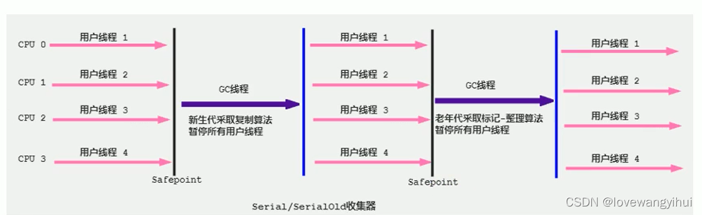
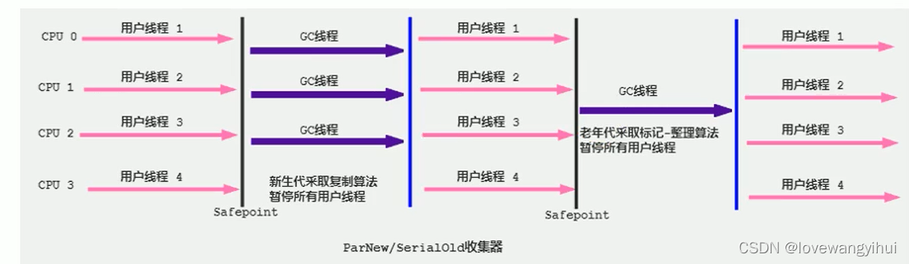
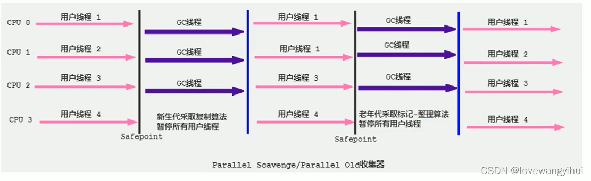

# 补充问题

redis数据结构底层实现

dubbo的序列化

Eureka和zookeeper同步怎么实现的

**canal mysql和redis一致性问题**

**为什么区分计算机大端小端？**

**实现一个LRU** 

虚拟内存有什么用？为什么要有虚拟内存？

**CPU拿到地址后取得数据的过程？**

CPU存储器类型

**ArrayList源码的修饰，序列化**

kafka原理

**锁升级的原理**

**sync lock的区别**

**explain关键字，查数据库运行**

**几种io模型**

netty的线程模型

**mvc的过程**

类加载过程

redis应用场景

NoSQL的理解

Spring,Spring MVC,Spring Boot 之间什么关系?

tcp的心跳机制

拥塞控制的几种算法

用户态和内核态的区别

任务调度

app数据库怎么设计

程序加载到内存中有哪些段

Netty的IO模型，Reactor模式，Handler线程一定要新起一个线程来进行数据库操作吗；

redlock

进程控制模块TCB

操作系统中哪几种锁？信号量、互斥量 等


# Java

## 浮点型

### 底层实现

二进制不能精确的表示浮点数，所以浮点数不能进行相等的比较。在涉及到金额计算的时候，建议使用BigDecimal，防止由于精度丢失带来的BUG。

### 比较大小

可以确定一个**误差范围**，当小于这个误差范围的时候就认为这两个浮点数相等。

也可以使用BigDecimal，BigDecimal 是不可变的，它能够精确地表示十进制数字。需要注意的是，创建 BigDecimal 对象时，要使用参数为 String 的构造方法，不要使用构造参数为 double 的，如果非要使用 double 创建，一定要用 valueOf 静态方法，防止丢失精度。然后调用 compareTo 方法比较即可。


## 静态代码块、构造代码块、构造方法的执行顺序是什么

静态代码块：用staitc声明，jvm加载类时执行，仅执行一次

构造代码块：类中直接用{}定义，每一次创建对象时执行。

执行顺序优先级：静态块,main(),构造块,构造方法。


# Maven

https://www.jianshu.com/p/ec8e50cb33be

## maven是干什么的

Maven 主要服务于基于Java平台的项目构建、依赖管理和项目信息管理。Maven 的主要功能主要分为5点：依赖管理系统；多模块构建；一致的项目结构；一致的构建模型和插件机制。

## Maven的作用有哪些？

（1）maven主要是用来解决**导入**java类依赖的jar，**编译**java项目主要问题；

（2）项目导入jar，是通过copy方式导入项目中，而且还会存在jar之间的**依赖和冲突**。而maven解决了这些问题，使用私服nexus解决这个问题；

（3）jar 包管理，防止jar之间依赖起冲突。小组之间建立个私服务，大家都用通用的maven配置文件，**不用自己手动去下载**jar ，pom文件会**自动管理下载**好的jar包；

（4）Maven是基于项目对象模型，可以通过一小段描述信息来管理项目的构建，报告和文档的软件项目管理工具。Maven能够很方便的帮你管理项目报告，生成站点，管理jar文件等。


## maven的依赖原则有什么？

（1）依赖路径最短优先原则。一个项目Demo依赖了两个jar包，其中A-B-C-X(1.0) ， A-D-X(2.0)。由于X(2.0)路径最短，所以项目使用的是X(2.0)。

（2）pom文件中申明顺序优先。如果A-B-X(1.0) ，A-C-X(2.0) 这样的路径长度一样怎么办呢？这样的情况下，maven会根据pom文件声明的顺序加载，如果先声明了B，后声明了C，那就最后的依赖就会是X(1.0)。

（3）覆写优先原则。子pom内声明的优先于父pom中的依赖。


## Maven常用命令有哪些？

Clean（清除项目下以前编译的内容，清空target目录，运行的都是target目录）

Validate（验证编译有没有编译错误）

Complie（编译，将.java——>.Class——>放到target）

Test（单元测试 就是把原有的类放到Test类里面进行测试）

package（打包 打成（jar包和war包））

varify （校验 jar或者war是否正确  针对打包去做的）

Install （安装到指定的服务器 或者目录）

deploy（部署  部署到远程服务器）


## GAV

**gav（必须的三个）是针对Maven仓库的jar包给一个编号（导入依赖就是导入jar包）**

1. **G（groupId）：组织机构。**
2. **A（artifactId）：哪个团队开发的特性。**
3. **V（version）：不同时间段，开发的不同的版本。**


## Maven依赖冲突怎么办

使用插件检测

关键字:`exclusions`

exclusions可以包含一个或者多exclusion子元素，因此可以排除一个或者多个传递性依赖。

需要注意的是，声明exclusion的时候只需要`groupld`和`artifactld`,而不需要要version元素。


一般我们在解决依赖冲突的时候，都会选择保留jar高的版本，因为大部分jar在升级的时候都会做到向下兼容，所以只要保留高的版本就不会有什么问题。


# JVM

## 除了程序计数器不会发生OOM外，哪些区域会发生OOM的情况呢？

**堆内存**，堆内存不足是最常见的发送OOM的原因之一。

如果在堆中没有内存完成对象实例的分配，并且堆无法再扩展时，将抛出OutOfMemoryError异常，抛出的错误信息是“java.lang.OutOfMemoryError:Java heap space”。

当前主流的JVM可以通过-Xmx和-Xms来控制堆内存的大小，发生堆上OOM的可能是存在内存泄露，也可能是堆大小分配不合理。


**Java虚拟机栈和本地方法栈**，这两个区域的区别不过是虚拟机栈为虚拟机执行Java方法服务，而本地方法栈则为虚拟机使用到的Native方法服务，在内存分配异常上是相同的。
在JVM规范中，对Java虚拟机栈规定了两种异常：
a. 如果线程请求的栈大于所分配的栈大小，则抛出StackOverFlowError错误，比如进行了一个不会停止的递归调用；
b. 如果虚拟机栈是可以动态拓展的，拓展时无法申请到足够的内存，则抛出OutOfMemoryError错误。


**直接内存：**直接内存虽然不是虚拟机运行时数据区的一部分，但既然是内存，就会受到物理内存的限制。在JDK1.4中引入的NIO使用Native函数库在堆外内存上直接分配内存，但直接内存不足时，也会导致OOM。

**方法区：**随着Metaspace元数据区的引入，方法区的OOM错误信息也变成了“java.lang.OutOfMemoryError:Metaspace”

对于旧版本的Oracle JDK，由于**永久代**的大小有限，而JVM对永久代的垃圾回收并不积极，如果往永久代不断写入数据，例如String.Intern()的调用，在永久代占用太多空间导致内存不足，也会出现OOM的问题，对应的错误信息为“java.lang.OutOfMemoryError:PermGen space”
————————————————
版权声明：本文为CSDN博主「无法无天过路客」的原创文章，遵循CC 4.0 BY-SA版权协议，转载请附上原文出处链接及本声明。
原文链接：https://blog.csdn.net/yangbaggio/article/details/94626578


## Java排错

### 内存溢出怎么找到

top——ps——jstat——dump——MTA

**1、使用top对当前服务器内存有个大致了解**，top后 shift+M俺内存占用由大到小排序

**2、****利用ps命令查看服务pid：***ps -aux|grep java*

**3、利用jstat查看虚拟机gc情况**

```
jstat  -gc:util <vmid>  [<interval> [<count>]
vmid：虚拟机进程号
interval:采样时间，默认单位是ms
count：采样条数

[root@speedyao java]# jstat -gcutil 17561 1000 10
```

 以上命令代表1秒钟采样1次，总共采样10次。

如果FULL GC明显大于YOUNG GC次数，并且FULL GC次数很频繁，说明程序有大内存对象，并且一直无法释放。

**4、****生成dump文件**，有两种方式。 一种是利用jmap直接生成dump文件；另一种是利用gcore先生成core文件，再根据core文件利用jmap生成dump文件。

（1）先说第一种，这种比较简单，使用这种方案的时候请注意：JVM会将整个heap的信息dump写入到一个文件，heap如果比较大的话，就会导致这个过程比较耗时，并且执行的过程中为了保证dump的信息是可靠的，所以会暂停应用。

 

```
[root@speedyao java]# jmap -dump:format=b,file=heap.prof  17561 
format=b：表示生成二进制类型的dump文件
file=：后面写的是输出的dump文件路径17561：jvm进程id
```

（2）接下来是第二种。这一种在jmap转换core文件的时候比较耗时，并且生成的dump文件用mat打开的时候分析结果不太正确，不太好定位问题。所以我建议使用第一种，虽然会造成服务挂起吧，但是结果总归是正确的。

优势：利用gcore保存服务的内存信息，因为gcore比jmap的dump会快很多，也不对线上服务有大的影响。

利用jmap将gcore文件转换为java的dump文件，这一步执行的比较慢，可以用nohup执行，以防止误点Ctrl+C导致退出。
**5、利用MAT或者 jdk自带的jvisualvm.exe 来分析dump文件**

在MAT工具中一般用到比较多的2个功能
**1、Histogram
2、Leak Suspects**

### Histogram

这个功能主要是查看类和对象关系，对象和对象之间的关系，用来定位哪些对象在FGC之后还活着，哪些对象占大部分内存。

### Leak Suspects

Leak Suspects 界面提示可能存在内存的泄露。有的时候具体代码的位置都帮我们定位好了，排查非常方便。

JVM加上 -XX:+HeapDumpOnOutOfMemoryError 这个参数，系统oom的时候会自动dump的，到时候拿快照MAT中分析即可。

### 内存溢出的可能原因

数据库脏数据导致查出极多数据，和预估不相符，创建了大量无用对象


## 为什么新生代的内存占比分为8:1:1

GC是统计学测算出当内存使用超过98%以上时，内存就应该被minor gc时回收一次。但是实际应用中，我们不能较真的只给 他们留下2%，换句话说当内存使用达到98%时才GC 就有点晚了，应该是多一些预留10%内存空间，这预留下来的空间我们称为S区（有两个s区  s1 和  s0），S区是用来存储新生代GC后存活下来的对象，而我们知道新生代GC算法使用的是复制回收算法。

         所以我们实际GC发生是在，新生代内存使用达到90%时开始进行，复制存活的对象到S1区，要知道GC结束后在S1区活下来的对象，需要放回给S0区，也就是对调(对调是指，两个S区位置互换,意味着再一次minor gc 时的区域  是eden 加，上一次存活的对象放入的S区)，既然能对调，其实就是两个区域一般大。这也是为什么会再有个10%的S0区域出来。这样比例就是8:1:1了!!（80%：s1:s0=80%:10%:10%=8:1:1）这里的eden区（80%） 和其中的一个  S区（10%） 合起来共占据90%，GC就是清理的他们，始终保持着其中一个  S  区是空留的，保证GC的时候复制存活的对象有个存储的地方。


堆内存划分：

堆大小 = 新生代 + 老年代。堆的大小可通过参数–Xms（堆的初始容量）、-Xmx（堆的最大容量） 来指定。

其中，新生代 ( Young ) 被细分为 Eden 和 两个 Survivor 区域，这两个 Survivor 区域分别被命名为 from 和 to，以示区分。默认的，Edem : from : to = 8 : 1 : 1 。可以通过参数 –XX:SurvivorRatio 来设定 ，即：

Survivor区和Eden区的比值

-XX:SurvivorRatio=8 表示 两个Eden ：Survivor  = 8：2 ，每个Survivor占 1/10
可以修改为-XX:SurvivorRatio=2
2 表示 两个Eden ：Survivor  = 2： 2  ，各占一半
JVM 每次只会使用 Eden 和其中的一块 Survivor 区域来为对象服务，所以无论什么时候，总是有一块 Survivor 区域是空闲着的。
新生代实际可用的内存空间为 9/10 ( 即90% )的新生代空间。

minor gc：指发生在新生代的垃圾回收动作，因为JAVA对象大多数都是朝生夕死的特性，所以minor gc非常平凡，使用复制算法快速的回收

老年代GC（major gc）：指发生在老年代的垃圾回收动作，所采用是的标记--整理算法。

老年代几乎都是经过survivor熬过来的，它们是不会那么容易“死掉”，因此major gc不会想minor gc那样频繁

Full gc：minor gc + major gc
————————————————
版权声明：本文为CSDN博主「善良勤劳勇敢而又聪明的老杨」的原创文章，遵循CC 4.0 BY-SA版权协议，转载请附上原文出处链接及本声明。
原文链接：https://blog.csdn.net/yy339452689/article/details/106200546/


## JVM老年代和新生代的比例

1:2

## 垃圾回收器

https://blog.csdn.net/lovewangyihui/article/details/122442440

### 7种经典的垃圾收集器

- 串行回收器：Serial、Serial old
- 并行回收器：ParNew、Parallel Scavenge、Parallel old（多cpu同时回收，暂停其他操作）
- 并发回收器：CMS、G11（垃圾回收与程序运行并发工作）

### Serial回收器：串行回收

Serial收集器是最基本、历史最悠久的垃圾收集器了。JDK1.3之前回收新生代唯一的选择。

这个收集器是一个单线程的收集器，但它的“单线程”的意义并不仅仅说明它只会使用一个CPU或一条收集线程去完成垃圾收集工作，更重要的是在它进行垃圾收集时，必须暂停其他所有的工作线程，直到它收集结束（Stop The World）



### ParNew回收器：并行回收

如果说serialGC是年轻代中的单线程垃圾收集器，那么ParNew收集器则是serial收集器的多线程版本。

Par是Parallel的缩写，New：只能处理的是新生代

ParNew 收集器除了采用并行回收的方式执行内存回收外，两款垃圾收集器之间几乎没有任何区别。

ParNew收集器在年轻代中同样也是采用复制算法、"stop-the-World"机制。



对于新生代，回收次数频繁，使用并行方式高效。
对于老年代，回收次数少，使用串行方式节省资源。（CPU并行需要切换线程，串行可以省去切换线程的资源）

### Parallel回收器：吞吐量优先

HotSpot的年轻代中除了拥有ParNew收集器是基于并行回收的以外，Parallel Scavenge收集器同样也采用了复制算法、并行回收和"Stop the World"机制。

那么Parallel 收集器的出现是否多此一举？

和ParNew收集器不同，ParallelScavenge收集器的目标则是达到一个可控制的吞吐量（Throughput），它也被称为吞吐量优先的垃圾收集器。
自适应调节策略也是Paralle1 Scavenge与ParNew一个重要区别。




### CMS回收器：低延迟

CMS的垃圾收集算法采用标记-清除算法，并且也会"stop-the-world"

**它第一次实现了让垃圾收集线程与用户线程同时工作**。

不幸的是，CMS作为老年代的收集器，却无法与JDK1.4.0中已经存在的新生代收集器Parallel Scavenge配合工作，所以在JDK1.5中使用CMS来收集老年代的时候，新生代只能选择ParNew或者Serial收集器中的一个。

CMS收集器的关注点是尽可能缩短垃圾收集时用户线程的停顿时间。停顿时间越短（低延迟）就越适合与用户交互的程序，良好的响应速度能提升用户体验。


# JUC

## 线程池如何销毁线程

核心线程调用阻塞方法，直到任务队列有任务

非核心线程调用非阻塞方法，达到时间，返回null，开始销毁


1、线程池是由一堆线程+阻塞队列组成。可以类比成MQ系统，线程就是消费者、阻塞队列就是MQ、execute方法就是生产者。

2、线程池中虽然有核心线程和非核心线程之分，但是本质上是没有区别的。线程最终是阻塞等待任务还是销毁取决于当前线程在getTask方法时刻线程池整体的状态。也就是说一个线程是核心线程还是非核心线程是不确定的。

3、线程池中线程的销毁不是线程池来销毁的，而是线程本身的行为，线程从创建开始就一直工作，直到无任务可工作之后会由getTask方法的阻塞状态来决定销毁（非核心线程）还是阻塞（核心线程）。

ThreadPoolExecutor 源码的 getTask() 方法部分：

timed 参数是用来判断当前线程数是否大于核心线程数，如果大于，就执行 poll 方法，否则执行 take 方法。因为这些大于核心线程数的线程如果没有任务是有可能被回收处理的，而 take() 方法会使线程一直被阻塞住，直到有任务来，不会对线程进行回收。

workQueue 是定义的阻塞队列，阻塞队列的两个取出元素的方法 poll() 和 take()，前者是一个非阻塞方法，如果当前队列为空直接返回，而 take() 是一个阻塞方法，即如果当前队列为空阻塞线程，封装线程到 AQS 的条件变量的条件队列中，而上面的方法是一个介于二者之间的方法。

然后看这个阻塞队列方法 E poll(long timeout, TimeUnit unit)，其注释如下：

Retrieves and removes the head of this queue, waiting up to the specified wait time if necessary for an element to become available.

所以我们的线程在获取任务时，如果队列中已经没有任务会在此处阻塞 keepALiveTime 的时间，如果到时间都没有任务就会 return null(不是直接返回null，是最终)，然后在 runWorker() 方法中执行 processWorkerExit(w, completedAbruptly) 终止线程。


## 为什么使用自定义加载器

自定义类的应用场景：

（1）加密：Java代码可以轻易的被反编译，如果你需要把自己的代码进行加密以防止反编译，可以先将编译后的代码用某种加密算法加密，类加密后就不能再用Java的ClassLoader去加载类了，这时就需要自定义ClassLoader在加载类的时候先解密类，然后再加载。

（2）从非标准的来源加载代码：如果你的字节码是放在数据库、甚至是在云端，就可以自定义类加载器，从指定的来源加载类。

## LIMIT原理

这里以LIMIT N,M为基础：LIMIT首先要找查N+M行，然后从N行处，取M行。那么这样的SQL对一次查询1275500一个操作应该是一个昂贵的开销。对于LIMIT这类的优化，第一个目标就是让N变的尽可能的小或是不用。


## abc循环打印

互斥变量，synchronized wait自旋锁

https://blog.csdn.net/jiangzuofengqiao/article/details/124307876

ReentrantLock结合Condition

https://blog.csdn.net/riemann_/article/details/98119372


## 可重入锁

可重入锁是某个线程已经获得某个锁，可以再次获取锁而不会出现死锁。再次获取锁的时候会判断当前线程是否是已经加锁的线程，如果是对锁的次数+1，释放锁的时候加了几次锁，就需要释放几次锁。

代码中的锁的递归只是锁的一种表现及证明形式，除了这种形式外，还有另一种表现形式。同一个线程在没有释放锁的情况下多次调用一个加锁方法，如果成功，则也说明是可重入锁。

 解释一：可重入就是说某个线程已经获得某个锁，可以再次获取锁而不会出现死锁。

这是可重入锁的概念描述。

解释二：可重入锁又称递归锁，是指同一个线程在外层方法获取锁的时候，再进入该线程的内层方法会自动获取锁(前提是锁对象得是同一个对象)，不会因为之前已经获取过锁还没有释放而阻塞。

这是可重入锁的一种表现方式，不代表说某段代码中的锁没有发生嵌套，这个锁就不是可重入锁。


————————————————
版权声明：本文为CSDN博主「谷同学」的原创文章，遵循CC 4.0 BY-SA版权协议，转载请附上原文出处链接及本声明。
原文链接：https://blog.csdn.net/weixin_43845227/article/details/122043596


# MySQL

## mysql查询连接查询的缺点

数据量非常大，速度非常慢，使用多表查询代替，in exite，或者业务层连接

阿里巴巴的代码规范中有一条就是不建议执行三张表以上的多表联合查询，因为对数据量不大的应用来说, 多表联合查询开发高效, 但是多表联合查询在表数据量大, 并且没有索引的时候, 如果进行笛卡儿积, 那数据量会非常大, sql 执行效率会非常低，所以我们更建议多次单表查询然后在service中进行拼接参数

多次单表查询在 service 层进行合并优点

1, 缓存效率更高, 许多应用程序可以方便地缓存单表查询对应的结果对象. 如果关联中的某个表发生了变化, 那么就无法使用查询缓存了, 而拆分后, 如果某个表很少改变, 那么基于该表的查询就可以重复利用查询缓存结果了.

2, 多表信息联合的列表页面分页显示, 只需要显示一部分的数据, 如果是多表联合查询那要把所有数据联结查出来再执行 limit, 如果是多次单表查询, 先对单表进行筛选, 先执行 limit 再与其余表去关联, 数据量会大大减小

3, 如果数据库没有进行读写分离 (主从备份), 在并发量高的时候, 由于写表会加排他锁, 把多表联合查询改成单表查询后锁的粒度变小, 减少了锁的竞争

4, 在数据量变大之后, 普遍会采用分库分表的方法来缓解数据库的压力, 采用单表查询比多表联合查询更容易进行分库, 不需要对 sql 语句进行大量的修改, 更易扩展. 分库分表的中间件一般对跨库 join 都支持不好

5, 查询本身效率也可能会有所提升. 查询 id 集的时候, 使用 IN() 代替关联查询, 可以让 MySQL 按照 ID 顺序进行查询, 这可能比随机的关联要更高效.

6, 业务高速增长时, 数据库作为最底层, 最容易遇到瓶颈, 单机数据库计算资源很贵, 数据库同时要服务写和读, 都需要消耗 CPU, 为了能让数据库的吞吐变得更高,

而业务又不在乎那几百微妙到毫秒级的延时差距, 业务会把更多计算放到 service 层做, 毕竟计算资源很好水平扩展, 数据库很难啊, 这是一种重业务, 轻 DB 的架构

7, 可以减少冗余记录的查询, 在应用层做关联查询, 意味着对于某条记录应用只需要查询一次, 而在数据库中做关联查询, 则可能需要重复地访问一部分数据.

更进一步, 这样做相当于在应用中实现了哈希关联, 而不是使用 MySQL 的嵌套循环关联. 某些场景哈希关联的效率要高很多.

多次单表查询在 service 层进行合并缺点

1, 需要进行多次的数据库连接

2, 代码更复杂

总结

个人觉得还是做多次单表查询更好, 更易扩展, 当然数据量不大时, 直接联合查询开发更方便

## 数据库优化与SQL语句优化

1，数据库优化，包括存储引擎的优化，缓存的优化和内存的优化等。

2，SQL优化。首先先判断什么样的SQL需要优化。

可以在MySQL中开启慢查询，设置成例如SQL执行时长超过5秒就可以定为慢SQL，并记录到日志中。然后拿到慢SQL的执行记录和计划，通过explain关键字做分析。

分析思路有例如SQL存在索引，判断是否执行了索引或者索引失效原因，若索引未失效则要考虑索引创建是否合理，以及是否遵循最左匹配原则等。


慢查询日志 slow_query_log，是用来记录查询比较慢的sql语句，通过查询日志来查找哪条sql语句比较慢，这样可以对比较慢的sql可以进行优化。


# Redis

## 如何应对脑裂？

既然问题出现在原主库发生故障后仍然能接收请求上，我们就开始在主从集群机制的配置项中查找是否有限制主库接收请求的设置。
redis提供了两个配置项来限制主库的请求处理，分别是min-slaves-to-write 和 min-slaves-max-lag
min-slaves-to-write：这个配置项设置了主库能进行数据同步的最少从库数量
min-slaves-max-lag：这个配置项设置了主从库间进行数据复制时，从库给主库发送的ACK消息的最大延迟。
有了这两个配置就可以轻松解决脑裂问题了，首先既然原主库是假故障，它在假故障期间是无法响应哨兵心跳的，也不能和从库进行同步，自然也就无法和从库进行 ACK 确认了。这样一来，min-slaves-to-write 和 min-slaves-max-lag 的组合要求就无法得到满足，原主库就会被限制接收客户端请求，客户端也就不能在原主库中写入新数据了。等到新主库上线时，就只有新主库能接收和处理客户端请求，此时，新写的数据会被直接写到新主库中。而原主库会被哨兵降为从库，即使它的数据被清空了，也不会有新数据丢失。

## redis和MySQL时间对比

redis的读写性能在单线程下可以达到每秒2W左右，多线程可以到10w

对mysql的select和insert、delete语句测试,mysql的读性能可达到6000每秒,写性能可到达3000每


# 计算机网络

## http头部


## 哪些协议使用TCP哪些用UDP

### 运行于TCP协议之上的协议：

HTTP协议：超文本传输协议，用于普通浏览

HTTPS协议：安全超文本传输协议，身披SSL外衣的HTTP协议

FTP协议：文件传输协议，用于文件传输

POP3协议：邮局协议，收邮件使用

SMTP协议：简单邮件传输协议，用来发送电子邮件

Telent协议：远程登陆协议，通过一个终端登陆到网络

SSH协议：安全外壳协议，用于加密安全登陆，替代安全性差的Telent协议

### 运行于UDP协议之上的协议：

DHCP协议：动态主机配置协议，动态配置IP地址

NTP协议：网络时间协议，用于网络时间同步

BOOTP协议：引导程序协议，DHCP协议的前身，用于无盘工作站从中心服务器上获取IP地址


# 计算机基础


## linux查找日志中的error

```bash
grep  'ERROR'  xx.log |wc -l
```

wc进行统计-l统计行数


ps -ef | grep pid

查看磁盘使用空间df -hl

ifconfig

## 端口

65535个端口

netstat命令查看8080端口是否被占用

“端口"端口"是英文port的意译，可以认为是**设备与外界通讯交流的出口**

mysql的默认端口号是3306

redis默认端口号是6379


# 分布式


## 分布式Session的实现

存储在本地的Session里面，其他机器没有

https://blog.csdn.net/weixin_42338555/article/details/105034390

### 数据分割

反向代理层让同一个用户的请求保证落在一台server上呢？
方法一：四层代理hash。反向代理层使用用户**ip来做hash**，以保证同一个ip的请求落在同一个server上（更推荐，保证传输层不引入业务层的逻辑）

方法二：七层代理hash。反向代理使用http协议中的**某些业务属性**来做hash，例如sid，city_id，user_id等，能够更加灵活的实施hash策略，以保证同一个浏览器用户的请求落在同一个server上

优点：

只需要改nginx配置，不需要修改应用代码
可以支持server水平扩展

不足：
server水平扩展，rehash后session重新分布，会有一部分用户路由不到正确的session,即使hash散列均匀，也不能保证server的负载均匀


### 数据复制

思路：
多个server之间相互同步session，这样每个server之间都包含全部的session

优点：
只需要设定配置，应用程序不需要修改代码
不足：
session的同步需要数据传输，占内网带宽，有延时所有server都包含所有session数据，数据量受最小内存的sever限制，水平拓展能力差

### session中心存储

### redis实现分布式session

## ZAB zookeeper

https://blog.csdn.net/yizhiniu_xuyw/article/details/114870828
